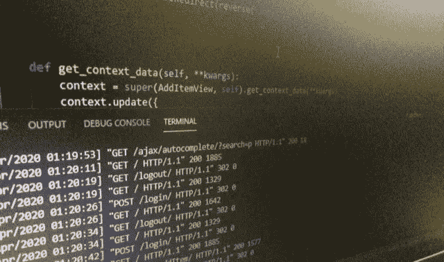
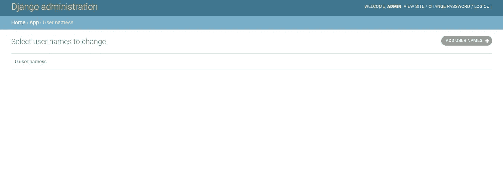
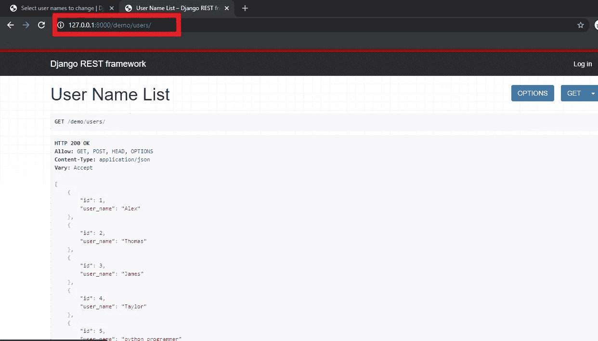
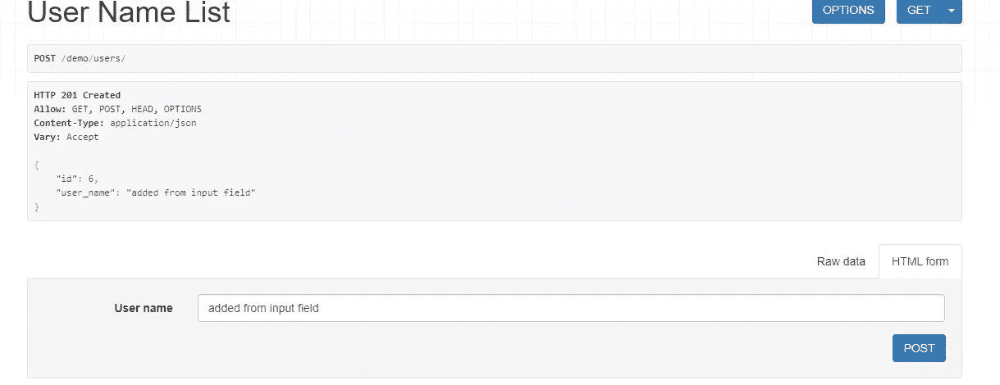
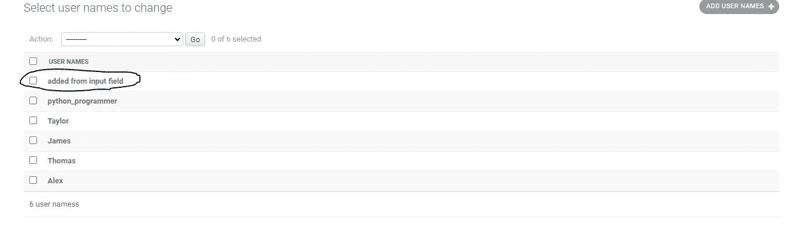

# 用 DRF 编写 API(Django Rest 框架)

> 原文：<https://medium.com/analytics-vidhya/writing-apis-with-drf-django-rest-framework-37cabbd44fb3?source=collection_archive---------18----------------------->

自从 Django(基于 Python 的 web 框架)发布以来，web 开发人员就选择它作为他们最喜欢的工作和构建平台之一。

灵活性和可伸缩性是它受欢迎的两个主要原因。

本文主要关注如何开始使用 DRF 编写 REST APIs，并要求您对 python 和设置 Django 项目有一个基本的了解。



让我们进入教程。

# 什么是 Django Rest 框架？

DRF(Django rest 框架)是一个基于 python 的工具包，用于构建 Web APIs。

我说的 API 是指 REST APIs。几乎所有依赖于后端的服务都利用 REST APIs 供客户端使用。因此，如果您的项目应该有多个用户，您需要编写高效和明智的端点。

在我们开始之前，我希望你清楚 REST API 和 DRF 之间的区别。

API(应用程序接口)是一种允许程序相互通信的架构。API 是在服务器上开发的，它让客户端通过 URL 与服务器对话。URL 称为**请求**，发回的数据称为**响应。**

REST(表述性状态转移)是 API 上的一组规则，它决定了响应应该如何格式化，对不同请求的响应应该是什么，等等。

然而，Django Rest Framework 是一个构建 REST APIs 的工具，它也可以使用其他工具包来构建，这取决于所使用的 web 框架。

介绍够了，让我们马上开始吧…

## 装置

首先，我们需要安装 DRF 图书馆。确保您的虚拟环境已激活。

安装 DRF 的命令:

```
pip install djangorestframework
```

将“rest_framework”和“rest_framework.authtoken”添加到 settings.py 中的 INSTALLED_APPS。

```
INSTALLED_APPS = [...'rest_framework','rest_framework.authtoken',]
```

现在，DRF 已经可以使用了。

让我们开始编写我们的 API。

当编写一个 API 时，重要的是要注意 3 件事

1.  端点
2.  响应内容
3.  允许的请求类型。

端点是可以发出请求的 URL。

回复内容决定回复格式。

允许的请求将端点约束到一个或多个请求方法。

endpoint 的主要需求是在数据库上执行 CRUD 操作，这意味着必须拥有一个数据库或 Django 中的模型，可以使用 endpoint 存储和操作数据。

对于这个项目，让我们有一个存储用户名的简单模型。

在模型中. py

```
from django.db import modelsclass UserNames(models.Model):
   user_name = models.CharField(max_length=264)

   def __str__(self):
    return self.user_name
```

上面的代码代表了一个带有“用户名”字段的模型。

在 admin.py 中注册模型并运行迁移。

管理. py

```
from <your-app-name>.models import UserNamesadmin.site.register(UserNames)
```

然后，在您的终端中运行以下命令(启用虚拟环境)。

```
python manage.py makemigrations
python manage.py migrate
```

这将创建“用户名”模型，并在管理面板上注册它。



空用户名模型

如果您成功地创建了模型，它应该看起来像上面显示的那样。

让我们通过点击右上角的“添加用户名”来添加一些虚拟数据。

现在，我们有一个模型，里面有一些数据。

在一个常规的简单项目中，我们将模型与表单相关联，或者直接从视图中获取值。但是，对于一个 API，我们使用一种叫做 ***的序列化器。***

序列化程序将模型实例转换成 Python 字典。这些字典进一步用于以 JSON 或 XML 等格式呈现 API。

在你的 Django 应用中创建一个新文件*‘serializer . py’*

在 serializers.py 中添加以下代码

serializers.py

```
from <your-app-name>.models import UserNamesfrom rest_framework import serializersclass UserNamesSerializers(serializers.ModelSerializer):
   class Meta:
    model = UserNames
    fields = "__all__"
```

上面的代码不言自明。我们正在创建一个序列化程序“UserNamesSerializer ”,它链接到模型“UserNames ”,也就是说，与这个序列化程序相关联的 API 呈现“UserNames”模型中的可用信息。

此外，field 变量决定显示哪一列的数据。

“__all__”表示包括所有字段。如果我们只需要显示某些信息，我们也可以使用元组。例如，一个用户模型(用户名，电子邮件，密码)，显示密码不是一个好主意。

在这种情况下，我们可以用只包含必需字段的元组替换“__all__”。

```
fields = (name,email)
```

或者

```
fields = exclude(password) 
#Includes all the other fields except password
```

序列化程序已经准备好了，我们现在将这个序列化程序连接到一个视图集。

视图集将序列化程序与其他规则(如权限和查询)绑定在一起。

在 views.py 中，添加以下内容

```
from rest_framework import viewsets
from rest_framework import permissions,generics
from app.serializers import UserNamesSerializers
from rest_framework.permissions import IsAuthenticated
from <your-app-name>.models import UserNamesclass UserNameViewSet(viewsets.ModelViewSet):
   # this fetches all the rows of data in the UserNames table
   # customize it as required    
   queryset = UserNames.objects.all()
   serializer_class = UserNamesSerializers
```

注意，我们使用的是基于类的视图，使用函数也可以达到同样的效果。

最后一步是建立请求端点和视图集之间的关系。

转到 urls.py，用各自的视图集配置 URL。

```
from <your-app-name> import views
from django.contrib import admin
from rest_framework import routersrouter = routers.DefaultRouter()router.register(r'demo/users/',views.UserNameViewSet)admin.autodiscover()
```

路由器类似于*‘URL _ patterns’*，区别在于，*‘URL _ patterns’*处理常规视图，路由器处理基于 API 的视图。

这里的*‘demo/users/’*是我们的端点，您可以用您喜欢的任何东西来替换它。

保存更改，启动您的终端并启动服务器。

然后转到创建的端点(在本例中为' demo/users/')，您应该会看到在创建模型之后添加的用户名列表。



端点显示用户名

或者，可以从终端发出 cURL 请求，它也应该获取相同的信息。

有时，它会要求我们在 API 上有一些部分敏感的信息，我们希望这些信息只被经过认证的用户访问。

在这里，我们可以限制未经身份验证的用户访问信息，

通过添加一行代码。

```
class UserNameViewSet(viewsets.ModelViewSet):
   # this fetches all the rows of data in the UserNames table
   # customize it as required
   permission_class = (IsAuthenticated,)    
   queryset = UserNames.objects.all()
   serializer_class = UserNamesSerializers
```

现在，API 受到保护，不会受到未经授权的访问。

因此，现在只能通过在请求中发送有效的令牌来访问该端点。

## 使用 API 插入数据

到目前为止，我们已经看到了如何创建一个基本的 API 并从中提取信息。

现在让我们看看如何将信息添加到 API 中。

这相当简单，需要的改动也较少。

在“views.py”中，对视图集进行以下更改。

```
def get_permissions(self):if self.action == "create":self.permission_classes = settings.PERMISSIONS.user_createelif self.action == "list":self.permission_classes = settings.PERMISSIONS.user_listreturn super().get_permissions()
```

保存更改并重新加载 URL 后，我们可以看到一个输入框，通过它我们可以向模型中添加值。

请注意“if-elif”块，它有创建(添加)和列出(显示)来自/到模型的用户名的选项。

默认情况下，从现在起这些信息将只显示给授权用户，这就是 super()的原因。返回 get_permissions()。

通过从端点添加一个值，让我们看看它是否有效。



API 端点中的 POST 请求

正如我们在上面看到的，我将字符串“added from input field”提交到模型中，我得到了一个响应代码 201，这意味着该值已经成功地添加到数据库中。

我们可以从管理面板中验证这一点。



圈起来的字符串与我从端点发布的字符串相匹配，因此可以验证 POST 请求正在按预期工作。

恭喜你，你成功编写了你的第一个 API。:) :)

## 发现这篇文章内容丰富？

如果你觉得这篇文章有帮助，请给我一些掌声，并在 Instagram 上与我联系。

如果你有任何问题，欢迎在评论中提出！