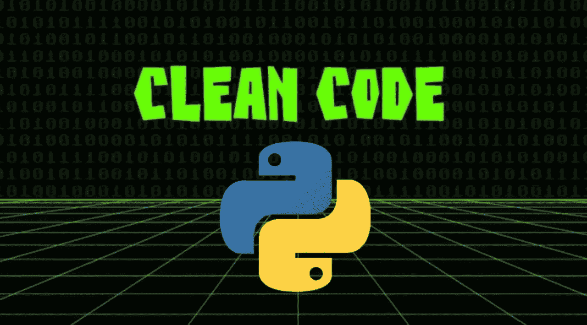
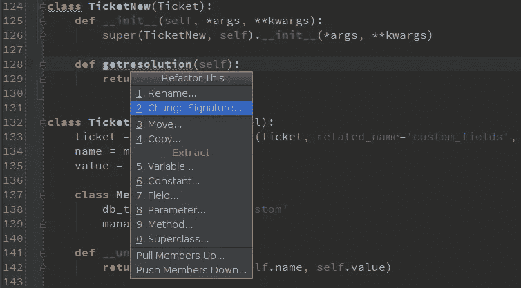
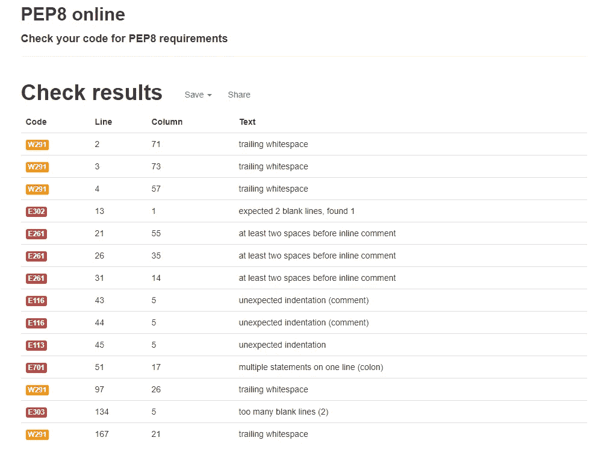
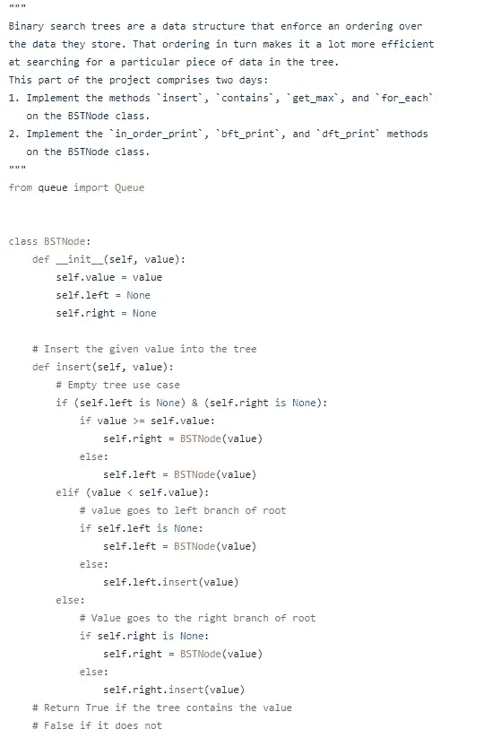

# 编写干净的模块化代码

> 原文：<https://medium.com/analytics-vidhya/writing-clean-and-modular-code-4747e4e64a48?source=collection_archive---------24----------------------->

关于确保你的代码是最好的有用提示！

让我们互相帮助，尽可能成为最好的程序员。图片的功劳[在这里](https://morioh.com/p/00125cb1410c)

你认为拥有干净的模块化代码意味着什么？

模块化代码是将代码分解成函数和模块。拥有函数和模块使编码变得更容易，因为您可以在以后调用函数，而不必重复和重写代码行。

拥有干净代码的一个重要步骤是重构它！这是一个在最初编写代码之后发生的过程。仔细看一下，看你是否能澄清或简化它。为什么？从长远来看减少工作量。它更易于维护和重用，并且有助于您成为更好的开发人员。

这里找到的图片:[https://blog . jetbrains . com/WP-content/uploads/2015/02/py charm-refactor 4 . png](https://blog.jetbrains.com/wp-content/uploads/2015/02/pycharm-refactoring4.png)

为干净的代码使用有意义的和描述性的名字。记住干—不要重复自己！您可以使用 *is_* 或 *has_* 来帮助描述和显示类型。正确使用你的空白。保持间距和缩进一致。一个很好的在线工具是 [Pep8Online](http://pep8online.com/) 。

该网站是免费的！你只需输入你的代码，点击“检查代码”按钮，结果将出现如上。这有利于看到需要清理的代码的确切行和列！

下面是我的一些干净的模块化代码的例子。请随意查看我的 [Github](https://github.com/ash827) 页面，获取更多关于 Python 编码的技巧、项目和指南。编码快乐！

来自我的 Github [的干净代码的简短剪辑这里](https://github.com/ash827/Data-Structures/tree/Ashley_Gaskins/binary_search_tree)实现一个二叉查找树:)