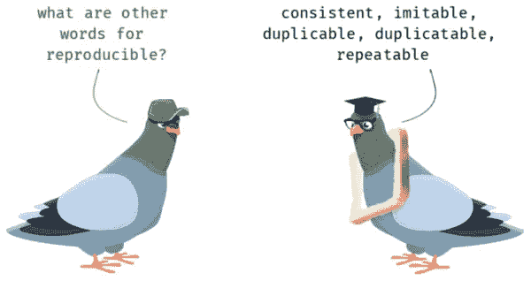

# 为数据科学家编写高效代码和自动化

> 原文：<https://medium.com/analytics-vidhya/writing-efficient-codes-and-automation-for-a-data-scientist-b24fa30077d?source=collection_archive---------18----------------------->

# 需要了解的编程和 Python 库原则

数据科学家用构建模型的知识编写代码，并总结发现。有时，他们共享导致结果的代码或模型。数据科学家来自各种背景，许多人没有计算机科学或编程培训。编写共享的代码时，应该牢记一些容易被忽略的编程技巧。

## 干(不要重复自己):编写模块化/可重用代码

DRY 是一个简单的编程原则，它基本上意味着您不应该在多个地方编写相同的代码/配置。



例如，当试图绘制一个散点图和两个箱线图时，这些单个图的标签、标题和其他可视化参数的设置可能会变成大量重复的代码，如下所示。

```
sns.scatterplot(x='x', y='y', data=data, palette='cubehelix')
plt.xlabel('xlabel')
plt.ylabel('ylabel')
plt.xticks(rotation=45)
plt.title('Scatter Plot Title')
plt.legend(title='Legend Title')
ax.spines['left'].set_color('k')
ax.spines['bottom'].set_color('k')sns.boxplot(x=x, y=y, hue=hue, data=data, palette='cubehelix')
plt.xlabel('xlabel')
plt.ylabel('ylabel')
plt.xticks(rotation=45)
plt.title('1st Box Plot Title')
plt.legend(title='Legend Title')
ax.spines['left'].set_color('k')
ax.spines['bottom'].set_color('k')sns.boxplot(x=x, y=y, hue=hue, data=data, palette='cubehelix')
plt.xlabel('xlabel')
plt.ylabel('ylabel')
plt.xticks(rotation=45)
plt.title('2nd Box Plot Title')
plt.legend(title='Legend Title')
ax.spines['left'].set_color('k')
ax.spines['bottom'].set_color('k')
```

当代码被编写为可重用时:

```
def ax_params(xlabel, ylabel, plt_title=None, ax=None, legend_title=None, c='k'):
    plt.xlabel(xlabel)
    plt.ylabel(ylabel)
    plt.xticks(rotation=45)
    plt.title(plt_title)
    if legend_title:
        plt.legend(title=legend_title)    
    if ax is None:
        ax = plt.gca()
    ax.spines['right'].set_visible(False)
    ax.spines['top'].set_visible(False)
    ax.spines['left'].set_color(c)
    ax.spines['bottom'].set_color(c) sns.scatterplot(x='x', y='y', hue='hue', data=data)
ax_params('xlabel', 'ylabel', 'Scatter Plot Title')sns.boxplot(x='x', y='y', hue='hue', data=data)
ax_params('xlabel', 'ylabel', '1st Box Plot Title')sns.boxplot(x='x', y='y', hue='hue', data=data)
ax_params('xlabel', 'ylabel', '2nd Box Plot Title')
```

## 编写动态使用的代码

正如在前面的示例代码中可以看到的，代码还允许其他用例，例如当您希望轴脊通过传入参数 *c* 而具有不同的颜色时，或者当您使用 *ax* 设置子图轴的可视化参数时。

对定制功能进行小的修改也符合敏捷编程原则和版本控制。如果我要添加一个新的输入参数来控制是否保存图形 *savefig* ，那么在传入 *'savefig=True'* 之前，用于绘图的 3 行代码的功能是相同的。

```
def ax_params(xlabel, ylabel, plt_title=None, ax=None, legend_title=None, c='k', savefig=False):
    plt.xlabel(xlabel)
    plt.ylabel(ylabel)
    plt.xticks(rotation=45)
    plt.title(plt_title)
    if legend_title:
        plt.legend(title=legend_title)
    if ax is None:
        ax = plt.gca()
    ax.spines['right'].set_visible(False)
    ax.spines['top'].set_visible(False)
    ax.spines['left'].set_color(c)
    ax.spines['bottom'].set_color(c)
    if savefig:
        plt.gcf().savefig(f'{plt_title}.png',bbox_inches='tight')
```

## Python 的“时间”模块

为了测试和比较代码运行的速度，Python 有一个方便的“ *time* ”模块。

下面的代码示例 *time.time()* 展示了一个代码块执行多长时间的测试(来自[更好的编程](/better-programming/25-useful-python-snippets-to-help-in-your-day-to-day-work-d59c636ec1b)

```
import time
start_time = time.time()
a,b = 5,10
c = a+b
end_time = time.time()
time_taken = (end_time- start_time)*(10**6)
print("Time taken in micro_seconds:", time_taken) 
**# Time taken in micro_seconds: 39.577484130859375** # Testing random_array of 1000 numbers from random vs numpy.random
import random
def random_array(N):
    num_array = [random.randint(-N,N) for i in range(N)]
    return num_arraystart = time.time()
random_array(1000)
time_taken_random = (time.time() - start)*(10**3)start = time.time()
np_random_array = np.random.randint(1000, size=1000)
time_taken_np_random = (time.time() - start)*(10**3)print("Time taken for random in milli_seconds:", time_taken_random)
print("Time taken in milli_seconds:", time_taken_np_random)
**# Time taken for random in milli_seconds: 1.6129016876220703
# Time taken for np_random in milli_seconds: 0.1647472381591797**
```

*time* 模块中的 *time.sleep()* 在您从 API 获取数据时特别有用，您不仅在一天内可以执行的调用次数有限，而且每分钟或每秒钟可以执行的调用次数也有限。

*   data.gov:“使用你的 API 密匙，你可以发出的 API 请求的数量是有限制的。[…]如果您在上午 10:15 发出 500 个请求，在上午 10:25 发出 500 个请求，那么您的 API 密匙将会被暂时阻塞。API 键的这个临时块将在上午 11:15 停止，此时您可以发出 500 个请求。上午 11 点 25 分，你可以再提出 500 个请求。”
*   “FoodData Central 目前将 API 请求的数量限制在每个 IP 地址每小时 3，600 个请求的默认速率，因为这对大多数应用程序来说已经足够了。超过此限制将导致 API 密钥被暂时阻止 1 小时”。
*   Foursquare:“默认的每小时限制是每个认证用户每组端点每小时 500 个请求。”

当有像 Shopify API 这样的秒速率限制时特别有用:“为了避免被节流，你可以构建你的应用平均每秒两个请求。”

如下所示，当使用 Selenium 收集数据时，尤其是在交互式网页中，使用 *time.sleep()* 特别有用。下面的代码是用日期填充表单的一部分，并自动单击。

Selinium 中暂停执行的屏幕记录。

```
for date in ['2/8/2016-2/15/2016', '2/15/2016-2/28/2016']:
    date_input = browser.find_element_by_name('FmFm2_Ctrl3')
    date_input.clear()
    time.sleep(2)
    date_input.send_keys(Keys.DELETE)
    date_input.send_keys(date)
    time.sleep(5)
    no_results = browser.find_element_by_id('m_ucSearchButtons')
    no_results = int(re.search('\d+', no_results.text).group())
    date_input.send_keys(Keys.RETURN)
    time.sleep(2)
    results_pagination(browser, no_results)
    time.sleep(1)
    browser.find_element_by_id('m_lbReviseSearch').click()
    time.sleep(5)
```

其他值得研究的 Python 库是来自*多处理*的并行处理*池*，以及 Python 生成器 *yield* ，这在拆分大型数据集以进行批量训练时特别有用。