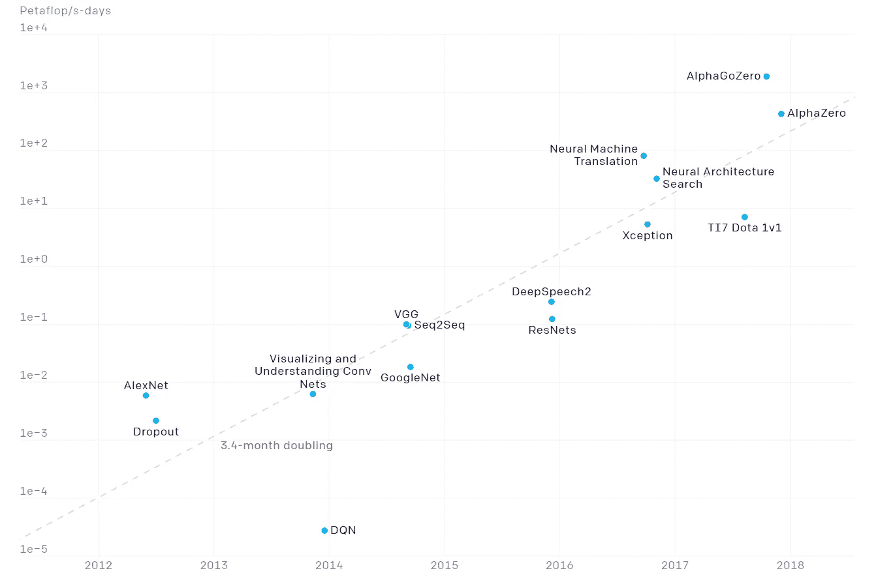
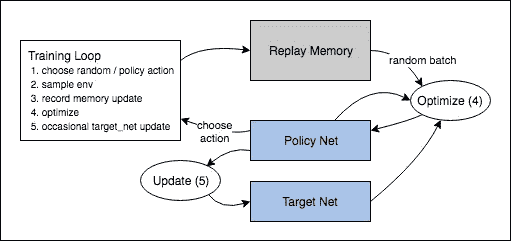
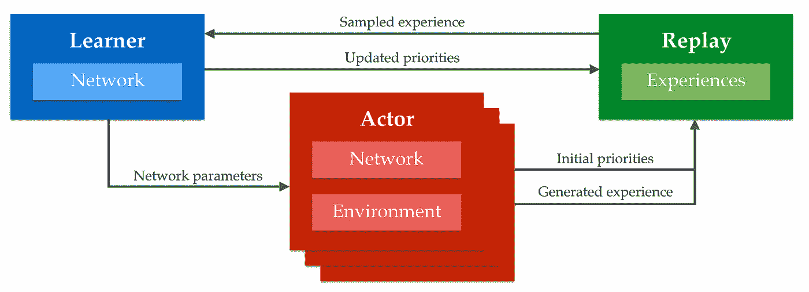
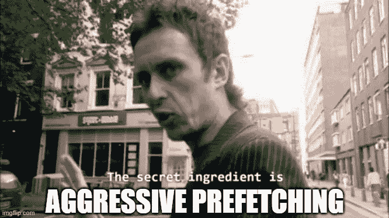
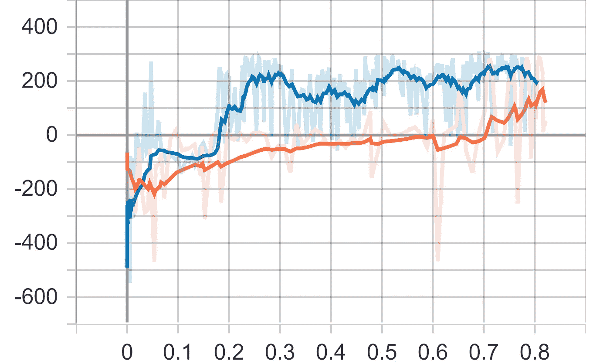
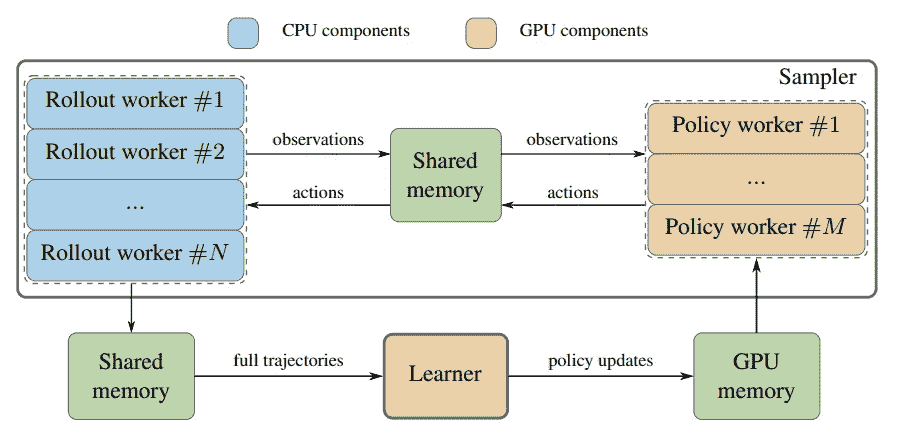
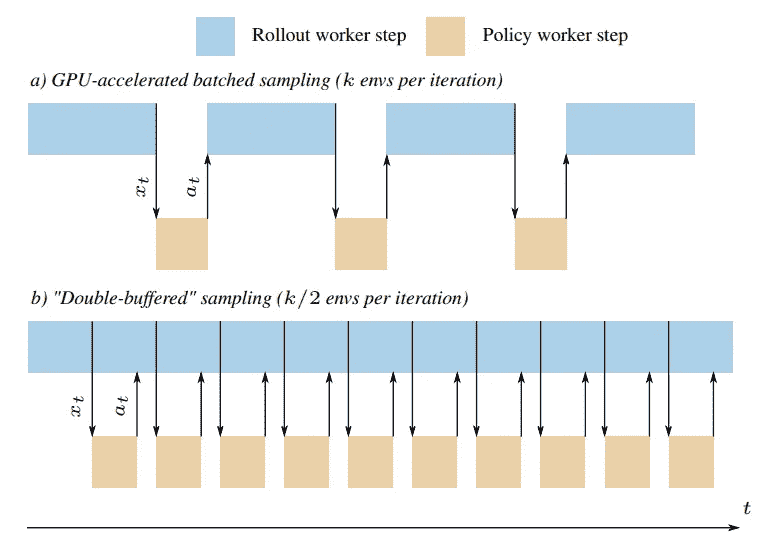

# 在商用硬件上编写快速深度 Q 学习管道

> 原文：<https://medium.com/analytics-vidhya/writing-fast-deep-q-learning-pipelines-on-commodity-hardware-a3c59cdda429?source=collection_archive---------8----------------------->

随着时间的推移，深度强化学习的艺术水平已经[在规模上](https://openai.com/blog/ai-and-compute/)上升，并且在商品硬件上复制艺术水平变得越来越困难。

先前的工作已经表明，只要有足够的优化、耐心和时间，我们就能非常接近。为此，我开始研究如何以零停机时间为目标编写高效的训练管道:GPU 绝不能停止等待数据(在训练和推理端都是如此)，管道必须能够承担系统能够承担的全部吞吐量。

# 如何不写管道

大多数 DeepRL 基线是以同步形式编写的。

这样做有好处:
1) **简单**:基线就是这样；*一条基线*。他们通常试图让代码尽可能简单，以便突出重点。编写快速代码通常意味着代码可读性更差，更容易出错。
2) **性能指标评测**:保持事物的有序性，可以很容易地对不同算法进行比较，比较它们使用了多少[样本|剧集|训练步骤| <插入-度量-此处为> ]算法。如果让这些东西尽可能快地运行，差异可能只是由于一个阶段处理数据的速度比另一个阶段快。

但问题是性能:推理、学习和环境部署都相互阻碍，因为它们之间存在数据依赖性，但现有技术表明，这些依赖性可以被削弱到足以允许我们将它们作为单独的进程运行，只是试图尽可能快地执行。

# 隔离学习者流程:APEX

隔离培训过程的一个范例是 [Horgan 等人的 APEX DQN](https://arxiv.org/abs/1803.00933) 。

1.  重放存储器是异步实例化的。它提供了一个 API，可以添加到其他进程中，也可以从其他进程中抽取样本。
2.  推理和环境步骤仍然在它们自己的过程中连续运行(“参与者过程”)。它们将数据排队进入重放过程
3.  训练过程也是异步实例化的。它在一个无限循环中运行，只是尽可能快地从重播中获取迷你比赛，并对它们进行训练。
4.  训练(或“学习者”)进程周期性地将新的网络参数传送回参与者进程

这使得我们可以像对待深度学习一样对待训练，这里也适用标准的流水线技巧:

为了确保 GPU 永远不会停止等待数据，我们在训练器流程中使用并行数据加载:当训练步骤运行时，来自重放的迷你批处理被异步复制到 GPU，因此它们总是可供使用。我们使用相同的技巧从 GPU 中获取参数*而不减慢训练速度。*

[未来提示]:我们还可以使用虚拟化之类的技巧来扩展重播网络的容量，并积极地进行管道传输，这样我们就不会损失吞吐量，但这是另外一个故事了。

虽然这是一个巨大的 faff，但它导致挂钟时间的显著加速:

一段时间内的得分(小时):LunarLander 环境中的同步基准(橙色)与异步基准(蓝色)。

这种加速来自于训练速度的提高和我们收集数据的速度。通过积极的预取和调整批量大小，我们可以最大限度地利用 GPU 来进行训练，但仍然需要对推理进行改进。

# SampleFactory 和 SeedRL:隔离推理

APEX 的主要缺陷是，它仍然需要每个环境都有一个网络实例，并且这些实例仍然同步运行。这导致了两个主要问题:

1.  **内存浪费**:它需要同一个网络的多个实例，这使得 RAM 中留给重放缓冲区的空间更少。
2.  **计算浪费**:因为它不能跨环境进行向量化推理，尽管原则上它所做的计算应该允许这样做。
3.  **延迟**:如果在 GPU 上运行推理，将观测同步复制到 GPU 和所有冗余内核启动时，会导致进一步的延迟。

为了解决这个问题，现有技术将环境与所谓的[矢量化环境](https://stable-baselines.readthedocs.io/en/master/guide/vec_envs.html)同步批处理(即:等待所有环境返回观察值，然后将它们连接成一个批处理)。

这些在基于策略的深度 RL 中被广泛使用，并且克服了问题 **(1)** 和 **(2)** ，因为它们随后仅需要单个网络实例来操作该批观察。

但是这些并没有缓解问题 3，事实上反而恶化了问题 3:虽然它们被规范地称为*矢量化环境，但是环境本身通常并没有真正矢量化。它们异步运行，然后在返回观察结果时停止并同步。这意味着一些人在不同的时间完成他们的步骤，然后停下来等待其他人赶上。*

两部新作([Espeholt 等人的 SeedRL](https://arxiv.org/abs/1910.06591)和 [Petrenko 等人的样本工厂](https://arxiv.org/pdf/2006.11751.pdf))同时以相同的总体思路解决了这个问题:

将“参与者工作人员”分成两部分:负责模型推理的“策略工作人员”和负责运行环境模拟的“部署工作人员”:

这些都是异步运行的，只是在获得数据的同时处理数据。

部署工作人员将观察结果发送到策略工作人员的共享队列中。

策略工作器获取所有排队的观察结果，并对它们进行批处理，然后将动作预测传递回部署工作器

这允许稍后完成的环境并行地对它们的数据进行排队，同时策略工作者忙于较早的环境。

此外，这使我们能够通过并行化来隐藏数据加载延迟，就像我们让培训师将它作为另一个异步流水线阶段来运行一样。

然后，我们可以简单地调整我们可以同时运行的环境的数量，以及模型可以接受的最大批量，从而获得更好的可伸缩性，并最大化推理吞吐量(…至少直到我们超过其他管道阶段的容量)。

[此处代码可用](https://github.com/GershomA/FastDeepQLearning)！