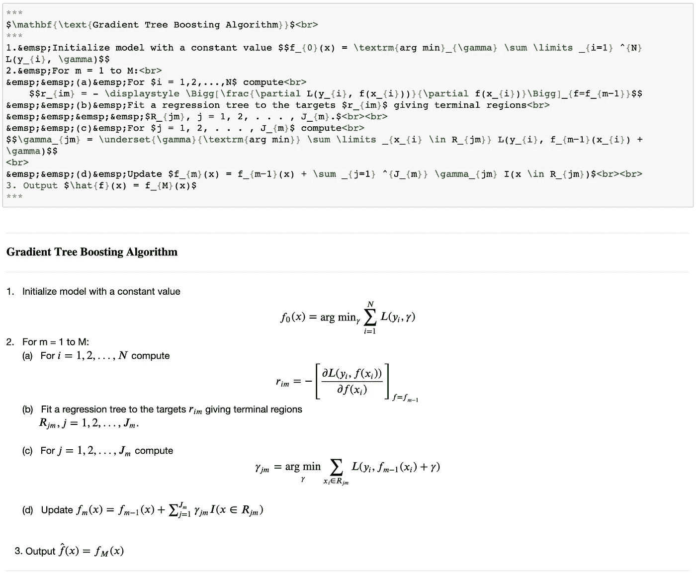

# 在 Jupyter 笔记本上写数学方程:一个天真的介绍

> 原文：<https://medium.com/analytics-vidhya/writing-math-equations-in-jupyter-notebook-a-naive-introduction-a5ce87b9a214?source=collection_archive---------0----------------------->


我写了所有的文字，符号(甚至是箭头！)和上面 Jupyter notebook 的 markdown 上图中的方程！

毫无疑问，文档是数据科学项目中必不可少的一部分。如果你的工作涉及阅读最新的研究或提出新的算法来解决问题，那么它就特别重要和有用。

然而，后一种工作通常涉及以数字形式编写数学方程。除了熟悉 LaTeX 的人，这往往是一个陌生的领域。

在这篇文章中，我将通过例子向你展示如何在 Jupyter notebook 的 markdown 中写方程。我选择了这些等式，这样它们就涵盖了你可能遇到的最常见的符号和记号类型(至少我是这样)。我还提供了我所参考的有用资源的链接。然后，一路上还有很多奖金:)

资料来源:giphy.com

## Jupyter 中的降价模式

很快，这就是你如何在 Jupyter 中切换到 markdown 模式。

1.  在命令模式下选择一个单元格。如果您在单元格中看到光标并且可以书写，那么它处于编辑模式。按 escape 键进入命令模式。通常，在编辑模式下，选定单元格左侧的粗边框颜色为绿色，在命令模式下为蓝/灰色。
2.  切换到降价模式:

*   选项 1:转到*Cell =>Cell Type =>Markdown*


从主菜单选项切换到降价

*   选项 2:从下拉菜单中更改模式，如下图所示。在右图中，您可以看到我当前处于代码模式(选中),减价模式突出显示，您可以单击它切换到减价模式。


从下拉菜单切换到降价模式

*   选项 3:在命令模式下选择一个单元格，然后按 M 键进行下调。 ***加成 1*** *:按 Y 键切换回代码模式。*

*切换到 Markdown 模式后，我们将编辑单元格以编写方程式。*

## 在 Jupyter 笔记本上写下你的第一个方程

现在，你要写一个线性模型的方程。你问什么是线性模型？这个，


线性模型

***加成 2*** *:一个模型是线性的，如果因变量(Y)和自变量(X)之间的关系在参数(betas)上是线性的。betas 上的帽子只是意味着它们是根据数据估计的值(我们希望它们接近真实值)。*

**我们需要写的符号有哪些？**

1.  帽子:*\帽子*
2.  下标: *_{}*
3.  总和:*\总和*
4.  总和限额:*\限额 _{} ^{}*
5.  测试版:\测试版

每一个名字看起来都很奇怪的是，在线性模型的等式中写下 *hat、下标、sum、limits 和 beta* 的 markdown 语法。注意，其余的东西只是字母和数字，即。y、0、j、1、p 和 X，除了有时被包含在 *{}* 中之外，它们不需要特殊的语法。

使用这些构件，线性模型的完整语法可以写成:


$ \ hat { y } = \ hat { \ beta } _ { 0 }+\ sum \ limits _ { j = 1 } ^{p} x _ { j } \ hat { \ beta } _ { j } $

当您使用 markdown 语法运行单元格时，如上图所示，您将获得线性模型的方程。您可以双击单元格来编辑降价语法。请记住，单元格必须处于降价模式。

**语法解释**

```
**$** : All the Math you want to write in the markdown should be inside opening and closing $ symbol in order to be processed as Math.**\beta** : Creates the symbol *beta***\hat{}** : A hat is covered over anything inside the curly braces of \hat{}. E.g. in \hat{**Y**} hat is created over Y and in \hat{\**beta**}_{0},  hat is shown over *beta***_{}** : Creates as subscript, anything inside the curly braces after _. E.g. \hat{\beta}_{**0**} will create beta with a hat and give it a subscript of 0.**^{}** : (Similar to subscript) Creates as superscript, anything inside the curly braces after ^.**\sum** : Creates the summation symbol**\limits _{} ^{}** : Creates lower and upper limit for the \sum using the subscript and superscript notatio*n.*
```

***奖金 3*** *:你也可以把数学括在两个$$里面。区别在于内嵌模式和显示模式。内嵌模式适用于包含在文本行或段落中的数学，显示模式适用于与主文本分离的数学—*[*https://tex . stack exchange . com/questions/410863/what-is-the-differences-and*](https://tex.stackexchange.com/questions/410863/what-are-the-differences-between-and)


数学在两个$$内的显示模式

恭喜你，如果你已经跟帖到此为止。你已经成功地在 Jupyter 的 markdown 上写出了你的第一个非平凡的数学方程。

到目前为止，一切顺利。但现在不是停止的时候。让我们加快一点速度。

资料来源:giphy.com

## 梯度树提升算法

让我们为[梯度树提升算法](https://en.wikipedia.org/wiki/Gradient_boosting#Algorithm)写下所有的数学！


通用梯度树提升算法

资料来源:giphy.com

深呼吸，但你不必担心！只要看一眼上面的梯度树提升算法，你就会发现你已经知道如何写*下标*、*求和*及其*限制*、数学在*显示模式*(上面的*奖金 3* )和*帽子*。这些符号连同纯文本实际上是大多数算法！

有什么新消息吗？

```
******* : Creates horizontal line**&emsp;** : Creates space. (Ref: [Space in ‘markdown’ cell of Jupyter Notebook](https://stackoverflow.com/questions/47061626/how-to-get-tab-space-in-markdown-cell-of-jupyter-notebook/54674431))**\gamma** : Creates *gamma* symbol**\displaystyle** : Forces display mode (*BONUS 3* above). (Ref: [Display style in Math mode](https://www.overleaf.com/learn/latex/display_style_in_math_mode))**\frac{}{}** : Creates fraction with two curly braces from numerator and denominator.**<br>** : Creates line breaks**\Bigg** : Helps create parenthesis of big sizes. (Ref: [Brackets and Parentheses](https://www.overleaf.com/learn/latex/Brackets_and_Parentheses))**\partial** : Creates partial derivatives symbol**\underset**() : To write under a text. E.g. *gamma* **under** *arg min*, instead of a subscript. In the algorithm you’ll see both types.**\in** : Creates *belongs to* symbol which is heavily used in set theory.
```

一些文本格式选项，如 *\text* —用空格写纯文本， *\mathbf* —用粗体写数学， *\textrm* —用罗马字体写文本。当你想让事情看起来像某种方式时，这些格式选项是你在谷歌上搜索时会发现的。所以没必要太在意他们。

说得够多了，现在让我们看看完整的语法吧！

## Jupyter 的梯度树提升降价语法



梯度树提升算法的 Markdown 语法及其在单独单元中的输出

*但是你可能更喜欢…* 而不是自己写所有的内容

资料来源:tenor.com

*你不会吗？*

以下是明文形式的降价语法:

```
***
$\mathbf{\text{Gradient Tree Boosting Algorithm}}$<br>
***
1.&emsp;Initialize model with a constant value $$f_{0}(x) = \textrm{arg min}_{\gamma} \sum \limits _{i=1} ^{N} L(y_{i}, \gamma)$$
2.&emsp;For m = 1 to M:<br>
&emsp;&emsp;(a)&emsp;For $i = 1,2,...,N$ compute<br>
    $$r_{im} = - \displaystyle \Bigg[\frac{\partial L(y_{i}, f(x_{i}))}{\partial f(x_{i})}\Bigg]_{f=f_{m−1}}$$
&emsp;&emsp;(b)&emsp;Fit a regression tree to the targets $r_{im}$ giving terminal regions<br>
&emsp;&emsp;&emsp;&emsp;$R_{jm}, j = 1, 2, . . . , J_{m}.$<br><br>
&emsp;&emsp;(c)&emsp;For $j = 1, 2, . . . , J_{m}$ compute<br>
$$\gamma_{jm} = \underset{\gamma}{\textrm{arg min}} \sum \limits _{x_{i} \in R_{jm}} L(y_{i}, f_{m−1}(x_{i}) + \gamma)$$
<br>
&emsp;&emsp;(d)&emsp;Update $f_{m}(x) = f_{m−1}(x) + \sum _{j=1} ^{J_{m}} \gamma_{jm} I(x \in R_{jm})$<br><br>
3\. Output $\hat{f}(x) = f_{M}(x)$
***
```

哇！你经历了太多事情了！啪啪啪……

***加成 4:快速刑事简短讲解梯度树提升算法***

*梯度树提升算法以累加和顺序的方式组合决策树，以增量方式对训练数据做出更好的预测。*

*它从所有数据点的预测的初始常数值开始(在回归的情况下是平均值)。*

*在每一次后续迭代中，它将一棵树拟合到损失梯度的负值，该损失梯度与迄今为止学习到的模型预测值相关(在回归情况下，该预测值是错误的，即实际预测值)。*

*然后，这个新树与先前的树相结合，以获得每个数据点的更新预测。*

*在预设的迭代次数时停止算法。*

这是一个非常非常笼统的解释，淡化了很多重要的细节。

***加成 5:降价中的方差协方差矩阵***


方差协方差矩阵的降价语法

你必须自己写下来，:D

## 参考

*   [在 Jupyter 笔记本中使用 Markdown](https://gtribello.github.io/mathNET/assets/notebook-writing.html)
*   [乳胶符号](https://artofproblemsolving.com/wiki/index.php/LaTeX:Symbols)
*   [综合乳胶符号列表](http://mirror.iopb.res.in/tex-archive/info/symbols/comprehensive/symbols-a4.pdf)(PDF 文件)
*   [背页:积分、求和与极限](https://www.overleaf.com/learn/latex/Integrals,_sums_and_limits)
*   [背面:换行符和空格](https://www.overleaf.com/learn/latex/Line_breaks_and_blank_spaces)
*   [背页:括号和圆括号](https://www.overleaf.com/learn/latex/Brackets_and_Parentheses)
*   [数学模式下的间距](http://www.emerson.emory.edu/services/latex/latex_119.html)(\；—一个厚空间，:—一个中空间，，—一个薄空间，\！—负薄空格)
*   [https://www.math.ubc.ca/~pwalls/math-python/jupyter/latex/](https://www.math.ubc.ca/~pwalls/math-python/jupyter/latex/)
*   [按主题排列的数学符号列表](https://en.wikipedia.org/wiki/List_of_mathematical_symbols_by_subject)
*   [有没有办法控制 MathJax 方程的字体大小？](https://physics.meta.stackexchange.com/questions/6461/is-there-a-way-to-control-the-font-size-of-mathjax-equations)
*   [梯度推进](https://en.wikipedia.org/wiki/Gradient_boosting)
*   [吉菲](https://giphy.com/)
*   [期限](https://tenor.com/)
*   [数据科学如何入门](/@silpara/how-to-get-started-with-data-science-6c10bd189d1c)(插头)
*   [个性化 Swiggy POP 推荐](https://bytes.swiggy.com/personalizing-swiggy-pop-recommendations-d434b6f555f9) (plug —我在 Swiggy 的工作)