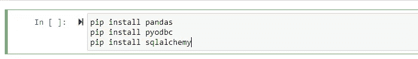
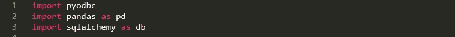
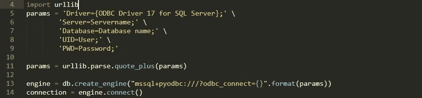
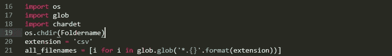
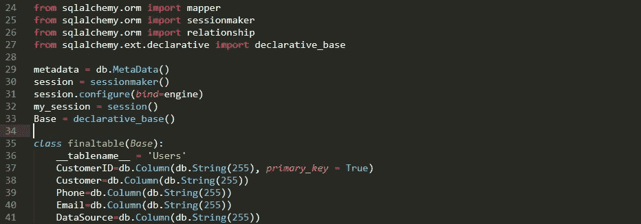
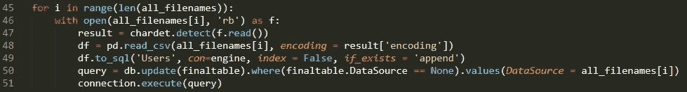

# 使用 SQLAlchemy 将多个 CSV 文件写入 SQL 数据库

> 原文：<https://medium.com/analytics-vidhya/writing-multiple-csv-files-to-sql-databases-using-sqlalchemy-1f3b85af56d6?source=collection_archive---------4----------------------->

数据库在数据科学中扮演着非常重要的角色，每个程序员，无论是数据科学家还是数据分析师，都需要能够有效地使用这些数据库并灵活处理。处理 CSV 文件也是数据科学家的日常工作。为了查询数据并得出可用于业务的有意义的见解，能够读取它们或将它们写入 SQL Server 等数据库是绝对必要的。这项工作的自动化将为您节省大量时间和精力。

为了有效地完成这项工作，python 非常方便，它是开源的，内置了几个强大的包和库。一个这样的库是 ***SQLAlchemy*** ，它方便了 ***Python*** 程序和 ***SQL 数据库*** 之间的通信。

假设您已经熟悉了基本的 python 技能，让我们从代码开始，在这里您将看到如何将保存在本地机器上的一个文件夹中的多个 CSV 文件写入您的***Microsoft SQL Server***数据库中的一个 SQL 表(SQLAlchemy 可用于写入许多其他数据库，如 MySQL、Oracle、PostgreSQL、SQLite 等。仅举几个例子)。

因此，第一步是通过在本地机器终端上运行来安装如下重要的库，如果它们还没有安装在 python 工具包中的话。Pyodbc 是一个连接器，用于连接 python 和 SQL Server 数据库。

现在，我们将从 python 代码开始。

然后我们将使用 pyodbc 连接器在 python 和 MS SQL Server 之间建立连接。在下面的代码中定义您的服务器名称、数据库名称、用户和服务器登录密码。

建立连接后，您可以定义保存所有 CSV 文件的文件夹，所有文件名都可以存储在一个列表变量中。只要确保这些文件具有相同的列数和列名，以便它们可以作为单个表写入 SQL 数据库。

现在是时候使用 SQLAlchemy 的强大功能将这些文件写到一个表中了。您可以首先在 SQL 数据库中创建一个表(使用 SQL query，确保它具有与 CSV 文件相同的列数和列名，并且您可以添加一个 ***DataSource*** 列来写入文件名，以便在查询数据时知道 DataSource 文件)，使用 python 代码与它建立连接。这将通过对象关系映射器(ORM)工具来完成，该工具将 Python 类转换为关系数据库上的表，并自动将函数调用转换为 SQL 语句。

下面的代码解释了 python 如何首先读取每个 CSV 文件。如果您的文件包含一些非英语数据，那么它需要在代码中定义一些编码，以便 python 能够读取该文件。你可以用下面这段代码完成所有这些，然后最终将所有文件写入表中，并更新数据源列。

运行整个代码，享受自动化。