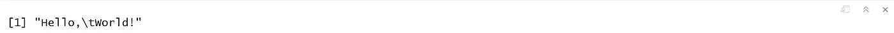
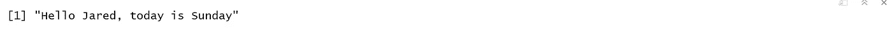
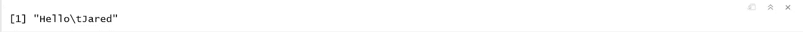
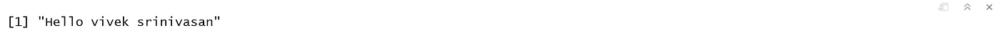
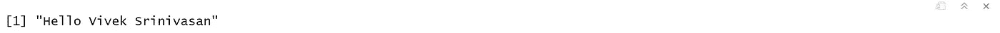
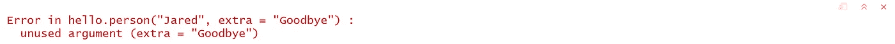
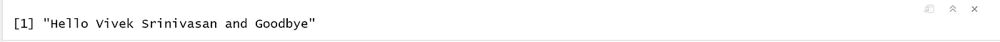
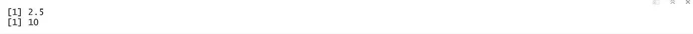

# 编写 R 函数— 3

> 原文：<https://medium.com/analytics-vidhya/writing-r-functions-3-2fe03faecfbe?source=collection_archive---------11----------------------->

> 如果您还没有阅读 R 基础系列的第 2 部分，请阅读下面的文章，在这篇文章中我们讨论了 R-2 中的高级数据结构。本系列涵盖了 R 的基础知识，包括数据类型、控制结构、循环、函数和高级数据结构。
> 
> 如果您已经熟悉这些主题，并且正在使用 r 寻找统计和机器学习中所有重要主题的全面介绍，请从以下系列开始，其中讨论了与数据科学相关的所有必要主题。
> 
> [将数据读入 R — 1 的多种方式](/@viveksrinivasan/many-ways-of-reading-data-into-r-1-52b02825cb27)
> 
> 这篇文章的内容是我在 IIM-B 时代得到介绍的几本书的要点。
> 
> 人人为我——贾里德·p·兰德
> 
> 实用数据科学与 R — Nina Zumel 和 John Mount
> 
> 文中讨论的所有代码块都以 R markdown 的形式出现在 [Github 链接](https://github.com/viveksrinivasanss/Data_Science_Using_R)中。
> 
> 要查看我写的所有文章，请使用链接 [Vivek Srinivasan](/@viveksrinivasan) 。


如果我们发现自己在重复运行相同的代码，那么把它变成一个函数可能是个好主意。在编程中，最好尽可能减少冗余。这样做有几个原因，包括可维护性和易于重用。有一种方便的方法来创建函数，但是它与其他语言有很大的不同，所以可能需要一些预期调整。

## 你好世界

如果我们不包括“你好，世界！”这就不是一个关于编程语言的严肃博客例子，我们就从这个开始。让我们构建一个简单地打印“Hello，World！”到控制台。

```
say.hello <- function()
 {
  print("Hello, World!")
 }say.hello()
```



首先，注意在`R`中，句号`(.)`只是另一个字符，没有特殊的含义，1 不像在其他语言中。这允许我们调用这个函数`say.hello`。

接下来，我们看到函数被分配给对象，就像任何其他变量一样，使用`<-`操作符。对于来自其他语言的人来说，这是编写函数最奇怪的地方。

函数后面是一组括号，可以是空的(没有任何参数)，也可以包含任意数量的参数。

函数体用花括号`({ and })`括起来。如果函数只包含一行，这是不必要的，但这种情况很少见。注意函数内部命令的缩进。虽然不是必需的，但适当缩进代码以确保可读性是一个好习惯。我们将希望函数执行的代码行放在主体的这里。分号`(;)` 可以用来表示行尾，但不是必须的，而且它的使用实际上是不被允许的。

## 函数参数

我们经常希望将参数传递给函数。这些很容易添加到函数声明的括号中。我们将使用一个参数来打印`“Hello Jared.”`

然而，在此之前，我们需要简要了解一下`sprintf` 函数。它的第一个参数是一个带有特殊输入字符的字符串，后续参数将被替换到特殊输入字符中。

```
sprintf("Hello %s, today is %s", "Jared", "Sunday")
```



参数`name`可以作为函数内部的变量使用(它不存在于函数外部)。它也可以像任何其他变量一样使用，并作为进一步函数调用的参数。

```
hello.person <- function(name)
{
  print(sprintf("Hello %s", name))
}

hello.person("Jared")
```



参数`name` 可以作为函数内部的变量(在函数外部不存在)。它也可以像任何其他变量一样使用，并作为进一步函数调用的参数。

我们还可以添加第二个要打印的参数。当调用带有多个参数的函数时，有两种方法可以指定哪个参数带有哪个值，要么是按位置要么是按名称。

```
hello.person <- function(first, last)
  {
    print(sprintf("Hello %s %s", first, last))
  }hello.person("vivek","srinivasan") orhello.person(first="vivek",last="srinivasan")
```



能够通过名称指定参数为调用函数增加了很多灵活性。甚至可以提供部分参数名，但是要小心。

```
hello.person(fir="Jared", l="Lander")
```

## 默认参数

使用多个参数时，有时不需要为每个参数输入值。在其他语言中，可以通过多次定义函数来重载函数，每次使用不同数量的参数。相反，r 提供了指定默认参数的能力。这些可以是`NULL`、`characters`、`numbers` 或任何有效的`R`对象。让我们重写`hello.person` 以提供`“Doe”`作为默认姓氏。

让我们重写`hello.person`以提供`“Doe”`作为默认姓氏

```
hello.person <- function(first, last="Srinivasan")
  {
    print(sprintf("Hello %s %s", first, last))
  }# call without specifying last
hello.person("Vivek")
```



## 额外参数

r 提供了一个特殊的操作符，使函数可以接受任意数量的参数，而这些参数不需要在函数定义中指定。这就是点-点-点论证`(…)`。尽管这可以提供很大的灵活性，但应该非常小心地使用。现在，我们将只是看看它如何吸收额外的参数；稍后我们会发现它在函数间传递参数时的用途。

```
# call hello.person with an extra argument 
hello.person("Jared", extra="Goodbye")
```



```
hello.person <- function(first, last="Srinivasan",...)
  {
    print(sprintf("Hello %s %s and %s", first,last,...))
  }# call hello.person with an extra argument
hello.person ("Vivek", extra="Goodbye")
```



## 返回值

函数通常用于计算某个值，因此它们需要一种机制将该值返回给调用者。这就是所谓的回归，而且很容易做到。使用`R`有两种方法可以实现这一点。函数中最后一行代码的值会自动返回，尽管这可能是一种不好的做法。举例来说，我们将构建一个函数，它将唯一的参数加倍并返回该值。

```
# first build it without an explicit return
double.num <- function(x)
{
  x * 2
}
double.num(5)
```

`return` 命令更明确地指定了应该返回值和应该退出函数。

```
# build it again, this time with another argument after the explicit return
double.num  <- function(x)
{
  return(x * 2)
  # below here is not executed because the function already exited
  print("Hello!")
  return(17)
}double.num(5)
```

## 打电话

一个特别未被充分利用的技巧是`do.cal` l 函数。这允许我们将函数名指定为`character` 或`object`，并将参数指定为`list`。

```
do.call("hello.person", args=list(first="Jared", last="Lander"))or do.call(hello.person, args=list(first="Jared", last="Lander"))
```

这在构建允许用户指定动作的函数时特别有用。在下面的例子中，用户提供一个`vector` 和一个`function` 来运行。

```
run.this  <- function(x, func=mean)
{
  do.call(func, args=list(x))
}## calling the run.this with vector and function
run.this(c(1,2,3,4),mean)run.this(c(1,2,3,4),sum)
```



函数允许我们创建可重用的代码，避免重复并允许容易的修改。需要记住的要点是函数参数、默认值和返回值。在接下来的文章中，我们将会看到比我们目前看到的更复杂的函数。在下一篇文章中，我们将讨论 r。

> [R—4 中的控制语句和循环](/@viveksrinivasan/control-statement-and-loops-in-r-4-3663b782b064)
> 
> *一定要通过评论和分享文章来分享你的想法和支持。*