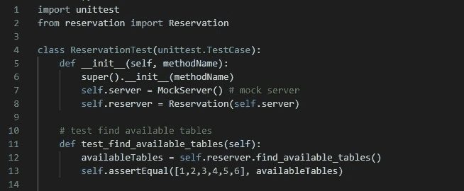

# 用 PYTHON 编写可靠的单元测试—第 1 部分

> 原文：<https://medium.com/analytics-vidhya/writing-reliable-unit-tests-in-python-a6b1a26be30e?source=collection_archive---------24----------------------->

作为开发人员，我们发现自己几乎一直在编写代码集群，构建或管理大型软件系统。通常情况下，我们还会花费大量时间寻找和修复这些系统中的错误。今天，一些设计模式、最佳实践、调试工具和编码风格的存在使我们在处理 bug 时不那么困难，最终使我们成为有用的开发人员，因为花在寻找和修复 bug 上的时间更少意味着花在改进或构建更复杂和高效的软件上的时间更多。测试驱动开发就是这样的最佳实践之一。

# **简介**

测试就像它们听起来的那样，断言某样东西是它想要的，看起来完全像它想要的样子，或者完全做它想要做的事情。

测试驱动开发(TDD)传达了在整个软件开发过程中编写测试以及特性实现的思想。作为开发人员，我们需要培养为我们实现的每个单元编写测试的习惯(单元测试)。这是最初看似详尽的实践之一，随着您作为开发人员的成长和提高，它将被证明成为您工具箱中有用的技能集。

# **什么是单元测试？**

> 根据维基百科，单元测试通常是由软件开发人员编写和运行的自动化测试，以确保应用程序的一部分(称为“单元”)符合其设计并按预期运行。

简单地说，我想我们可以说单元测试基本上是为组成我们整个软件系统的最小实现场景(单元)编写测试用例。在函数式或过程式编程中，一个单元可以分别被认为是一个函数或过程，或者是面向对象编程中的一个方法。

当测试由开发人员独立地或集体地(成批地)编写和运行时，它被称为单元测试，然而当测试被设置为由自动化服务器运行时，例如在持续集成和持续开发(CI/CD)配置中，它是自动化测试。

# **但是我为什么要写测试呢？**

**编写测试将帮助你理解构建什么:**因为理想情况下，我们将首先编写测试，在实际实现我们的单元之前，我们将被迫考虑我们希望我们的单元(和整个软件)如何通过严格测试我们将最终编写的单元中的关键因素或行为来工作。

单元测试将帮助你记录你的单元:因为通常我们可能与设计师、项目经理、终端用户等一起工作。测试将指导我们在开发过程的早期阶段开始与他们互动，收集功能需求，同时为我们的单元编写测试用例，以完全匹配这些需求。在此过程中，利用项目经理和/或最终用户等提供的见解记录单元。同时也帮助你一点一点地设计整个软件结构。

**测试还可以帮助您检测回归:**回归是由于代码库中最近的一些更改，导致先前测试和工作代码实现失败或中断时产生的失败。因为我们通常会集体运行我们的测试用例(作为测试套件)，任何由最近的变化触发的失败都很容易被发现。

# **好吧，很公平，那么我应该什么时候写单元测试呢？**

单元测试应该是你开始写的第一件事，因为它们帮助你设计和记录你的特性实现。首先编写测试用例将允许您表达和传达每个实现应该如何工作的想法，因此它将指导您如何有效地执行任务实现。

# 如何编写单元测试

今天，人们测试代码的方式有很多种。下面是一些使用的方法:

**最后的测试:**这是指在你完成设计后，你立即开始编写你的实现，并且在编写了相当多的单元实现代码后才决定开始编写你的测试用例，这样做的缺点是，它可能会导致你不得不重构你的一些代码库，所以你花了很多时间编写代码，只是为了回来撤销你的一些工作。此外，您可能会实现将来证明不太容易测试的代码，因为它周围有各种各样的依赖关系，并且由于没有先编写测试而缺乏灵活性，这是您没有预料到的。

您可能永远也不会编写足够的测试用例来覆盖所有可能的场景，而不是先开始编写测试。

编写测试在编写代码之后进行

**先测试:**另一种方法是先编写所有的测试用例，紧接在设计之后，编写单元实现之前。这基本上意味着，您尝试预测所有可能的场景来测试任何特定的单元，然后为该单元编写所有测试用例，实现该单元，然后对其他单元继续相同的方法。虽然这肯定比以前的方法好，但有时我们不能完全预测所有的测试用例，这也可能导致不得不做一些返工。

在实现单元之前，编写所有的测试用例来覆盖每一个可能的场景

测试驱动:这是我强烈推荐的方法，在测试驱动开发方法中，你将为一个单元写一个测试用例，然后写一点点代码使它通过，然后你重构并重复。接下来，您为另一个单元编写另一个测试用例，依此类推。

测试驱动开发(TDD)。这是编写测试的推荐方式

同样，至少，一个单元测试用例应该只测试一个单元任务或实现。通常，测试用例应该遵循以下结构:

排列-动作-断言

其中 **Arrange** 将暗示一个设置，比如一个类的对象实例化(如果进行面向对象的编程)， **Act** 将暗示一个使用该实例的方法调用(主要是你的测试用例所涉及的方法，我们正在测试的方法)，而 **Assert** 将检查一致性或正常行为，存在不同种类的断言，从检查相等性的基本断言到引发定制异常的断言等。

一个好的单元测试通常会按顺序执行这些步骤，并且几乎总是只包含一个批处理，例如，一个差的单元测试会在一个单元测试用例中执行一系列 **Arrange-Act-Assert** 步骤。

顺便提一下，测试用例应该是相互独立的，也就是说，一个用例不应该依赖于另一个测试用例通过的可能性才能通过，这最终会成为未来灾难的原因。

同样，一个单独的测试用例不应该承担测试一个特定方法或功能的唯一责任，没有规则这么说。您应该编写测试用例来测试您的方法或函数可能存在的各种场景或状态，以及您希望如何对待或处理这些场景。

# **足够的理论，让我们在实践中看到这一点**

所以我们准备为一个只有 6 张桌子的小餐馆建立一个预订应用程序，并为它编写一些单元测试。我们将在设计中使用面向对象的方法，我们的 reservation 类将具有执行以下功能的方法:

查找可用的表

预订

查找预订

更改预订

取消预订

然而，在本教程中，我们将只实现执行前两个功能的方法，并为它们编写测试用例。所以让我们深入研究一下。

图 1

如上图，我们可以看到我们 ***预约*** 类的定义。我们的构造函数将一个 ***服务器*** 对象引用作为一个参数，我们分别从其中获取我们的 ***预订*** 和 ***表*** 作为字典和列表。对于我们的测试，我们将使用一个 ***模拟*** 服务器类。

从第 7 行到第 20 行，我们可以看到我们的类函数的定义。然而，目前他们不一定做任何有用的事情。

接下来，让我们开始为***find _ available _ tables***方法编写我们的第一个测试用例，看看当我们运行测试时会发生什么。

图 2

从上面我们可以看到，在**行 1** 上，我们正在导入[***unittest***](https://docs.python.org/3/library/unittest.html)*模块，该模块提供了一套丰富的用于构建和运行测试的工具，它随您的 python 发行版一起提供，所以您不必担心安装问题。*

*尽管存在其他类型的测试运行程序，但是对于本教程，我们将使用 *unittest* 模块，您会发现对于您将要编写的大多数测试用例，这个模块已经足够了。其他一些测试跑步者包括[***pytest***](https://pypi.org/project/pytest-runner/)等。*

*该模块提供了一个名为 ***TestCase*** 的基类，可以用来创建新的测试用例，我们将它传递给第 4 行上的类定义**。*测试用例*中包括的一些方法有:***

******assert true****—接受一个表达式并检查该表达式是否为真****

*******assertIn****—*就像 *assertTrue* ，但是有一个更好的默认消息，它可以用来检查第一个参数是否存在于第二个参数中(例如 ***self.assertIn(2，[1，2，3])*******

****和其他一些人。要了解更多关于 *unittest* 的信息，你可以访问文档页面[这里](https://docs.python.org/3/library/unittest.html)。****

******第 4 行到第 13 行**保存了我们的 ***ReservationTest*** 类的定义，包括它的构造函数和我们的第一个测试用例为***find _ available _ tables***方法名为***test _ find _ available _ tables _ finds _ all _ tables***。****

****我们 ***将*** 安排在**行**(或 7 加 8)***行事*** 在**行****和*断言*** 在**行【13】**同时你也可以将*安排在*行事* 之前*****

***正如您可能已经注意到的，测试类名是它正在测试的类的名称(*保留*)，后面附有“test”关键字，测试用例以前缀“Test”标记开始，后面是它正在测试的方法的名称( *find_available_tables* )，以它正在测试的特定特性或行为结束。“test”后置到类名，而“Test”前置到测试用例方法名，这是大多数测试运行程序使用的命名约定，这是测试运行程序在运行时如何识别测试类和测试用例，以及如何将它们与非测试函数区分开来。***

***因为一个方法很可能有几个测试用例来测试不同的行为，所以如果我们在测试方法名称中包含我们要测试的特性或行为，这通常是有帮助的。例如，对于我们的测试用例，我们想测试它是否返回所有的表(因为还没有预订)，因此命名为*test _ find _ available _ tables _ finds _ all _ tables****。******

***让我们运行我们的第一个测试案例，看看会发生什么…***

******

***图 3***

***我们在命令行中使用命令"***python–m unittest***"调用我们的测试运行程序(在本例中为 *unittest* ),确保您位于测试文件所在的当前路径中。***

***不出所料，我们的测试用例失败了，AssertionError 为*【1，2，3，4，5，6】！= None* ”，这是有意义的，因为我们的 *find_available_tables* 方法目前并没有真正做任何事情，因此还没有返回任何东西，所以 *assertEqual* 很容易标记它。***

***因此，让我们通过向我们的方法添加一些实现代码来改变这一点。它所要做的就是返回一个尚未被预订的表的整数列表，所以接下来我们就这么做吧。***

******

***图 4***

***在上面的第 8 行,我们已经使用列表理解在一行中完成了。这将返回当前在 *self.reservation* (一个字典)中为空的所有表，这些表的状态是从服务器返回的。***

***需要注意的是，通常用实时服务器连接、文件系统等进行测试是不理想的。使用*模拟软件*通常更容易也更可取，在编写测试时使用模拟软件会引导你构建更加灵活的应用。***

***模拟基本上是使用硬编码的、假的或虚拟的数据(如果允许我这么说的话)来表示用于测试目的的实际数据的实现，通常我们按照我们期望的实际数据来构造我们的模拟数据，并且因为它们是硬编码的，这使得我们更容易可靠地为它们编写测试。***

***在再次运行我们的测试之前，让我们快速看一下我们的 *MockServer* 是什么样子，服务器将发送并管理我们的 *reservations* 和*表*的当前状态。***

******

***图 5***

***我们可以看到这是一个非常简单的服务器，有两个变量代表我们的状态(在内存中)和两个 getter 方法。正如前面所强调的，我们的餐馆只有 6 张桌子，我们的*预订*字典将这些*桌子*映射到进行预订的人的名字(非常琐碎)，我们将在 *make_reservation* 方法中看到这一点。***

***好了，现在我们知道了我们的模拟服务器是什么样子的，我们对我们的应用程序如何从哪里获取数据，以及我们正在处理什么样的数据有了更清晰的了解，让我们再次运行我们的测试，看看会发生什么。***

******

***图 6***

***这一次，我们的测试用例通过了，如上所示。因此，基本上我们的测试调用了 *find_available_tables* 方法，该方法获取由我们的模拟服务器提供的模拟表，因为在这个调用之前没有在测试中进行预留，所以这个调用返回所有的表。直走右拐。***

***接下来，让我们为 *make_reservation* 方法编写一个基本实现，足以让它成功地进行预订，然后为它编写一个测试用例来确认它做了我们期望的事情，这样我们就可以为 *find_available_tables* 方法编写另一个测试用例，看看如果我们在这次调用它之前进行预订，它会返回什么。***

******

***图 7***

***上面是我们的 Reservation 类现在的样子，从第 10 行到第 15 行实现了 *make_reservation* 方法**。*****

***所以基本上我们想在 *reservations* 中找到任何可用的桌子，然后预订它。如果成功，我们将返回 True，否则返回 False。***

***让我们为 *make_reservation* 编写一个测试用例来测试这个动作…***

******

***图 8***

***从**的第 16 行到第 18 行，**我们可以看到我们的第二个测试用例，但是第一个测试用例为 *make_reservation* 方法，名为***test _ make _ reservation _ has _ available _ table***(这不是一个很容易理解的名字，我必须承认 ***)*** ，但是这意味着测试确实有一个可用的表，因此它能够为“ *Mariam* ”保留它。***

***让我们运行它，确保它完全按照我们的预期运行…***

******

***图 9***

***果然，正如你在上面看到的，它也通过了，所以现在我们有两个通过测试的案例，都测试不同的行为。***

***接下来，我们想测试在保留一个表之后，当调用 *find_available_tables* 方法时，它不会出现在可用表的列表中。所以下面就这么做吧。***

******

***图 10***

***我们的测试叫做***test _ find _ available _ tables _ after _ making _ reservation***，因为那是我们想要测试的。我们想测试在预订一个表后，它不会出现在可用表的列表中。**在第 22** 行我们为 *Adam* 预留了表 *1* ，在第 23 行我们调用了 *find_available_tables* 和**在第 24** 行我们使用 *assertNotIn* 断言在我们预留后 *1* 不会包含在*available s*列表中***

******

***图 11***

***在运行测试之后，我们可以看到我们现在有 3 个测试用例，并且目前都通过了。如果我们断言 *1* 在返回的*可用表*的列表中，测试将会失败。让我们试试这个:***

******

***图 12***

***因此，我们将断言方法从 *assertNotIn* 更改为 *assertIn* ，如第 24 行中的**所示。现在让我们运行它…*****

******

***图 13***

***果然，我们进行了一个失败的测试，正如你所看到的，我们运行了 3 个测试用例，其中 2 个已经通过，除了***test _ find _ available _ tables _ after _ making _ reservation***，失败指向正在进行断言的**第 24 行**，并打印出一条 *AssertionError* 消息“在[2，3，4，5，6]【T61]中未找到 *1”。正如我们所看到的, *1* 不在返回列表中。****

***假设我们对我们的*find _ available _ tables*方法感到满意，我们想回到我们的 *make_reservation* 方法来测试其他行为。***

***我们希望该方法足够灵活，可以预订特定的桌子，以防一些人可能更喜欢坐在一些特定的桌子上。***

***因此，让我们改进我们的方法，以包括这种能力。***

******

***图 14***

***因此，我们在第 10 行的 *make_reservation* 的签名中加入了一个名为 *table* 的可选参数，并在第 11 行到第 22 行的 if-else 条件**中包装了我们的实现。**如果没有提供表，我们的行为将和以前一样，否则我们将不得不在预订表之前执行一些检查。***

***第一次检查是为了防止提供无效的表号，而第二次检查是为了确保表是空的或者还没有被预订。***

***让我们添加测试案例来验证这些行为…***

******

***图 15***

***我们已经添加了 3 个测试用例来测试无效的表编号，分别是如上所示的不取表和取表。***

***第一个测试用例提供了一个表编号 *11* ，因为我们知道我们只有 6 个表，我们期望得到一个*假*响应，如在第 29 行上实现的**。我们的第二个测试用例提供了表编号 *5* ，因为这是一个有效的表编号，并且我们知道它当前是可用的(因为我们还没有预订它)，我们期望得到一个 *True* 响应。第三个测试用例首先为第 38 行**上的*【Scott***保留表 *2* ***，然后尝试为第 39 行***上的*Aisha***保留同一个表，因为表已经被占用，所以我们预期它将返回一个 *False* 。*******

******

***图 16***

***运行之后，我们看到它们都通过了，我们可以看到我们现在总共有 6 个测试用例都通过了。***

***我们可能需要添加更多的测试用例来测试我们两种方法中的其他行为，但是对于我们简单的应用程序来说，这些已经足够了。***

***到目前为止，通过我们所介绍的内容，您应该开始习惯于我们如何进行单元测试的想法，从测试用例的命名约定到我们使用的断言。***

***如果你需要我们所涵盖的完整代码实现，包括其他类方法和测试用例的实现，你可以在这里找到它们**。*****

# *******结论*******

*****总之，我希望这已经足够有帮助了，并且它已经帮助你在使用 python 编写单元测试时变得有些舒服了。我们所介绍的只是冰山一角，我可能会在未来的教程中介绍自动化测试，所以请继续关注。*****

*****感谢您的阅读，我希望您能够成功地跟进，如果您有任何问题或建议，请随时在下面的评论中提出，我将非常高兴听到您的反馈。如果你认为这篇文章对你有帮助，也可以和你的朋友和同事分享。再次感谢，祝您愉快。*****