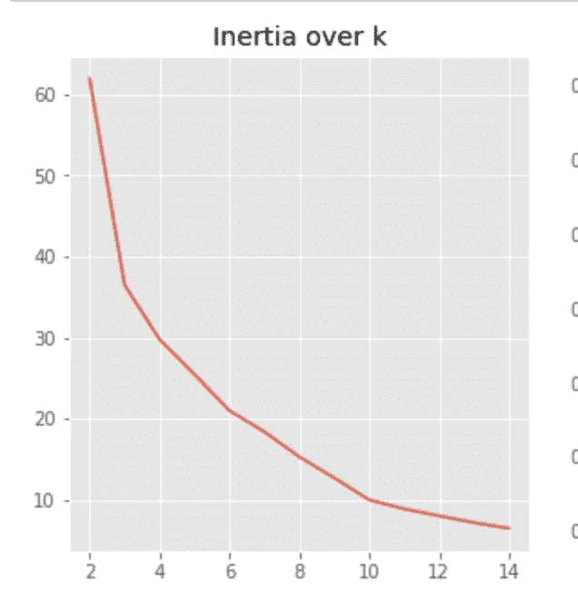

# WSH 奇才 2 十年梦之队

> 原文：<https://medium.com/analytics-vidhya/wsh-wizards-2-decade-dream-team-35954aaa00fe?source=collection_archive---------9----------------------->

*用机器学习分析我喜欢的篮球队。*

要查看完整的代码，请访问我的 Github: [这里](https://github.com/Sandeep-Bansal1/WSH-Wizards-2-Decade-Team/blob/master/Wizards%202%20Decade%20Team%20Updated%20(1).ipynb)

当我观看以芝加哥公牛队为主角的纪录片【T4·最后的舞蹈】时，我预计这部剧可能会以迈克尔·乔丹穿着奇才队球衣在 NBA 的最后几天结束。不幸的是，在未能提及他重返 DC NBA 后，我不得不思考: ***有人记得迈克尔·乔丹为华盛顿奇才队效力吗？***

虽然他在奇才队短暂的职业生涯被许多人认为是失败的，但他在国家首都的时光仍然是华盛顿球迷的普遍记忆。除了对 1998 年芝加哥公牛队赛季的深入探讨之外，这部纪录片还突出了许多在球队赢得第六次冠军的过程中发挥作用的补充球员。像托尼·库科克、比尔·卡特莱特和斯科特·伯勒尔这样的球员已经成为遥远的记忆，直到这部纪录片将他们拍成了全国电视连续剧。

受到这部纪录片的启发，我决定调查我自己最喜欢的球队的历史，重温那些为华盛顿奇才队效力的人的记忆。利用机器学习，我组建了一支由过去 20 年中为华盛顿奇才队效力的最佳球员组成的 20 年梦之队。当我开始探索数据集时，两个问题很快浮出水面:谁将组成这个团队？伟大的迈克尔·乔丹在他的两年任期中做了足够多的事情来使他成为第 12 位和第 13 位吗？扣上安全带，因为结果可能会让你大吃一惊！

# **第一步:数据采集和初步观察**

第一步是从篮球参考中获取数据集。在过去的 20 年里，我总共得到了 182 名球员。我的第一个观察或多或少是“哇，我不知道那个球员为奇才队效力？”下面是一些我在过去二十年中已经遗忘的照片。博扬·博格多诺维奇是当今的顶级球员，肖恩·里文斯顿随勇士队赢得了多个冠军，拉素尔·巴特勒几年前在一场不幸的车祸中去世。

同样值得注意的是仓位分布。例如，在过去的二十年里，华盛顿奇才队已经有 46 名得分后卫和 20 名中锋。作为一个奇才队的球迷，这与球队今天的表现有着太多的联系。想想在过去的 20 年里，球队仅仅只有 20 名中锋，这只是众多问题中的一个。

# 第二步:确定每个职位的统计类别。

NBA 记录了许多统计数据，其中一个挑战是确定如何评估每个位置，因为有些人在更多类别中比其他人表现得更好。例如，一个得分后卫每场比赛不会有很高的盖帽值，所以用这个作为得分后卫位置的统计数据是没有意义的。为了解决这个问题，我采用了基于以下类别的平均表现:FG%，TRB/G，STL/G，BLK/G，AST/G，PTS/G，并决定对给定的职位使用以下统计数据。

**1。控卫:AST/G，PTS/G，STLs/G**

> **2。得分后卫:AST/G，PTS/G，STL/G**
> 
> **3。小前锋:FG%，TRB/G**
> 
> **4。大前锋:BLK/克，FG%，TRB/克**
> 
> **5。中心:FG%，TRB/G**

在决定了每个位置将如何被评估后，我只能想象约翰·沃尔看到助攻和抢断时的表情。

> ***你知道吗:自 2014 年以来，约翰·沃尔场均 9.8 次助攻排名第一，场均 1.8 次抢断排名第七***

# **步骤 3:使用机器学习为每个职位创建聚类**

在确定每个职位的最佳表现质量后，我继续在每个职位内创建聚类，将每个质量标记为预测变量。 ***通过一种称为 K-Means 聚类的无监督机器学习模型，*** 我能够围绕中心点对数据进行分组，以创建相似数据的不同聚类。中心点用字母 **k** 表示，需要在模拟模型前确定。换句话说, **k** 将根据玩家的统计表现对他们进行分类——表现质量越好，分类排名越高。

现在我必须决定标记为 n_clusters 的簇的数量。这个数字决定了玩家将被分到多少组。基本上 **n_clusters** 代表了团队的数量。如果我的 n_cluster = 5，这意味着我的模型将根据运动员的表现质量将他们分成 5 组(或团队)。现在的问题是我如何确定这个 n_cluster 值？理想情况下，惯性分数越低，聚类中的每个数据点越相似。因此，我们希望选择一个数字来显示附近的数据点聚类以及低惯性分数。下面是一个图表示例，描述了对数据最有用的 n_cluster 数。

SF、PF、C 表示所有位置的 n_cluster = 8 的估计值。

下面描述了一种可视化集群以查看它们是否靠得很近的方法。左图显示了 SF 的位置。了解 n_cluster 值是否准确的定量方法是比较每个位置最佳表现特征的平均值和中间值，以查看中心趋势值在可变性方面是否不同。右边是一个恰好完全相同的清晰示例！

在确定最佳 n_cluster = 8，并根据他们的表现将所有球员分入不同的群之后，这里是每个位置的结果。 ***请记住，我没有设定最低游戏金额来包括新手，他们的排名是根据篮球参考来计算一名球员对球队整体胜利的贡献。*** 这意味着如果团队在某个特定的赛季总共只赢了 20 场比赛，无论个人篮球水平如何，由于团队赢的比赛不多，参考都不会给该球员排名很高。

下面是前两个集群的玩家。看看是谁:吉尔伯特·阿里纳斯！

左边是集群 1。右图:第二组

# **第四步:介绍 WSH 奇才 2 十年梦之队**

由于我没有设置玩家玩游戏的最小数量，再次考虑到新手，我决定将集群 1 和集群 2 合并为一个梦之队，并将前 15 名玩家标记为 20 年梦之队。

别担心，布拉德，我没有忘记你！

下面是最终结果。多么令人惊讶的表情啊，谁刚刚进了队

华盛顿的告别

感谢您的阅读！

— — — — — — — — — — — — — — — — — -

参考资料:

1.  茉莉·瓦桑达尼
2.  篮球参考