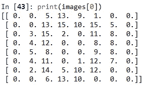
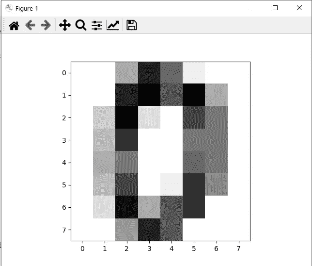
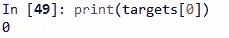
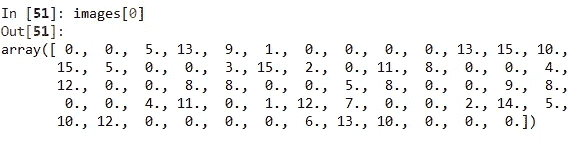
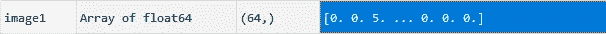
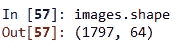
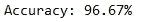
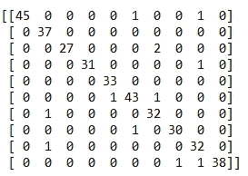

# XGBoost 分类器手写数字识别

> 原文：<https://medium.com/analytics-vidhya/xgboost-classifier-hand-written-digit-recognition-219acedfef13?source=collection_archive---------7----------------------->

要开始使用 XGBoost，首先我们必须安装 XGBoost 库包。我们可以用“pip”或“conda”来做。

```
pip install xgboost
```

在本文中，我们将关注如何使用 XGBoost 创建您的第一个模型(分类器)。

我们为这个例子选择的数据集是手写数字数据集，它在 sklearn 预加载的数据集中很容易获得。为了导入数据集，我们使用代码:

```
from sklearn import datasets
digits = datasets.load_digits()
```

digits 对象中有“images”和“target”属性。

这些图像是 8×8 维的二维阵列，每个阵列代表一个手写数字图像。由于该图像只有 8×8 = 64 像素，因此它是一个分辨率相当低的图像。
目标属性具有图像的标签，即如果图像[0]表示数字“4 ”,则相应的目标具有值“4”。

我们的问题陈述是从给定的 8×8 像素图像中正确识别手写数字。
我们有 10 个目标类别(数字 0 到 9)

```
images=digits.imagesprint(images[0])
```



代表手写数字的 2D 数组

为了更好的可视化，我们使用 matplot 库。

```
import matplotlib.pyplot as plt
plt.imshow(images[0],cmap='binary',interpolation='nearest')
```



图像[0]

```
targets=digits.target
print(targets[0])
```



load_digits 数据集有 1797 条记录。出于训练和验证的目的，我们必须将数据集分成训练集和测试集。
我们拥有的图像对象是 3D 数组，这很难处理，
所以为了方便起见，我们将其转换成 2D 数组数据集。
也就是说，现在每个图像都用 2D 数组表示，我们将每一行添加到前一行的末尾，使其成为一行，从而将其更改为 1D 数组。

```
images=images.reshape(1797,8*8)
```



现在我们的数据集是二维的，形状为:



在我们的数据集中有 1797 个展平的图像，我们使用 train_test_split 方法将它们分成训练集和测试集。

```
from sklearn.model_selection import train_test_split
X_train, X_test, y_train, y_test = train_test_split(images, targets, test_size=0.2)
```

现在我们创建一个 XGBoost 类的对象，并根据我们的训练数据拟合模型。

```
from xgboost import XGBClassifier
model = XGBClassifier()
model.fit(X_train, y_train)
```

为了进行预测，我们称之为预测方法。

```
y_pred=model.predict(X_test)
```

模型的准确性可以如下测试，

```
from sklearn.metrics import accuracy_score
accuracy = accuracy_score(y_test, y_pred)
print("Accuracy: %.2f%%" % (accuracy * 100.0))
```



此数据集上未调整的 XGBClassifier 的准确性

为这个多类分类问题获得的混淆矩阵是，

```
from sklearn.metrics import confusion_matrix
confusion = confusion_matrix(y_test, y_pred)
print('Confusion Matrix\n')
print(confusion)
```



行从左边(0 到 9)开始标记，列从上到下(0 到 9)开始标记

沿着对角线的数字显示正确的预测，所有其他地方显示不正确的预测。
考虑位置行:0 和列:5，它具有值 1，它表示对于一个实例，数字“0”被错误地预测为“5”。

通过参考 xgboost 文档更改 XGBClassifier 中的参数，可以对模型进行微调。

 [## Python API 参考-xgboost 1 . 3 . 0-快照文档

### 本页给出了 xgboost 的 Python API 参考，更多内容请参考 Python 包介绍…

xgboost.readthedocs.io](https://xgboost.readthedocs.io/en/latest/python/python_api.html?highlight=xgbclassifier#xgboost.XGBClassifier) 

上述示例的完整代码:

```
from sklearn import datasets
import matplotlib.pyplot as plt
from xgboost import XGBClassifier
from sklearn.model_selection import train_test_split
from sklearn.metrics import accuracy_scoredigits = datasets.load_digits()images=digits.images
targets=digits.targetX_train, X_test, y_train, y_test = train_test_split(images, targets, test_size=0.2)model = XGBClassifier()
model.fit(X_train, y_train)y_pred=model.predict(X_test)accuracy = accuracy_score(y_test, y_pred)
print("Accuracy: %.2f%%" % (accuracy * 100.0))from sklearn.metrics import confusion_matrix
confusion = confusion_matrix(y_test, y_pred)
print('Confusion Matrix\n')
print(confusion)
```

# 谢谢大家！