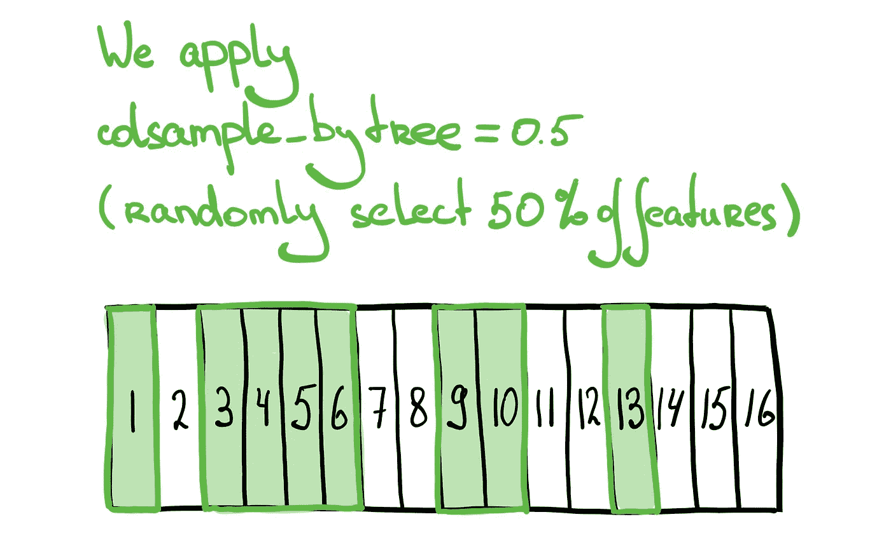

# XGBoost colsample_by*超参数说明

> 原文：<https://medium.com/analytics-vidhya/xgboost-colsample-by-hyperparameters-explained-6c0bac1bdc1?source=collection_archive---------1----------------------->

同志们好！

当我第一次偶然发现 XGBoost 的 colsample 超参数时，我有点困惑它们是如何一起工作的。官方文档很好，但我花了一些时间来完全理解参数之间的差异。本文假设您熟悉 XGBoost，并且只关注 **colsample_by*** 超参数。

假设我们有一个包含 16 个要素的数据集。

# 列样本 _ 字节树

我们知道，XGBoost 构建了多个树来进行预测。 **colsample_bytree** 定义了用于构建每棵树的特征(列)的百分比。很明显，每棵树的特性集很可能是不同的(尽管有可能是相同的，但是不太可能是相同的)。为简单起见，让我们使用 0.5 作为所有参数的默认值。

所以我们将要建造我们的第一棵树。让我们从根节点开始。但是首先我们需要为我们的树过滤随机特征。

# **colsample_bylevel**

每当我们在树中达到新的深度级别时，这就会发挥作用。在进行任何进一步的分割之前，我们提取应用 **colsample_bytree** 后剩下的所有特征，并使用 **colsample_bylevel 再次过滤它们。**在下一个深度级别，我们重复这一步，这样你就可以在每个级别上获得不同的特征集。

# **colsample_bynode**

选择特性的最后一个可能步骤是当我们设置 **colsample_bynode** 超参数时。在进行下一次分割之前，我们过滤掉应用 **colsample_bylevel** 后剩下的所有特征。我们分别为同一深度级别上的每个分割选择特征。

正如官方文件所述:

> `colsample_by*`参数累积工作。例如，具有 64 个特征的组合`{'colsample_bytree':0.5, 'colsample_bylevel':0.5, 'colsample_bynode':0.5}`将在每次分割时留下 8 个特征供选择。

## 为什么我需要这些参数？

通过限制构建每棵树的特征数量，我们可能最终得到从数据中获得不同见解的树。他们学习如何使用不同的特征集来优化目标变量。因此，如果您有足够的数据，您可以尝试调整 **colsample** 参数！

希望这篇文章对你有帮助！

