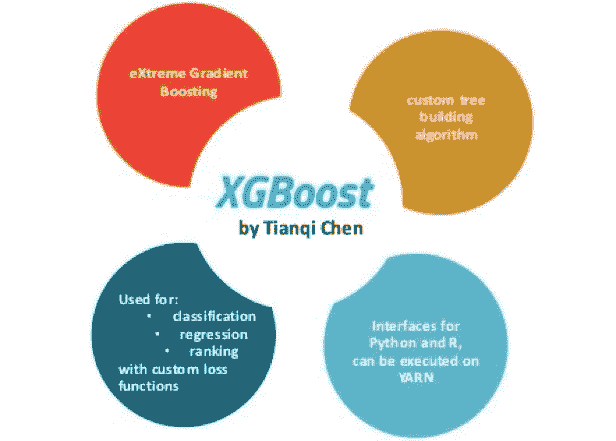
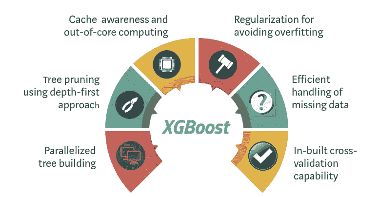
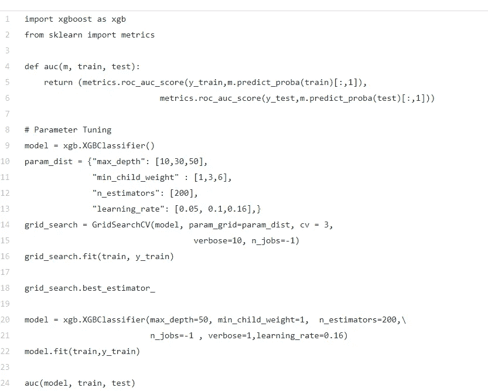

# XGBoost:“一颗橡子里有千片森林”

> 原文：<https://medium.com/analytics-vidhya/xgboost-thousand-forests-is-in-one-acorn-e7deefa9a64?source=collection_archive---------16----------------------->

**我们先来了解一下什么是 XGBoost？**

XGBoost 代表“极限梯度提升”。它是梯度推进算法的扩展。这种强大算法的美妙之处在于其可扩展性，它通过并行和分布式计算驱动快速学习，并提供高效的内存使用。XGBoost 是一种集成学习方法。集成学习提供了一个系统的解决方案来结合多个学习者的预测能力。

XGBoost 用于监督学习问题，其中我们使用训练数据(具有多个特征)x 来预测结果变量 y。XGBoost 是梯度增强决策树的实施，旨在加快和提高性能。

该模型的实现支持 scikit-learn 和 R 实现的特性，并增加了正则化等新特性。梯度增强的三种主要形式是:

*   **梯度推进**算法也叫梯度推进机包括学习率。
*   **随机梯度推进**，在每个分离级别的行、列和列进行子采样。
*   **L1 和 L2 正则化的正则化梯度增强**。

# XGBoost 的独特功能

**并行学习的块结构:**为了更快的计算，XGBoost 可以利用 CPU 上的多个内核。与其他算法不同，这使得数据布局可以被后续迭代重用，而不是再次计算

**核外计算:**该特性优化了可用磁盘空间，并在处理大型数据集时最大限度地利用了磁盘空间。

**处理稀疏数据:** XGBoost 结合了一个稀疏感知的分裂查找算法，以处理数据中不同类型的稀疏模式。缺少值或数据处理步骤(如一键编码)会使数据变得稀疏。

**正则化:**正则化应用于过拟合模型。XGBoost 可以选择通过 L1 和 L2 正则化来惩罚复杂的模型。

**加权分位数示意图:**。XGBoost 有一个分布式加权分位数草图算法来有效地处理加权数据

# XGBoost 的重要参数:

# **1)助推器参数:**在每一步，它引导单个助推器。

## ***a)*min _ child _ weight[默认值=1]:**

> 定义子级*所需的所有观察的最小权重和。*

## **T27)b)max _ leaf _ nodes:**

> 树中的最大终端节点或叶子数。

## ***c)* 伽玛[默认值=0]:**

> Gamma 指定进行分割所需的最小损失减少量。

## ***d)* max_delta_step【默认值= 0】**

> 在最大增量步骤中，我们允许每棵树的重量估计为。如果该值设置为 0，则表示没有约束。如果将其设置为正值，则有助于使更新步骤更加保守。

## ***e)* 子样本【默认= 1】**

> 表示每棵树随机抽样的观察分数。

## **f)eta[默认值=0.3]**

> 通过缩小每一步的权重，使模型更加健壮
> 
> 要使用的典型最终值:0.01–0.2

## ***g)*max _ depth[默认值=6]:**

> 树的最大深度，与 GBM 相同。
> 
> 典型值:3–10

## ***h)* max_depth【默认值= 6】**

> 树的最大深度，与 GBM 相同。

## ***I)*scale _ pos _ weight[默认值=1]**

> 在高等级不平衡的情况下，应该使用大于 0 的值，因为它有助于更快收敛

# **2)学习任务参数:**它指导优化的性能。

## **a)eval_metric :**

*   用于验证数据的指标。
*   对于回归，默认值为 rmse，对于分类，默认值为 error。
*   典型值包括:

## ***RMSE****—*

> *均方根误差*

## **——**

> **平均绝对误差**

## ***——***

> ***负对数似然***

## *****错误****——***

> ***二元分类错误率(0.5 阈值)***

## *****误差*** *—***

> ***多类分类错误率***

## *****mlogloss****——***

> ***多类对数损失***

## ****b)目标[default=reg:linear]****

## **-这定义了要最小化的损失函数。最常用的值有:**

## *****二进制:逻辑****–***

> ***用于二元分类的逻辑回归，返回预测概率(非类)***

## *****多:soft max****–***

> ***使用 softmax 目标的多类分类返回预测类(非概率)***

## *****多:soft prob****–***

> ***与 softmax 相同，但返回属于每个类的每个数据点的预测概率。***

# ****3)一般参数:**它指导整体功能。**

## *****a)* 升压器【默认= GB tree】:****

## **gbtree:**

> **基于树的模型**

## **gblinear:**

> **线性模型**

## **n 线程:**

> **这用于并行处理，应输入系统中的内核数量。**

## *****c)无声【默认= 0】:*****

> **通常最好保持为 0，这样消息可以帮助理解模型。静音模式激活设置为 1，即不打印任何运行消息。**

****

****实现 Xgboost****

****

**我使用的是 2015 年航班延误的 Kaggle [数据集](https://www.kaggle.com/usdot/flight-delays/data)既有分类特征，也有数字特征。XGBoost 本身不能处理分类特征，它只接受类似随机森林的数值。因此，在向 XGBoost 提供分类数据之前，必须执行各种编码，如标签编码、均值编码或一键编码。**

**这里的 Performer 是 XGBoost，它通常工作得很好。然而，XGBoost 唯一的问题是它太慢了。**

****谢谢，继续学习:)****