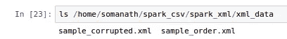
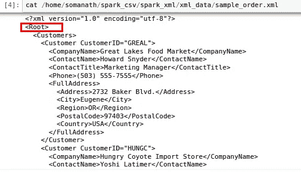
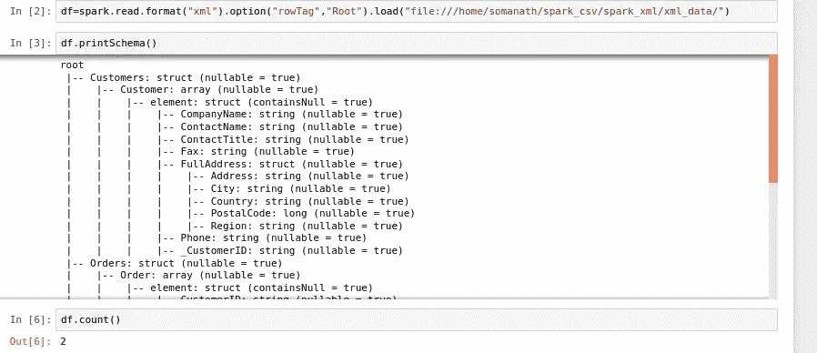
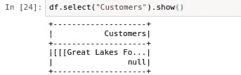
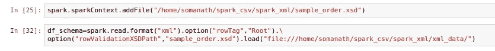
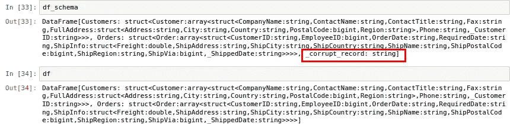
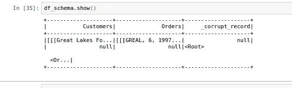

# 用 Pyspark 解析 XML

> 原文：<https://medium.com/analytics-vidhya/xml-parsing-with-pyspark-4a16fbd53ddb?source=collection_archive---------1----------------------->

这是我在《火花深潜》中的一个故事

[https://medium.com/@somanathsankaran](/@somanathsankaran)

Spark 是近来事实上的数据处理框架，xml 是用于数据的格式之一。

让我们看看下面。

1.  正在读取 XML 文件
2.  这是如何工作的
3.  使用 XSD 验证架构

**读取 XML 文件**

为了读取 xml 数据，我们可以利用 data bricks([*spark _ xml*](https://github.com/databricks/spark-xml))中 spark 的 XML 包，如下所示

我有下面的模式 2 xml

通过提供 xml 的根标签，我们可以用 spark 读取 xml 数据

我们可以使用 spark.read 读取 xml 数据，方法是提供 xml 的目录和 xml 的行标签，这是我们数据的根，如上所示

所以从上面的图片可以清楚地看到，xml 已经被成功解析了

**这是如何工作的**

这使用 stax XML 解析器来解析 XML。由于我们没有提供任何 schemafile(XSD 文件), spark 将推断 schema，如果某个特定的标签不在 xml 中，它将被填充为 null

例如，为了说明这一点，我特意删除了其中一个行标签

**使用 XSD 验证模式**

XSD 是 xml 的模式文件，通常由源应用程序提供，它将是消费应用程序验证 xml 的真实来源。所以在 spark 中，我们也可以使用

`**rowValidationXSDPath after adding the xsd file using** [SparkContext.addFile](https://spark.apache.org/docs/latest/api/scala/index.html#org.apache.spark.SparkContext@addFile(path:String):Unit) as the local xsd file will not available in all executors`

我刚刚显示了模式，如果我们看到损坏的记录字段被添加，因为我们有损坏的 xml

**结论:**

**今天就到这里吧！！:)**

**Github 链接:[https://github . com/SomanathSankaran/spark _ medium/tree/master/spark _ XML](https://github.com/SomanathSankaran/spark_medium/tree/master/spark_xml)**

*****请给我发 spark 中我必须涉及的话题，并给我提供改进写作的建议:)*****

****学习，也让别人学习！！****