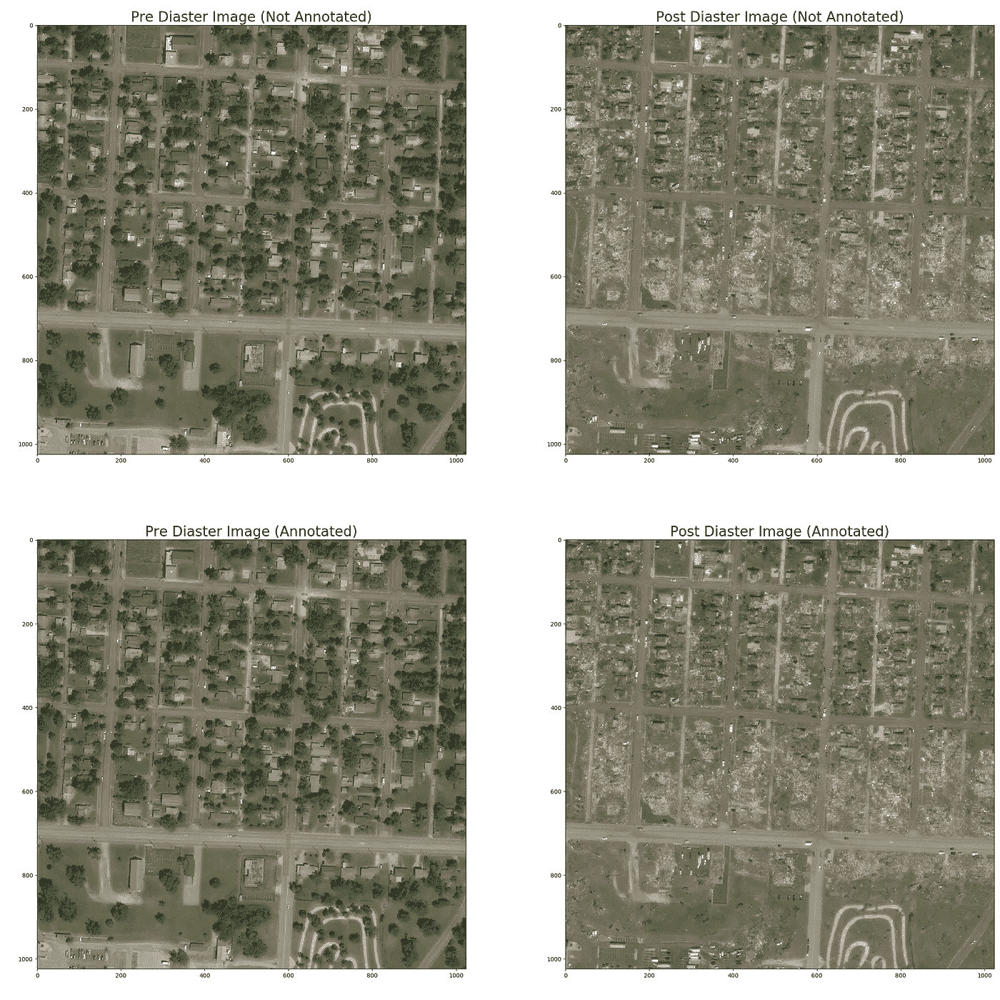

# XView 2 挑战:第 3 部分:探索数据集

> 原文：<https://medium.com/analytics-vidhya/xview-2-challenge-part-3-exploring-the-dataset-ec924303b0df?source=collection_archive---------8----------------------->


我认为，要训练机器准确地做某件事，需要对人工任务有深入的理解。这种观点一直帮助我更好地理解问题和解决方案的本质。在本系列中，在我们深入研究训练我们的模型之前，我想花一些时间来解决这个问题，从那些必须手动检测和标记正确像素的正确类的人的角度来看。我在这篇文章中的目标是获得数据集的要点和它所包含的图像的质量。

这篇文章是我写的 XView 挑战系列的后续。如果你没有读过之前的帖子，请考虑在这里阅读它们，因为它会为你提供一些关于这个挑战的背景信息。

我还想指出的是，截止到本文发布之日，挑战赛的提交截止日期已经截止。不过，我会继续尝试这个挑战，因为这是一个非常有趣的挑战。我在这里的目的是了解专家面临的问题，并以任何可能的方式帮助解决这种现实世界的挑战。

让我们开始吧。为了帮助你开始，我在这里创建了一个代码为[的 Kaggle 笔记本。关于我们将要讨论的函数和脚本，请参考这个笔记本。](https://www.kaggle.com/lezwon/xview2-challenge/)

由于数据集包含与来自多个地点的各种类型的灾害相关的图像，如果我们专注于一个特定的灾害事件，这将对我们有益，因为来自具有不同灾害类型的其他区域的图像将为我们提供完全不同的建筑结构和环境。我们将重点关注与 2011 年发生的一场特定灾难相关的数据集:乔普林龙卷风。该事件于 2011 年发生在美国密苏里州，造成约 28 亿美元的损失。你可以在[维基百科](https://en.wikipedia.org/wiki/2011_Joplin_tornado)上了解更多。

# **加载数据**

我们要做的第一件事是从文件夹中加载数据集标签。请注意，数据分两批发布:第 1 层和第 3 层。这两个版本的数据格式基本相同，只是在文件夹结构上有一些细微的差别。

我们现在将根据灾难对标签进行分组。`**get _ diastar _ dict**'函数也是如此。一旦我们收到 dictionary 对象，我们就可以获取与某个灾难相关的所有标签。这里我们将获取所有与乔普林龙卷风灾难相关的标签。

# 绘制图像

接下来我想做的是对比灾难前和灾难后的图像。为此，我创建了几个函数来帮助我过滤和选择正确的图像。` ***display_img*** '函数接受一个标签路径参数，并显示与该标签相关的图像。它还有两个可选参数:

```
**display_img(label, time='post', annotated='True')**label: String
A path to a json label file.time: ['pre', 'post']
Display pre disaster or post disaster image, depending on the argument.annotated: [True, False]
Displays annotations on the image if argument is set to True
```

示例:

```
***display_img(disaster_labels[0], time=’post’, annotated=True)***
```


乔普林龙卷风受灾地点的灾前图像注释


乔普林龙卷风受灾地点的注释灾后图像

如果你注意到，在灾难前的图像中，绿色的屋顶是可见的，看起来状况良好。在灾后图像中，我们注意到大部分屋顶都不见了。你也可以注意到一些建筑完全消失了。我们的任务是检测这种情况下的财产，已经部分或全部损坏。让我们看看更多的例子，更好地理解图像之间的差异。` ***plot_image*** '帮助我们在一个情节中比较这样的图像。它接受一个标签参数，并绘制图像的所有四种变化。即带注释和不带注释的灾后和灾前图像。这里有一个例子。


使用这些函数，我们可以快速浏览数据集中的各种图像。

# 使用元数据

我想做的下一件事是查看图像的元数据。JSON 标签文件中提供了图像的元数据。要获得元数据中字段的描述，请参考本文档[这里](https://cdn.discordapp.com/attachments/624633738512433154/648748268393857026/xBD_Metadata_Explanation.pdf)。为了更容易地分析这些数据，我编写了一个函数，将数据从 JSON 转换成 pandas 数据框架。“ **generate_metadata_df** ”接受一个标签列表并生成一个 pandas 数据框，其中的字段作为列。我还在这里添加了几个额外的列:

```
**centroid_x**: Combines the polygons in an image and fetch the central coords (lat)**centroid_y**: Combines the polygons in an image and fetch the central coords (long)**latlong**: A WKT format point object with the latlong info.**label_path**: relative label path ( used for display_img func)**no-damage**: Count of no-damage polygons in the image**minor-damage**: Count of minor-damage polygons in the image**major-damage**: Count of major-damage polygons in the image**destroyed**: Count of destroyed polygons in the image**un-classified**: Count of un-classified polygons in the image
```

使用质心数据，我们还可以生成一个 google maps 链接，以便在 google maps 上找到位置。` **generate_gmaps_link** 的功能也是如此。

```
# provides google maps link
***generate_gmaps_link(row.centroid_y, row.centroid_x)***
```


谷歌地图中的位置

一旦我们有了元数据数据框架，我们就可以按任何列对其进行排序，并迭代查看示例。例如，我想看很多被摧毁的建筑的图片。因此，我已经按照*destroyed*列对数据帧进行了排序，并遍历了这些行来查看图像。这里有一个例子:

```
***sorted_df = df.sort_values(by=['destroyed'], ascending=False)
index, row = next(df_generator)
plot_image(row.path)***
```



受灾害影响的区域有大量被破坏的多边形

# 绘制数据

当灾难发生时，有可能某个特定的区域比其他区域受影响更大。这类事情因灾害的类型而异。洪水可能会对沿海地区造成更大的破坏，龙卷风会影响其路径上的建筑物，火山爆发会对其周围的财产造成最大的影响。因此，根据土地的地理情况绘制损害地图会有所帮助。由于每个多边形都使用纬度和经度坐标进行了映射，我们可以使用这些数据来突出显示受灾难影响最严重的位置。

参考由[亚历克西斯·库克](https://www.kaggle.com/alexisbcook)所写的[内核](https://www.kaggle.com/alexisbcook/interactive-maps)，我已经将受灾地区按照它们的破坏类型绘制成地图。如下图所示，可以看到很多绿色的圆圈。这些圆圈代表标记为 ***无损的多边形。*** 图像中标签类型的多边形数量越多，圆的尺寸越大。您还可以注意到地图中的红色圆圈。这些代表被标记为 ***的多边形被破坏。*** 其他标签同样用黑色、蓝色和黄色表示。


显示密苏里州乔普林多边形映射的地图

请注意，圆圈是在我们之前为每幅图像计算的质心位置绘制的。这使得给定图像中的所有多边形有一个共同的中心点，这就是为什么它们在彼此之内。

***数据集的 GSD 指标*** 数据集包含与总共 19 种不同灾害相关的影像。这些灾难的每一组图像都是用不同的相机和不同的传感器拍摄的。由于这个因素，图像的 [GSD](https://www.aerial-survey-base.com/gsd-calculator/what-is-gsd/) (地面采样距离)会有一定程度的变化。如果我们要在神经网络中训练这种影像，标准化数据集的 GSD 可能有助于我们获得更准确的结果。下面的条形图显示了每幅图像的平均 GSD。


每次灾难的平均 GSD 值

如您所见，危地马拉火山影像的 GSD 最低，这意味着影像更接近地面，也更详细。如果我们能够以某种方式利用超分辨率技术将其他数据集的图像提高到这种 GSD 水平，我们就可以在标准的 GSD 水平上训练神经网络。

***每次灾难的图像量***
当我们开始训练我们的网络时，我们可能必须首先关注特定的灾难。为此，我们需要确保所选的灾难数据集具有丰富的可用训练数据。下图显示了每次灾难中出现的图像数量。


每次灾难的映像计数值

正如你所看到的，葡萄牙野火和松林野火有最多的可用图像。另一方面，危地马拉火山仅由 36 张照片组成。在训练模型时，我们需要考虑这个缺点。

基于本练习中的发现，我们将继续对数据集进行一些图像预处理。在下一篇文章中，我们将特别关注数据集的 GSD 标准化，并研究一些卫星影像的数据增强选项。如果你有任何反馈或更多探索性数据分析的想法，请在评论区告诉我。

请在 Kaggle 笔记本上找到这篇文章的代码:[xfiew 2 挑战笔记本](https://www.kaggle.com/lezwon/xview2-challenge/)

# 参考

1.  DIUx-xfiew。(2019 年 12 月 6 日)。DIUx-x 视图/x 视图 2-基线。从 https://github.com/DIUx-xView/xview2-baseline.[取回](https://github.com/DIUx-xView/xview2-baseline.)
2.  (未注明)。检索自[https://developers . Google . com/maps/documentation/URLs/guide。](https://developers.google.com/maps/documentation/urls/guide.)
3.  Matplotlib —散点图。(未注明)。检索自[https://www . tutorialspoint . com/matplotlib/matplotlib _ scatter _ plot . htm](https://www.tutorialspoint.com/matplotlib/matplotlib_scatter_plot.htm.)
4.  漂亮的用户手册。(未注明)。从 https://shapely.readthedocs.io/en/stable/manual.html.[取回](https://shapely.readthedocs.io/en/stable/manual.html.)
5.  XBD:从卫星图像评估建筑物损害的数据集*ArXiv.org*2019 年 11 月 21 日[https://arxiv.org/abs/1911.09296.](https://arxiv.org/abs/1911.09296.)
6.  古普塔河(2019)。xBD 元数据解释[在线]可从以下网址获得:[https://cdn . discordapp . com/attachments/624633738512433154/648748268393857026/xBD _ Metadata _ explain . pdf](https://cdn.discordapp.com/attachments/624633738512433154/648748268393857026/xBD_Metadata_Explanation.pdf)
7.  什么是 GSD。(未注明)。检索自[https://www . aerial-survey-base . com/GSD-calculator/what-is-GSD/。](https://www.aerial-survey-base.com/gsd-calculator/what-is-gsd/.)
8.  辛格 p .和盖尔(未注明)。地面采样距离(GSD)。检索自[https://support . pix4d . com/HC/en-us/articles/202559809-地面-采样-距离-GSD。](https://support.pix4d.com/hc/en-us/articles/202559809-Ground-sampling-distance-GSD.)
9.  j . t . Vander plas(2016 年)。 *Python 数据科学手册:开发者的工具和技术*。北京:奥雷利。
10.  亚历克西斯库克。(2019 年 10 月 18 日)。交互式地图。从 https://www.kaggle.com/alexisbcook/interactive-maps.[取回](https://www.kaggle.com/alexisbcook/interactive-maps.)