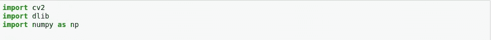
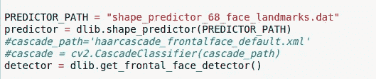
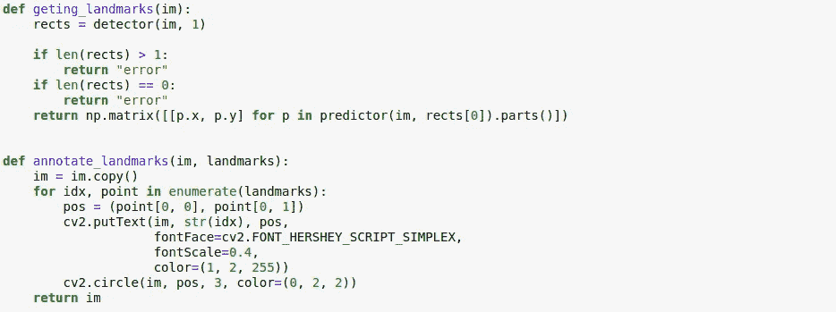
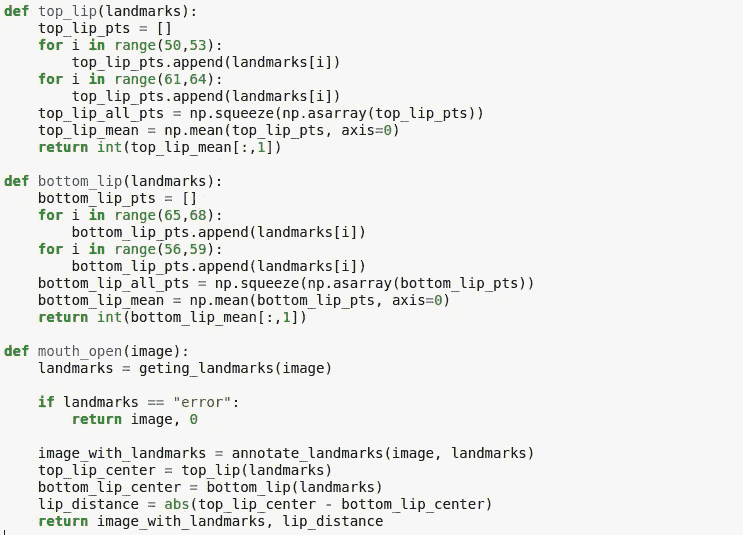
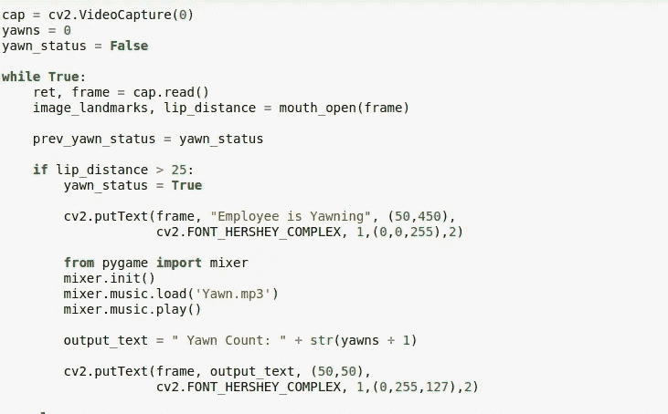
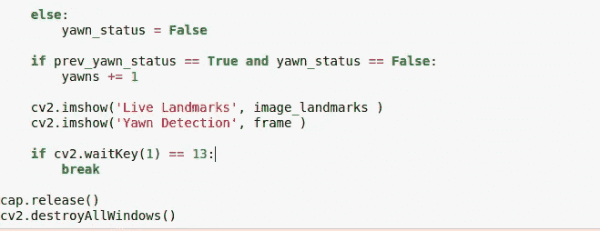
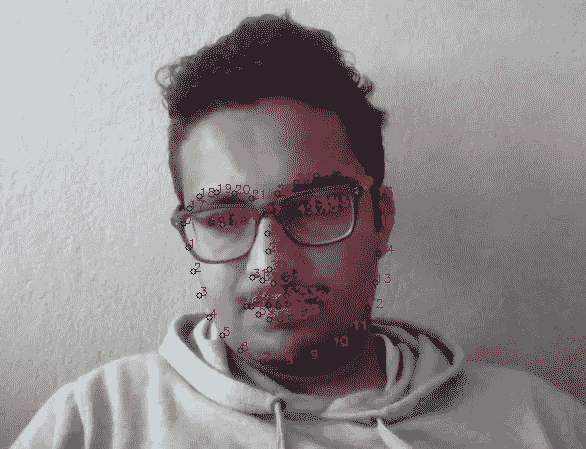

# 使用 OpenCV 和 Dlib 的哈欠检测。

> 原文：<https://medium.com/analytics-vidhya/yawn-detection-using-opencv-and-dlib-e04ba79b9936?source=collection_archive---------2----------------------->

# **定义**

OpenCV: OpenCV 是一个用于计算机视觉的库函数，最初是用 C++编写和使用的。

Dlib: Dlib 是一个用 C#编写的库，包括处理数据挖掘、数据结构、机器学习、图像处理等的工具。

**哈欠检测与应用**

哈欠检测就是使用 OpenCV 和 Dlib 检测哈欠(由于疲劳或无聊而张大嘴巴并深深吸气)。它可以用于各种主要应用，如自动驾驶汽车、驾驶员疲劳检测、驾驶员睡意检测、驾驶员意识检测等。

# 让我们编码

**安装 OpenCV** 和 Dlib

OpenCV 可以安装为:
`pip install opencv-python`

Dlib 可以安装为:
`pip install cmake
pip install dlib`

**导入 OpenCV、Dlib 和 Numpy。**

**分配。dat 文件**

我们下载了。dat 文件，它是一个可以识别我们面部各种特征并提供信息的模型。Dlib 将从文件中提取所有信息，opencv 用于找出不同的特性。

**获取地标并使用颜色对其进行注释的功能。**

形状预测器(dat 文件)用于从图像中提取信息，如眼角、眼周区域等。图像被转换成矩阵，并且 annotate_landmarks()函数标记这些特征/信息，这些特征/信息被其他函数用来提取各种特征，如上唇、上嘴等。

**提取对检测打哈欠至关重要的各种特征的信息**

**当呵欠状态为真时，打开摄像机并定义呵欠标准，并相应地分配动作。**

如果 lip_distance 大于 25，则将其(哈欠 _ 状态)定义为打哈欠(真实情况)。在这种情况下，“员工正在打哈欠”文本出现在屏幕上，然后我们导入播放. mp3 文件的混音器，该文件尖叫着“停止打哈欠”。如果呵欠状态为真，呵欠计数将继续并显示受试者打了多少次呵欠。

**发射两帧显示标记的地标和哈欠检测帧**

# **现场地标长啥样:**

# **哈欠检测演示**

 [## Nitish Raj Pathak 在 LinkedIn 上发帖

### 哈欠检测器使用 dlib 库，这是像哈尔级联。祝大家胡里节快乐。愿你的生活充满色彩…

www.linkedin.com](https://www.linkedin.com/feed/update/urn:li:activity:6642681821580619776/) 

## 代号:**https://github.com/beingnitisho7/Yawn-Detection**