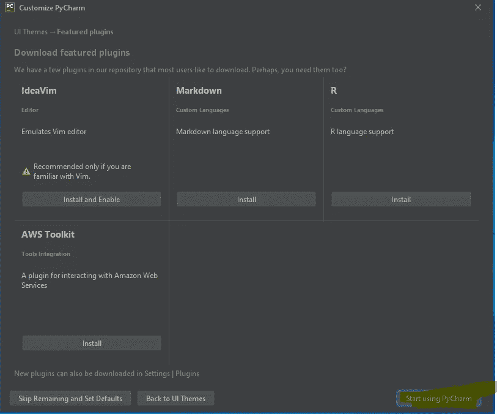

# 如何在 Windows 中安装 Python & PyCharm (IDE)？

> 原文：<https://medium.com/analytics-vidhya/ychow-to-install-python-pycharm-ide-in-windows-83ba18f0f993?source=collection_archive---------11----------------------->

在 Windows 中安装 Python & PyCharm 而不会迷失在大海中，我真的是这个意思。我用截图和细节记录了每一个步骤。

演职员表:[**文卡特什**](https://www.twitter.com/vvrofficial)

谢谢你听我说！在以下基于互联网连接、防火墙、浏览器的过程中，可能不需要遵循某些步骤。在这种情况下，我建议您跳过并使用截图继续适用的步骤。

## 在 Windows 计算机上安装 python 和 IDE 的分步过程。

**第一步:**打开 python 下载页面[https://www.python.org/downloads/](https://www.python.org/downloads/)，下载最新版本。

**第二步:**如果你得到一个类似于 ***的错误，这种类型的文件会损害你的电脑。你想留下 python…….exe 吗？*** ”，请轻点保持。否则，它不会下载 python 文件，因为浏览器怀疑该文件包含恶意代码。这个错误可能只适用于谷歌 Chrome 用户。

Python 下载—谷歌 Chrome 可能出错

**步骤 3:** 双击或运行下载的 python 文件(通常下载的文件会在下载文件夹中)

**第 4 步:**您可能会收到运行 python 应用程序的提示，如下图所示。点击运行。

**第五步:**你会从应用程序中收到一个选择安装类型的提示。选中“将 Python 3.8 添加到路径”复选框，然后点击立即安装。

Python 安装提示

**第六步:**你会再收到一条 UAC 的提示(用户账户控制)。在这里你可以看到这个应用程序的发行商是 Python 软件基金会(PSF ),这是一个真正的发行商。所以点击是。

UAC 提示

**第 7 步:**您可能会看到下图所示的安装屏幕。让安装完成。如果你愿意，可以休息一会儿:)

Python 安装屏幕

**步骤 8:** 您可能会收到一条消息“安装成功”，这意味着 python 已成功安装在您的系统中。只需点击关闭。

安装成功

**第 9 步:**现在，只是为了验证 python 是否安装成功，在你的计算机中打开命令提示符(按下 **Windows 键，**然后输入 **cmd，**点击命令提示符。您将看到一个名为 Command Prompt 的黑色背景屏幕，如图 B)所示

图 A:打开命令提示符

图片 B:命令提示

**第十步:**在命令提示符下输入命令 python，会显示 win32
上的“Python 3 . 8 . 1(tags/v 3 . 8 . 1:1b 293 b 6，2019 . 12 . 18，22:39:24)[MSC v . 1916 32 bit(Intel)]输入“help”、“copyright”、“credits”或“license”了解更多信息。
>>>***这意味着，python 成功地安装并运行在了你的电脑上。***

命令提示符下的 Python

**第十一步:**市面上有多个 IDE(集成开发环境)应用，不过，我推荐你安装#PyCharm。您可以安装 PyCharm IDE 社区版或教育版(提供教程)。

[**点击此处打开 PyCharm 下载页面**](https://www.jetbrains.com/pycharm/download/#section=windows)

PyCharm 下载页面

**步骤 12:** 您将被重定向至 JetBrains 的感谢页面，如下图所示，下载将自动开始，并可能显示确认提示。如果下载没有自动开始，点击“直接链接”(用黄色笔突出显示)，然后点击提示中的保存文件。

**步骤 13:** 打开下载文件夹，双击 PyCharm community edition 应用程序/右键单击，然后点击打开。

安装 PyCharm 社区版

**第 14 步:**您将再次收到来自用户帐户控制(UAC)的提示来运行应用程序，您可以看到发布者的名称为“JetBrains s.r.o”。点击是。

UAC 提示

步骤 15: 你会看到一个应用程序向导，如下图所示，点击下一步。

应用程序向导— PyCharm

**第 16 步:**不要更改任何配置，只需点击下一步。

应用程序安装向导。

**第十七步:**你会被要求选择一些选项像下图，我建议你启用(勾选)64 位启动器(在桌面上添加快捷方式)，和。py 协会。

安装向导

**第 18 步:**你会被要求一个开始菜单文件夹来保存快捷方式，你可以只点击安装。

开始菜单文件夹

第 19 步:实际安装将开始。你可以休息一会儿，然后继续完成剩下的步骤。

装置

**第 20 步:**您可能会收到如下完成信息。可以勾选“运行 PyCharm 社区版”或者取消勾选，这样就可以随时打开。

安装完成

**奖励步骤:**转到桌面，双击 PyCharm Community Edition 或右键单击并点击打开。

打开 PyCharm (IDE)

**附加步骤:**选择不导入设置，然后点击确定

设置配置

**奖励步骤:**您将收到一个接受 PyCharm 用户协议和隐私政策的提示，如下图所示。选择(检查)“我确认我已经阅读并接受本用户协议的条款。”然后点击继续。

接受协议

**额外步骤:**您将看到一个数据共享提示，询问您是否要将使用统计数据发送到 JetBrains，用于应用程序开发和用户体验。如果你不了解他们，我建议你点击不要发送。

数据共享提示

**奖励步骤:**你会收到选择主题的提示。您可以根据自己的喜好选择深色或浅色主题。我的选择肯定是 Darcula:)

主题提示

**奖励步骤:**你会收到安装特色插件的提示，新手不需要。点击开始使用 PyCharm。

特色插件提示

**加分步:**牛逼！！您已经进入 PyCharm 面板。现在点击创建新项目。

Python 面板

**加成步骤:**新项目的配置。输入项目名称。由于我们已经安装了 python，剩下的设置将默认配置。在给出一个新的项目名称而不是无标题后，点击创建。

创建项目

**附加步骤:**加载所有内容并为您安排 IDE 可能需要一些时间。点击创建后，它会显示一些提示，如果你想你可以使用它们，如果没有你必须取消选中“启动时显示提示”，然后你必须关闭弹出窗口。

PyCharm 提示

**恭喜你！**您已经成功安装了最新的 python 版本以及作为 IDE(集成开发环境)的 PyCharm。

开始学习 python 吧，祝你事业有成。我个人推荐你用 python 给出的文档练习 python。 [**点击此处查看文档。**](https://docs.python.org/3/)

如果你对文档不感兴趣，想直接开始，我推荐你去 [**看完这篇博文**](https://beginnersbook.com/2018/01/first-python-project-in-pycharm-ide/) ，练习并成为一名皮查姆:)

如果你觉得这对绝对初学者有帮助，有好处，请鼓掌，把这篇文章分享给你的朋友。