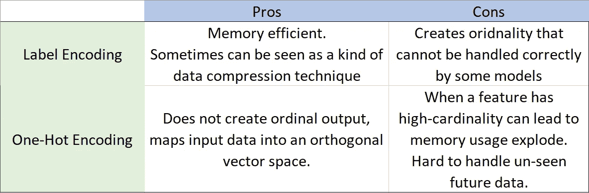

# 又一个 ML 分类变量编码 post

> 原文：<https://medium.com/analytics-vidhya/yet-another-ml-categorical-variables-encoding-post-2ef5c0651991?source=collection_archive---------5----------------------->

## …和一个“强大的”scikit-learn 标签编码器

## 1.介绍

机器学习算法/模型通过将数值特征作为输入来工作，这里我们可以考虑一些现实世界的应用示例，如年龄、收入、自上次交易以来的天数等。

> ***为什么我们需要分类值编码？*** 逻辑回归和神经网络是简单或复杂的嵌套**数值函数**，随机森林和 GBM 通过基于**数值范围扫描**以“贪婪”方式为下一次分割找到“最佳”特征/值对，等等。

像性别和邮政编码这样的分类值特征呢？在这种情况下，我们需要将这些特性的值编码成数字，正如我们将看到的，有几种方法可以实现这一点。

[Katarzyna Pe](https://unsplash.com/@kasiape?utm_source=medium&utm_medium=referral) 在 [Unsplash](https://unsplash.com?utm_source=medium&utm_medium=referral) 上拍照

******* 有些库，比如 [LightGBM](https://github.com/microsoft/LightGBM) 使用内置分区技术来处理分类特性，你可以在这里找到更多信息:[https://light GBM . readthe docs . io/en/latest/features . html # optimal-split-for-categorial-features](https://lightgbm.readthedocs.io/en/latest/Features.html#optimal-split-for-categorical-features)

## 2.分类特征编码器

尽管有许多方法来编码分类变量，在这篇文章中我们将看到一些最流行的方法:标签编码和一键编码。

***标签编码***
在标签编码中，我们将每个分类特征值映射到一个从 0 到基数-1 的整数，其中基数是特征的不同值的计数。你可以点击查看 scikit-learn 实现[。](https://scikit-learn.org/stable/modules/generated/sklearn.preprocessing.LabelEncoder.html)

***一键编码***
在一键编码中，我们将特征的每个值映射到不同的二进制“虚拟”特征，例如，如果我们的特征*性别*的值为“男性”和“女性”，那么我们将一个特征*性别*替换为两个新特征*is _ 男性*和*is _ 女性*，它们可以取值 0 或 1。请注意，如果基数足够大，那么我们将不得不用更多的特性来替换一个特性，这可能会导致内存消耗爆炸。
Scikit-learn One-Hot 编码器可在此[链接](https://scikit-learn.org/stable/modules/generated/sklearn.preprocessing.OneHotEncoder.html)中找到。

## 3.利弊

在下表中，我们可以看到两种分类值编码方法的优缺点:

标签编码和一次性编码的优缺点。

## 4.处理未来输入数据

现实世界/企业级 ML 模型的一个最重要的方面是能够处理未来的输入数据，包括泛化能力(即保持与训练数据集中相同的预测质量)和执行能力。特别是对于第二种情况，假设已经对您的模型进行了训练和评估，因此您已经准备好部署到生产中了。
假设您的模型中有一个名为“postal_code”的分类特性，在您的训练数据集中有 150 个不同的值(基数),并且您已经应用了上述两种编码技术中的一种。

> 如果一个新的预测示例的邮政编码值不同于训练数据集中的 150 个值，会发生什么情况？

*   scikit-learn 标签编码器将失败，因为它不是通过使用这个新值来拟合的，给出以下错误:
    *"ValueError: y 包含以前未见过的标签:['new_value']"*
*   更糟糕的是，一键编码器将不得不创建新的“虚拟”二进制特征“邮政编码新值”，从而导致预测特征空间的不同维度(增加 1)。您的 ML 模型将无法处理这种情况并生成预测，除非您为训练和评分阶段显式定义预测器特征。

在下一节中，我们将看到如何在 scikit-learn 标签编码器的情况下克服这个问题。

## 5.一个“健壮的”scikit-lean 标签编码器

您可以在下面找到所需的代码修改，以便拥有能够处理不可见输入值的 scikit-learn 标签编码器版本。

一个“健壮的”scikit-learn 标签编码器

## 6.参考

[1] Scikit-learn 预处理:[https://scikit-learn.org/stable/modules/preprocessing.html](https://scikit-learn.org/stable/modules/preprocessing.html#)