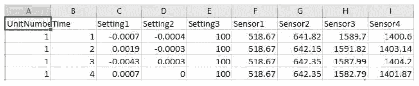
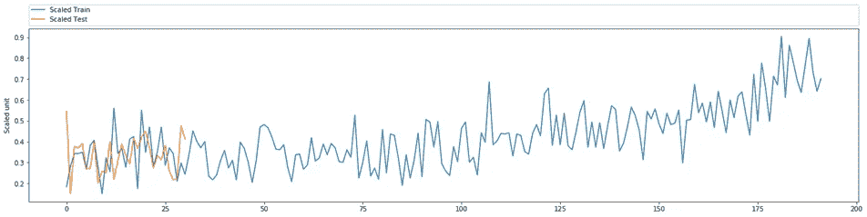
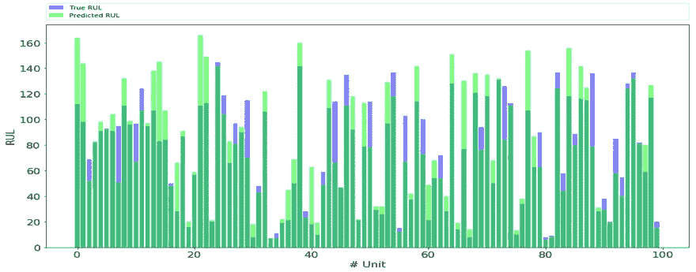
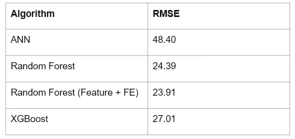
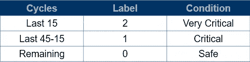
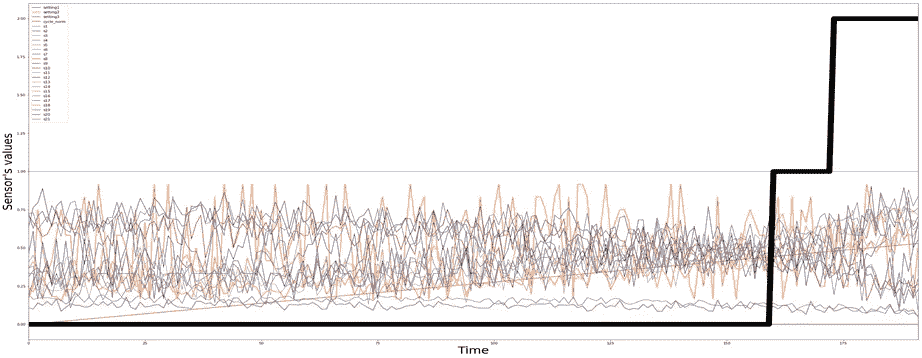
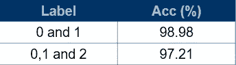

# 又一篇预测性维护文章-2

> 原文：<https://medium.com/analytics-vidhya/yet-another-predictive-maintenance-article-2-40a86fab56f5?source=collection_archive---------13----------------------->

在[第 1 部分](/@shreymalvi/yet-another-predictive-maintenance-article-1-19e19c75b027)中，我讨论了预测性维护(pdM)的基础知识以及构建 pdM 系统的程序概述。本文包含实现 pdM 系统的步骤以及结果。

在我们直接跳到实现之前，我们将看看我们正在处理什么样的数据。

**数据集**

预测性维护要求机器配备能够以固定时间间隔收集数据的传感器。时间序列或序列数据集可用于预测部件的寿命状况。我已经使用以下数据集实施了 pdM:

*NASA -涡轮风扇降级引擎数据集*

NASA 的涡轮风扇发动机数据集——该数据集由不同运行条件下的发动机数据以及发动机每个运行周期的不同传感器读数组成。

*   三个操作设置:高度，马赫数和油门解算器。
*   21 用于检查发动机状况的传感器。

数据集子集

> **训练数据**由飞机发动机的连续故障数据组成。
> 
> **测试数据**由没有记录故障事件的飞机发动机运行数据组成。

给定训练和测试数据的循环次数

1.  **数据清理和预处理**

我们将首先确保我们的数据不能包含任何缺失值或空值。数据科学中有几种处理缺失数据的技术。涡轮风扇发动机数据集不包含任何缺失值，因此我们将简单地跳过这一步。

在数据清理之后，我们将在输入模型之前应用特征工程或数据预处理。在预测之前应用三种基本的预处理技术。

*   零方差特性——对于每个时间戳或每个样本，任何包含相同值的特性或列，我们可以简单地删除它。
*   强相关特性——如果两列之间的相关性非常高(大于某个阈值),我们可以删除其中的任何一列。
*   归一化-对于不同要素的非统一值，我们将使用最小-最大归一化在 0 和 1 之间缩放数据集，以获得更好的 ML 模型性能。

2.**问题定义(重温)**

我已经考虑了我在之前的博客中讨论的两个问题。从技术上讲，我们有两个定义:

**回归**-预测断裂点的准确值。

**分类** —对发动机是否将要发生故障进行分类。

**3。机器学习模型**

**回归:**我已经应用了几个监督 ML 模型来预测发动机的剩余使用寿命(RUL)。

随机森林分类器的拟合

RMSE 均方根误差(用于选择最佳模型的参数)

结果如上表所示。随机森林为测试数据提供了最佳的模型拟合。

**分类:**为了分类，我们将训练集分成三类。序列长度为 50 的两层 LSTM 网络被用于测试集并且表现良好。

为训练标注数据集

每个传感器和标签

双向 LSTM 的结果如下:

准确性度量(选择最佳模型的参数)

完整的实现是在 python 3.6 和 jupyter notebook 中完成的。

**结论**

在本文中，我们探讨了如何解决预测性维护问题以及建立预测性模型的步骤。其他几种技术也可用于制造 pdM 系统。同样的方法也可以应用于其他时间序列数据集，并可以扩展到更大的规模。本文给出了预测模型实际实现的简化方法。

**未来工作**

*   自动化维护:预测性维护是未来工厂的重要组成部分。不仅自动化制造流程，而且自动化设备维护的制造商可以从全新水平的生产效率中获益。
*   **扩展到不同的领域:**一旦具有机器的不同传感器信息的这种类型的数据集可用，我们就可以将这些模型用于不同的机器。
*   **动态预测:**记录传感器数据时，预测机器的断点。

**参考文献**

数据集:[https://archive.ics.uci.edu/ml/datasets/diabetes](https://archive.ics.uci.edu/ml/datasets/diabetes)

 [## 用 C-MAPSS 数据预测发动机故障

### 作为一名机械工程师，我希望在一个项目中结合引擎和机器学习。为此……

yajasd.github.io](https://yajasd.github.io/2018/06/04/Predicting-Engine-Failure/) 

[https://towards data science . com/remaining-life-estimation-with-keras-2334514 f9c 61](https://towardsdatascience.com/remaining-life-estimation-with-keras-2334514f9c61)