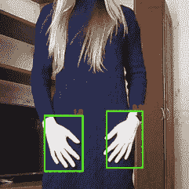
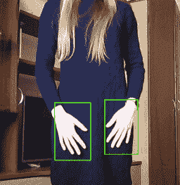
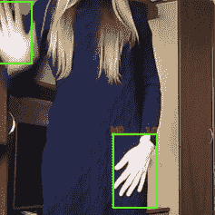
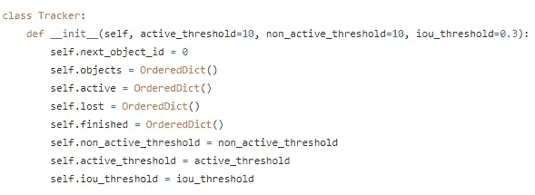

# 另一种基于实时检测的对象跟踪算法使用 Tensorflow 对象检测 API 和 OpenCV

> 原文：<https://medium.com/analytics-vidhya/yet-another-real-time-detection-based-object-tracking-algorithm-using-tensorflow-object-detection-8a349215c4c4?source=collection_archive---------7----------------------->

## 这篇文章描述了优化现有物体跟踪模型和算法的方法，以获得更好的性能

> 我将通过这些步骤来创建一个可以实时执行的对象跟踪模型。完整的实现可以在 [GitHub](https://github.com/HelgaShiryaeva/diploma) 上找到

 [## HelgaShiryaeva/文凭

### 手势追踪毕业设计。克隆或下载…

github.com](https://github.com/HelgaShiryaeva/diploma) 

实时视频流中的检测与跟踪模型

# 检测模型

这项工作的目的不是特别跟踪视频中的手势，而是尝试为任何对象跟踪制定通用算法。我决定选择的检测模型是单次检测器(SSD)模型，通过[**tensor flow/models**](https://github.com/tensorflow/models)库进行训练。Tensorflow 对象检测 API 是一个非常容易上手的东西。如果你想知道如何训练自己的物体检测器，你可以遵循 [**Victor Dibia**](https://medium.com/u/304fe0310a13?source=post_page-----8a349215c4c4--------------------------------) 指令 [**如何在 Tensorflow**](/@victor.dibia/how-to-build-a-real-time-hand-detector-using-neural-networks-ssd-on-tensorflow-d6bac0e4b2ce) 上使用神经网络(SSD)构建实时手部检测器。我从零开始用训练 SSD 网络修改了他的模型，用手势传递额外的自我标记数据集，在近 2000 个标记样本上扩展现有数据集。所有图片都用 [**LabelImg**](https://github.com/tzutalin/labelImg) 工具贴上标签，下面的说明来自[***这里的***](https://tensorflow-object-detection-api-tutorial.readthedocs.io/en/latest/training.html) 。你可以从上面提到的 GitHub 库中下载预先训练好的 Oxford Hands 和 Ego Hands 数据集检测模型。我选择的附加数据集分别是[***Creative Senz3D***](http://lttm.dei.unipd.it/downloads/gesture/#senz3d)和 [***手部姿态估计***](http://sun.aei.polsl.pl/~mkawulok/gestures/) *。*

# 目标跟踪问题

目标跟踪可以描述如下。假设您有一组按顺序处理的帧(或视频)。每一帧上都有一些物体。从第一帧开始，每个对象都必须与唯一的 id 相关联，并在接下来的帧中被跟踪。新的对象可能出现，旧的对象可能消失。

人们进行了大量的研究，建立了许多目标跟踪模型。甚至有人提出了神经网络模型，如 **ROLO(最近的 YOLO)** 和**深度回归网络 GOTURN。**这个问题也可以用流行的**卡尔曼滤波器**和**光流**来解决。我认为最流行的多目标跟踪算法是 SORT(简单在线实时跟踪)和 DeepSORT(深度关联排序)。

通常，MOT 问题可以分为两个部分:当您在第一帧指定 ROI(感兴趣区域)并在接下来的帧中跟踪它时，以及当您不指定时。第二种方法更灵活，解决方案是在所有帧上使用检测模型，将边界框相互关联并跟踪它们。基于检测的算法是我更深入研究的东西。让我们看看我们有什么。

# 基于检测的跟踪问题

> 当涉及到基于检测的目标跟踪时，可能会有几个问题。模型检测每一帧上的对象。覆盖单个对象的每个边界框的坐标被传递。但是检测模型可能并不完美。这里出现了一些问题。

*   **漏检(遮挡)** —在之前的帧中成功检测到对象，但在当前帧中，由于对象移动或其他原因，未检测到对象。这可能会导致丢失该对象，并在它再次出现时用新的 id 来标识它。
*   **错误检测** —模型检测到实际上没有物体的物体。这可能导致将这种错误检测与现有轨迹相关联，或者它可能开始跟踪不存在的对象，这是不好的。
*   **Id 切换** —在执行对象关联算法后，当对象彼此非常接近时，它们可能关联不良，对象标识符可能会切换。结果就是跟踪的错误。

# **关联问题**

问题如下。假设您具有来自前一帧的被跟踪对象的当前位置，并且刚刚使用检测模型在当前帧上检测到其他对象。为了继续跟踪，我们必须将现有对象与当前检测到的对象相关联。这个问题可以用贪心的方式解决。可以简单地计算每对对象之间的边界框中心之间的**欧几里德距离**，然后为每个轨迹选择最接近其检测到的边界框的。或者，可以计算每对对象之间的 [**【交集超过并集】**](/@nagsan16/object-detection-iou-intersection-over-union-73070cb11f6e) 。但有时贪婪的解决方案并不是最优的。具有 m 个轨迹和 n 个检测对象的该解决方案的时间复杂度将是 **O(m * n)，**，这是相当好的。

取而代之的是另一种方法。这是用**匈牙利算法**解决**线性指派问题**。这是在加权二部图中寻找给定大小的匹配的问题，其中边的权重之和最小。在我们的例子中，权重可能是欧几里得距离，或 IoU，或任何其他可用于测量对象之间距离的度量。m * n 大小的距离矩阵将是一个矩阵，在每个位置(I，j)上将有轨迹(I)和被检测物体(j)之间的距离。这个问题求的是最小的权重和，但是我们要最大化。这可以通过用-1 *距离矩阵求解最小值问题来实现。然后我们会得到最大值的答案。

# 跟踪算法

我在这里 找到了一个实现 [**的基础算法，并决定使用它，因为它接近我想要的东西。再来看我在**](https://github.com/adipandas/multi-object-tracker)**[**Tracker . py**](https://github.com/HelgaShiryaeva/diploma/blob/master/tracking/utils/tracker.py)**中实现的类 Tracker。**构造函数包含几个输入变量。**

跟踪器类构造函数

*   ***active _ threshold***—超参数，它告诉我们至少需要连续 10 帧的成功关联才能证明该物体不是**误检**。

*   *****iou_threshold*** —解决线性分配问题时成功关联的最小 iou 值，有助于解决 **id 切换**问题**

> **这里也有一些清晰的跟踪器类集合。**对象**包含所有被跟踪对象的当前 id 和位置。**激活**是每个对象顺序轨迹的计数器。如果它大于 10，那么我们在视频上显示这个对象。**丢失**是不成功关联的计数器。如果它大于 10，那么我们就说这个曲目已经结束了。**

**锦上添花的是这个类的更新方法。其工作可以描述如下。我们计算 IoU 矩阵，其中当前**对象**的 **m** 行被**跟踪**并且 **n** 行**检测**来自下一帧。解决线性分配问题后，我们有 3 个案例。假设我们有 k 个成功的赋值。 **k** 始终小于等于 **min(m，n)** 。我们增加被跟踪对象的活动计数器并更新其位置。我们剩下了 **m — k 个未分配的曲目**。我们递减其活动计数器并递增其非活动计数器。最后一种情况是我们剩下 n-k 个未分配的检测。我们将它们存储为一个新对象，让它们有机会成为一个新的轨迹。**

****此解的时间复杂度**是在 O(m * n)时间内用匈牙利算法求解**线性指派问题的时间复杂度。它比贪婪的 O(m * n)方法更大，但工作起来肯定更好。我认为框架上不会有太多的手，因此使用更快的解决方案是合理的。****

**感谢你阅读这篇文章！如果你有任何问题或想更详细地讨论这个问题，请随时联系 [GitHub](https://github.com/HelgaShiryaeva) 或 [LinkedIn](https://www.linkedin.com/in/volha-shyrayeva-014452138/) 。**

# **参考**

**一些相关和参考论文。**

1.  **Victor Dibia，在 Tensorflow 上使用神经网络(SSD)进行实时手部检测，(2017)，GitHub 知识库，[https://github.com/victordibia/handtracking](https://github.com/victordibia/handtracking)**
2.  **多目标追踪器，GitHub 库，【https://github.com/adipandas/multi-object-tracker **
3.  **学习使用深度回归网络以每秒 100 帧的速度跟踪，【https://davheld.github.io/GOTURN/GOTURN.】T4pdf**
4.  **用于视觉目标跟踪的空间监督递归卷积神经网络，[https://arxiv.org/pdf/1607.05781v1.pdf](https://arxiv.org/pdf/1607.05781v1.pdf)**
5.  **不使用图像信息的高速检测跟踪，[https://www . research gate . net/publication/319502501 _ High-Speed _ Tracking-by-Detection _ Without _ Using _ Image _ Information _ Challenge _ winner _ iwot 4s](https://www.researchgate.net/publication/319502501_High-Speed_Tracking-by-Detection_Without_Using_Image_Information_Challenge_winner_IWOT4S)**
6.  **利用视觉信息扩展基于 IOU 的多目标跟踪，[https://www . research gate . net/publication/330425906 _ Extending _ IOU _ Based _ Multi-Object _ Tracking _ by _ Visual _ Information](https://www.researchgate.net/publication/330425906_Extending_IOU_Based_Multi-Object_Tracking_by_Visual_Information)**