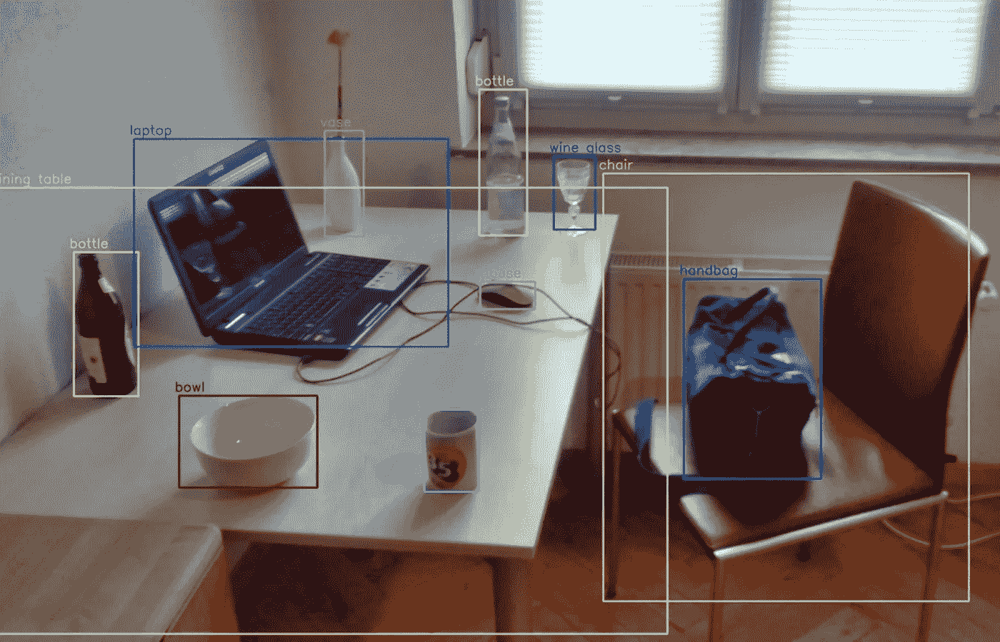
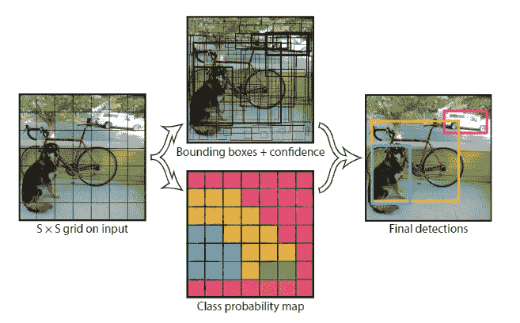
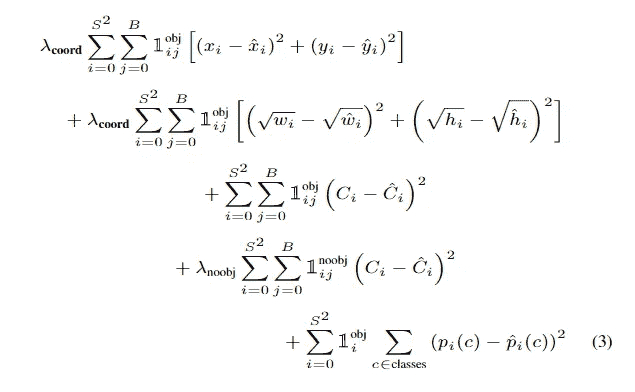

# YOLO

> 原文：<https://medium.com/analytics-vidhya/yolo-1506-02640-dbe968e87b46?source=collection_archive---------25----------------------->

## 实时目标检测

## 你只看一次

来源:[https://en.wikipedia.org/wiki/Object_detection](https://en.wikipedia.org/wiki/Object_detection)作者: [Mtheiler](https://commons.wikimedia.org/wiki/User:MTheiler)

我已经计划阅读主要的对象检测论文(虽然我已经浏览了大部分，但现在我将详细阅读它们，好到足以写一篇关于它们的博客)。这些论文与基于深度学习的对象检测相关。随时给建议或询问疑惑会尽我所能帮助大家。任何从这个领域开始的人都可以跳过许多这样的论文。当我看完所有的论文后，我也会写下它们的优先顺序/重要性。
我写这篇博客是考虑到和我相似并且仍在学习的读者。虽然我会通过从各种来源(包括博客、代码和视频)深入理解论文来尽力写出论文的关键，但如果您发现任何错误，请随时在博客上指出或添加评论。我已经提到了我将在博客结尾涉及的论文列表。

我们开始吧:)

YOLO 是第一篇使用神经网络实现对象检测实时性能的论文。Yolo 使用单个神经网络在一次评估中从完整图像预测边界框和类别概率。因此，YOLO 是一个一级对象检测器，因为它在一个阶段预测输出，而不像我们之前研究的对象检测器，它有一个额外的阶段用于区域提议。与其他实时物体检测器相比，Yolo 以 45 FPS 的速度工作，几乎有两倍的贴图。这使得 YOLO 成为许多应用的合理选择，并为一些新的应用打开了大门。

YOLO 将输入图像分成 S*S 个网格。如果对象的中心落入网格单元，则该网格单元负责检测该对象。每个网格单元预测 B 个边界框和这些框的置信度得分(因此 5 个预测，框的中心(x，y)，宽度，高度和置信度得分)。这些置信度得分反映了模型对盒子包含对象的置信度，以及它认为盒子预测的准确性。每个网格单元还预测对象类别概率。因此，输出是维数为 S*S*(B*5+C)的张量。

来源: [YOLO 论文](https://arxiv.org/abs/1506.02640)作者:Joseph Redmon

使用非最大抑制生成最终预测。

## 网络

该网络非常简单，它有一个主干 CNN 网络，后面是一个全连接层，给出维数为 S*S*(B*5+C)的输出(它是一个向量，后来被整形为张量)。YOLO 使用两种不同的主干:更快的版本(快速 YOLO 155 fps)和更精确的版本(45 fps)。该网络的架构类似于 googlenet，精确版本有 24 层，快速版本有 9 层。

## 培养

上面讨论的主干网络首先在图像网络数据集上进行预训练。对于预训练，使用 224*224 的图像分辨率。由于物体检测通常需要更精细的信息，因此将其更改为 448*448。边界框坐标(宽度和高度)在 0 和 1 之间标准化。所用的损失函数将在下一段中解释:

YOLO 损失函数

上述等式中的前两个值是边界框坐标的回归损失。这里需要注意的两件事是λ_cord 和 w 与 h 的平方根。平方根用于解决大小物体的相同重量误差问题，大盒子中的小偏差不如小盒子中的小偏差重要。λ_cord 用于给定位和分类任务不相等的(λ_cord>1，文中用 5)权重。

第三个和第四个值是置信度得分。因为大多数网格实际上不包含物体，但是这些网格造成了压倒梯度的损失。因此λ_ noobj(λ_ noobj< 1, used 0.5 in the paper) is used to reduce weightage because of grids not containing objects. The last value in the equation is for the probability score of each object class which is used only if the object is present in the grid.

Inference of YOLO is very easy, as the network is single-stage the image is resized, passed through the network and non-max suppression is applied to final output.

## References

1.  [https://arxiv.org/pdf/1506.02640.pdf](https://arxiv.org/pdf/1506.02640.pdf)

# 论文列表:

1.  [OverFeat:使用卷积网络的综合识别、定位和检测](https://arxiv.org/pdf/1312.6229.pdf)。[ [链接到博客](https://towardsdatascience.com/overfeat-review-1312-6229-4fd925f3739f)
2.  [丰富的特征层次，用于精确的对象检测和语义分割(RCNN)。](https://arxiv.org/pdf/1311.2524.pdf) [ [链接到博客](/@sanchittanwar75/rcnn-review-1311-2524-898c3148789a) ]
3.  [用于视觉识别的深度卷积网络中的空间金字塔池。](https://arxiv.org/pdf/1406.4729.pdf) [ [链接到博客](/@sanchittanwar75/review-spatial-pyramid-pooling-1406-4729-bfc142988dd2)
4.  [快速 R-CNN](https://arxiv.org/pdf/1504.08083.pdf) [ [链接到博客](/@sanchittanwar75/fast-rcnn-1504-08083-d9a968a82a70)
5.  [更快的 R-CNN:利用区域提议网络实现实时目标检测。](https://arxiv.org/pdf/1506.01497.pdf) [ [链接到博客](https://towardsdatascience.com/faster-rcnn-1506-01497-5c8991b0b6d3)
6.  [你只看一次:统一的，实时的物体检测。](https://arxiv.org/pdf/1506.02640.pdf) ←你完成了这篇博客。
7.  [SSD:单次多盒探测器](https://arxiv.org/pdf/1512.02325.pdf)。[博客链接]
8.  R-FCN:通过基于区域的完全卷积网络的目标检测。【博客链接】
9.  [用于目标检测的特征金字塔网络。](https://arxiv.org/pdf/1612.03144.pdf)【博客链接】
10.  DSSD:解卷积单粒子探测器。[博客链接]
11.  [密集物体检测的失焦(视网膜网)。](https://arxiv.org/pdf/1708.02002.pdf)【博客链接】
12.  [YOLOv3:增量改进](https://arxiv.org/pdf/1804.02767.pdf)。[博客链接]
13.  [狙击手:高效多尺度训练](https://arxiv.org/pdf/1805.09300v3.pdf)。[博客链接]
14.  [标注像素和区域的高分辨率表示。](https://arxiv.org/pdf/1904.04514.pdf)【博客链接】
15.  [FCOS:全卷积一级目标检测](https://arxiv.org/pdf/1904.01355v5.pdf)。[博客链接]
16.  [物体为点](https://arxiv.org/pdf/1904.07850.pdf)。[博客链接]
17.  CornerNet-Lite:高效的基于关键点的对象检测。【博客链接】
18.  [CenterNet:用于对象检测的关键点三元组](https://arxiv.org/pdf/1904.08189v3.pdf)。[博客链接]
19.  [训练时间友好的实时目标检测网络。](https://arxiv.org/pdf/1909.00700.pdf)【博客链接】
20.  [CBNet:一种用于目标检测的新型复合主干网络体系结构。](https://arxiv.org/pdf/1909.03625v1.pdf)【博客链接】
21.  EfficientDet:可扩展且高效的对象检测。[博客链接]

和平…