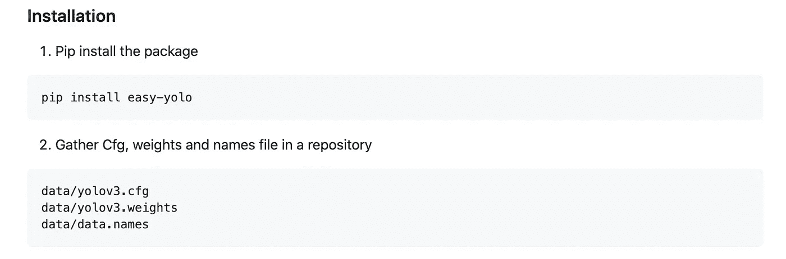
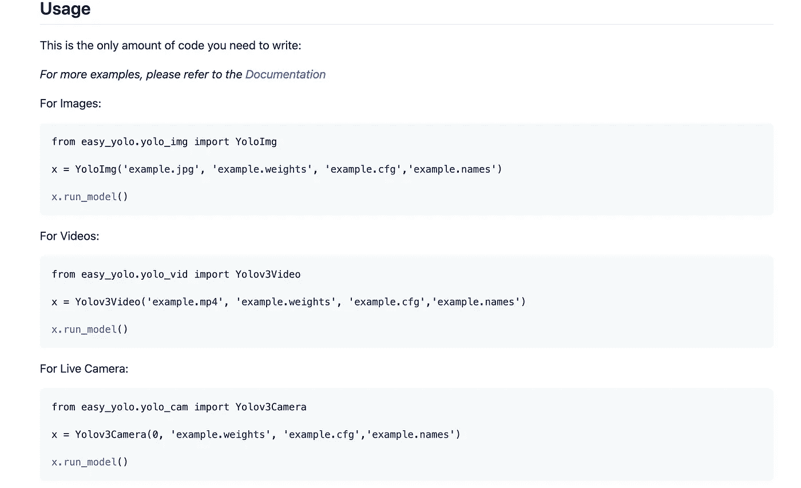
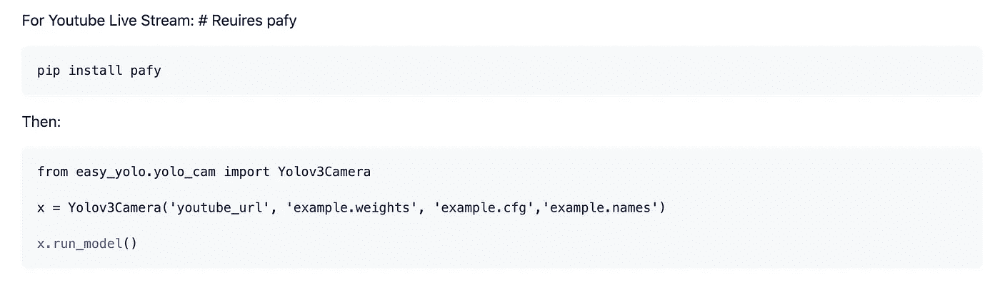
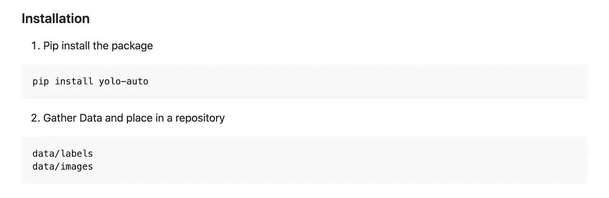
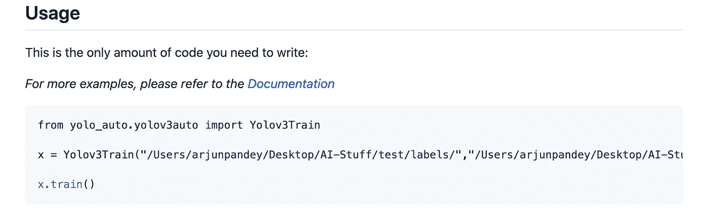

# YOLO 检测变得更加容易

> 原文：<https://medium.com/analytics-vidhya/yolo-detections-made-easier-c892a3047a9e?source=collection_archive---------12----------------------->


在冠状病毒期间，我花了很多时间探索物体检测，特别是用 YOLO 算法。对我来说，编写庞大的基于 OpenCV 的推理脚本或者经历训练自定义检测器的繁琐过程是一件痛苦的事情。经过大量研究，我决定着手一个项目，通过简单的 PyPi 库来自动化这两个过程。

我已经成功地编写并发布了两个 python 库，这对所有对 YOLOv3 对象检测感兴趣的人来说可能是非常有益的。先从 easy-yolo 说起吧

**易 YOLO**

Easy Yolo 可以让你在一行中运行任何图像、视频、直播摄像机和 youtube 流的定制模型。查看下面的代码



它允许将 50 多行代码浓缩为 3 行。只需传递重量、cfg 和名称文件，这就是所有需要的。如果你有同样的问题或者从事物体探测工作，请试一试。

**YOLO 汽车**

我创建的另一个库是 YOLO-AUTO，它可以在未来添加到 EASY YOLO，这是一个仅用 2 行代码就可以训练定制 YOLOv3 模型的库！是的，你没听错。只需要两行。让我们看看这在代码中是如何工作的:



这可能不是很清楚，下面是示例代码:

```
from yolo_auto.yolov3auto import Yolov3Train

x = Yolov3Train('Path to labels', 'path to images' ,No. classes, Class Names array, 'Path to Working Dir.', No.subdivisions(O), No.batches(O), ImageSize(O))

x.train()
```

所有你需要给的是图像的路径，标签，关于数据和你的工作目录的一些细节，就是这样。(O)代表可选的，所以这甚至不是必要的。只需给出数据的路径和细节，让奇迹发生吧。

我鼓励你们所有人都尝试一下这两个库，并传播消息，帮助全球的计算机视觉开发人员。如果人们觉得方便，我将来会将这两者结合起来，并扩大基地，以托管其他几个类似 YOLOv4 的型号。

谢谢你，我希望你喜欢我创造的东西。

一些有用的链接:

[](https://github.com/pandeyarjun242/yolo-auto) [## pandeyajun 242/yolo-auto

### 在一行中训练 YOLOv3 自定义对象检测器探索代码“我们意识到训练自定义对象检测器…

github.com](https://github.com/pandeyarjun242/yolo-auto) [](https://github.com/pandeyarjun242/easy_yolo) [## pandeyarjun242/easy_yolo

### 在一行中运行 YoLOv3 对象检测器探索代码“我们意识到实现和运行 YOLOv3 对象…

github.com](https://github.com/pandeyarjun242/easy_yolo) [](https://pypi.org/project/yolo-auto/) [## yolo-汽车

### yolo_auto 是什么？一个允许你在一行中训练自定义 yolv3 物体检测器的库！yolo_auto 如何…

pypi.org](https://pypi.org/project/yolo-auto/) [](https://pypi.org/project/easy-yolo/) [## 轻松-yolo

### 在图像上运行 YOLO 模型。地点。cfg，。重量和。相同目录中的名称示例:from easy_yolo.yolo_img…

pypi.org](https://pypi.org/project/easy-yolo/)