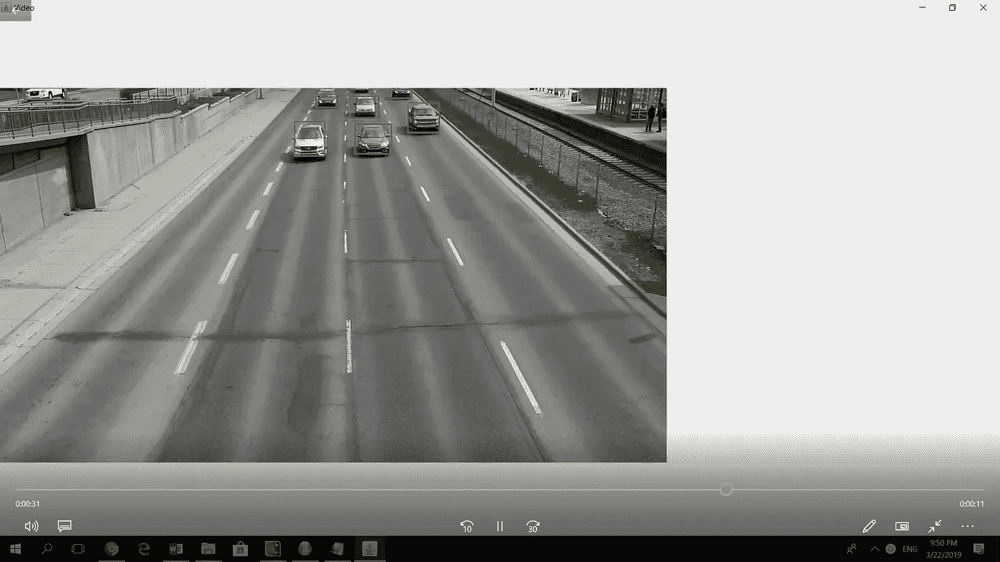

# java 中的 YOLO 对象检测

> 原文：<https://medium.com/analytics-vidhya/yolo-object-detection-in-java-90bbf85a2b06?source=collection_archive---------1----------------------->

工作中的模型示例截图

基于 java 的模板，用于仅使用 YOLO 权重的基于流视频的对象检测

# 这个项目是关于:

虽然在 python 中进行基于深度学习的图像分类和对象检测模型有很多关注点，因此有许多博客显示如何做同样的事情，但关于如何以独立的方式使用基于 java 的包(如 OpenCV)来进行图像分类和识别任务的信息很少，该项目专注于一步一步地使用 JAVA、JAVA 中的 OpenCV 包和 YOLO 进行视频流分析。请记住，我们没有在这个项目中使用 tensorflow/Darkflow/Darknet。在接下来的章节中，我们将详细介绍什么是对象检测，什么是 YOLO，以及如何使用 OpenCV 和 JAVA 实现 YOLO。接下来，我们将给出一个使用 YOLO 模型来检测视频流中的对象的示例 JAVA 代码

# 为什么我们不使用 Python 作为这个项目的语言:

我们不使用 python 仅仅是因为

1.  正如已经提到的，有多个博客，项目，repos 展示了如何使用 python 和不同的深度学习框架，如 Torch，Keras，Caffee，Tensorflow 进行图像识别
2.  图像检测和对象识别是数字化领域的一个新兴领域，然而，大多数需要数字化的系统和行业都运行在基于 java 的平台上，因此，他们可能很难在现有架构中使用 python 等语言。
3.  虽然有混合架构试图利用较旧的平台和较新的框架，如 tensorflow 和 python，但这些类型的架构通常会导致速度可伸缩性问题，从而使项目部署和维护变得困难

# 为什么我们不在这个项目中使用 tensorflow:

正如这篇博客解释的那样，运行深度学习模型在计算上非常昂贵。当涉及到计算机视觉的图像处理时。很难在 Raspberry Pi 这样的边缘设备上运行计算机视觉模型，并且使用 TensorFlow 或 PyTorch 这样的深度学习库很难做出可移植的解决方案

# 我们的筹码是什么:

对于本项目，我们将使用以下内容:

1.  JAVA SE 8 在这里获取:[https://www . Oracle . com/tech network/JAVA/javase/downloads/JDK 8-downloads-2133151 . html](https://www.oracle.com/technetwork/java/javase/downloads/jdk8-downloads-2133151.html)
2.  OpenCV 4.0，在这里获取:【https://opencv.org/ 
3.  TIBCO Streambase:我使用 TIBCO Streambase 一个复杂的事件处理引擎来编译和运行这个项目，但是您可以使用任何标准的 IDE

# #我们将在我即将发布的博客中详细讨论代码，现在让我们直接进入编码

# 为此，假设用户熟悉 Opencv 和 YOLO 以及它们的设置，一篇博客文章将很快解释这些

# #这是关键解释的代码

代码片段

 [## suddh 123/Java 中的 YOLO 对象检测

### 一个基于 java 的模板，用于仅使用 YOLO 权重的基于流视频的对象检测…

github.com](https://github.com/suddh123/YOLO-object-detection-in-java/blob/code/yolo.java) 

这是我在英特尔 i7 2.8 Ghz 处理器上得到的结果