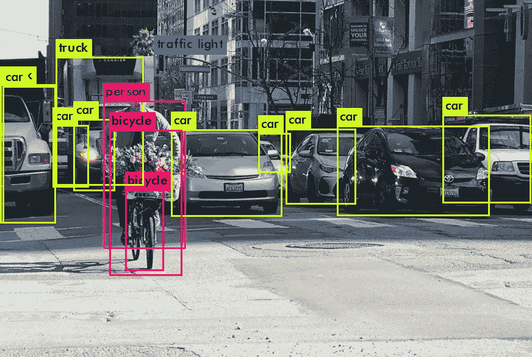
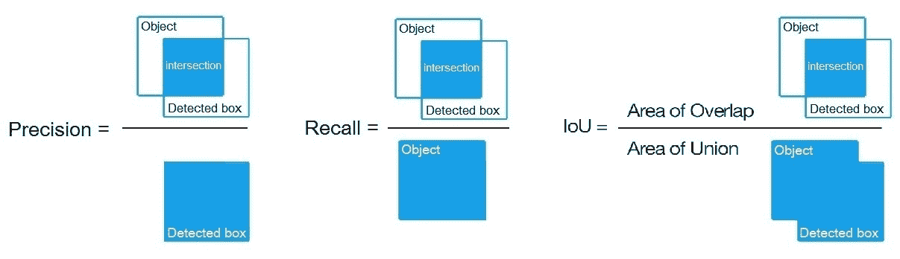
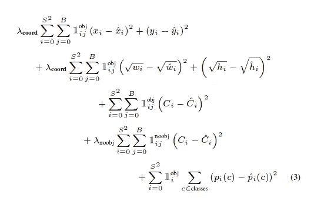

# Yolo 物体检测变得简单

> 原文：<https://medium.com/analytics-vidhya/yolo-object-detection-made-easy-7b17cc3e782f?source=collection_archive---------9----------------------->

《你只看一次》(YOLO)是物体探测领域最先进的技术之一。这种体系结构的速度非常快，在许多实时应用程序中都有使用。

所以起初这看起来像是一门火箭科学。你可能想跳过它所有的理论解释，只想实现。但是如果我说理解这种攻击很容易呢？？？

所以我将首先列出在实现 YOLO 之前你需要知道的所有重要的事情，它是如何工作的，边界框是如何决定的，等等。等等。等等。

第二，也是最重要的一点，它的实施，尤其是你不应该做什么？？还有怎么办！！

> 所以让我们开始吧，伙计们！！好了👏👀

首先，Yolo 有 3 个版本

1.  [Yolo v1](https://pjreddie.com/media/files/papers/yolo_1.pdf)
2.  [Yolo v2](https://pjreddie.com/media/files/papers/YOLO9000.pdf)
3.  [Yolo v3](https://www.google.co.in/url?sa=t&rct=j&q=&esrc=s&source=web&cd=1&cad=rja&uact=8&ved=2ahUKEwiCuabqyuDoAhVr4zgGHU1WDsoQFjAAegQIARAB&url=https%3A%2F%2Fpjreddie.com%2Fmedia%2Ffiles%2Fpapers%2FYOLOv3.pdf&usg=AOvVaw01xmf3LgycSZAqgOK1fA8V)

所有这些版本的有趣之处在于网络的输出是网格。卷积使得能够以优化的方式计算图像中不同位置的预测。

v3 最重要的特点是它可以在 3 个不同的尺度上进行预测。一个调用可以有多个边界框。

它获取一幅图像，并将其划分为 S×S 的网格(其中 S 是自然数)

所以一个被检测的核的形状是**1**×**1**×(**(B**×**5)+C】对于完整的图像是**S**×**S**×(**(B**×**5)+C)。****

在哪里

→ S×S 是 Yolo 划分输入的图像数量。

→ B 是一个单元上边界框的数量。

→ C 是班级的数量

5 后面的原因是对于 1 个单元，有四个边界框属性和一个对象置信度。

**锚盒:**这是您在实现 Yolo 和阅读其文档时会听到的术语之一。**定位框**是一组预定义的具有一定高度和宽度的边界框**和**。这些**框**被定义为捕获您想要检测的特定对象类的比例和纵横比，并且通常基于您的训练数据集中的对象大小来选择。

Yolo v3 总共使用 9 个锚盒。每个刻度三个。

因此，当任何对象检测算法工作时，它甚至在同一对象上预测多个边界框。输出格式如下:

对象 1 : (X₁、Y₁、Height₁、Width₁)、Classₓ

对象 2 : (X₂、Y₂、Height₂、Width₂)、Classₓ

就这样继续下去……

所以决定哪个包围盒识别哪个对象是算法的责任。可能是两个边界框正在识别同一个对象。也有可能在几乎相同坐标的两个边界框检测不同的对象。

要实现这一点，有许多技术，其中之一是 IOU(并集上的交集)。根据这些，为保留的边界框计算置信度得分。

**IOU:** 通过下图很容易理解。它定义了重叠区域与联合区域的比率。

**mAP :** 平均精度它作为 Yolo 的一个评价标准。每个类别的平均精度的平均值，其中平均精度是同一类别的每个可能阈值(每个检测概率)的 PR 曲线上 11 个点的平均值。

# 每个图像更多的边界框🤔

Yolo v3 比之前的版本预测了更多的边界框(也比之前的版本慢了一点)。这是因为它预测了 3 种不同的销售情况。与 v2 架构相比，Yolo v3 预测了大约 10 倍的边界框。

# 理解它的损失函数

这是 Yolo v2 的损失函数

这似乎有点吓人。为了更清楚起见，让我们把它分成几部分。

👉所以第一项惩罚了边界框的坐标预测。第二个是预测物体的高度和宽度。最后一个惩罚它预测对象的类。

在约罗·V2 的著作中，这些术语被用作误差平方和。但是当涉及到 V3 架构时，它就像逻辑回归中的对数损失一样被计算。

这些是关于 Yolo 的一些重要概念。所以现在让我们跳到实现部分。

# 履行

我将在这里介绍暗网的实现。还有像 Yolo-Darkflow，Yolo Keras 这样的实现。

首先也是最重要的是，Darknet 模型有两个 github 库，一个是[的 pjreddie](https://github.com/pjreddie/darknet) (官方版本)，另一个是 [AlexyAB](http://github.com/AlexeyAB/darknet) 。

所以如果你想让所有的功能都工作，就克隆第二个。你会发现互联网上的许多命令只适用于 AlexyAB 的回购。它根据需要和用途进行修改。

所以使用 Yolo 的最好方法是首先阅读完整的库文档，否则你会夹在中间，诅咒自己🤐。

我将列出他在那里提到的一些重要的事情。

所以第一件事就是你必须用 Yolo 格式标注你的数据集。有很多工具可以做到这一点，其中之一就是标签，安装和使用都非常简单。

首先在您的系统中克隆存储库(您也可以使用 Colab，因为它将为您提供良好的 GPU 支持)

1.  创建与`yolov3.cfg`中内容相同的文件`yolo-obj.cfg`(或将`yolov3.cfg`复制到`yolo-obj.cfg)`中，并且:

*   将行批更改为`[batch=64](https://github.com/AlexeyAB/darknet/blob/0039fd26786ab5f71d5af725fc18b3f521e7acfd/cfg/yolov3.cfg#L3)`
*   将线条细分改为`[subdivisions=16](https://github.com/AlexeyAB/darknet/blob/0039fd26786ab5f71d5af725fc18b3f521e7acfd/cfg/yolov3.cfg#L4)`
*   如果你训练 3 节课，将最大批量线改为(`classes*2000`但不小于`4000`)，即`[max_batches=6000](https://github.com/AlexeyAB/darknet/blob/0039fd26786ab5f71d5af725fc18b3f521e7acfd/cfg/yolov3.cfg#L20)`
*   将生产线步骤更改为 max_batches 的 80%和 90%，例如`[steps=4800,5400](https://github.com/AlexeyAB/darknet/blob/0039fd26786ab5f71d5af725fc18b3f521e7acfd/cfg/yolov3.cfg#L22)`
*   设置网络大小`width=416 height=416`或 32 的任意倍数:
*   将线条`classes=80`更改为 3 个`[yolo]`层中每个层的对象数量
*   在每个`[yolo]`层之前的 3 个`[convolutional]`中，将`filters=255`更改为 filters=(classes + 5)x3，请记住，它只需是每个`[yolo]`层之前的最后一个`[convolutional]`。

所以如果`classes=1`那么应该是`filters=18`。如果`classes=2`那么就写`filters=21`。

2.在目录`build\darknet\x64\data\`中创建文件`obj.names`，用对象名——每个在新的一行

3.在目录`build\darknet\x64\data\`中创建文件`obj.data`，包含(其中类=对象数)

4.将图像文件(。jpg)的目录中你的对象`build\darknet\x64\data\obj\`

您应该将 train.txt 文件和 test.txt 文件放在/data 文件夹中

5.下载卷积层的预训练权重并放入目录`build\darknet\x64`

6.使用命令行开始训练:。/darknet 探测器序列数据/obj . data yolo-obj . CFG darknet 53 . conv . 74

所以最好的事情是，权重定期保存在备份文件夹中，每 100 次迭代保存在 yolo-obj_last.weights 文件中。因此，如果您由于任何问题丢失了会话，您可以使用命令从保存的权重继续。

。/darknet 检测器训练数据/obj . data yolo-obj . CFG backup/yolo-obj _ last . weights

# 何时停止

通常每个类(对象)有足够的 2000 次迭代，但总共不少于 4000 次迭代。但是要更准确地定义何时应该停止训练，请使用以下手册:

1.  在训练过程中，你会看到不同的错误指标，当不再减少 0 时，你应该停止。XXXXXXX 平均值:

> *地区平均 IOU: 0.798363，类别:0.893232，对象:0.700808，无对象:0.004567，平均召回:1.000000，计数:8 地区平均 IOU: 0.800677，类别:0.892181，对象:0.701590，无对象:0.004574，平均召回:1.000000*
> 
> *9002: 0.211667，0.60730 avg，0.001000 rate，3.868000 秒，576128 张图片加载:0.000000 秒*

*   9002 —迭代号(批次号)
*   0.60730 avg —平均损耗(误差)—越低越好

你可以在这里找到 yolo [的一个实现，供你参考。](https://colab.research.google.com/drive/1zC2JGI6xMNm1WUzgZV-kRNnIYmUXj8kt)

在那之前，祝你学习愉快！！

如果你喜欢，请鼓掌👏👏