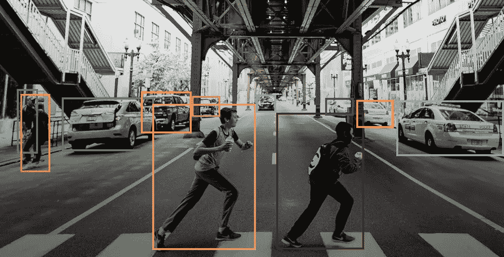

# YOLO V1-直观指南

> 原文：<https://medium.com/analytics-vidhya/yolo-v1-an-intuitive-guide-ad24c707b0eb?source=collection_archive---------8----------------------->

实时目标检测在许多应用中都有应用，如安全、监控、视频分析等。YOLO·V1 算法于 2016 年提出，作为实时对象检测中最快、最有效的算法之一，风靡全球。下面的博客文章对此进行了深入分析，旨在让你在深入研究算法背后的数学知识之前，对算法有一个直观的理解。
本帖假设你对神经网络和卷积神经网络的工作原理有所了解。

# **问题**

目标检测问题由两部分组成

*   目标定位:定位图像/视频中的特定目标。
*   对象识别:位于图像/视频中的对象的标签是什么。

# 以前的工作及其局限性

## 可变形零件模型

该模型涉及一个复杂的管道，由用于特征提取、区域分类和边界框预测的独立模块组成。可以注意到，这个模型有太多的模块和复杂性。此外，图像被分成固定大小的窗口，并且特征提取器在所有窗口上滑动，以从整个图像中提取特征，这又是计算上昂贵的，并且不适于实时对象检测。

## 区域卷积神经网络(R-CNN)

这个模型又涉及到一个非常复杂的管道。它涉及一个区域建议网络，以建议最有可能包含一个对象的区域。CNN 进一步用于特征提取，支持向量机用于生成置信度得分。考虑到它的复杂性，这个系统非常慢。

## 深多框

这个算法非常类似于 RCNN。唯一的不同是 CNN 被训练来预测地区提议，而不是选择性搜索。该模型的缺点是它能够进行单一类别的预测，但是不能检测一般的对象，即不同类型的对象。

# YOLO

YOLO 代表你只看一眼。它表明，与在图像上多次滑动特征提取器不同，该算法只查看图像一次来检测其中的对象。YOLO 涉及到将图像分成一个 S×S 的网格。

如果对象的中心落入网格单元，则该特定单元被认为负责检测该特定对象。每个网格单元预测 B 个边界框和每个边界框的置信度得分，表示算法感觉到边界框中有物体的强烈程度。置信分数超过特定阈值(0.25)的盒子被认为是最终的盒子。置信度得分的公式如下:

公关(对象)* IOUᵗʳᵘᵗʰₚᵣₑₔ

这里，Pr(obj)代表对象存在于预测边界框中的概率。IOU 代表交集大于并集。顾名思义，它是实际边界框和预测边界框之间的相交面积，除以实际边界框和预测边界框之间的面积之和。

预测边界框意味着预测 5 个值:x、y、w、h 和置信度得分(如上所述)。(x，y)是预测框的中心相对于其相应网格单元的坐标，w 和 h 是框相对于图像的宽度和高度。最后，该算法还预测条件类概率，即每个网格单元中预测的对象的名称。这些概率是有条件的，因为它们依赖于在特定边界框中实际检测到的对象。

# 电力网设计

YOLO CNN 由 24 个卷积层和 2 个全连接层组成。详细结构见上图。它包括使用 3 1 x 1 的卷积层来减少进入的特征数量。

输出是一个 7 x 7 x 30 维的张量(3-D 矩阵)。这是因为该模型是在 Pascal VOC 数据集上训练的，该数据集有 20 个要预测的对象类(C=20)。图像被分成 7×7 的网格(S=7)。每个单元负责 2 个边界框(B=2)。每个框预测 5 个值和 C 个要预测的概率。因此，输出结果是
S x S x (B*5 +C ),替换后变成 7 x 7 x 30。

# 培养

yolo 网络的卷积层在 imagenet 数据集上进行了一周多的预训练。由于 imagenet 数据集有超过 1000 个对象类，目标是提取尽可能多的特征。
然后，网络执行检测并优化以下损失函数:

与其钻研数学，不如简单地说损失函数考虑了三种损失

*   分类损失:预测类别概率和实际类别概率之间的差异
*   定位损失:预测边界框值(x，y，w 和 h)和实际边界框值之间的差异。
*   置信度损失:置信度得分中的错误

为了更深入地研究损失函数，我建议浏览一下[Jonathan Hui 的这篇令人惊叹的文章](/@jonathan_hui/real-time-object-detection-with-yolo-yolov2-28b1b93e2088)。

# 为什么是 YOLO？

## 速度

与之前的检测系统相比，YOLO 的速度非常快，因为它不是滑动窗口方法，而是只需要将图像通过网络一次。它能够在 Titan X GPU 上以每秒 45 帧的速度运行，无需任何批处理。

## 简单

不像许多其他模式，YOLO 涉及一个单一的 CNN。因此，不需要复杂的管道，这使得模型易于理解，执行速度更快。像特征提取、包围盒预测、对象分类这样的所有任务都由单个网络本身负责。

## 更少的边界框

Yolo 预测的边界框比其他模型少。相比之下，R-CNN 建议每幅图像大约 2000 个盒子，YOLO 只建议大约 98 个。

# 结论

虽然 YOLO v1 非常成功，但它也有自己的局限性。它没有发现成群出现的小物体。它不能推广到具有不寻常长宽比的物体。此外，在该算法中，误差没有被归一化，即小误差在小盒子中不能像在大盒子中那样被忽略。也就是说，YOLO 算法已经经历了多次修改，最新的版本是 YOLO v4。我希望这篇文章能够让你理解这个算法是如何工作的。我鼓励您通读这篇文章，并在您自己的系统上尝试一下。

*原文链接:*【https://arxiv.org/abs/1506.02640 

链接到 imageai api 在你自己的系统上试用 yolo:[https://imageai.readthedocs.io/en/latest/detection/](https://imageai.readthedocs.io/en/latest/detection/)