# YOLO v3 和 MiDaS 来自单一的 Resnext101 主干网。

> 原文：<https://medium.com/analytics-vidhya/yolo-v3-and-midas-from-a-single-resnext101-backbone-8ba42948bf65?source=collection_archive---------16----------------------->

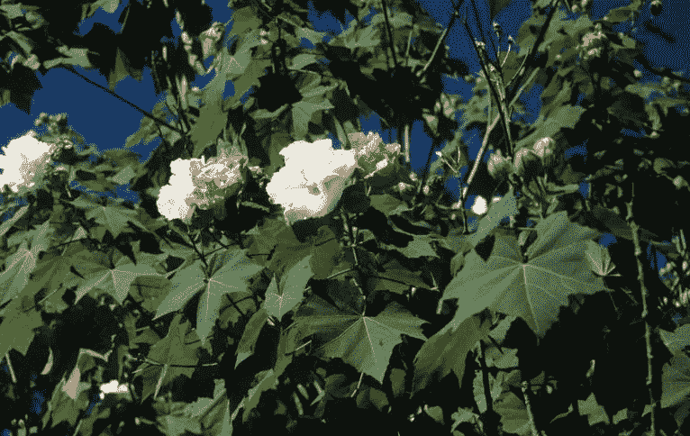

在自主导航和增强现实等应用中，您可能需要不止一个输入来分析环境，以精确评估条件并采取行动。例如，自动驾驶汽车可能需要检测路上的行人及其深度，以便调整速度、刹车时间等。我们可以使用 [YOLO v3](https://github.com/ultralytics/yolov3) 并训练它检测乘客、标志牌等，并使用类似[迈达斯](https://github.com/intel-isl/MiDaS)的网络并使用它来检测深度。这种方法的问题是，在大多数边缘设备中，推理能力较低，并且在实时情况下，必须保持推理符合帧速率，因此我们需要在业务端有效实施这些网络。

想法是使用单个特征提取网络。在我们的例子中，YOLO v3 使用了暗网主干。

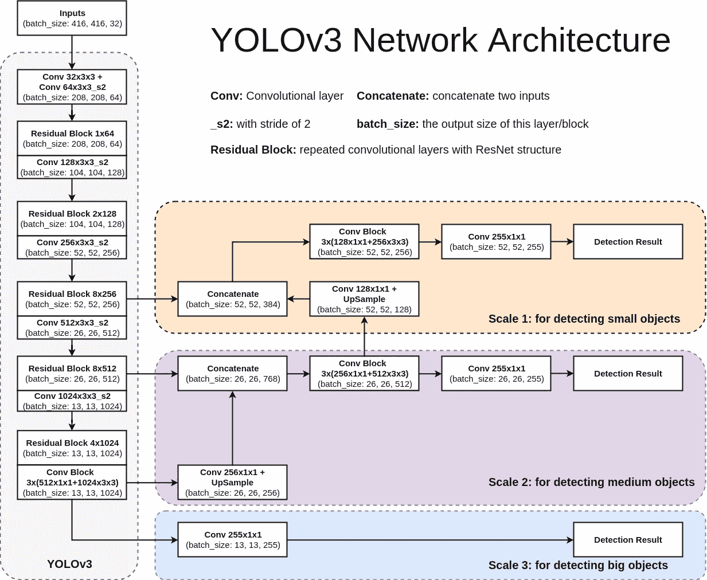

MiDaS 使用预训练的 Resnext101 作为特征提取器。因此，这里我们将选择 MiDaS 的 ResNext101 作为公共特征提取器，并从那里训练 YOLO v3 头。

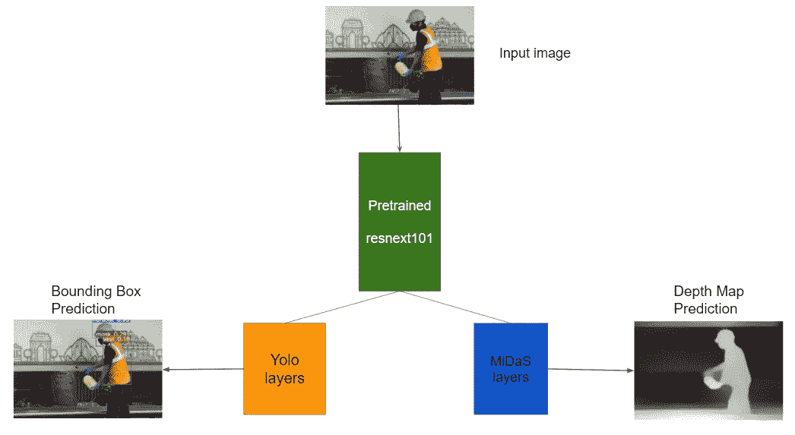

从单幅图像中检测物体和深度

上面重新设计的结构减少了参数的数量，并且反过来减少了边缘设备中的推理时间。我们将使用有助于检测建筑工人安全装备的数据集。

# 方法

1.  MiDaS 是一个训练有素的网络。砝码可以原样使用。
2.  用 MiDaS 网络的特征提取器连接 3 个 YOLO 层。
3.  在 YOLO 图层之前添加一些卷积图层，以便更好地学习边界框。
4.  冻结迈达斯分部，只为 YOLO 分部训练，节省重量。
5.  为 MiDaS 网络引入损耗函数，定义总损耗。
6.  用所有预训练的权重加载模型，并用非常小的学习率训练所有层。

具有 Imagenet 权重的 Resnext101 对于对象检测问题是一个非常有能力的网络，此外，YOLOv3 中使用的 Darknet 主干实际上是 Resnet 的变体。因此，从头开始培训主干并不是一个好主意，尤其是当两个分支机构都在使用它的时候。因此，我们在主干之后增加了学习包围盒的能力，并进行迁移学习。

**用迈达斯缝合 YOLO**

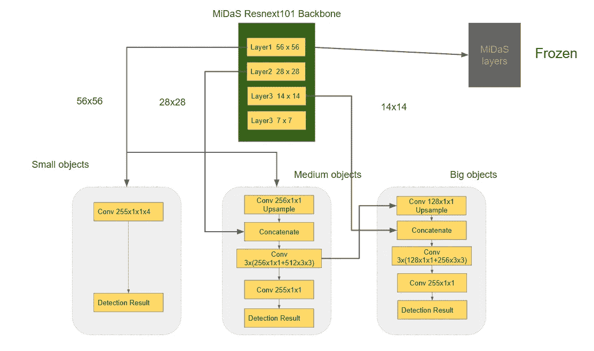

现在让我们来训练这个网络，正如你在这个练习中看到的，MiDaS 解码器被冻结了。

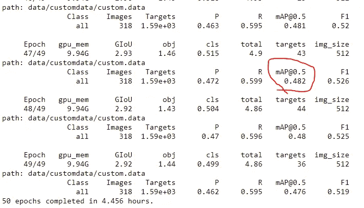

仅训练 YOLO 分支 50 个时代

仅仅过了 50 个纪元，我们就看到了惊人的结果！记得最初的 YOLO v3 被训练了 300 个纪元。现在，我们保存模型权重，并专注于包括 MiDaS 在内的整个网络的损耗函数。

**损失函数**

我们没有关于从头开始训练 MiDaS 网络的详细解释，否则很难用我们可支配的有限资源来训练这样的网络，因此我们使用预训练的 MiDaS 并为我们的图像生成深度图。

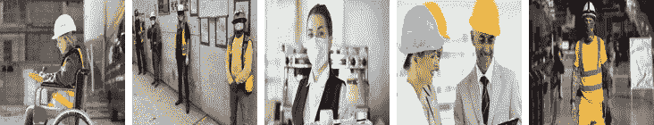

原始图像

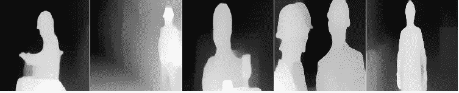

从 MiDaS 推断的深度图

我们使用这些深度图作为我们网络的地面实况。现在，当从两个分支训练网络时，来自每个分支的梯度可能渗入主干权重，因此可能完全破坏它们。首先，让我们确保为 MiDaS 网络定义一个损失函数，并单独训练它，以查看损失是否减少(损失将减少非常非常少，因为我们已经在使用训练有素的网络)。

我们可以使用图像质量评估作为损失的度量。我们可以使用

1.  SSIM(结构相似指数)
2.  MSE(像素级)

SSIM(建议更接近人类感知)从亮度、对比度和结构方面测量图像之间的结构相似性。SSIM 在相似图像之间为 1，在随机图像之间为 0。但是在我们的观察中，我们看到下面两张深度图像的 SSIM 值为 0.00711

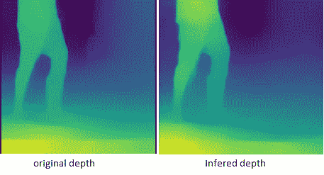

SSIM 0.00711

根据我们的问题，我们需要一个度量来告诉我们这两个图像彼此有些相似。我们将选择像素方式的 MSE 作为损失函数，因为它简单。有了这个，我们可以单独训练我们的迈达斯分部冷冻 YOLO 分部。

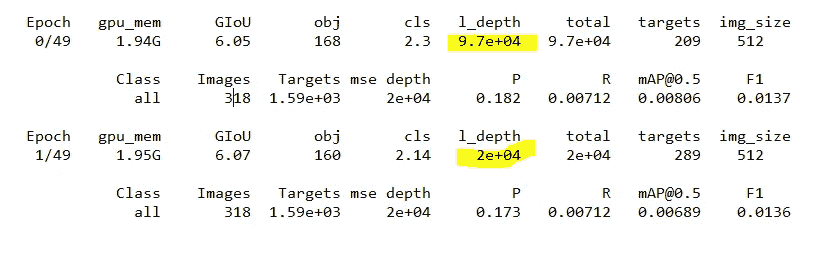

深度图预测的损失减少

现在让我们来定义网络的总损耗。

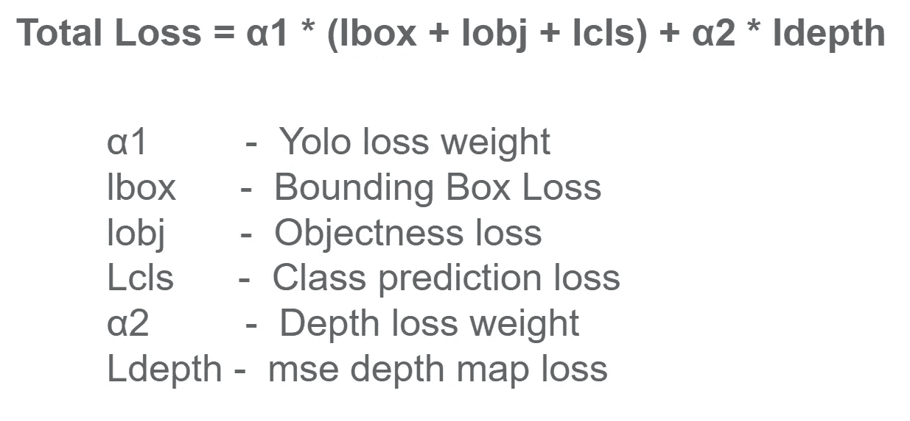

在以非常小的学习速率用上述损失函数训练之后(为了不使权重偏离范围太多，因为各个分支表现得相当好)，我们得到如下结果。

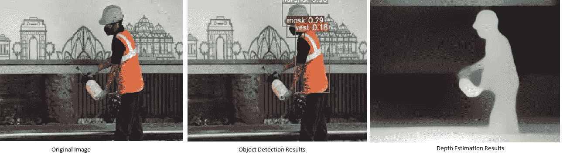

这看起来很好，现在我们可以使用这个网络部署在导航系统中。感谢阅读！

参考资料:

 [## 英特尔-isl/MiDaS

### 这个库包含了从一幅图像计算深度的代码。它伴随着我们的论文:走向稳健的单目…

github.com](https://github.com/intel-isl/MiDaS)  [## ultralytics/yolov3

### 分支通知:ultralytics/yolov3 存储库现在分为两个分支:$ git clone…

github.com](https://github.com/ultralytics/yolov3)  [## YOLOv3:增量改进

### 我们向 YOLO 展示一些更新！我们做了一些设计上的小改动，让它变得更好。我们还培训了这个新的…

arxiv.org](https://arxiv.org/abs/1804.02767)  [## 走向稳健的单目深度估计:用于零炮跨数据集传输的混合数据集

### 单目深度估计的成功依赖于大量不同的训练集。由于相关的挑战…

arxiv.org](https://arxiv.org/abs/1907.01341v3)  [## 图像质量评估:从错误可见性到结构相似性

### 图像质量评估:从误差可见性到结构相似性，卷…

ece.uwaterloo.ca](https://ece.uwaterloo.ca/~z70wang/publications/ssim.html)