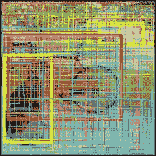
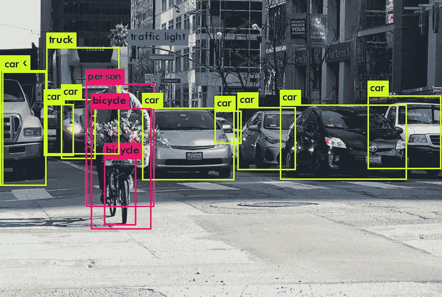

# YOLO:你只能看一次。

> 原文：<https://medium.com/analytics-vidhya/yolo-you-look-only-once-9af63cb143b7?source=collection_archive---------3----------------------->

> **YOLO** 目标检测算法，可以同时执行分类和目标定位(检测)，只需查看图像一次。因此，这种算法的名字叫做**你只看一次**。

# 1.介绍

多年来，计算机视觉领域一直与我们一起生活和成长，从 Instagram 滤镜、谷歌镜头到特斯拉汽车，这些都是受计算机视觉算法创作启发的产品。在本文中，我将向您解释最流行的对象检测算法 YOLOv3 背后的工作原理。但在此之前，让我试着解释一下，**分类任务 vs 物体检测的区别。**

注意:所有 3 个版本的 YOLO 都具有相似的工作原理，只是在网络架构上有微小的变化，这有助于整体性能的提高。

## 先决条件

要彻底理解这篇文章

*   你应该明白[卷积神经网络背后的工作原理。](/@RaghavPrabhu/understanding-of-convolutional-neural-network-cnn-deep-learning-99760835f148)
*   能够轻松构建简单的神经网络。
*   最重要的是，学习的欲望。

# 2.分类与目标检测

**分类**的任务是预测图像中物体的类别。例如，训练图像分类网络来分类一副牌，或者区分猫和狗的图像。

**目标检测**的任务是识别图像中目标的位置以及目标的类别。图像中的对象包含在一个矩形框中，也表示对象的类别。
例如，如果一个人想要在点击自拍的同时计数交通路口的汽车数量或面部数量，则采用对象检测的任务。分类的任务不能直接应用于现实世界场景中的输入图像馈送，它总是伴随着检测或分割的任务。

# 3.YOLO 的工作原理

YOLO 使用一个 CNN 来预测物体的种类，并且通过只看一次图像来检测物体的位置。让我们先看看 YOLO 的网络架构。

图一

让我试着用文字描述上面的图(图 1)，YOLO 网络接受一个固定输入维度的图像。理论上，YOLO 对于输入图像的大小是不变的(灵活的)。然而，在实践中，我们将输入尺寸调整为 416x416 或 608x608 的固定尺寸。这样做使我们能够批量处理图像(批量图像可以由 GPU 并行处理)，这有助于我们更快地训练网络。

当图像通过网络向前传播时，对图像应用多重卷积，学习物体的特征、颜色、形状和许多其他方面。在每一层，我们获得一个复杂的图像，即该层的特征图。**CNN 图层的输出是 3D 特征图。每个深度通道对图像或对象的特征进行编码。**

了解更多关于[的特色地图](https://towardsdatascience.com/applied-deep-learning-part-4-convolutional-neural-networks-584bc134c1e2)。

当网络步距达到 32 时，在一定数量的卷积之后，我们得到**输出特征图，**我们从中获得它的层被称为**检测层**。

## 3.1 如何解释这个输出特征图？

输出特征图是表示在将图像从输入层传递到检测/输出层时，所有前面的卷积层所学习的特征的合成张量。**输出/检测特征图**为 **13x13x125。**

## 3.2 我们来分解一下，看看里面有什么。

13 是输出特征地图的宽度和高度。由于发生了卷积，13x13 中的每个单元(正方形)可以看到输入图像的一个区域/部分。这叫做 [**感受野**](http://blog.christianperone.com/2017/11/the-effective-receptive-field-on-cnns/#:~:text=The%20receptive%20field%20in%20Convolutional,particular%20unit%20of%20the%20network.&text=The%20numbers%20inside%20the%20pixels,sliding%20step%20of%20the%20filter).) **。**网络的**感受** **域**是输出特征图中细胞(神经元)可见的输入图像区域。

此外，13x13x125 特征地图中的每个单元都有 5 个边界框来检测图像中的对象。只有当对象落在该单元的感受野内(感受野是该单元可见的输入图像的区域/部分)时，该单元才能通过其 5 个边界框中的一个来检测图像中的对象。

图 2

为此，YOLO 将输入图像分成 13x13 的网格。13x13x125 输出要素地图中的每个像元代表输入图像的每个相应的 13x13 格网。(比如，特征图的红色单元格代表狗的图像上的红色网格)。(狗图像上的每个正方形 13x13 称为一个**网格**13x 13 特征图上的每个神经元称为一个**细胞**。)

现在，由于 13x13x125 中的每个单元有 5 个边界框，这些边界框可以使用输入上的 13x13 网格进行本地化(用于定位对象)。

如果对象的中心/中点落在特定的网格内(红色网格包含狗的中点)，则该网格负责检测对象。

更简单地说，包围对象或对象的一部分的边界框是将用于检测/定位图像中的对象的框。这些盒子比其他盒子具有更高的置信度得分。

## 3.3 现在来看张量的第三个维度，125。这代表了什么？

这是实际产量预测被封闭的地方。如前所述，13x13x125 特征地图中的每个像元都有 5 个边界框来进行预测。

每个边界框由它的，

*   **质心-x (tx)，质心-y (ty)，包围盒宽度(btw)，包围盒高度(th)** 。
*   **置信度/客观分数(Po)** (对象在边界框内的概率)。
*   **类别概率(P1，P2…)**即对象属于哪个类别(数据集中每个类别的 softmax 值)。

总的来说，这相当于来自边界框坐标的 4 个值，1 个客观分数的值，N 个正在被训练的类(这里，N=20)。每个边界框总共有 25 个值。

每个单元有 5 个边界框(YOLOv2)，因此在特征图中每个单元有 125 个值。

特征图中的深度方向条目(13x13xd)由以下公式控制:

((5+C)xB)=深度方向的条目。(四)

x，y，w，h，对象得分— 5。

C —类别概率(C=20)。

B —每个像元的边界框数量(B=5)。

将这些值放入公式中，我们得到的深度值为 125。13x13x125，如图所示。

## 3.4 YOLO 生产了多少个边界框？

每个 13x13 单元通过其指定数量的边界框 13x13xB 检测输入图像中的对象。在 YOLOv2 中，B=5。总边界框(13x13)x5=845。

在 YOLOv3 中，每个单元格有 3 个边界框。因此，使用 13x13 特征地图的边界框的总数将是。

(13x13)x3 = 507 个边界框。

从上面的图中，包含狗或狗的一部分的边界框将被用来检测这张图片中的狗。剩余的边界框被丢弃，因为它们没有在图片中定位狗。

## 3.5 不同尺度的预测

YOLOv3 为对象检测生成多个输出特征图。在达到 32 的步距之后，网络为尺寸为 416x416 的输入图像产生 13×13 的特征图。YOLOv3 还以 16 步距和 8 步距生成特征图。步长 16 处的层产生 26×26 的特征图&在步长 8 处，产生 52×52 的特征图(416×416 输入)。尽管特征图的宽度和高度在不同的步幅值下变化，但是包围边界框坐标的深度方向条目的数量、置信度得分和类别概率保持不变。

随着网络向前传播图像，当步幅为 32 时，在第一检测层，我们获得 13x13 输出特征图。进一步的层(在第一检测层之后)以因子 2 进行非采样，并与具有相似尺寸的先前层的特征图连接。另一个检测层当步幅为 16 时，我们在检测层获得 26×26 的输出特征图，当步幅为 8 时，获得 52×52 的特征图。因此，当输入图像尺寸为 416x416 时，YOLOv3 的边界框的总数为

## ((13x13)+(26x26)+(52x52))x3 =每幅图像 10647 个边界框。

现在，有很多边界框来检测图像中的对象。

但是我们需要 10647 个包围盒来检测图像中的一只狗吗？在我试图回答这个问题之前，让我们看看 YOLO 网络如何预测边界框的尺寸坐标。

# 4.包围盒预测

**在第一版 YOLO 中，边界框坐标是输出特征图**的回归值。

YOLOv1 网络试图直接预测边界框坐标和尺寸，而不对目标对象的形状进行任何假设。例如，图像中的人总是适合放在一个矩形框中&而不是正方形框中，但在某些情况下，网络无法为人类输出矩形边界框。 **YOLOv1 无法捕获数据**中对象的广义长宽比&大小。

当网络被赋予预测边界框坐标和尺寸的责任时，它导致定位误差，精确边界框尺寸的错误。简单地说，网络发现很难输出精确标记在物体上的包围盒坐标。

然而，这个缺点已经在 YOLOv2 中通过使用一种叫做 Anchors 的东西解决了。

## 4.1 锚

锚点是训练数据集中对象的预定义大小。由于直接预测的边界框坐标非常倾斜(YOLO 的直接输出)，这可以通过应用对数空间变换来消除&然后将它们应用于预定义的边界框，称为锚点。

**锚是先前的边界框，其倾向于捕捉训练数据中对象的长宽比&大小。**例如，当一个人从侧面看一辆汽车时，它的长宽比为 2:1 (w=2xh)，当从前面看时，它的长宽比为 1:1(正方形)，如果有一个人，如果他/她站着，他/她的长宽比为 1:3。类似地，前景中的对象将具有较大的边界框尺寸，而背景中的对象将具有较小的尺寸。锚是对训练数据中对象的形状&大小做出的假设。

锚是通过训练数据中所有包围盒的 K 均值聚类来计算的。此过程创建相似边界框的群集，并选择质心来表示每个群集的尺寸。

YOLOv3 从 k-means 聚类生成 9 个锚盒。(每个单元格 3 个边界框，跨 3 种不同比例 13x13、26x26 和 52x52 的预测。总共 3x3 = 9 个锚)

锚点或先前的边界框是有用的，因为 YOLO 可以学习对这些锚点进行小的调整，以正确地检测对象上的框。

## 4.2 这些锚点调整是如何进行的？

tx，ty，tw，th 是来自检测图层的回归(直接)边界框值。sigmoid 函数应用于 centroid-x 和 centroid-y，将值限制在 0-1 之间，确保边界框质心保持在网格内。Cx 和 Cy 是图像上网格的左上角坐标。

pw 和 ph 是盒子锚定尺寸。通过将 YOLO 输出应用于锚而不是预测它们，YOLOv3 减少了定位误差并增加了其预测的精度。

**注意:** **锚点可以是任意大小，因此可以延伸到 13x13 网格单元的边界之外，以检测大型对象。**

## 4.3 如何把 10647 个箱子减少到一个更小的数字？

我们不需要多个盒子来检测图像中的单个对象。单个边界框看起来很优雅。有两种方法可以限制预测框的数量。

1.  **设定置信度/客观分数的阈值** 客观分数指示边界框内的对象成为对象的概率，换句话说，**“由边界框包围的区域包含对象的置信度”。**

1.  **非最大抑制。
    将盒子的数量减少到一个盒子。我们采用一种叫做非最大抑制的方法。**

非最大值抑制是一种广泛使用的策略，用于从多个重叠实体中找出单个实体。在 YOLOv3 中，NMS 使用 IOU 公制。

IOU metric 计算两个边界框输出之间重叠面积与联合面积的比率。

选择其 IOU 值等于或大于阈值 NMS 值的框。

YOLOv3 的最终训练输出。

# 5.YOLOv3 损失函数

**YOLOv3** 使用预测值和实际值之间的平方差来计算**损失**。

损失函数是以下各项的组合

1.  **分类**损失。
2.  **本地化**损失。(预测边界框和地面真实框之间的误差)。
3.  **信心**丧失。

**∑^B** 表示单元格 w.r.t 中所有边界框相对于其质心-x、质心-y、宽度、高度&置信度得分的损失值之和。

**∑^S** 表示输出特征图中所有像元间所有损失值的总和。(在 13x13 地图中，S=13，将包含 169 个单元)。

**当单元格中有物体时，1^obj** 为 **1** 。 **0** 无对象时

**1^noobj** 当单元格中没有对象时为 1&当单元格中有对象时为 0。

**λ** s 为常数。 **λ** 为坐标最高，更专注于检测。

## 5.1 分类损失

如果像元包含对象，这是每个类的条件类概率的平方误差。

## 5.2 本地化损失

定位损失是在包围盒形心的误差和它的宽度和高度之间计算的。

我们在平方根函数中使用宽度和高度来惩罚较小的边界框，因为我们需要对较小的对象使用精确的边界框。

## 5.3 信心丧失

测量存在于边界框内的对象的置信度时的误差。

我们计算了两次信心损失，一次是 1^obj，另一次是 1^noobj.这样做是为了确保我们在没有检测到对象时降低置信度，而在检测到对象时提高置信度。

**网络的总损失值是分类损失、定位损失&置信度损失的总和。**

# 6.结论

YOLO 算法的理论到此结束。参考资料原文版 [YOLO](https://arxiv.org/pdf/1506.02640.pdf) 论文&一个最流行的 YOLO 框架[暗网](https://github.com/pjreddie/darknet)。