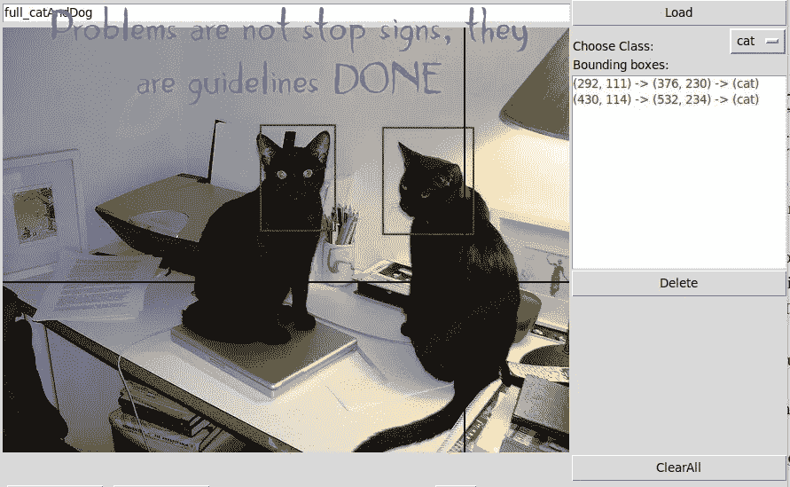

# YoloV3 注释工具(用于自定义数据)

> 原文：<https://medium.com/analytics-vidhya/yolov3-annotation-tool-for-custom-data-d876cae4da3c?source=collection_archive---------2----------------------->

Yooo Lo 伙计们，希望你们有一个愉快的一天，在这个帖子中，我将展示一个输出 YoloV3 格式标签的 bbox 注释工具。

但在此之前，如果你有兴趣看看在什么样的环境下可以使用这个注释工具，我会推荐你看看下面链接的我的其他论文。这篇论文是构成整个项目的众多论文之一。(提示:您可以随时联系…