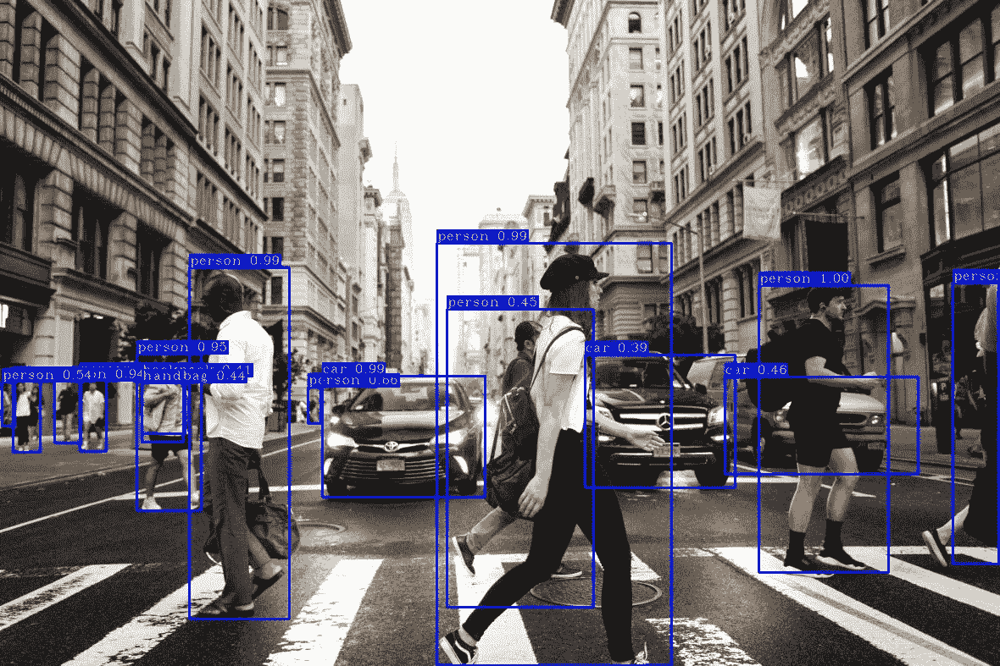
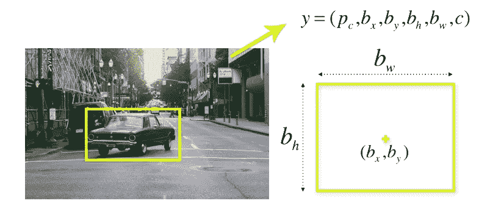
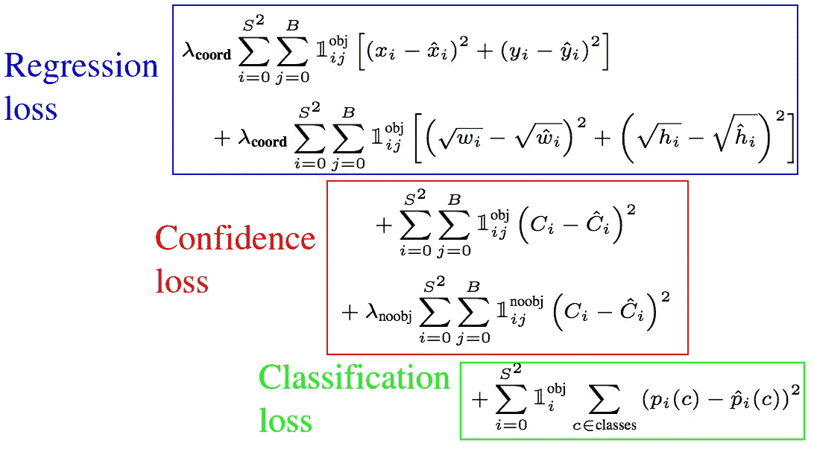
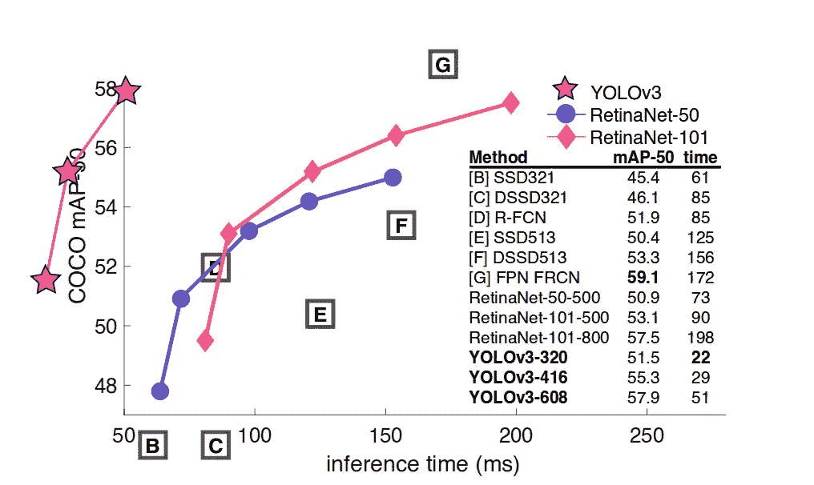
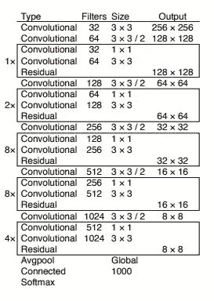
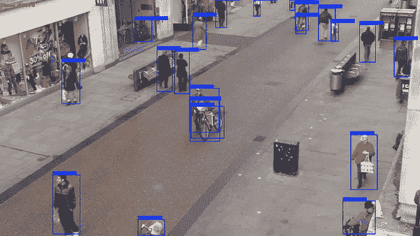
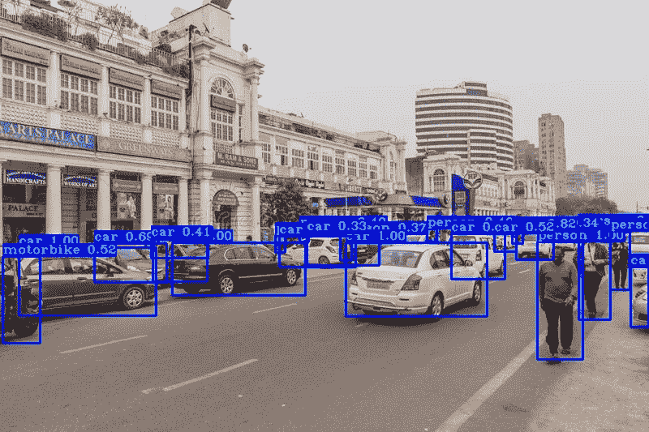
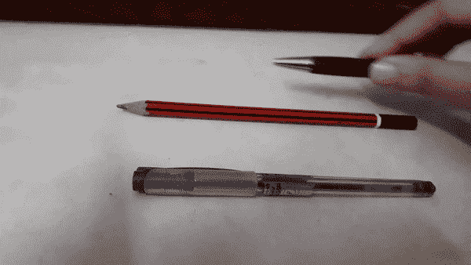

# TensorFlow 2.x 中的 YOLOv3 对象检测

> 原文：<https://medium.com/analytics-vidhya/yolov3-object-detection-in-tensorflow-2-x-8a1a104c46a8?source=collection_archive---------1----------------------->

你只看一次(YOLO)是一个最先进的，实时对象检测系统，是令人难以置信的快速和准确。在本文中，我们介绍了对象检测的概念，YOLO 算法，并在 TensorFlow 2.0 中实现了这样一个系统。

# **物体检测**

对象检测是一种计算机视觉技术，用于在图像或视频中定位对象的实例。它是监控系统、图像检索系统和高级驾驶辅助系统等应用背后的关键技术。

这些系统不仅包括识别和分类图像中的每一个物体，还包括*通过在物体周围画出合适的边界框来定位每一个物体。*

对象检测有不同的算法，它们可以分为两组:

1.  基于分类的算法:这些算法分两个阶段工作。首先，我们从图像中选择感兴趣的区域。然后，我们使用卷积神经网络对这些区域进行分类。这个过程非常慢，因为我们必须对每个选定的区域进行预测。这类算法的例子是基于区域的卷积神经网络(RCNN)及其版本 Fast-RCNN 和 Fast-RCNN。
2.  基于回归的算法:我们不是从图像中选择感兴趣的区域(ROI ),而是在算法的一次运行中预测图像的类别和边界框。这类算法的例子是 **YOLO(你只看一次)。**

# **YOLO**

Joseph Redmon 首先描述了 YOLO 模型。在 2015 年题为“[你只看一次:统一的实时物体检测](https://arxiv.org/abs/1506.02640)”的论文中

首次出版时(2016。)与 R-CNN 和 FRCNN 等系统相比，YOLO 已经实现了最先进的 mAP(平均精度)。另一方面，YOLO 努力精确定位物体。然而，它学习对象的一般表示。在新版本中，在速度和准确性上都有一些改进。

> 我们将对象检测重新定义为一个单一的回归问题，直接从图像像素到边界框坐标和类别概率。

— [你只看一次:统一的，实时的物体检测](https://arxiv.org/abs/1506.02640)，2015。

简单地说，我们把一幅图像作为输入，让它通过一个类似于 CNN 的神经网络，我们在输出中得到一个包围盒和类别预测的向量。

**解释预测向量**

输入图像被分成一个由单元组成的*S×S*网格。对于图像上出现的每个对象，一个网格单元被称为负责预测它的*****。这是对象中心所在的单元格。*****

*****每个网格单元预测 *B* 边界框以及 *C* 类概率。边界框预测具有五个分量 *x，y，w，h，置信度*。 *(x，y)* 坐标表示相对于网格单元位置的盒子中心。这些坐标被标准化为介于 0 和 1 之间。相对于图像尺寸， *(w，h)* 框的尺寸也被标准化为[0，1]。*****

**********

*****在包围盒预测中还有一个组件，即置信度得分。*****

> ******形式上我们定义置信度为 Pr(Object) * IOU(pred，truth)。如果该单元格中不存在任何对象，置信度得分应该为零。否则，我们希望置信度得分等于预测框和实际情况之间的交集(IOU)。******

*****— [你只看一次:统一的实时物体检测](https://arxiv.org/abs/1506.02640)，2015。*****

*****每个网格单元产生这些预测中的 B 个，因此总共有 *S x S x B * 5* 个与边界框预测相关的输出。*****

*****还需要预测类概率， *Pr(Class(i) | Object)。*这个概率取决于包含一个对象的网格单元。这意味着如果网格单元上没有对象，损失函数将不会针对错误的类预测对其进行优化。该网络仅预测每个单元的一组类别概率，而不管总共有多少个框 *B、*使得*S x S x C 产生类别概率。******

******最后，将类预测加到输出向量上，我们得到一个 *S x S x (B * 5 +C)* 张量作为输出。******

********网络********

******网络结构看起来像 CNN，有卷积和 max 池层，最后是 2 个完全连接的层。******

************

## ******损失函数******

******我们只希望其中一个边界框负责图像中的对象，因为 YOLO 算法为每个网格单元预测了多个边界框。为了实现这一点，我们使用损失函数来计算每个真阳性的损失。******

************

******该等式计算与预测边界框位置 ***(x，y)*** 相关的损失。该函数计算每个边界框预测值 **( *j = 0)的总和..每个网格单元的 b*****(*I = 0)..S* )** 。 ***𝟙 obj*** 定义为:******

*   ******1，如果对象出现在网格单元 *i* 中，并且第 *j* 个边界框预测器“负责”该预测******
*   ******0，否则。******

> *******YOLO 预测每个网格单元有多个边界框。在训练时，我们只希望一个边界框预测器负责每个对象。我们分配一个预测器来“负责”预测一个对象，基于哪个预测具有最高的当前 IOU 和地面真实值。*******

******— [你只看一次:统一的，实时的物体检测](https://arxiv.org/abs/1506.02640)，2015。******

******等式中的另一项: ***(x，y)*** 是预测的包围盒位置， ***(x̂，ŷ)*** 是来自训练数据的实际位置。******

******等式的第二部分，这是与预测的盒子宽度/高度相关的损失。******

> *******我们的误差指标应该反映大盒子中的小偏差不如小盒子中的小偏差重要。为了部分解决这个问题，我们预测边界框宽度和高度的平方根，而不是直接预测宽度和高度。*******

******— [你只看一次:统一的，实时的物体检测](https://arxiv.org/abs/1506.02640)，2015。******

******等式的第三部分，这里我们计算与每个边界框预测器的置信度得分相关联的损失。 ***C*** 是置信度得分，而***ĉ***是预测边界框与地面真实的交集。 ***𝟙 obj*** 当单元格中有对象时等于 1，否则等于 0。 ***𝟙 noobj*** 则相反。******

*********λ*** 参数用于损失函数的不同权重部分。这是增加模型稳定性所必需的。最高的惩罚是对于坐标预测(***λcoord****= 5)*，最低的惩罚是对于没有对象存在时的置信度预测(***λnoobj****= 0.5)*。******

******损失函数的最后一部分是分类损失，这看起来像是分类的正态平方和误差，除了 ***𝟙 obj*** 项。******

# ******YOLOv3******

******YOLOv3 是一个实时的单阶段物体检测模型，它建立在 [YOLOv2](https://paperswithcode.com/method/yolov2) 的基础上，并做了一些改进。改进包括使用新的主干网络 Darknet-53，该网络利用剩余连接，或者用作者的话说，“那些新奇的剩余网络东西”，以及对边界框预测步骤的一些改进，并使用三种不同的尺度来提取特征(类似于 FPN)。******

************

******原[论文](https://pjreddie.com/media/files/papers/YOLOv3.pdf)中提到，YOLOv3 有 53 个卷积层叫做 Darknet-53 如下图所示，主要由卷积和残差结构组成。应当注意，最后三层 Avgpool、Connected 和 softmax 层用于在 Imagenet 数据集上进行分类训练。当我们使用 Darknet-53 图层从图片中提取特征时，这三个图层都没有用到。******

******与 ReseNet-101 相比，Darknet-53 网速是前者的 1.5 倍；虽然 ReseNet-152 和它的性能差不多，但是它需要 2 倍以上的时间。此外，Darknet-53 还可以实现每秒最高的测量浮点运算，这意味着网络结构可以更好地利用 GPU，从而使其更加高效和快速。******

************

******YOLO 通过使用 32、16 和 8 的步幅以 3 种不同的尺度进行检测，以适应不同的物体尺寸。******

******Yolo 预测超过 3 个不同的尺度检测，因此如果我们输入一个大小为 416x416 的图像，它会产生 3 个不同的输出形状张量，13 x 13 x 255、26 x 26 x 255 和 52 x 52 x 255。******

******例如，当我们馈入大小为 416x416 的输入图像时，在进入 Darknet-53 网络后得到 3 个分支。这些分支经历一系列卷积、上采样、合并和其他操作。最终得到三幅大小不同的特征图，形状分别为[13，13，255]，[26，26，255]和[52，52，255]******

******残差网络用于缓解神经网络中因深度增加而导致的梯度消失问题，从而使神经网络更容易优化。******

# ******TF2.0 中的实现******

******这段代码的实现受到了罗卡斯·巴尔西斯的启发，他在自己的 [pylessons](https://pylessons.com/) 站点上发表了一篇关于 Yolov3 实现的文章。******

******设计用于在 Python 3.7 和 TensorFlow 2.0 上运行的代码可以在我的 [**GitHub 库**](https://github.com/anushkadhiman/YOLOv3-TensorFlow-2.x) 中找到。******

******在我的回购中，你会发现一个笔记本(。ipynb 文件)，它是对图像和视频执行检测代码。******

******首先克隆我的资源库:
`git clone https://github.com/anushkadhiman/YOLOv3-TensorFlow-2.x.git`******

******接下来，安装需要的 python 包:
`pip install -r ./requirements.txt`******

******现在，下载经过训练的 yolov3.weights:
`wget -P model_data [https://pjreddie.com/media/files/yolov3.weights](https://pjreddie.com/media/files/yolov3.weights)`******

******现在，测试 Yolo v3 检测:
`python detection_demo.py`******

## ******通过预先训练的模型进行检测******

************************

## ******由定制训练模型进行检测******

************

********我的其他帖子:********

1.  ******[在 TensorFlow 2 中使用深度排序进行对象跟踪](/analytics-vidhya/object-tracking-using-deepsort-in-tensorflow-2-ec013a2eeb4f)******
2.  ******[计算机视觉:现在和未来](/analytics-vidhya/computer-vision-the-present-and-future-2c2c95fa81af)******

******参考资料:******

1.  ******[你只看一次:统一的实时物体检测](https://arxiv.org/abs/1506.02640)——约瑟夫·雷德蒙、桑托什·迪夫瓦拉、罗斯·吉斯克、阿里·法尔哈迪******
2.  ******[约洛夫 3:增量改进](https://arxiv.org/abs/1804.02767)——约瑟夫·雷德蒙，阿里·法尔哈迪******
3.  ******https://pylessons.com/——罗卡斯·巴尔西斯******