# YOLOv4-速度和精度

> 原文：<https://medium.com/analytics-vidhya/yolov4-speed-accuracy-9f11c301334d?source=collection_archive---------20----------------------->

**(你只看一次)但更***！！！！***

**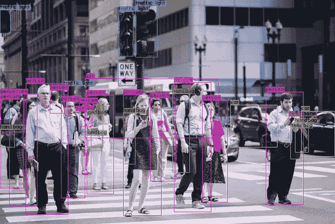**

**YOLOv4**

**自从 R-CNN 发布以来，对象检测在最近几年开始成熟，竞争仍然激烈。YOLOv4 再次声称具有最先进(SOTA)精度，同时保持高处理帧速率。它在 Tesla V100 上以大约 65 FPS 的推理速度实现了 ms coco 43.5% AP(65.7%ap₅₀)的准确率，如下图所示。在物体检测中，更高的准确度和精确度是我们绝对想要的许多东西中的少数。我们希望该模型能够在 Rasberry Pi、Jetson Nano、英特尔主板等边缘设备上顺利运行。如何利用这些低功耗和低成本硬件处理实时视频流变得越来越重要，也越来越具有挑战性，推动了机器人、商业等领域的需求。( ***代码最后与视频分享走查)*****

**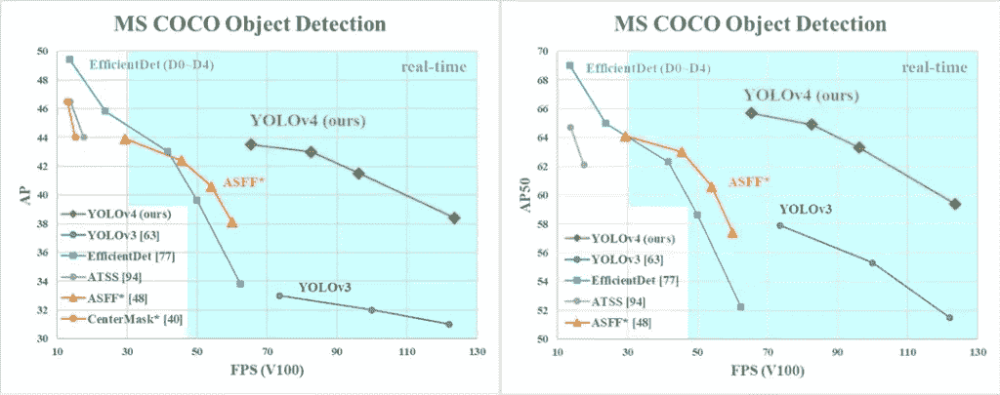**

**YOLOv4 的速度是 EfficientDet 的两倍，但性能相当。**

**YOLO 版本列出了三位作者:阿列克谢·博奇科夫斯基(Alexey Bochkovskiy)，他是构建 YOLO Windows 版本的俄罗斯开发人员，钱和廖宏远。(不幸的是，YOLO 的创造者约瑟夫·雷德蒙[宣布](https://syncedreview.com/2020/02/24/yolo-creator-says-he-stopped-cv-research-due-to-ethical-concerns/)由于工作的负面影响，他不再追求计算机视觉)**

**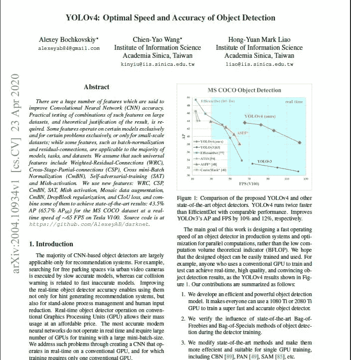**

**[https://arxiv.org/abs/2004.10934](https://arxiv.org/abs/2004.10934)**

*****按作者*****

> **与之前的 YOLOv3 相比，YOLOv4 具有以下优势:**
> 
> **这是一个高效而强大的对象检测模型，使任何拥有 1080 Ti 或 2080 Ti GPU 的人都可以训练一个超级快速而准确的对象检测器。**
> 
> **在探测器培训期间，最先进的“免费赠品袋”和“特殊物品袋”物体探测方法的影响已经得到验证。**
> 
> **改进的最新方法，包括 CBN(交叉迭代批量归一化)、PAN(路径聚合网络)等。，现在效率更高，适合单 GPU 训练。**

**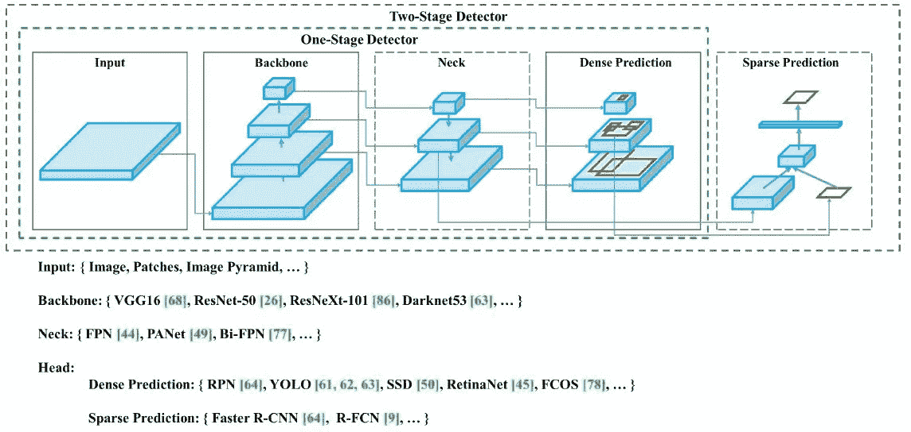**

**可插拔架构**

# **一袋赠品(Bof)和一袋特价商品(BoS)**

**可以在训练过程中进行改进(如数据扩充、类别不平衡、成本函数、软标签等)以提高准确性。这些改进对推理速度没有影响，被称为“免费赠品”。然后，还有“特价商品包”,它对推理时间有轻微的影响，但在性能上有很好的回报。这些改进包括感受野的增加，注意力的使用，像跳跃连接& FPN 这样的特征整合，以及像非最大抑制这样的后处理。在本文中，我们将讨论特征提取器和瓶颈是如何设计的，以及所有这些 Bof 和 BoS 好东西。**

> *****生产中满足神经网络速度的方法论&并行计算的优化:*****

*   **对于 GPU，卷积层中的少量组(1–8):cspresnext 50/cspdarknet 53**
*   **对于 VPU-分组卷积，但避免
    使用挤压和兴奋(SE)块
    -具体包括以下型号:
    efficient net-lite/mix net/ghost net/mobilenet v3**

****一般意义上的 BoF 和 BoS 的选择****

**为了改进任何对象检测训练，典型的 CNN 通常使用以下:**

*   ****激活:** ReLU，leaky-ReLU，parametric-ReLU，ReLU6，SELU，Swish 或 Mish**
*   ****包围盒回归损失** : MSE，IoU，GIoU，CIoU，欧弟**
*   ****数据扩充**:剪切、混合、剪切混合**
*   ****正则化方法**:丢弃、丢弃路径、空间丢弃或丢弃块**
*   ****根据网络激活的均值和方差进行归一化**:批量归一化(BN)、跨 GPU 批量归一化(CGBN 或 SyncBN)、滤波器响应归一化(FRN)或交叉迭代批量归一化(cBN)**
*   ****跳过连接**:剩余连接、加权剩余连接、多输入加权剩余连接或跨级部分连接(CSP)**

**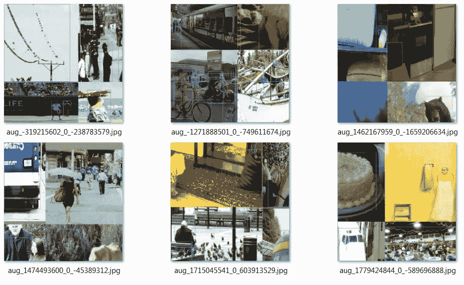**

**镶嵌数据增强**

# **YOLOv4 的详细信息**

*   ****主干**:CSP darknet 53(CSP+darknet 53)**

**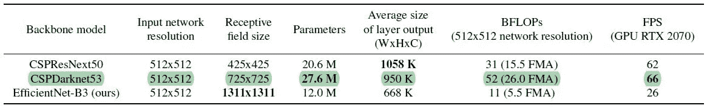****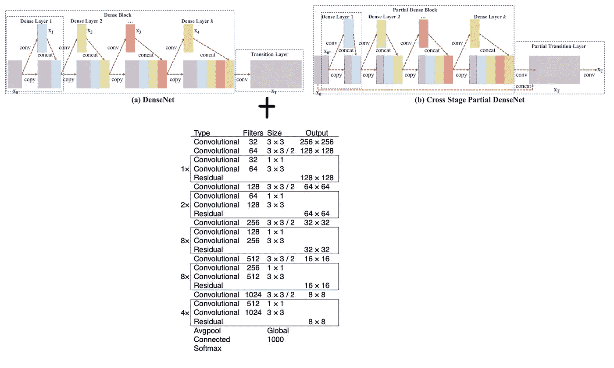**

*   ****颈:** SPP(空间金字塔池)，PAN(路径聚合网络)**

**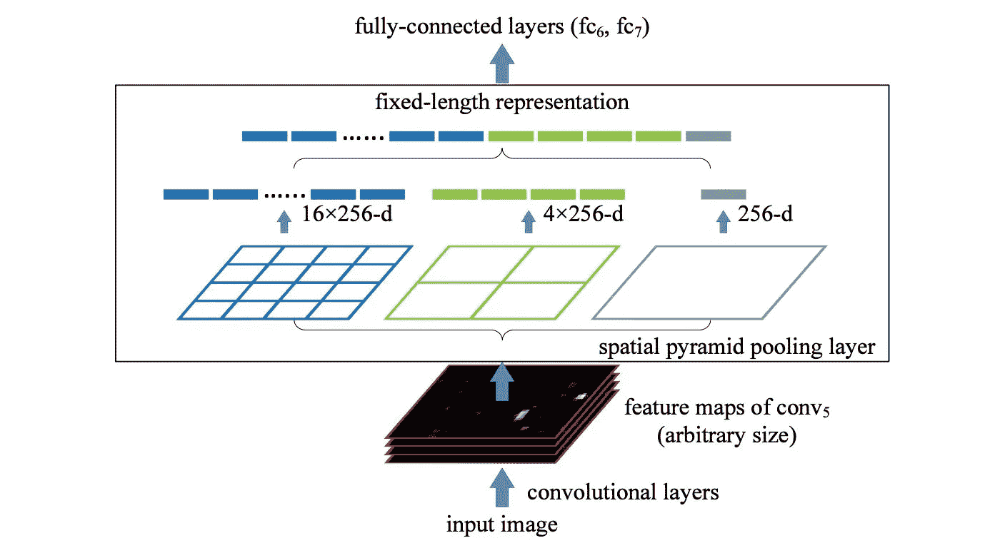**

****空间金字塔汇集层****

**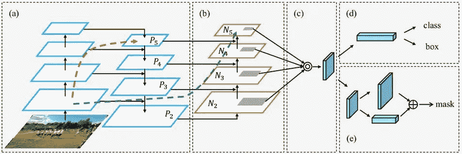**

**潘【路径聚合网】**

*   ****头** : YOLOv3**

# ****YOLO v4 用途:****

*   ****主干的免费包(BoF)**:剪切混合和镶嵌数据增强、DropBlock 正则化、类标签平滑**

**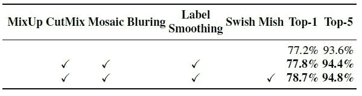**

*   ****骨干专用包** : Mish 激活、
    跨级部分连接(CSP)、多输入
    加权剩余连接(MiWRC)**
*   ****探测器的一包赠品(BoF)**:CIoU-loss、CmBN、DropBlock 正则化、马赛克数据增强、自我对抗训练、消除网格敏感性、对单个地面使用多个锚
    真理、余弦退火调度程序、最优超参数、
    随机训练形状**

**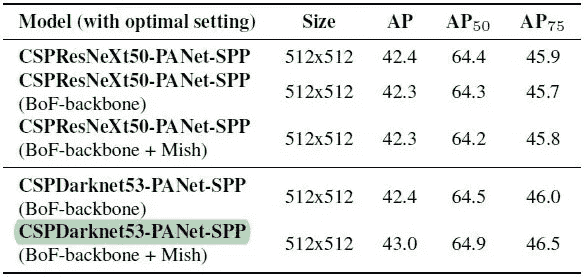**

*   ****探测器专用包** : Mish 激活，SPP-block，SAM-block，PAN 路径-聚合 block，欧弟-NMS**

> ****！！！对以上每个超参数深潜好奇，请通读**[***【https://medium.com/@jonathan_hui/yolov4-c9901eaa8e61】***](/@jonathan_hui/yolov4-c9901eaa8e61)***(你会喜欢的。)*****
> 
> ****yolov 4 在不同 NVIDIA GPU 架构(Maxwell、Pascal、Volta)上的对比****

**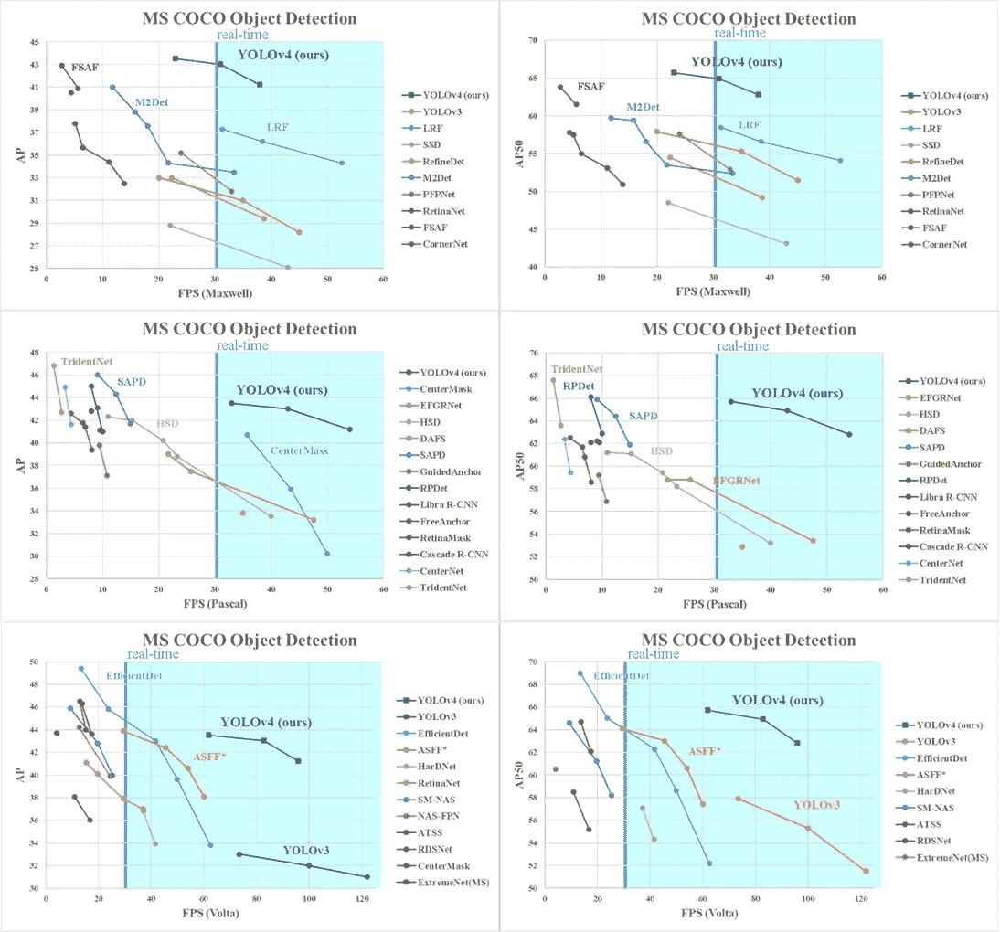**

> ****作者的最终想法:****

## **一个 *最先进的检测器，比所有可用的替代检测器更快(FPS)和更准确(MS COCO AP50…95 和 AP50)。所描述的检测器可以在具有 8–16 GB VRAM 的传统 GPU 上训练和使用，这使得它的广泛使用成为可能***

**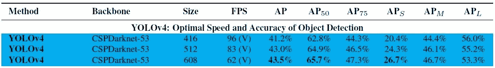**

# ****编码并遍历:(分叉代码)****

** [## SSusantAchary/yolov 4-Cloud-教程

### 这个存储库将带您了解如何在 Google 的云中使用 Darknet 构建和运行 YOLOv4 对象检测…

github.com](https://github.com/SSusantAchary/YOLOv4-Cloud-Tutorial) 

[https://www.youtube.com/watch?v=mKAEGSxwOAY](https://www.youtube.com/watch?v=mKAEGSxwOAY)(代码和视频**归功于他)**

**坚持学习！！！**

# **参考文献:**

1.  约洛夫 4 论文-[https://arxiv.org/abs/2004.10934](https://arxiv.org/abs/2004.10934)
2.  [https://medium.com/@jonathan_hui/yolov4-c9901eaa8e61](/@jonathan_hui/yolov4-c9901eaa8e61)
3.  官方和托管代码:【https://github.com/AlexeyAB/darknet **