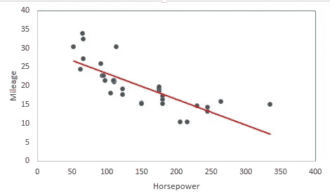

# 线性回归介绍，它的陷阱，以及如何避免它们

> 原文：<https://medium.com/analytics-vidhya/you-are-into-data-science-5dbdf9256d6e?source=collection_archive---------1----------------------->

> “简单是最复杂的”——莱昂纳多·达芬奇

我们都喜欢有大牌的“酷”模特！

但事实是，像**线性回归**这样的简单模型在很多实际情况下表现非常好。如果你对处理数据感兴趣，理解以下概念总是有好处的，这些概念在不同和更复杂的机器学习模型中有重复的应用。

# 介绍

*线性回归*模拟标量响应(或因变量 y)和一个或多个解释变量(或自变量 X)之间的关系。这是预测因变量的一个**非常简单而强大的方法。它在时间序列分析、金融(如[资本资产定价模型](https://en.wikipedia.org/wiki/Capital_asset_pricing_model))、流行病学和其他社会科学以及机器学习等领域有着广泛的应用。**

下面是来自 onlinestatbook.com[的**实际例子**。在这里，我们相信一个学生的大学 GPA(我们的 y 变量)可以用他或她的高中 GPA 来解释。当然，这是一个很幼稚的模型，不会给出太高的准确率。但是从图中我们可以看到，我们的回归曲线(红线)给出了一个大致准确的趋势。添加更多相关的预测因素(如学习时间、大学所学课程等。)可能会给我们一个更好的模型。](http://onlinestatbook.com/2/regression/intro.html)

同样，我们可以尝试预测作为不同广告模式(如电视、报纸和互联网)的函数的销售额(y)。将吸烟与癌症和发病率联系起来的早期证据来自于一些采用回归分析的观察性研究。

这在科学家之间引起了争议，正如那句名言所说的那样— [相关性并不总是意味着因果关系](https://www.skepticalraptor.com/skepticalraptorblog.php/correlation-implies-causation-except-doesnt/)。

*(漫画鸣谢-*[*xkcd*](https://xkcd.com/)*)*

*现在你明白为什么你上了* ***统计学-101*** *课，回到大学时代了吧！*

# 数学公式

通常，我们假设 y 和 X 之间存在线性关系(参数中的**线性)，如下所示:**

这里ε表示**误差项。**

我们通过标准技术估计模型的参数，如 ***最小二乘法、最大似然估计、自适应估计、最小角度回归*** 等。线性回归也扩展到了 ***广义线性模型、异方差模型、分层线性模型和测量误差模型*** 。关注这篇维基百科文章，了解更多细节-[https://en.wikipedia.org/wiki/Linear_regression](https://en.wikipedia.org/wiki/Linear_regression)。

**如果您对这些技术有任何疑问，请在**下方评论。

如果你知道 R，下面是我在[my Github](https://github.com/souravstat)-[https://Github . com/souravstat/Statistical-Learning-Solved-exercises-from-ISLR-book/blob/master/CH3 中对线性回归的*实现。R*](https://github.com/souravstat/Statistical-Learning-Solved-excercises-from-ISLR-book/blob/master/ch3.R) 。

下面是来自 **Aishwarya Ramachandran** 用 Python-[https://www . LinkedIn . com/pulse/tutorial-3-applying-linear-regression-Python-Aishwarya-c-Ramachandran/](https://www.linkedin.com/pulse/tutorial-3-applying-linear-regression-python-aishwarya-c-ramachandran/)更详细的实现。

# 常见陷阱

> “所有的模型都是错的，但有些是有用的”——乔治·博克斯

本质上，一个特定模型的“有用性”取决于它的假设如何适应现实世界的应用。线性回归的假设包括**线性(在参数中)、恒定方差、误差独立性**等。如果这些在很大程度上被违反，分析可能会出错！所以，这里有一些实现线性回归时的常见问题(它始于 LinkedIn 中的[这篇文章](https://www.linkedin.com/feed/update/urn:li:activity:6450022585307623424)，在那里我得到了朋友们非常热烈的回应)。

**下面是如何在拟合回归线的同时处理这些实际问题**。这同样适用于这里讨论的其他回归模型。我大致遵循了 ISLR 书[中的指导方针。](https://www.amazon.in/Introduction-Statistical-Learning-Applications-Statistics/dp/1461471370)

# 如何解决这些问题

在这里，我们讨论在实践中实现线性回归时如何处理核心问题。

1.  **非线性**:

我们可以绘制残差(误差)与拟合值的关系图，找出数据中的非线性。对预测值使用[非线性变换](https://people.revoledu.com/kardi/tutorial/Regression/nonlinear/NonLinearTransformation.htm)(如代数、对数或幂变换-见右图)以使用线性回归方法。

2) **离群值:**

这些是具有不寻常的 Y 值的观察结果。通过将每个残差 e[i]除以其估计的标准误差来计算[学生化残差](https://en.wikipedia.org/wiki/Studentized_residual)。如果绝对值为> 3，则可能是异常值。仔细观察变量，决定是*删除变量、*还是*继续插补*(替换为合适的值，如平均值/中值)。

3) **高杠杆点:**

具有异常 X 值的观察值被称为**高杠杆点**。计算[杠杆统计量 h](https://en.wikipedia.org/wiki/Leverage_(statistics)) 的值，其有界在[0，1]内。更高的幅度意味着更高的杠杆。正如我们在下面的例子中所看到的([来源](https://slideplayer.com/slide/9173878))，尽管两种情况下的数据云是相似的，但是包含杠杆点(红色观察)完全改变了回归曲线

我们还可以使用 **Cook 的距离图**(学生化残差与每个点的杠杆的图)来找到这些点(称为影响点，因为它们显著影响模型行为)。要更详细地了解杠杆和影响诊断，请参考[IIT 坎普尔**沙拉布**教授](http://home.iitk.ac.in/~shalab/regression/Chapter6-Regression-Diagnostic%20for%20Leverage%20and%20Influence.pdf)的讲稿。

4) **误差项的相关性**:

有时，模型中的误差项会相互关联。例如，有时在时间序列数据中，对应于相邻时间点的观察值可能会变得相关。如果人群以某种方式聚集在一起，也会发生这种情况(例如，同一个家庭的成员，接触相同饮食/相似环境因素的人等)。这就是为什么我们使用[受控实验](https://en.wikipedia.org/wiki/Scientific_control)来最小化不需要的变量(不包括在自变量中)的影响。

5) **异方差:**

这指的是误差项的**非恒定方差，这是另一个常见的陷阱。我们可以绘制残差(有时以标准化格式)与预测值的关系图来找出这一点。从下图(b)可以看出，漏斗状表示异方差。我们可以使用像 Log 或 Root 这样的凹函数对 Y 进行变换，从而使较大值的收缩量更大。因此，线性回归变得适用，我们得到类似(a)的曲线。**

6) **多重共线性**:

它指的是两个或多个预测变量彼此密切相关的情况。这是不好的，因为这会在模型中引入冗余。最小平方优化方法受到影响(即变得不稳定)，因为在这种情况下系数矩阵 X 不能实现满秩。这个问题在生存分析和不同期限的利率建模(利率一起变动)中尤其普遍。

另一个流行(！)练习确保完美的多重共线性是[哑变量](https://en.wikipedia.org/wiki/Dummy_variable_(statistics))陷阱；包括每个类别的虚拟变量(例如，12 个月中的每个月)以及作为预测因子的常数项。

这可以通过**数据的随机扰动**检测到(注意在多次重新运行回归后系数的变化，向数据添加随机噪声)。另一种方法是计算[方差膨胀因子](https://en.wikipedia.org/wiki/Variance_inflation_factor)。VIF > 5 表示多重共线性的存在。

# 就这些，朋友们！

希望你喜欢这篇文章。请在下面的评论中告诉我你对线性回归的体验。

*喜欢这篇文章？随意发个“你好”！还有* [*在不同平台跟我连接*](http://about.me/sourav.nandi) *。我活跃在*[*Github*](https://github.com/souravstat)*[*LinkedIn*](https://www.linkedin.com/in/souravstat)*[*Quora*](https://www.quora.com/profile/Sourav-Nandi-58)*[*Twitter、*](https://twitter.com/souravstat) *和*[*Medium*](/@souravstat)*。****

**PS-不要忘记关注 [Analytics Vidhya](https://medium.com/analytics-vidhya) 获取更多类似的精彩文章！**