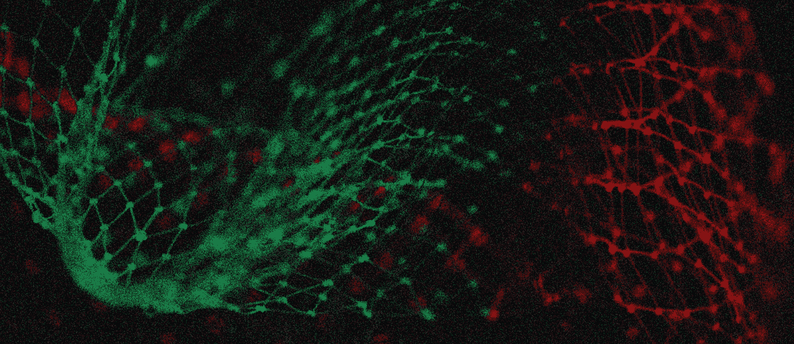

# 除非你理解了通用逼近定理，否则你不会理解神经网络

> 原文：<https://medium.com/analytics-vidhya/you-dont-understand-neural-networks-until-you-understand-the-universal-approximation-theorem-85b3e7677126?source=collection_archive---------0----------------------->

来源: [Pixabay](https://unsplash.com/photos/n6B49lTx7NM)

## 神经网络力量背后的证据

*如果你是通过 Yann Lecun 和/或史蒂芬·平克* *从* [*Twitter 而来，我已经尝试相应地更新了这篇文章，并可能会写另一篇文章来寻求解决和讨论这里的分歧。现在，记住这是* …](https://twitter.com/ylecun/status/1409940043951742981)