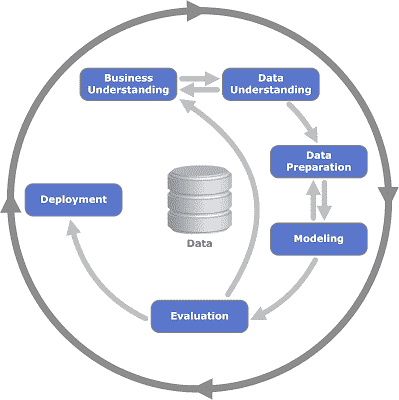
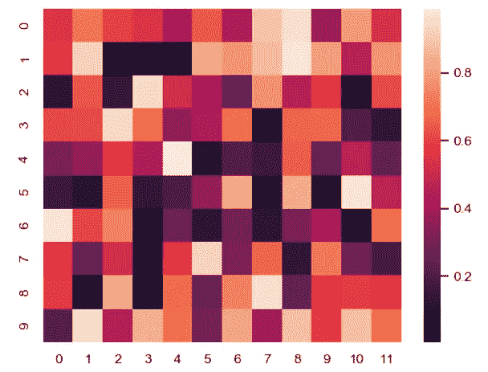
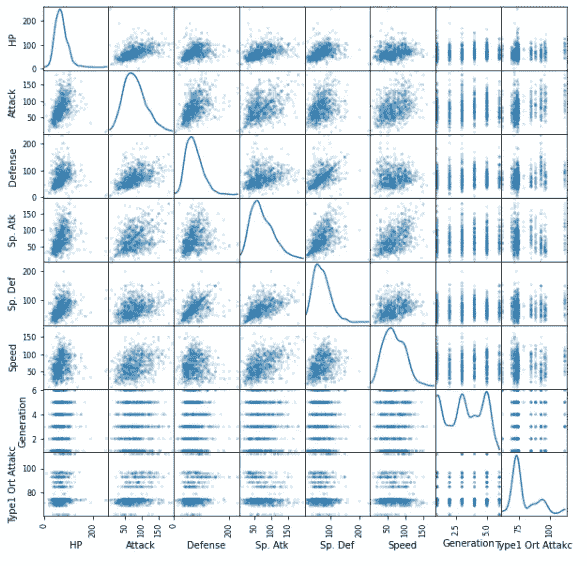
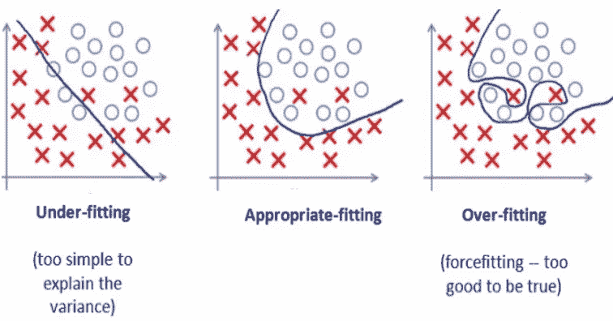

# 你需要的不仅仅是 CRISP-DM

> 原文：<https://medium.com/analytics-vidhya/you-need-more-than-crisp-dm-5f2721b3afbf?source=collection_archive---------34----------------------->



如果你已经在 ML 世界里，你一定经常看到这个图表。几乎每个教程都会参考。但这只是宪法，我们需要一本更详细的法律书，告诉我们具体什么时候做什么。

以下是我具体的行动方案:

第一部分是 ML 模型和数据分析工作。

注意:当我说“如果需要/必要”时，我指的是如果你的数据需要一些动作，以及如果你的算法需要它。例如，如果要素处于不同的比例，则可能需要进行缩放，但如果您使用的算法不需要缩放，则不必缩放数据。

注意:我假设您对 ML 模型有点熟悉，并且已经构建了一些基本模型。

1.  **导入必要的库和函数**

你不需要一开始就导入所有的东西。只需导入您经常使用的函数，并在需要时导入其他函数。

```
import pandas as pd
import numpy as np
import matplotlib.pyplot as plt
import seaborn as sns
import os
from sklearn.model_selection import train_test_split
from sklearn.metrics import mean_squared_error, mean_absolute_error 
from sklearn.metrics import confusion_matrix, recall_score, precision_score, f1_score 
from sklearn.metrics import accuracy_score,roc_auc_score,roc_curve
from sklearnextension import * #You should have some reuseable functions of your own
```

**2。获取数据**

起初，我们使用 csv/excel 文件，通常从类似 kaggle 的网站下载。有时我们从 sklearn 数据集模块中加载它。但是后来，最终，我们不得不处理真实的数据，这些数据是使用 SQL 从我们的数据库中检索的。说到这一点，我强烈建议像在数据库上一样预处理数据，这样会更快。

**3。用 EDA** 理解数据

有很多关于 EDA 的文章/博客/白皮书，我不想重复。简单说一下吧。

```
#Getting to know data briefly
df.describe()
df.info()
df.nunique()
df["somecolumn"].value_counts()
```

*   检查缺失值以及类似缺失的值。即“拿”、“打-”、“-999”等。如果这是一个 ML 模型，在这一步不要做任何事情，我们很快就会看到这一点。
*   检查偏斜度，必要时进行处理。你可能会想到“对数变换”这样的方法。
*   检查异常值并在必要时进行处理，即移除该特征或使用上限值替换它们。
*   检查是否需要缩放
*   可视化数据:查看与 seaborn 的热图和 pandas 的散点图的相关性。使用直方图查看分布。



这里的一些步骤被称为预处理和特征工程。

**4。检查是否存在足够的数据实例**

如果你没有足够的数据，你的模型可能**欠拟合**(非常低的精度或高损失函数值)。所以你应该收集更多的数据或者使用像 **SMOTE** 这样的重采样方法。



**5。** **检查特征数量**

如果特征的数量太多，您可能会考虑减少它，或者利用 **PCA** 等算法，或者手动选择最有用的特征(也有这方面的算法和方法)

如果特征的数量很少，您可以考虑通过特征提取和创建技术来增加它，如果可能的话，还可以从数据库中获取更多的列。

这里的东西也被称为**特征工程**。

**6。如果分类有问题，检查标签是否平衡。**

如果您有不平衡的数据，您的模型可能会导致不适当的方式。你必须用上述方法使它达到平衡状态。你也可以查看我的相关笔记本[。](/analytics-vidhya/three-steps-in-case-of-imbalanced-data-and-close-look-at-the-splitter-classes-8b73628a25e6)

**编辑**:在训练/测试分割后进行该步骤。

以下项目符号专门针对 ML 型号。

**7。获取 X 轴和 y 轴**

您通常将要素放入 X 变量，将标注放入 y 变量。大多数情况下，您需要将 y 标注调整为 2D 数组，因为大多数算法需要 2D 数组来

```
X=df.iloc[:,1:10]
y=df.iloc[:,11].reshape(-1,1) #make it 2D
```

**8。重要提示:现在就将您的数据拆分为训练集和测试集。**

并且**在您准备好最终评估之前，不要触摸**测试装置。

在一些教程中，可能为了简单起见，这部分是在一些一些变换操作之后执行的。(更糟糕的是，转换步骤是通过使用熊猫的方法完成的)。但是我建议在你的婴儿阶段习惯这一步。

在这两个集合中，都有一些我们试图预测的自变量(特征)和一个(有时更多)因变量。这里的主要思想是用训练集来训练我们的数据，并且不要让它看到测试集，这样就不会有信息泄漏到训练集中。然后我们微调我们的模型。最后，我们用测试集来测试我们的模型。

**9。一些更多的特征工程(需要转换的操作)**

*   插补(填充空值)。不要在 ML 模型中使用 pandas 的 fillna 方法。我很快会解释原因。
*   将分类值转换为数值(**标签编码(用于类)、序数编码(用于特征)**和**一键编码(创建虚拟列**)。不要在 ML 模型中使用 pandas 的 get_dummies 方法。一个原因是关于删除一列的默认值之间的差异，另一个原因是 OneHotEncoder 在管道中更有用，我马上会提到这一点。最后但同样重要的是，使用 OneHotEncoder，实现虚拟列(其中训练集和测试集在一列中有不同的项目)会更加容易和有效。一旦你了解了这个想法，请查看我的相关笔记本 中的 [*。*](/@mvolkanyurtseven/onehotencoding-with-dissimilar-items-in-train-and-test-set-ffe365f84a4c)
*   如果需要，扩展您的数据。

使用**管道**进行一系列转换。管道是可重用的，可以很容易地实现测试数据和新来的数据。多搜索一下这个。快速搜索后，你还可以查看我的相关笔记本 ***(即将推出)*** 。

10。用你的火车组建立你的模型。

这就是我们拟合和转换数据的地方(有时只有拟合方法，有时还有转换方法)

**11。如果你有足够的(也就是相当多，我的意思是很多)数据，用你的训练集做预测**

我们应该首先预测我们的训练集，以便查看我们的模型是否首先不准确地预测训练集(低精度或高损失函数值，如 RMSE)。如果没有，我们甚至不进行下一步。低精度/高 RMSE 意味着我们的模型**不符合**。我们应该做一些必要的事情来解决这个问题，比如:

*   选择更强大的模型
*   增加特征的数量(从数据库获取或使用特征提取技术)
*   如果是回归模型，则减少正则化参数

您的模型也可能**过拟合**，其中您的训练集预测是好的，但是您的测试集分数不是。如果是这样，请执行以下操作:

*   降低模型复杂性(选择更简单的模型)
*   如果可能，收集更多数据
*   通过处理异常值来减少噪音
*   在回归模型中添加正则化(搜索此内容)或减少决策树的深度

**12。如果你没有太多的数据(你会经常遇到这种情况)，做一个交叉验证。(不知道就上网查)**

如果结果令人满意，我的意思是结果符合或超过你的期望，这意味着它不是不符合，进入下一步。当然，不要忘了确保你的模型也不会过度拟合。

**13。使用测试集评估您的模型。**

在用测试集预测你的模型之后，如果一切看起来都没问题，就对它进行评估。回归和分类模型都有评估指标。

**14。建立更多的模型并进行比较**

使用 **GridSearchCV** 和**randomsearccv**对模型的结果进行比较，选择最好的，并做更多的微调操作。(如果你不知道，就去查一查)

最后，根据本文([https://machinelementmastery . com/train-final-machine-learning-model/](https://machinelearningmastery.com/train-final-machine-learning-model/))使用整套(训练+测试+交叉验证)训练你的模型

感谢阅读…