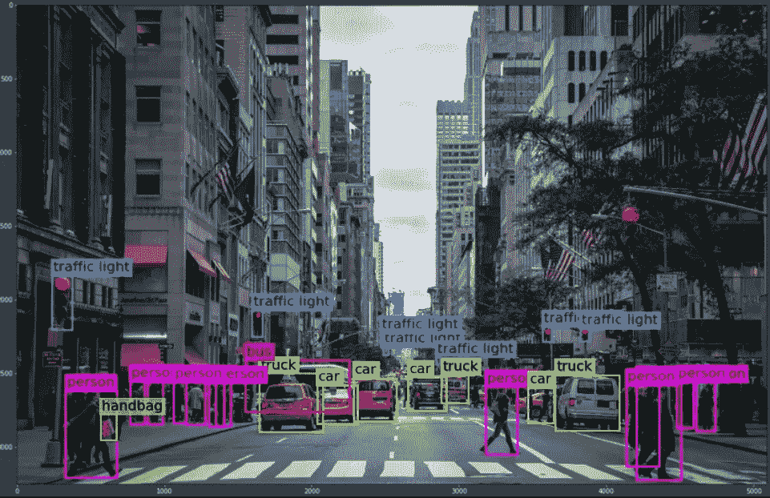
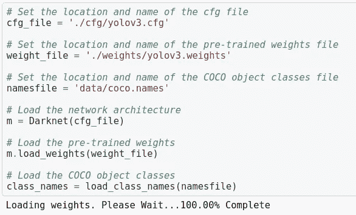
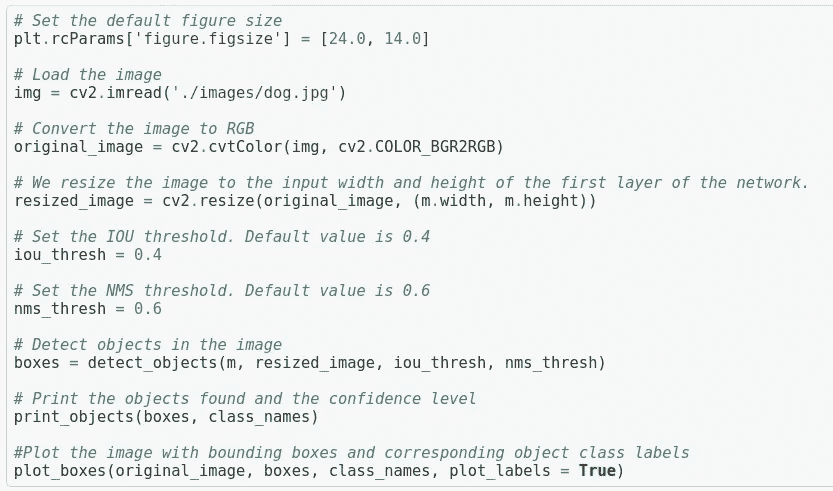
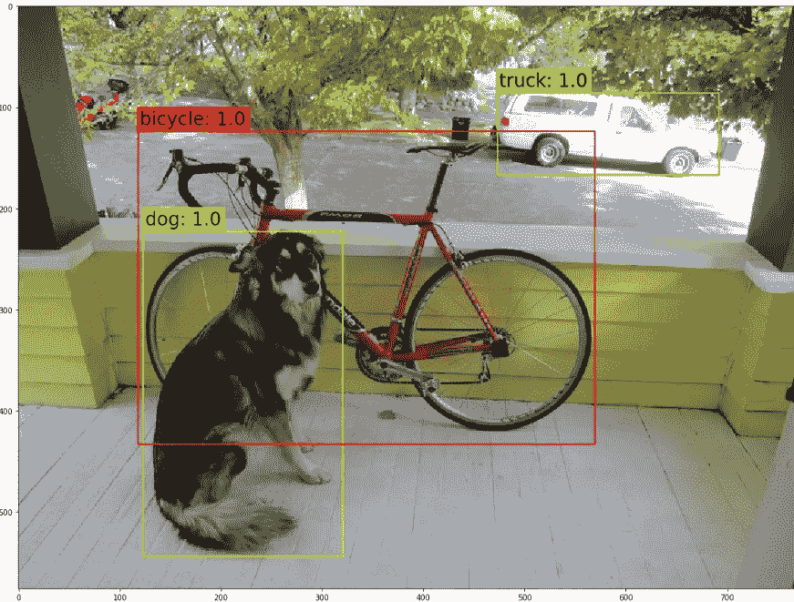

# 你只看一次(YOLO):用不到 30 行 Python 代码实现 YOLO

> 原文：<https://medium.com/analytics-vidhya/you-only-look-once-yolo-implementing-yolo-in-less-than-30-lines-of-python-code-97fb9835bfd2?source=collection_archive---------0----------------------->

> **You Only Look Once 是一种实时对象检测算法**，它避免了在生成区域建议上花费太多时间。它不是完美地定位物体，而是优先考虑速度和识别。

更快的 R-CNN 等架构是准确的，但模型本身相当复杂，有多个输出，每个输出都是潜在的误差源。一旦经过训练，它们仍然不够快，无法实时运行。

考虑一辆自动驾驶汽车看到这张街道的图像。对于自动驾驶汽车来说，能够检测周围物体的位置是非常重要的，例如行人、汽车和交通灯。最重要的是，**这种检测必须接近实时，这样汽车才能安全地在街上行驶。**汽车并不总是需要知道所有这些对象是什么？它最需要知道不要撞上他们，但它确实需要识别交通灯、自行车和行人，以便能够正确地遵循道路规则。
在下图中，我使用了 YOLO 算法**来定位和分类不同的物体**，有一个边界框来定位每个物体和相应的类别标签。

YOLO 在行动

> 因此，下一个显而易见的问题是，YOLO 是如何运作的？

假设我们有一个 CNN，它被训练来识别几个类别，包括交通灯、汽车、人和卡车。我们给它两种类型的锚盒，一个高一个宽，这样它就可以处理不同形状的重叠对象。一旦 CNN 经过训练，我们现在可以通过新的测试图像来检测图像中的对象。

设置神经网络

> **什么是锚箱？** YOLO 可以很好地用于多个对象，其中每个对象与一个网格单元相关联。**但是在重叠的情况下，我** n 哪一个网格单元实际上包含两个不同对象的中心点，**我们可以使用称为锚框的东西来允许一个网格单元检测多个对象。**

行动中的锚箱

> 在上面的图片中，我们看到一个人和一辆车重叠在一起。所以，车的一部分被遮住了。我们还可以看到，两个边界框、汽车和行人的中心都落在同一个网格单元中。由于每个网格单元的输出向量只能有一个类，因此它将被迫选择汽车或人。但是通过定义锚盒，我们可以创建一个更长的网格单元向量，并将多个类与每个网格单元相关联。
> **锚定框有一个定义好的长宽比，他们试图检测那些恰好适合这个比例的对象。**例如，因为我们正在检测一辆宽的汽车和一个站着的人，我们将定义一个粗略的汽车形状的定位框，这个框将比它的高度宽。我们将定义另一个锚盒，它可以容纳一个站立的人，它的高度比宽度大。

测试图像首先被分成网格，然后网络产生输出向量，每个网格单元一个向量。这些向量告诉我们一个单元格中是否有一个对象，该对象是什么类，以及该对象的边界框。因为我们使用了两个定位框，我们将为每个网格单元获得两个预测定位框。一些，事实上大多数预测的锚定框将具有非常低的 PC(对象存在于其中的概率)值。
在产生这些输出向量之后，我们使用非最大抑制来去除不太可能的包围盒。对于每一类，非最大抑制去除了具有低于某个给定阈值的 PC 值的边界框。

> 什么是非最大抑制(NMS)？
> YOLO 使用非最大抑制(NMS)只保留最佳包围盒。NMS 的第一步是移除所有检测概率小于给定 NMS 阈值的预测边界框。在下面的代码中，我们将这个 NMS 阈值设置为 0.6。这意味着检测概率小于 0.6 的所有预测边界框都将被移除。
> 
> **什么是交集超过联合阈值(IOU)？**
> 在去除所有具有低检测概率的预测包围盒之后，NMS 的第二步是选择具有最高检测概率的包围盒，并去除所有其**交集/并集(IOU)** 值高于给定 IOU 阈值的包围盒。在下面的代码中，我们将 IOU 阈值设置为 0.4。这意味着相对于最佳边界框具有大于 0.4 的 IOU 值的所有预测边界框将被移除。

然后，它选择具有最高 PC 值的边界框，并移除与此过于相似的边界框。它将重复这一过程，直到为每个类移除了所有的非最大边界框。最终的结果将看起来像下面的图像，我们可以看到黄色有效地检测了图像中的许多对象，如汽车和人。

YOLO 物体检测

现在你知道了 YOLO 是如何工作的，你就能明白为什么它是当今最广泛使用的物体检测算法之一了！

**点击此处查看此代码:******，**获取 YOLO 算法的代码实现，并真正了解它如何在不同场景和不同置信度下检测物体。**