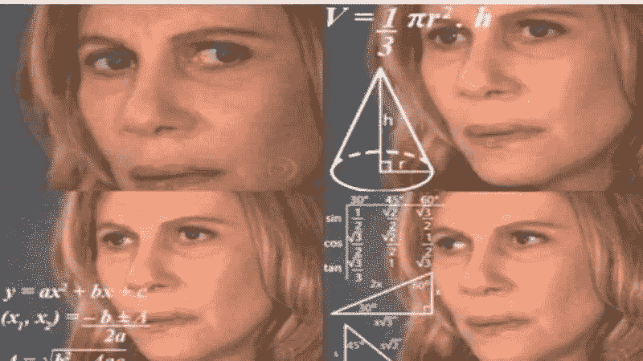
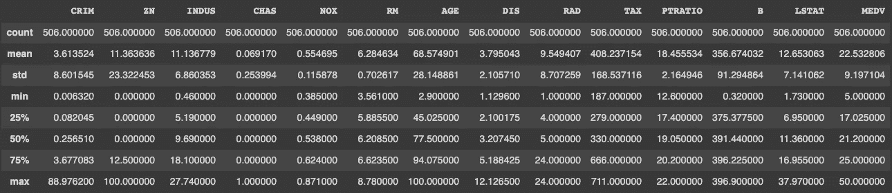
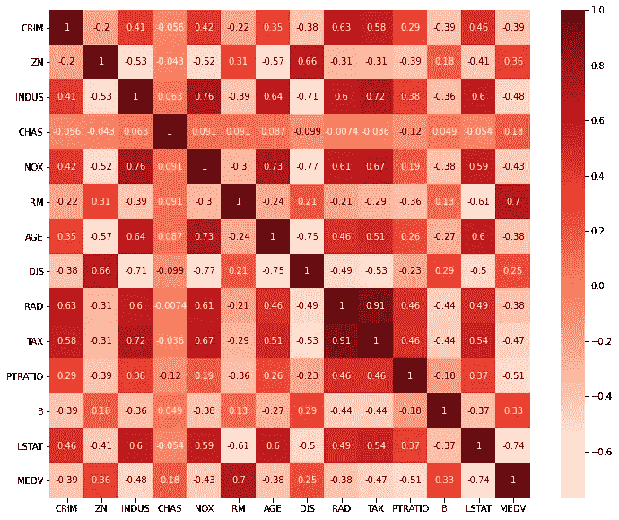

# 你的代数课没有让你为这个机器学习房价预测器做好准备

> 原文：<https://medium.com/analytics-vidhya/your-algebra-class-did-not-prepare-you-for-this-machine-learning-housing-price-predictor-b63e691b0bc5?source=collection_archive---------23----------------------->

## 使用线性回归的 ML 项目&波士顿住房数据集

如果你的代数课和我的一样，直线方程 y=mx+b 会永久地印在你的大脑中。您甚至可能还记得使用这个等式来寻找最适合数据的直线。

无论你做了多少只试图将…线的重要性联系起来的应用题，你可能都没有完全理解在数学课之外了解线性回归会对你产生怎样的影响。暗示你的同学，或者甚至你，问那个臭名昭著的"*为什么我们需要再次知道这个？*或者*这对我有什么帮助？*

尝试自己回答这些问题可能是这样的:



我来为你解答:**机器学习。这就是原因。就是这样。**你的代数课可能已经让线性回归在你的脑海中根深蒂固，但你没有意识到的是，它可能也在为你理解机器学习做准备。如果你仍然觉得自己是个困惑的数学女士，那么本文的其余部分应该会让你明白我们如何在机器学习中使用线性回归来制作强大的预测工具。

特别是在这个项目中，我使用线性回归法，根据房屋所在城镇的师生比例和城镇中较低地位人口的百分比等因素，对房价进行了预测。

但首先，让我们探索一下为什么我们要使用机器学习，以及线性回归如何适用于此。

# 机器学习预测未来

真的，ML 能做到？

嗯，不完全是，但是监督机器学习实际上是一种从数据中做出预测的非常强大的方法。

当我们被给定一组输入和输出时，监督学习就发生了。计算机学习根据输入来预测输出，并通过将其预测与已知输出进行比较来检查它有多接近。这被认为是“受监督的”,因为我们从数据集知道给定特定输入时什么输出是正确的，并且计算机可以学习它是对还是错。

就代数而言，监督 ML 是计算机学习基于 x 和 y 值的训练集将 x 映射到 y 的函数的过程。基本上，**计算机就是用一个已知的 x 和 y 来求满足关系 y=f(x)** 的函数 f。

在监督学习中，数据集被操纵并分成两组，以实现预测模型:

*   **训练数据**:计算机用于**创建模型**的数据。这包括输入(x 值)和输出(y 值)。
*   **测试数据**:计算机用来**学习和改进模型的数据。**测试数据的输入通过模型运行，产生输出(预测)。然后，该模型将其预测输出与测试数据的实际输出进行比较，以确定其拟合程度，并调整模型以更好地拟合数据。

简而言之，所有受监督的 ML 实际上就是**从已知数据中提取关系，以预测新数据的关系。**

然后一旦我们有了那个关系(那个函数 f)，**我们就可以插入*任何* *新的* *输入*并以相对的置信度预测其输出**。我将在接下来的章节中介绍函数 f(x)是什么样的，以及如何使用统计学来确定置信度。

## 监督学习的两种类型

我们选择什么类型的模型取决于数据，对于监督学习，它取决于输出的性质，或 y 值。

**分类**用于****输出值离散**的情况。因此，函数 f 也将是离散的。换句话说，输出被限制在预先确定的类别中，如 0 或 1，猫或狗，黑或白。可以有任意数量的这些类别，也称为类。**

**这是监督学习的另一个特点:标签。监管的一部分来自于这样一个事实，即在分类模型中，计算机被赋予每一类数据的标签，而不必自己去弄清楚它们。**

****回归**，另一方面，当**输出值连续时使用。所以，函数 f 将是连续的。这意味着输出可以取某一范围内的任何值。回归模型的可能输出可能是年龄、体重、利润。同样，因为回归是受监督的，所以计算机知道它预测的目标变量。****

**连续函数 f 意味着我们可以只用一个方程来描述所有已知的数据。对于这个项目，我探索了**线性回归**，或者根据一条线对数据建模，但是当然，还有其他更复杂的回归形式，更适合更复杂的数据集。对于波士顿住房数据集，线性回归工作得很好。**

**因此，使用线性回归来模拟我们的数据，函数 f 可以通过代数课 y=mx+b 中的方程找到，只需做一些小的调整，我将在接下来分享。**

# **工作流程**

**这个 Python 项目是在 Google Colab 环境中用 Jupyter 笔记本创建的。该项目可在[github.com/calidocious/housing-reg](https://github.com/calidocious/housing-reg)找到**

**在这里，我将概述我的项目的主要步骤:**

1.  **加载数据集及其统计数据**
2.  **查找数据集的相关要素**
3.  **使用相关特征训练线性回归模型**
4.  **测试和评估模型**

## **1.加载数据集及其统计数据**

**在应用任何 ML 模型之前，我们首先应该理解我们正在处理的数据。为此，我们制作了一个**数据帧**，它是一个**字典对象**。很容易将数据帧想象成行和列相互关联的**结构**，就像字典中的一个单词有多个定义一样。在数据框中，每一列就像是每一段数据的一个“定义”。**

```
df = pd.DataFrame(boston.data, columns=boston.feature_names)df["MEDV"] = boston.targetdf_x = df_x.drop("MEDV",axis='columns')          
#remove target from feature (x) framedf_y = pd.DataFrame(boston.target)               
#target (y) data frame
```

**通过将波士顿住房数据集作为数据框进行加载和打印，我们发现该数据集有 506 行和 14 列。在这些列中，有 13 列是我们称之为数据的**特征，或输入**。第 14 列(MEDV，中值或价格的缩写)是**目标变量，或输出。**特性和目标的定义如下所示。**

```
Features:
**CRIM** - per capita crime rate by town
**ZN** - proportion of residential land zoned for lots over 25,000 sq.ft.
**INDUS** - proportion of non-retail business acres per town.
**CHAS** - Charles River dummy variable (1 if tract bounds river; 0 otherwise)
**NOX** - nitric oxides concentration (parts per 10 million)
**RM** - average number of rooms per dwelling
**AGE** - proportion of owner-occupied units built prior to 1940
**DIS** - weighted distances to five Boston employment centres
**RAD** - index of accessibility to radial highways
**TAX** - full-value property-tax rate per $10,000
**PTRATIO** - pupil-teacher ratio by town
**B** - 1000(Bk - 0.63)² where Bk is the proportion of blacks by town
**LSTAT** - % lower status of the populationTarget:
**MEDV** - Median value of owner-occupied homes in $1000's
```

**我们还可以找到一些关于每个特性的统计数据。平均值和中值(50%四分位)等中心指标允许我们假设 13 个特征中的任何一个与目标价格之间的关系。**

****

**然而，我们不会单独做出这些假设，而是在下一节中更深入一点，从统计上确定这 13 个特征的相关性。**

## **2.查找数据集的相关要素**

**我们有 13 个特征可以使用，但并不是所有的 13 个特征都与预测房价相关。特征选择的一种方法是过滤掉与目标价格不线性相关的特征。**

**我们通过找出每个特征和价格之间的皮尔逊相关系数(PCC)r 来做到这一点。r 是一个介于-1 和+1 之间的值，它告诉我们一条线对两个变量之间的关系的拟合程度。**

**这就是了解 PCC 告诉我们的两个变量**

*   **r=1(或接近 1)表示强正线性相关**
*   **r=0(或接近 0)表示弱的或不存在的线性相关性**
*   **r=-1(或接近-1)表示强负线性相关**

**对于这个我们的线性回归模型，唯一相关的特征将与价格有很强的线性相关性。**

**下面的热图显示了数据集所有 14 个属性之间的 PCC。这有助于我们通过使更相关的特征非常暗(r=1)或非常亮(r=-1)来可视化相关特征。**

****

****我们将选择与价格的 r 绝对值大于 0.5(强正或负线性相关)的特征。****

```
#use Pearson correlation to filter out the relevant features of the data frame
cor_target = abs(cor['MEDV'])
relevant_features = cor_target[cor_target>0.5]
print(relevant_features)**RM         0.695360
PTRATIO    0.507787
LSTAT      0.737663
MEDV       1.000000**
```

**我们发现，只有 3 个特征(平均房间数、学校中的学生与教师的比率以及较低地位人口的百分比)与价格有很强的线性相关性。**

**我们通过检查相关特征彼此之间没有很强的相关性来进一步验证我们的模型。换句话说，**投入物必须对产出价格有强烈的影响，但不能对彼此有强烈的影响**；他们必须独立。**

**这一次，我们将检查 3 个相关特性*相对于彼此*的 PCCs 的绝对值是否小于 0.5。**

```
#check that relevant features do not correlate with each other
print(x[["LSTAT","PTRATIO"]].corr())
print(x[["RM","LSTAT"]].corr()) **LSTAT   PTRATIO
LSTAT    1.000000  0.374044
PTRATIO  0.374044  1.000000
             RM     LSTAT
RM     1.000000 -0.613808
LSTAT -0.613808  1.000000**
```

**RM 和 LSTAT 强负相关(r=-0.61)，所以其中 1 个不能用于我们的模型。因为 LSTAT 的 MEDV 具有更高的 PCC(r = 0.73)，所以我们决定在创建模型之前从数据帧中删除 RM。**

**使用统计数据，我们从 13 个特征中只选择了 2 个来预测房价:**

*   **学校学生与学生的比率**
*   **LSTAT，被认为地位较低的人口百分比**

## **3.使用相关特征训练线性回归模型**

**在从数据框中移除 11 个不相关的特征/列之后，我们现在可以实现我们的 ML 模型。第一步是将数据随机分为训练数据和测试数据。我随意地选择了 2:1 的训练测试比来分割数据，但是这个数字可以调整。**

**然后，我们将训练数据拟合到线性回归模型。**

```
# split data into train and test data
x_train, x_test, y_train, y_test = train_test_split(df_x, df_y, test_size=0.33, random_state = 5)# initialize linear regression model
reg = linear_model.LinearRegression()# train the model with training data
reg.fit(x_train, y_train)
```

**现在模型已经训练好了，我们可以回到我们心爱的方程 y=mx+b，在机器学习中，斜率 *m* 俗称权重，用 w 来代替。y 轴截距 *b* 通常被称为偏差，我们实际上不需要为其更改变量名。**

**此外，由于我们的模型本质上具有 2 个 x 值(2 个相关特征)，我们可以将 y=mx+b 重写为 y=w1x1 + w2x2 +b，其中 x1 和 x2 是特征 PTRATIO，LSTAT 和 w1 以及 w2 是它们各自的权重。**

**我们可以用下面的代码找到所有这些值:**

```
#get weights and intercept
weights = reg.coef_
intercept = reg.intercept_
print(weights)
print(intercept)**[[-1.27674121 -0.79380569]]
[56.04146127]**
```

**瞧，我们现在有了线性回归方程！**

> **y = -1.28x1 -0.79x2 + 56.04**

## **4.测试和评估模型**

**该项目的最后一部分是测试和评估模型。**

**为此，我们使用新发现的线性模型来预测所有测试输入的输出。然后，我们将预测的输出与测试数据的实际输出进行比较，看我们有多接近。从我们的实际值中减去我们的预测值，除了我们的预测值过高或过低之外，并不能告诉我们太多，但幸运的是，还有其他方法可以找到我们模型中的误差。**

**我们使用了更多的统计工具:**

*   ****均方误差(MSE)—** 因为这是平方误差，所以可以将其视为实际值(数据点)和预测值(最佳拟合线)之间的平均面积**
*   ****均方根误差(RMSE)—** 直观显示为实际值和预测值之间的平均距离**
*   ****r 平方** **(r )—** 线性模型与数据拟合程度的度量**

```
#make predictions with regression model on testing data
y_pred = reg.predict(x_test)#compare predicted to actual prices
mse = mean_squared_error(y_test, y_pred)
rmse = mean_squared_error(y_test, y_pred, squared=False)
r2 = r2_score(y_test, y_pred)
print("The model performance for training set")
print('MSE is {}'.format(mse))
print('RMSE is {}'.format(rmse))
print('R2 score is {}'.format(r2))
print("\n")**The model performance for training set
MSE is 40.976684403304056
RMSE is 6.401303336298324
R2 score is 0.562886726399217**
```

**MSE、RMSE 和 r 都是检验我们模型性能的有用工具。它们实际上都是损失函数的形式，ML 模型可以使用它们通过最小化它们来自我校正它们的错误。如果我们再次迭代回归，这次使用不同的随机状态和训练测试分割，我们可以比较这些度量来确定模型的哪个实例更好。**

**考虑到波士顿住房数据集的价格范围(20 世纪 70 年代为 5000 美元到 50000 美元),这个特定的线性回归模型是一个相对较好的拟合模型——但它还可以更好。机器学习的美妙之处在于，改进是这类模型的目标。现在，首先了解我们如何将数学课中臭名昭著的直线方程与日益实用的人工智能领域联系起来是有帮助的。**

# **TL；速度三角形定位法(dead reckoning)**

**在这篇文章中，我:**

*   **引入了**两种监督学习，**分类(用于离散分类输出)和回归(用于连续输出)，这两种学习都可以用作预测工具**
*   **探索波士顿房屋数据集与**线性回归模型**的拟合特征，以预测房屋的中值(价格)**
*   **使用皮尔逊相关系数(PCCs)来**选择数据集的相关特征****
*   **根据模型的**权重和偏差**找到 y=mx+b 的最佳拟合线(线性回归线)**
*   **使用三种误差测量方法评估模型— **MSE** :面积误差； **RMSE** :距离误差；**r**:PCC 错误**

**这是我用 Python 编写的第一个大型 ML 项目，我学到了很多关于这种语言以及如何使用统计数据来驱动我的程序和模型。迫不及待地想了解更多更复杂的项目！**

**感谢阅读:)在 Medium 上给我留下一些掌声、反馈和关注，以获得更多关于人工智能和人工智能的文章，以及商业和科学交汇处的其他创新领域。**

**如果你有兴趣陪我一起踏上新兴科技之旅，请通过 [LinkedIn](https://www.linkedin.com/in/caitlyncoloma/) 或[电子邮件](http://caitayc@gmail.com)与我联系，并订阅我的[每月简讯](https://mailchi.us20.list-manage.com/subscribe?u=3cda5e04da2f88cf231e781d6&id=2ad07268cd)！**