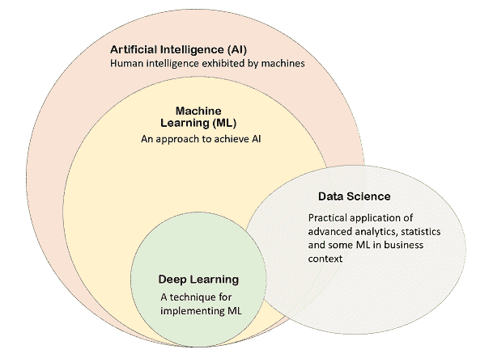

# 你的人工智能职业道路完全指南

> 原文：<https://medium.com/analytics-vidhya/your-complete-guide-to-ai-career-pathways-c6e0959c756a?source=collection_archive---------11----------------------->


Javier Allegue Barros 在 [Unsplash](https://unsplash.com?utm_source=medium&utm_medium=referral) 上拍摄的照片

*本文原载于我的* [***ML 博客***](https://towardsml.com/) ***。***

那么多的困惑，那么多关于人工智能职业的疑惑和问题！在决定职业道路时，缺乏明确性真的很有压力。我决定一劳永逸地解决这些问题，而不是继续回答个别问题。开发一个人工智能项目涉及各种技术角色和任务。让我们揭开它们的神秘面纱吧！

在这篇文章中，我们将讨论以下内容:

1.  人工智能项目中的角色和任务。
2.  理解人工智能生命周期中任务的来龙去脉。
3.  理解人工智能生命周期中角色的来龙去脉。
4.  职业领域(谁在招聘人工智能角色、人工智能分支和未来展望)。
5.  学习资源。

# 1.人工智能项目中的角色和任务

开发一个人工智能项目不是一个人的专长。它涉及各种不同的任务和角色。这意味着人工智能团队包括专注于产品生命周期不同部分的个人:


以下是主要技术角色及其与开发周期中任务的关系的可视化表示:

```
Legend: 
🟩 Primary tasks for that role. 
🟨 Secondary tasks: things they do at times; don't need to be proficient at them. 
🟥 Tasks not needed for that role.
```

请注意:

*   维持一个成功的人工智能团队所需的角色的确切数量根据项目的大小和规模而变化。并非所有的团队都需要将人员分配到所有上述技术角色。例如，人工智能团队通常不需要内部研究人员。
*   此外，这些角色和任务之间的确切界限可能因公司而异。例如，一些团队可能有应用科学家和数据科学家，而其他团队可能有 ML 工程师和数据科学家；一些公司可能同时拥有数据分析师和数据科学家，而另一些公司可能只雇佣具有强烈商业头脑的数据科学家，而不雇佣数据分析师。**这些界限往往很模糊，尤其是在初创公司。**

# 但是先来点基础的！

在深入了解更多细节之前，让我们先快速确认一下我们对基本原理有一个清晰的了解:



# 2.人工智能生命周期中任务的来龙去脉

## **一、数据工程**

**任务描述:**准备数据(从各种数据库中输入)，并将其转换为 AI 生命周期中其他人(如分析师和数据科学家)可以轻松使用的格式。

**所需技能:**编码和软件工程技能，广度根据项目的规模而变化。

**使用的工具:**SQL 等数据库查询语言和 Python、C#、Java 等面向对象编程语言。Apache Spark 等大数据工具也是常用的。

## **二世。建模**

**任务描述:**根据用例，在数据中寻找模式来帮助企业进行决策和/或自动化流程。例如，房地产模型可以用来预测房屋的销售价格，而计算机视觉模型可以用来在制造过程中自动检测有缺陷的项目。

**所需技能:**数学、数据科学、机器学习。

**使用的工具:**常用的有 Python，TensorFlow，PyTorch。

## **三。部署**

**任务描述:**让 AI 解决方案对终端用户可用——将数据与模型结合，将端到端的解决方案投入生产。

**所需技能:**强大的编码和后端工程技能，能够编写健壮且可伸缩的产品代码。

**使用的工具:**Python、C#、Java 等面向对象的编程语言，Azure、AWS 等云技术。

## **四。商业分析**

**任务描述:**评估已部署模型的性能及其对业务的影响。例如，用户的点击数据可以用来评估推荐模型的性能，并了解它是否提供了预期的商业价值。

**所需技能:**商业敏锐度、数据分析科学、强大的沟通和数据展示技能。

**使用的工具:**Excel、PowerPoint、Power BI、A/B 测试软件等演示和分析工具。有时可能需要 Python 之类的编程语言。

## **五、AI 基础设施**

**任务描述:**构建和维护可靠、快速、安全、可扩展的软件基础设施，使 AI 开发周期中的所有组件都可用。例如，YouTube 基础设施需要能够以无缝的方式处理每天 50 亿个视频的观看！

**所需技能:**较强的软件工程技能。

**使用的工具:**Python、Java 或 C#等面向对象的编程语言和 Azure、AWS 等云技术。

## **六。研究**

**任务描述:**深入研究特定的研究领域/问题，以提高当前的最先进水平为目标，了解该领域的最新发展，并发表论文。

**所需技能:**强大的分析和批判性思维、写作技巧、毅力、专注等等！

**使用的工具:**学术出版物、Arxiv、Twitter 等渠道和 NeurIPS、ICLR、ACM 等会议，以保持最新。用于建模的 Python、PyTorch 和/或 TensorFlow。

# 3.人工智能生命周期中角色的来龙去脉

## **一、软件工程师**

这个角色需要从事数据工程和核心基础设施工作。这意味着需要很强的编码和软件工程技能，如算法和分布式系统的知识。

## **二。数据科学家**

这个角色需要处理数据工程、建模和业务分析任务。所需的技能水平，例如工程设计的广度和深度以及所需的商业敏锐度，会根据整个团队的组成(以下几个角色的描述将使这一点更加清晰，特别是参见*“应用科学家与数据科学家”*)和项目的规模而有所不同。

## **三。ML/AI 工程师**

这个角色需要执行数据工程、建模、部署和人工智能基础设施任务。这是一个多功能的角色，可以看作是*软件工程师+数据科学家*的组合，具有比数据科学技能更强的工程技能。

## **四。应用科学家**

这个角色是*软件工程师+数据科学*组合的另一个变种。

***ML/AI 工程师 vs 应用科学家:*** 相比 ML/AI 工程师，应用科学家更看重数据科学技能而非软件工程。

***数据科学家 vs 应用科学家:*** 在既有数据科学家又有应用科学家的团队中，应用科学家更倾向于处理更高级的 ML 概念(深度学习)，而数据科学家很可能是商业敏锐度更强的人。

## **五、数据分析师**

这个角色是关于数据工程和业务分析任务的工作。然而，与处理数据工程的其他角色不同，数据分析师不需要适当的编码和软件工程技能——他们的任务可以使用查询语言(如 SQL)和交互式工具(如 Power BI 和 Excel)来完成(详见*“业务分析”*任务下的“所需技能和使用的工具】)。

## **六。AI/ML 研究员**

研究人员非常注重利用他们强大的科学技能进行建模。他们致力于改进现有的最先进的模型。在行业环境中，他们为人工智能开发周期中的其他人(如数据和应用科学家)提供指导，说明如何改进当前的解决方案并利用人工智能进行创新。

# 4.职业领域

## a.谁在招聘人工智能角色

**科技巨头**如*微软、谷歌、亚马逊、脸书、网飞、IBM、优步*等都是这个领域的最佳工作地点，因为除了从事尖端技术的工作，你还可以从事直接影响数十亿最终用户的产品:

*Cortana、Alexa、Google Translator、Power Point Designer、Outlook 和 Gmail 中的智能回复和智能撰写、YouTube 和网飞推荐、人脸识别、你可能认识的人、你可能喜欢的页面、食物配送估计、朋友建议、Feed 排名，等等。*

然而，人工智能的应用如此多样，以至于几乎每个行业都在拥抱人工智能，并在各自的垂直领域招聘人才。让我们看看一些不太明显的领域及其对人工智能的使用:

*   **金融:**欺诈检测、预测以及以人类无法与之竞争的速度和数量执行交易。
*   **医学**:医学诊断、药物发现、了解大群体疾病的风险因素、辅助全科医生的专家系统、重症监护室的监测和控制、假肢设计。
*   **机器人学**:视觉控制，运动控制，学习，合作行为。
*   **工程**:故障诊断、预测维护、智能控制系统、智能制造系统。
*   **营销**:更有针对性、相关性、及时性的营销方案。
*   **在线客服:**聊天机器人代替客服代表。
*   太空:美国宇航局使用人工智能来帮助计划和安排航天飞机的维护。
*   **军事活动:**巨额资金涌入这里，但详细情况属于机密信息！

## b.人工智能的分支

从上面的例子中我们可以看到，人工智能的应用可以非常多样。为了更好地说明这一点，下面是人工智能分支的概述:


此外，这里有一些来自麦肯锡研究的真知灼见，让你知道哪些**行业需要关注**:


# 5.学习资源

在这一点上，你应该能够为你想要的角色缩小工具和技能的范围。从这里开始，您应该能够找到许多相关资源，例如:

*   课程、训练营和认证
*   书
*   博客

## 书籍推荐

*   ***机器学习:*** [用 Scikit-Learn 和 TensorFlow 动手机器学习:构建智能系统的概念、工具和技术](http://amazon.com/Hands-Machine-Learning-Scikit-Learn-TensorFlow/dp/1491962291)
*   ***统计学:*** [数据科学家实用统计学:50 个必备概念](https://www.amazon.com/Practical-Statistics-Data-Scientists-Essential/dp/1491952962/ref=pd_lpo_14_t_2/132-5060356-4799760?_encoding=UTF8&pd_rd_i=1491952962&pd_rd_r=dec71062-d79a-45f3-8914-c653063c65d1&pd_rd_w=9svRJ&pd_rd_wg=ZTPax&pf_rd_p=7b36d496-f366-4631-94d3-61b87b52511b&pf_rd_r=QA1VKK3YZBZE0PDW8MRD&psc=1&refRID=QA1VKK3YZBZE0PDW8MRD)
*   **数据科学:**Python 数据科学手册
*   ***商业分析:*** [用数据讲故事:商业人士数据可视化指南](https://www.amazon.com/Storytelling-Data-Visualization-Business-Professionals-ebook/dp/B016DHQSM2/ref=sr_1_4?crid=18G0O5JU245FW&dchild=1&keywords=data+analysis&qid=1590283299&s=books&sprefix=data+ana%2Cstripbooks%2C256&sr=1-4)

## 在线课程

以下是一些很棒的在线课程和专业:

对于深入机器学习和深度学习，我强烈推荐**吴恩达**(斯坦福大学教授)在 *Coursera* 上的课程:

*   [机器学习](https://www.coursera.org/learn/machine-learning)
*   [深度学习专业化](https://www.coursera.org/specializations/deep-learning)
*   [AI 为医药专精](https://www.coursera.org/specializations/ai-for-medicine)

除了 Coursera， [**fast.ai**](https://www.fast.ai/) 也是学习深度学习的好地方。

为了以有趣和互动的方式学习 Python[](https://www.educative.io/courses/grokking-data-science)****中的数据科学，这里有一门深受您喜爱的课程！:)****

****不用说，那里有大量的资源。如果你想让我就某个特定领域提供进一步的建议(书籍/博客/课程)，请在评论中告诉我。****

# ****最后的想法****

****人工智能是一个相对较新且发展迅速的领域，所以可以理解会有很多困惑。我希望你觉得这个*简洁而全面的*指南很有帮助，并且你会对你想要追求的人工智能道路有一个更清晰的了解。同样，请阅读职位描述，并对你申请的公司/团队做一些调查，以了解他们的描述与哪个(些)角色相对应——不要只依赖头衔。****

****这种故障是**不容易找到的**，所以如果你发现这篇文章很有见地，**请与你的网络分享**它，以帮助我接触其他人，他们也会从中受益。谢谢！****

****最后但同样重要的是，请记住 ***无论你最终选择哪条道路，最重要的是你的职业选择要体现你的价值观。*******

*******祝前方旅途好运！*******

****P.S .除了 [**我的博客**](http://www.towardsml.com) 之外，我还会定期在 [**LinkedIn**](https://www.linkedin.com/in/samiakhalid/) 上发布有趣的 *AI 和工程*相关内容。如果对每周的短课感兴趣，欢迎你跟我去！****

# ****参考****

*   ****[https://www.deeplearning.ai/](https://www.deeplearning.ai/)****
*   ****[https://www . McKinsey . com/featured-insights/artificial-intelligence/notes-from-the-ai-frontier-applications-and-value-of-deep-learning](https://www.mckinsey.com/featured-insights/artificial-intelligence/notes-from-the-ai-frontier-applications-and-value-of-deep-learning)****
*   ****[https://www . neotalogic . com/2016/02/28/artificial-intelligence-in-law-the-state-of-play-2016-part-1/](https://www.neotalogic.com/2016/02/28/artificial-intelligence-in-law-the-state-of-play-2016-part-1/)****