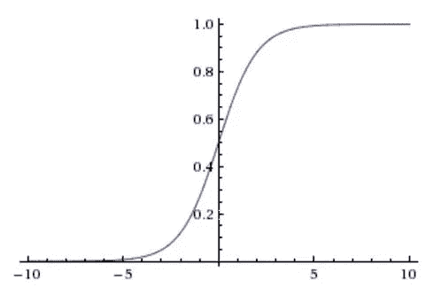
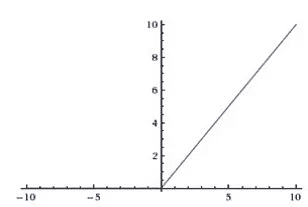
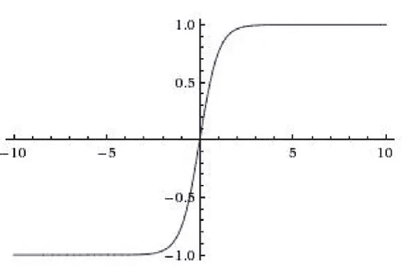

# 你最喜欢的激活功能。

> 原文：<https://medium.com/analytics-vidhya/your-favorite-activation-functions-c6fbe8e22b7b?source=collection_archive---------15----------------------->

大家好，我是 Debayo，今年的第一篇文章(我真的仍然觉得我的文章开头更适合播客和视频，而不是印刷品，但事实就是如此)

这篇文章将解释激活函数，是的，激活函数。

在我们进入主题本身之前，我想告诉你为什么激活函数是有用的，或者为什么激活函数已经成为开发深度学习模型的一个不可或缺的部分

让我们从这个角度开始，跟我来。

我以前用过这个迷因，但我懒得去找另一个

如果我们乘以 2 * 100，我们得到 200 对，如果我们决定乘以 5 * 20 * 2，我们得到 200，两者的唯一区别是一个比另一个贵？

同样的事情也适用于当我们建立线性的神经网络时，注意单词 T2 线性，我说的线性是指你的规则，wx + b = y，对我来说建立一个 2 层神经网络和一个输入层和输出层是很容易的，输入层和输出层包含输入层乘以权重，但是当我把它转换成一个多层网络时， 这是线性的(记住这个概念是基于网络的线性)，堆叠最基本形式的神经网络不会给它更多的能力，它只是两层网络的更昂贵的版本，输入层的任何变化都会直接影响隐藏层。

因此，要解决这个问题，这是一个问题，因为当你把线性层堆叠在一起时，没有真正的变化，不像把它作为一个单一的输入和输出模型，隐藏的层不允许选择或计算他们“想要”的东西，这对我们不利，这就是为什么它是一个问题，我们采用一种现象， Andrew Trask 称之为“有时关联”，就像名字一样简单，描述了隐藏层选择它决定关联的内容，隐藏层提供了以它认为合适的方式计算输出的机会，这种现象向神经网络引入了非线性，负责“有时关联”的实体是您的激活函数。

在本文中，我将介绍重要的激活函数，以及如何在神经网络中创建非线性，以及如何用 python 构建它们。

与我以前的文章相比，这篇文章将会很短(今年对我的期望更高！我不敢相信已经是二月了

所以基本上激活函数是应用于层中神经元的函数，引入非线性，基本上它接收输入并提供某种输出。它们应用数学变换并产生输出。如前所述，它们只是函数，可以非常容易地构建，但是并不是每个输出给定函数都可以用作激活函数，某些要求或约束限制了什么可以用作激活函数:

1.不管给定哪种输入，函数都必须给出某种形式的输出，你不应该给出某种没有输出值的数字形式。

2.激活函数必须是非线性的。如果不是，那就违背了当初创造它们的目的，不是吗？

3.激活函数也必须向一个方向移动，不是增加就是减少。将 x(输入)的多个值映射到 y(输出)的同一个值有点危险

4.激活功能也必须非常高效。你真的不希望它计算缓慢，因为你将在你构建的几乎每一层上调用它们。

现在，让我们看看最近在深度学习领域得到应用的激活函数的流行例子，我将写下其中的 4 个，也许还有一个(也许没有，哈哈)

重要的是要知道，利用一个激活而不是另一个激活取决于要解决的问题的类型，尤其是在事物的输出层方面。

我们今天将讨论的激活功能有

乙状结肠的

热卢

Tanh 和

Softmax

我们从头说起，先说乙状结肠。

Sigmoid 基本上将无限量的输入压缩到 0 和 1 之间。

乙状结肠人！！

正如我们在图中看到的，所有输入都有适合 1 或 0 的 Y 值。与正数相比，负数的输出更接近于 0，这意味着较大的数字更接近于 1，而较小的(负)值更可能接近于 0。

Sigmoid 主要用于隐藏层，但在处理二进制输出(0 或 1，只要记住向上取整)的问题时，可以在输出层找到表达式。

接下来，如果你阅读关于构建神经网络之类的在线文章，你会看到这个激活函数有一百万次了，你不会失序，这是因为 ReLU(校正线性单位)是我们现在拥有的最好的激活函数，这是因为它使收敛更快，计算成本低，不需要计算任何东西。

什么都不算？跟我来，伙计们

ReLU 所做的基本上是将任何负输入转换为零，并保持正数不变。

整流线性单元

从上面的图表中，它变得更加清晰，ReLU 是如何做它的事情的，所有的负值都变为零，而正值则保持不变。

所以任何时候你使用或看到 ReLU，我肯定你能解释它在做什么？

Tanh 是一个非线性函数，它压缩-1 和 1 范围内的值，这就是它的全部内容。

Tanh 乡亲

从图中可以看出，所有值的输出都在-1 和 1 之间。

最后一个激活函数是我们在输出层使用的，当我们执行多分类问题时使用，它的思想是概率，是的概率。

这个特殊激活函数的想法是，它将我们拥有的各种输出选项按概率排序。悬念够了，这个激活功能叫 Softmax。正如我前面提到的，这个激活函数在处理多个类的问题时使用，这意味着我们有两个以上可能的输出值。

举个例子，我们想对袋子里的球的颜色进行分类，在那个袋子里我们有 5 种不同的颜色，比如绿色、红色、蓝色、黑色和黄色。

如果我们的模型选择了一个球，softmax 可能会说这个球被染成黄色的概率是 0.87，蓝色的概率是 0.13 等等。这意味着根据我们的模型，球更有可能是黄色的，而不是在袋子里找到的其他颜色。

举一个更实际的例子，假设我们正在建立一个模型来检测图片中的对象，在我们的训练数据中，我们有汽车、摩托车(听说拉各斯州政府在该州禁止它们，现在人们骑着马去工作，这真是太棒了)，人类，交通灯等对象，最后还有坑洞(我们在尼日利亚有很多这样的东西)。

一旦我们训练了一个模型并挑选了一个标签，softmax 所做的就是给我们这个标签是人、物体、坑洞、汽车或摩托车的概率，并且具有最高概率分数的标签被视为该标签。

明白概率得分之和应该等于 1。

有道理是吗？

那是 softmax。

这就是我们将在本文中处理的所有激活函数。

我承诺每个激活功能的实现，这是它的家伙

[https://repl.it/@debayotomisin/null](https://repl.it/@debayotomisin/null)

我认为重要的是不要忽视激活函数在构建模型中的重要性，它们是模型的关键组成部分，在某种程度上决定了模型在训练过程中的方向。了解使用哪种函数与数据类型和您试图解决的问题类型相关，可以省去很多麻烦，让您成为更好的工程师。

我这边到下次都是这样。(我真的需要好好练习一下我的开场白和结束语)。

