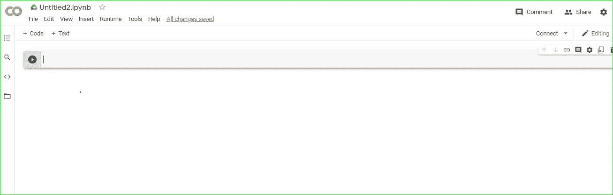
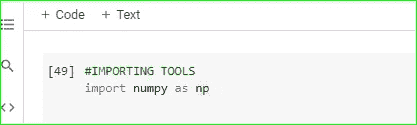
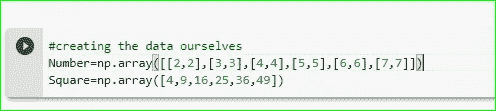
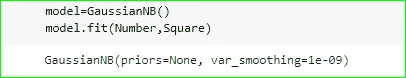
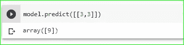
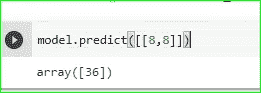

# 你的第一个机器学习项目

> 原文：<https://medium.com/analytics-vidhya/your-first-machine-learning-project-c9111ffaab58?source=collection_archive---------18----------------------->

嗯…我已经有一段时间没有写文章了，但是你猜怎么着？？？？

我回来帮你做你的第一个机器学习项目…

不要被机器学习的名字吓倒…这听起来很可怕，不是因为它本身，而是因为世界各地的宣传，认为这个领域是只有被选中的人才能从事的职业…所谓的智囊团和天生的才能…🙄🙄

你想知道我的想法吗..？

不，一点也不…这是一个任何人都可以从事的普通领域..男人……你只是说这个领域是一个次要领域，但如何？？？嗯嗯嗯……这就是我写这篇文章的原因……..为了让我所有的朋友让你熟悉机器学习，并帮助你做一个机器学习的小项目…咩咩😍

注意:它会很短，但会让你了解在这个领域中最常用的几个术语…

是的，我们正在使用 python……但是等等…等等…不要跑，我带你走过这条路…通过这篇文章，你将很容易学会所需的 python 双倍的咩咩..😂

你唯一需要做的就是和我一起去…

# **项目 1:用 ML 求数字的平方**

所以，伙计们，事情是这样的，对于一个机器学习项目……**你需要一个环境，我已经推荐你在第一步使用 google colab。**

**其他需求是训练数据、测试数据和算法**。不要担心，我们正在如此舒适地使用这些东西，当你继续下去的时候你会理解它们。如果你想更好地理解它，你可以看看我的另一篇文章，或者你现在可以跟着我的步骤走..

我的文章链接:[https://medium . com/@ anjanparajuli 2001/最简单易懂的机器学习-c95803b751d4？sk = E3 bcfc 0d 33 fc 39 a 322 B3 affd 971 c 35 CD](/@anjanparajuli2001/easiest-way-to-understand-machine-learning-c95803b751d4?sk=e3bcfc0d33fc39a322b3affd971c35cd)

**第一步:打开 GOOGLE COLAB**

 [## 谷歌联合实验室

### 编辑描述

colab.research.google.com](https://colab.research.google.com/) 

单击上面的链接并打开一个新笔记本。点击上面的链接后，你会很快整理出来，并知道如何在下面打开一个这样的新笔记本:

**第二步:导入所需工具**

你只需要在你的笔记本上写下我下面写的内容。

Numpy 只是一个用于数值计算的 python 库，但是不用担心，我们只是在做一个简单的数学运算。我们将用它来创建我们的数据。

**第二步:创建我们的数据**

我的朋友们，机器学习就像一个婴儿，使用不同的可用材料通过错误学习一些东西。在机器学习这里，宝宝是算法，数据是学习资料。因此，这里我们使用 numpy 创建我们的数据。

而算法需要学习的数据叫做训练数据。

**特征**是数据的特征，**标注**是我们提供给算法的正确结果。因为我们找到了数字的平方，我们给算法两次数字(**特征**)和正确的结果，即数字的乘法(**标签**)。算法必须自己找到公式。

只需键入我在下面写的内容。

这里，我们只是创建一个数字数组。你不需要在这里了解更多。

你要知道

> **数量=功能**
> 
> **正方形=标签**

**第 4 步:导入算法**

在这里，我们要生一个宝宝，在我们用学习材料学习之后，他会变得聪明。为你有了一个聪明的孩子而自豪😂😂。

> 算法=婴儿
> 
> 培训数据=学习材料

猜猜我们的宝宝叫什么名字

> **高斯贝叶斯解读为“高斯朴素贝叶斯”**

我们就是这样导入的:

**第 5 步:训练算法**

> **你知道吗？？恭喜各位，你们创造了第一个机器学习模型，虽然很小，但这是你们机器学习生涯的开始。😃**

这里，第一步**model = gaussianb**就像是把我们的宝宝从睡眠中唤醒。在技术术语中，它被称为实例化算法。

第二步 **model.fit(Number，Square)** 告诉我们的算法从给定的训练数据中学习，即特征和正确的结果。

算法会在训练后从数据中找到一个模式。为了检查它发现模式的正确程度，我们需要根据测试数据预测模型。

测试数据就像算法的试卷。它会根据测试数据进行预测，我们如下检查它是否预测正确:

**第 6 步:预测**

万岁。！！这个模型预测的数字是正确的。3 的平方是 9。

等等，等等..等待..它正确地预测所看到的数字，但是如果我们检查除了我们之前没有输入到算法中的数字之外的其他数字会怎样呢？

哎呀！！！它预测错误，因为该算法使用非常少的数据进行训练。我们为它提供了大约 7 个数据，但在现实世界中，我们用数百万个数据或至少数千个数据对它进行培训。所以，数据越多，模型就越好。

是的如果你和测试数据混淆了。测试数据是我们用来检查我们的模型是否运行良好的数据。因此，为此，我们应该使用以前没有提供给算法的数据进行训练。

因此，机器学习就是创造好的数据，训练正确的算法，得到最好的预测和上述步骤的反馈回路。

所以，朋友们，我真的希望你们能从本文中获得一些关于机器学习的知识。如果有任何问题，您可以在评论部分提问。

谢谢，祝你生活平安健康。下一篇文章再见。