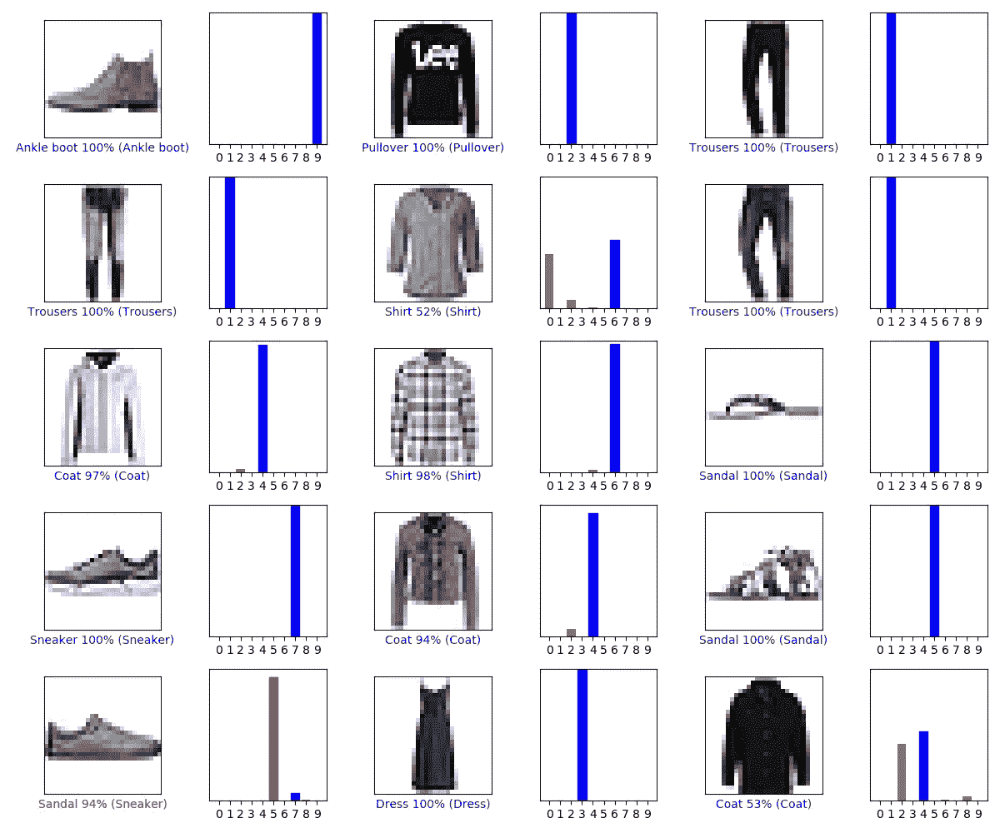

# 你的第一个 Python 机器学习模型

> 原文：<https://medium.com/analytics-vidhya/your-first-python-machine-learning-model-e09868458204?source=collection_archive---------38----------------------->

> 当我为一个项目创建我的第一个机器学习模型时，很难找到清晰的代码和解释。因此，我将向您展示一个简单的图像分类模型，您可以尝试并开始探索机器学习可以为您提供什么。

我们将使用 Python 作为编程语言，因为它有大量与数据科学相关的库和文档。为了让我们自己更容易，我们使用 TensorFlow，这是大多数机器学习的一个强大而简单的工具。对于一些简单的数字运算，我们需要 Numpy。为了制作一些漂亮的图形，我们使用 Matplotlib。

## **让我们开始编码**

我使用 Python 3 和 TensorFlow 2.2。两者目前都是最新的。你可以从其他作者那里找到关于如何 *pip 安装*库的在线教程。我建议使用虚拟环境。

我们的程序需要做的第一件事是导入我们使用的库。

```
import tensorflow as tf
from tensorflow import kerasimport numpy as np
import matplotlib.pyplot as plt
```

然后，下载我们需要的数据来训练我们的图像分类模型。将来你可能会想使用你自己的数据，但现在我们将坚持使用一个容易访问的数据集:时尚 MNIST。这个数据集由 10 种衣服的 60，000 个标记的训练图像和 10，000 个标记的测试图像组成。我们可以使用下面一行代码下载这些数据。

```
(train_images, train_labels), (test_images, test_labels) = keras.datasets.fashion_mnist.load_data()
```

在训练和测试我们的模型之前，我们必须对这些数据进行一些更改。首先，我们给不同的标签分配类名。这对于电脑来说是不必要的，但是对于我们自己来说，读真实的名字更容易，比如“衬衫”,而不是像第 8 类这样的数字。之后，我们需要调整图像像素的值。在标准的*黑&白*图像中，像素值在 0 到 255 之间，其中 0 表示全黑，255 表示全白。对于我们的*神经网络*所做的计算，像素值最好在 0 和 1 之间。因此，我们将这些值除以 255。

```
class_names = ['T-shirt/top', 'Trousers', 'Pullover', 'Dress', 'Coat', 'Sandal', 'Shirt', 'Sneaker', 'Bag', 'Ankle boot']train_images = train_images / 255.0test_images = test_images / 255.0
```

接下来，我们绘制一些图像来检查它们是否正确导入以及标签是否正确。由于本指南更多的是关于机器学习的，所以我不会详细讨论这个问题。

```
plt.figure(figsize=(10,10))
for i in range(25):
   plt.subplot(5,5,i+1)
   plt.xticks([])
   plt.yticks([])
   plt.grid(False)
   plt.imshow(train_images[i], cmap=plt.cm.binary)
   plt.xlabel(class_names[train_labels[i]])
plt.show()
```


第一个情节应该是这样的

有趣的部分现在开始。我们要创造我们的模型。我之前提到过，模型是一个*神经网络*。网络的第一层的神经元数量与每幅图像中的像素数量一样多。在这种情况下，图像是 28x28 像素，我们称之为输入形状。这一层有关键字 *flattten* 来表示这个二维数组像一维数组一样，这在进行计算之前是必要的。那么这些值必须通过网络的隐藏层。在这种情况下，隐藏层有 128 个神经元。这些层被称为密集层，因为这一层的每个神经元都与前一层的每个神经元相连。对于像这样的模型，这似乎是显而易见的，但其他一些网络结构使用不同的连接。我们还声明所使用的*激活函数*被称为 *relu* 。在这个阶段，知道这个是最常用于图像分类的就足够了。然后我们创建最后一层。*神经元*的数量应与图像类别的数量相对应。在这种情况下，我们有 10 个不同的类别，所以最后一层有 10 个*神经元*。

```
model = keras.Sequential([
   keras.layers.Flatten(input_shape=(28, 28)),
   keras.layers.Dense(128, activation='relu'),
   keras.layers.Dense(10)
])
```

完成程序后，你可以四处走动，玩不同的*隐藏层。*您可以简单地添加带有*密集层*的另一行，或者更改*神经元*的数量，或者，如果您变得更高级，可以在 TensorFlow 文档中查找其他模型结构和激活函数。您应该将过度拟合考虑在内，因为如果模型对您的训练数据太好，一般的识别特征就会丢失，从而使测试数据的结果变得更糟。

现在让我们继续并完成模型。我们必须编译这个模型。我们添加了一个*优化器*，它基本上是进行训练的算法。现在，就像*激活功能*一样:不用太担心。然后我们加上*损失函数*。这个函数测量模型在准确性度量方面做得有多好，这在下一行中陈述。这意味着模型以更高的精度做得更好。

```
model.compile(optimizer='adam',loss=tf.keras.losses.SparseCategorica  lCrossentropy(from_logits=True), metrics=['accuracy'])
```

既然我们已经建立了模型，我们可以训练它。因此，使用训练图像和标签。*时期数*是您用训练数据训练模型的次数。同样，由于*过度配合*，您不应该将此设置得太高。

```
model.fit(train_images, train_labels, epochs=10)
```

下一步是打印精度。您可以使用 model.evaluate 和测试数据来实现这一点。

```
test_loss, test_acc = model.evaluate(test_images,  test_labels,
   verbose=2)print('Test accuracy:', test_acc)
```

我们终于可以展示我们最漂亮的地块了。在第一行中，我们使用 *Softmax。Softmax 确保所有的输出加起来等于 1，这样我们就可以把输出解释为一个概率。因此，该图将显示模型认为某个图像是某个类别的一部分的概率。*

我将不会去考虑其余的策划，同样的原因，我没有早些时候。

```
probability_model = tf.keras.Sequential([model,
   tf.keras.layers.Softmax()])predictions = probability_model.predict(test_images)def plot_image(i, predictions_array, true_label, img): predictions_array, true_label, img = predictions_array,
   true_label[i], img[i] plt.grid(False)
   plt.xticks([])
   plt.yticks([]) plt.imshow(img, cmap=plt.cm.binary)
   predicted_label = np.argmax(predictions_array)
   if predicted_label == true_label:
      color = 'blue'
   else:
      color = 'red'plt.xlabel("{} {:2.0f}% ({})".format(class_names[predicted_label],
                              100*np.max(predictions_array),
                              class_names[true_label]),
                              color=color)def plot_value_array(i, predictions_array, true_label):
   predictions_array, true_label = predictions_array, true_label[i]
   plt.grid(False)
   plt.xticks(range(10))
   plt.yticks([])
   thisplot = plt.bar(range(10), predictions_array, color="#777777")
   plt.ylim([0, 1])
   predicted_label = np.argmax(predictions_array) thisplot[predicted_label].set_color('red')
   thisplot[true_label].set_color('blue')num_rows = 5
num_cols = 3
num_images = num_rows*num_cols
plt.figure(figsize=(2*2*num_cols, 2*num_rows))
for i in range(num_images):
   plt.subplot(num_rows, 2*num_cols, 2*i+1)plot_image(i,
     predictions[i], test_labels, test_images)
   plt.subplot(num_rows, 2*num_cols, 2*i+2)
   plot_value_array(i, predictions[i], test_labels)
   plt.tight_layout()
plt.show()
```



第二个情节应该是这样的

正如你在上面的图片中看到的，大多数条形图是蓝色的。这意味着大多数预测是正确的。条形的高度显示了模型对正确答案的确定程度。图片下面是带有确定性的预测，括号里是真实的标签。我们看到在左下角，模型犯了一个错误。模特非常确定图像中有一只凉鞋，但它是一只运动鞋。我们还没有创造出一个完美的模型，但是准确率远远超过 90%，我们可以为你的第一个机器学习程序感到自豪。

> N 扩展开来，你可以了解关于*卷积神经网络*和更多的一切。他们甚至更强大。要学的东西太多了。

现在，您已经用不到 100 行代码创建了第一个机器学习程序。当然，还有很多东西要学，而这仅仅是开始。在实践中，你可能不得不处理所有不同类型的数据和模型，这使得程序更复杂更快。我希望能帮助你激发对机器学习的兴趣。

注意:您可以随意使用这段代码。我使用了弗朗索瓦·乔莱对张量流的基本分类的修改版本。