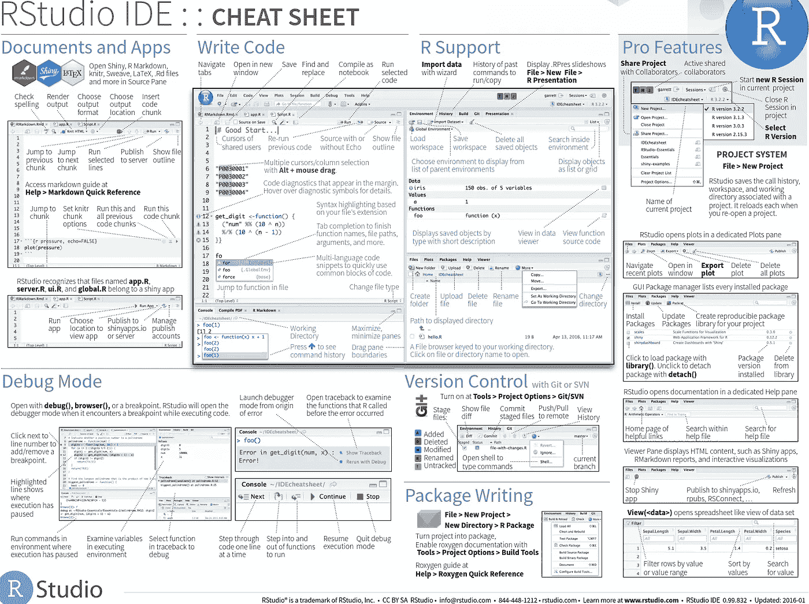

# 您的首次公开募股

> 原文：<https://medium.com/analytics-vidhya/your-first-time-opening-rstudio-cdef8dc8f4b2?source=collection_archive---------30----------------------->

RStudio 是一个为 R 编程而构建的集成开发环境。理解一个工具是有效使用它的最好方法。对我们来说幸运的是，RStudio 非常方便用户

在我们开始之前，如果需要，您可以随时使用 R 控制台。要打开它，您可以在计算机中搜索您的 R.exe 应用程序。一旦打开，它应该看起来像下图。如果您还没有安装 R 或 RStudio，请查看其他[教程](/@bcooked/how-to-install-r-and-rstudio-in-2020-230225027857)。

现在您已经了解了 R 控制台，让我们切换到 rstu 迪奥。当您第一次打开 RStudio 时，您会看到类似下图的内容。

在我解释每个部分之前，请单击 rstu 迪奥左上方的文件-新文件-R 脚本。或者，您可以输入 Ctrl+Shift+N 打开一个新的 R 脚本。这将打开一个新的部分，显示您当前正在处理的文件。RStudio 总共有 4 个主要部分。

下表总结了每个主要部分。

RStudio 还提供了许多有用的备忘单。您可以通过单击“帮助”(屏幕顶部)—数据表来找到它们。与本文相关的是下面显示的 RStudio IDE 备忘单。单击此处搜索所有 rstu 迪奥备忘单。

干杯！