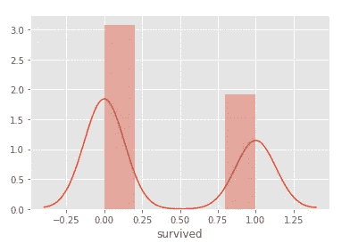
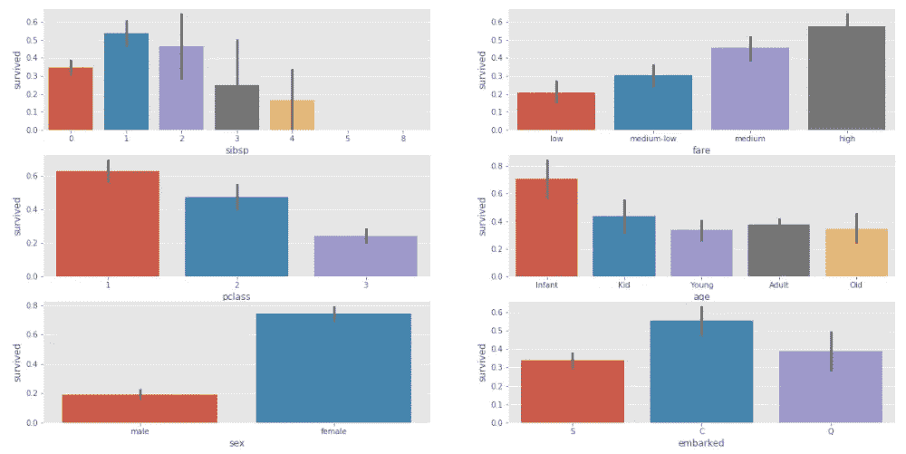

# 泰坦尼克号数据集的逻辑回归指南

> 原文：<https://medium.com/analytics-vidhya/your-guide-for-logistic-regression-with-titanic-dataset-784943523994?source=collection_archive---------1----------------------->


朱莉·科索拉波娃在 [Unsplash](https://unsplash.com?utm_source=medium&utm_medium=referral) 上的照片

N ext 我们要说的机器学习算法是 ***logistic 回归*** (也叫 Sigmoid 函数)。当我写下的时候，我会学到更多，像你一样。所以，我们来一趟逻辑回归，多标记一个算法为 **DONE** ！

> 在统计学中，逻辑模型(或 logit 模型)用于模拟某个类别或事件存在的概率，如通过/失败、赢/输、活着/死了或健康/生病。

维基百科是这样解释的。看起来很简单，对吧？这个模型的目的是给我们 0 或 1。该模型预测一个介于 0 和 1 之间的值，该值显示了这种情况的概率。

***逻辑回归不预测连续值。逻辑回归预测某事是真是假*** 。

我们来看一个例子。事实上，这是一个非常著名的例子。泰坦尼克号数据集。你有不止一个特征，通过逻辑回归你可以预测他们是否死亡。如果模型预测的值是 0.79，这意味着这个人 79%活着，21%死了。

**当概率大于等于 0.5 时，二进制值为 1，当概率小于 0.5 时，二进制值为 0。所以，我上面提到的人将被归类为 1，活着。模型返回 1(真)。**

逻辑回归图看起来像介于 0 和 1 之间的“S ”,如下所示:


[https://machine learning mastery . com/logistic-regression-for-machine-learning/](https://machinelearningmastery.com/logistic-regression-for-machine-learning/)

**曲线表示一个案件的概率**。

看起来类似于线性回归，但事实上，它不是。线性回归是一种预测算法。另一方面，逻辑回归是一种分类算法。线性回归算法使用最小二乘法来拟合数据的最佳直线，但逻辑回归不能使用该方法。所以，它需要另一个。逻辑回归使用 ***【最大似然】*** 来拟合数据的最佳直线。

## 什么是最大可能性？！

> 最大似然估计涉及将问题视为优化或搜索问题，其中我们寻求一组参数，这些参数导致最适合数据样本的联合概率( *X* )。

我会保持简单。我不会用华丽的词语来形容它。我会按照我的理解来写。它在泰坦尼克号数据集上计算一个人活着的可能性，然后另一个，然后另一个，在所有计算结束后，模型乘以所有这些可能性，*将 S 形线拟合到数据*。**不断计算，直到找到最佳的 S 形线。**

想了解更多可以看看这篇文章。

[](https://machinelearningmastery.com/what-is-maximum-likelihood-estimation-in-machine-learning/) [## 机器学习的最大似然估计的温和介绍-机器学习…

### 密度估计是从一个样本中估计一个观察值的概率分布的问题

machinelearningmastery.com](https://machinelearningmastery.com/what-is-maximum-likelihood-estimation-in-machine-learning/) 

或者，你可以看这个视频。

现在，我们将在 Titanic 数据集上实现逻辑回归。我们也不确定这种算法是否是该数据集的最佳匹配，但我们会一起找出答案。

数据集可通过 Seaborn 图书馆获得。如果您还没有安装 Seaborn 库，您可以在命令行中安装:

```
pip3 install seaborn **# check Seaborn documentations for details**
```

现在，我们可以导入我们的库:

```
import pandas as pd
import matplotlib.pyplot as plt
import seaborn as sns
from seaborn import load_dataset **# this method will help us to #download the Titanic dataset**
%matplotlib inline **# if you use jupyter notebook**
plt.style.use('ggplot') **# check for more with plt.style.available**
```

正在下载数据集:

```
data = load_dataset("titanic")
data
```


在上面的代码之后，您必须看到类似这样的内容。如果一切正常，你应该知道这不仅仅是一篇文章，我们将只使用逻辑回归。我们首先清理数据，然后将其可视化，然后将实现逻辑回归。

```
data.info()
```


如您所见，我们在“年龄”、“上船”、“甲板”、“上船 _ 城镇”列中有空值。我们将放弃其中一些，并处理其余的。

某些列具有相同的值，但值类型或名称不同。比如‘谁’、‘性’、‘成人 _ 男性’。我不想他们出现在我的模型里。

```
columns = ['alive', 'alone', 'embark_town', 'who', 'adult_male', 'deck']
data_2 = data.drop(columns, axis=1)
```

“列”列表包含我要从数据集中删除的名称。“drop”方法将删除它们。axis=1，意味着我们希望 as 列被删除。

***我把我的新数据集赋给另一个变量。如果需要，可以使用“inplace = True”对原始数据进行永久更改。***

```
data_2.describe(include='all').T
```


```
print(f"Max value of age column : {data_2['age'].max()}")
print(f"Min value of age column : {data_2['age'].min()}")
>> Max value of age column : 80.0
>> Min value of age column : 0.42
```

我们可以用 0 到 80 之间的值对年龄列进行分类。

```
bins = [0, 5, 17, 25, 50, 80]
labels = ['Infant', 'Kid', 'Young', 'Adult', 'Old']
data_2['age'] = pd.cut(data_2['age'], bins = bins, labels=labels)
```

熊猫的‘切’法会让我们做出自己的分类。

```
pd.DataFrame(data_2['age'].value_counts())
```


Wola！我们可以看到成年人占大多数。

“年龄”列中仍有空值。

```
data_3['age'].mode()[0]
>> 'Adult'
```

我们可以用该列的模式填充空值。这是一个选择，这就是我要做的！

```
data_4 = data_3.fillna({'age' : data_3['age'].mode()[0]})
```

我们已经完成了“年龄”一栏。是啊！“登上”专栏的时间到了。

```
data_2['embarked'].unique()
>> array(['S', 'C', 'Q', nan], dtype=object)
```

我们的‘上船’栏目显然包含‘S、C、Q’和‘nan’。

```
print(f"How many 'S' on embarked column : {data_2[data_2['embarked'] == 'S'].shape[0]}")
print(f"How many 'C' on embarked column : {data_2[data_2['embarked'] == 'C'].shape[0]}")
print(f"How many 'Q' on embarked column : {data_2[data_2['embarked'] == 'Q'].shape[0]}")
>> How many 'S' on embarked column : 644
>> How many 'C' on embarked column : 168
>> How many 'Q' on embarked column : 77
```

看起来我们可以使用这个列的模式来填充 nan 值。

```
data_3 = data_2.fillna({'embarked' : 'S'})data_4[['pclass', 'survived']].groupby(['pclass']).sum().sort_values(by='survived')
```


```
data_4[['sex', 'survived']].groupby(['sex']).sum().sort_values(by='survived')
```


```
bins = [-1, 7.9104, 14.4542, 31, 512.330]
labels = [’low’, 'medium-low’, 'medium’, 'high’]
data_4[’fare’] = pd.cut(data_4["fare"], bins = bins, labels = labels)
```

我们也可以对票价列进行分类，就像上面的代码一样。


我们数据集的最终版本。

我们也应该删除“class ”,因为它与 pclass 相同，而 pclass 已经是数字。

```
data_5 = data_4.drop('class', axis=1)sns.distplot(data_5['survived'])
```



```
plt.figure(figsize=(20, 10))
plt.subplot(321)
sns.barplot(x = 'sibsp', y = 'survived', data = data_5)
plt.subplot(322)
sns.barplot(x = 'fare', y = 'survived', data = data_5)
plt.subplot(323)
sns.barplot(x = 'pclass', y = 'survived', data = data_5)
plt.subplot(324)
sns.barplot(x = 'age', y = 'survived', data = data_5)
plt.subplot(325)
sns.barplot(x = 'sex', y = 'survived', data = data_5)
plt.subplot(326)
sns.barplot(x = 'embarked', y = 'survived', data = data_5);
```



现在，机器学习模型**讨厌**非数值。我们不能把它们放到我们的训练和测试数据中。我们需要将它们转换成数值。你有两个选择:标签编码器，和熊猫 get_dummies 方法。这个我就不细说了。我将使用 get_dummies。

```
dummies = ['fare', 'age', 'embarked', 'sex']
dummy_data = pd.get_dummies(data_5[dummies])
```

让我们把它打开一点。“dummies”包含我们要转换成数值的列名。它们中的每个变量都将成为一列，它们的缺失将被定义为 0，和 1，不管它们对那个乘客是否为真。

```
dummy_data.shape
>> (891, 10)
```

我们将连接两个数据框，并删除旧的列。

```
data_6 = pd.concat([data_5, dummy_data], axis = 1)
data_6.drop(dummies, axis=1, inplace=**True**)
```

现在我们有 891 行，18 列。我们准备好建立我们的模型。

```
from sklearn.model_selection import train_test_split
from sklearn.linear_model import LogisticRegression
from sklearn.metrics import accuracy_score, confusion_matrix
```

因为我们为我们的模型导入了必要的库，所以我们准备好了。

```
X = data_6.drop('survived', axis = 1)
y = data_6['survived']
X_train, X_test, y_train, y_test = train_test_split(X, y, test_size = 0.33, random_state = 0)**# X contains independent values, y contains dependent value**
```

模型构建:

```
log_reg = LogisticRegression()
log_reg.fit(X_train, y_train)
y_pred = log_reg.predict(X_test)
y_pred
```

y_pred 长这样:

```
array([0, 0, 0, 1, 1, 0, 1, 1, 0, 1, 0, 1, 0, 1, 1, 1, 0, 0, 0, 1, 0, 1,
       0, 0, 1, 1, 0, 1, 1, 1, 0, 1, 0, 0, 0, 1, 0, 0, 0, 0, 0, 0, 0, 0,
       1, 0, 0, 1, 0, 0, 0, 0, 1, 0, 1, 0, 0, 0, 0, 0, 0, 1, 1, 1, 1, 0,
       1, 0, 1, 1, 1, 0, 0, 0, 0, 1, 0, 1, 0, 0, 0, 0, 1, 0, 0, 1, 1, 0,
       1, 0, 0, 0, 1, 1, 0, 0, 1, 0, 0, 1, 0, 0, 0, 0, 1, 1, 1, 0, 0, 1,
       0, 1, 0, 1, 0, 1, 1, 1, 0, 1, 0, 0, 0, 0, 0, 0, 0, 0, 0, 0, 1, 0,
       0, 0, 0, 0, 0, 1, 0, 0, 0, 1, 0, 1, 1, 1, 0, 1, 1, 0, 0, 1, 1, 0,
       1, 0, 1, 0, 1, 1, 0, 0, 1, 0, 0, 0, 0, 0, 0, 0, 0, 1, 0, 0, 1, 0,
       1, 0, 0, 1, 0, 0, 0, 0, 0, 0, 1, 0, 0, 1, 0, 0, 1, 1, 0, 0, 0, 1,
       0, 0, 0, 1, 0, 1, 0, 0, 1, 0, 1, 0, 0, 0, 0, 1, 0, 0, 0, 0, 0, 1,
       0, 1, 1, 0, 0, 0, 0, 1, 0, 0, 0, 1, 1, 1, 0, 0, 1, 1, 1, 0, 0, 1,
       0, 0, 1, 0, 1, 0, 0, 1, 0, 0, 0, 0, 0, 1, 1, 0, 0, 0, 0, 0, 0, 0,
       0, 0, 1, 1, 0, 1, 0, 0, 1, 0, 0, 0, 0, 0, 1, 1, 0, 1, 0, 1, 0, 0,
       0, 0, 0, 0, 0, 0, 1, 1, 1])
```

我们可以检查我们的模型的准确性分数。

```
accuracy_score(y_pred, y_test)
>> 0.8067796610169492
confusion_matrix(y_pred, y_test)
>> array([[158,  31],
          [ 26,  80]])**# 31 + 26 = 57 wrong prediction**
```

说实话，不好看。我们可以做得更好。我们可以为这个数据集尝试不同的模型。但是这篇文章是关于逻辑回归的。就像我之前说的，我们不知道逻辑回归是否是泰坦尼克号数据集的正确选择。如果你已经做了很长时间，你可能会。但我没有。

**好消息是，现在您知道了逻辑回归算法，以及如何实现它！**

[](https://machinelearningmastery.com/what-is-maximum-likelihood-estimation-in-machine-learning/) [## 机器学习的最大似然估计的温和介绍-机器学习…

### 密度估计是从一个样本中估计一个观察值的概率分布的问题

machinelearningmastery.com](https://machinelearningmastery.com/what-is-maximum-likelihood-estimation-in-machine-learning/) [](https://machinelearningmastery.com/logistic-regression-for-machine-learning/) [## 机器学习的逻辑回归-机器学习掌握

### 逻辑回归是机器学习从统计学领域借用的另一种技术。它是最受欢迎的…

machinelearningmastery.com](https://machinelearningmastery.com/logistic-regression-for-machine-learning/)