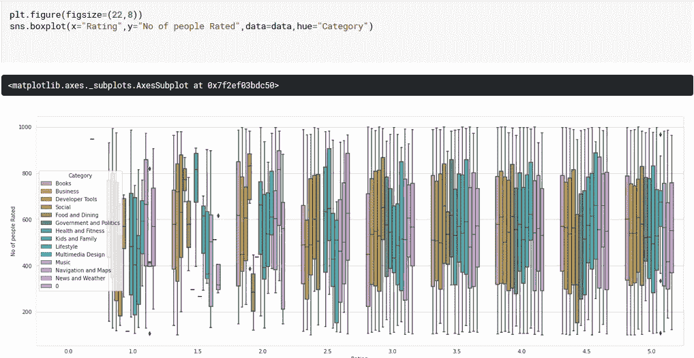

# 你的数据分析指南

> 原文：<https://medium.com/analytics-vidhya/your-guide-to-data-analysis-7b3b505d444c?source=collection_archive---------22----------------------->

对于本指南，我将使用你可以在 Kaggle 上找到的 windows store dateset。

这个数据集是微软 Windows 商店中应用程序的数据，该数据包含**应用程序的名称、评级、类别、日期和价格**

# 准备笔记本

让我们从导入必要的库开始。

我们需要 numpy，熊猫，matplotlib 和 seaborn 的 pyplot。

**plt** 。 **show()** 启动事件循环，查找所有当前活动的人物对象，并打开一个或多个显示人物的交互式窗口。

**SNS . set _ style(" white grid ")**用于设置地块的美学风格。

**%matplotlib inline** 是一个神奇的函数，它在笔记本中呈现图形(而不是显示图形对象的转储)。

接下来，我们将读取 csv 文件并将其放入数据帧中，这可以使用 pandas 轻松实现。

现在一切都准备好了，让我们开始数据分析。

# 对列中的值进行计数:

我们要做的第一件事是显示数据集中所有的当前价格，并显示有多少应用程序具有每种价格。

结果对象将按降序排列，因此第一个元素是出现频率最高的元素(在我们的例子中是“Free”)。默认情况下排除 NA 值。

现在让我们来看一下我们专栏的摘要。

**info()函数**用于打印**数据帧**的简明摘要。该方法打印关于**数据帧**的**信息**，包括索引数据类型和列数据类型、非空值和内存使用情况。

# 查找缺失的值:

知道每一列中 NaN 值的数量是一个很好的实践，因为当一列有太多的 NaN 值时，最好将其删除。

该函数将显示每列中 NaN 值的数量。

我们可以通过用某个值替换它们来去掉丢失的值(一个很好的例子是用相应列中的平均值来填充它们)。在我们的例子中，我们只使用 0 来填充它们:

*data.fillna(0，inplace=True)*

# 配对图:

pairplot 函数将绘制数据集中的成对关系。

默认情况下，该函数将创建一个轴网格，这样`data`中的每个数值变量将在 y 轴的一行中共享，在 x 轴的一列中共享。对角轴被区别对待，绘制一个图来显示该列中变量的数据的单变量分布。

*PLT . fig(figsize =(10，10))
sns.pairplot(data，hue="Category")*

**plt.figure** 创建一个新的图形，或者激活一个已有的图形，执行上面的单元格会给出以下结果:

# 接合图:

此函数将使用二元和一元图形绘制两个变量的图(带有边际直方图的散点图)。我们可以通过运行以下单元格来创建它:

*PLT . fig(figsize =(10，20))
SNS . joint plot(x = " Rating "，y= "评价的人数"，kind='kde '，data=data)*

# 条形图:

将点估计值和置信区间显示为矩形条。

条形图用每个矩形的高度表示数值变量的集中趋势估计值，并使用误差线提供该估计值周围不确定性的一些指示。条形图在量化轴范围内包含 0，当 0 是量化变量的有意义值，并且您想要与之进行比较时，它们是很好的选择。

对于 0 不是有意义值的数据集，点图将允许您关注一个或多个分类变量级别之间的差异。

# 计数图:

countplot 函数使用条形显示每个分类箱中的观察值计数。

计数图可被视为分类变量而非定量变量的直方图。基本的 API 和选项与`[barplot()](https://seaborn.pydata.org/generated/seaborn.barplot.html#seaborn.barplot)`的相同，所以您可以跨嵌套变量比较计数。

下面显示的值将不同于我们之前运行的值，因为我们已经用 0 替换了缺少的值。

现在，我们将使用 pandas corr 属性计算列的成对相关性，排除 NA/null 值:

# 热图:

热图函数将矩形数据绘制成颜色编码矩阵。

# 箱线图:

画一个箱线图来显示关于类别的分布。

箱线图(或盒须图)以一种便于变量之间或分类变量水平之间比较的方式显示定量数据的分布。该框显示数据集的四分位数，而触须延伸以显示分布的其余部分，除了使用作为四分位数范围函数的方法确定为“异常值”的点。

# 群集图:

用不重叠的点绘制分类散点图。

在本指南中，我们介绍了数据科学中一些最常用的图，我们了解到，通过将其应用于真实数据集，在下一个指南中，我将介绍数据科学中一些最重要的技术。