# 你的 Jupyter 减价指南

> 原文：<https://medium.com/analytics-vidhya/your-guide-to-jupyter-markdowns-d60ec0a49d78?source=collection_archive---------25----------------------->

仅仅因为我们正在与数字和代码打交道，并不意味着我们需要一个无聊的 Jupyter 笔记本。在这篇博客中，我们将介绍不同的方法来给你的笔记本增添趣味，让你的读者在视觉上感到愉悦。准备好了吗？让我们开始吧。

# 从基础开始

# 阻止引用

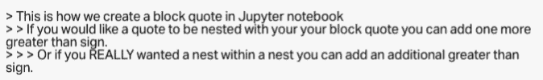

**这是它的样子**

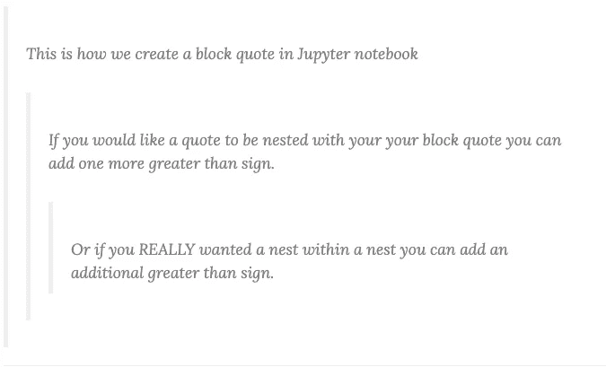

# 标题

标题有六种不同的选项。标签越多，标题越小。见下文。

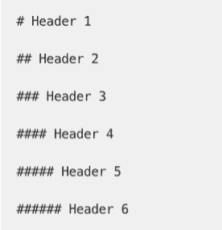

**这是它的样子**

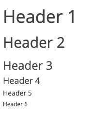

# 超链接

如果你想添加一个不显示网址的超链接，你可以格式化链接，点击[这里](https://www.google.com/)进入网页(我把我的链接到谷歌)。你可以随意输入你想要的任何单词来代替“这里”,这将会显示在你的笔记本上。

**以下是你的做法**

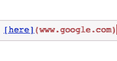

# 形象

图片有能力让你的博客或者 Jupyter 笔记本变得更好。这些可视化让读者对你所说的有更好的理解，或者能够看到支持你观点的数据可视化。

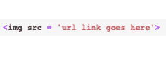

我会说这是它看起来的样子，但只要看看上面！

# 换行

你不知道我尝试了多少次换行符，结果只按了 shift+enter，却什么也没看到。因此，如果您需要在 Jupyter 笔记本 markdown 中换行，请确保按 enter *键两次或更多次*，这取决于您希望换行的大小。

**下面是它的样子**

*做什么*

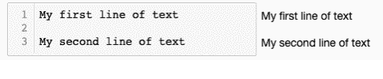

*不要做什么*

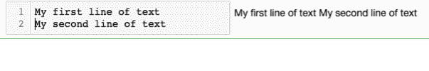

# 列表

列清单和你在其他地方做的事情非常相似。

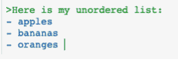

**下面是它的样子**

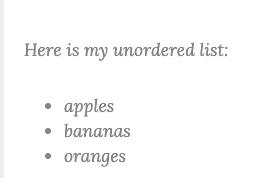

但是如果我想按顺序列出我最喜欢的水果呢？

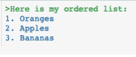

**这是它的样子**

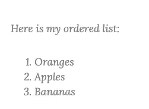

# 线

如果你想换行符，不需要在整个屏幕上做破折号来创建线，只需要放三个破折号并按回车键。您可以选择以下任何一项:

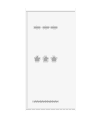

下面是它的样子

# 文本

**加粗**

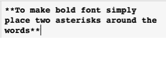

*斜体*

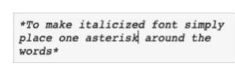

***加粗斜体***

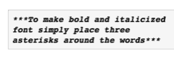

删除线

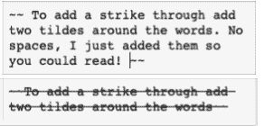

# 让我们变得更高级

# 让你的降价看起来像代码

`Here is some code!`

为了让上面的行看起来像代码，在你的单词周围加上反勾号(键盘左上方波浪号下的符号)。

# 任务列表

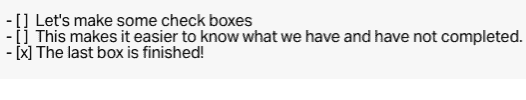

**这是它的样子**

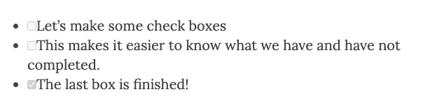

# 文本框颜色

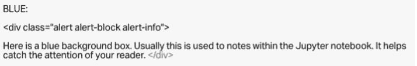

蓝色:

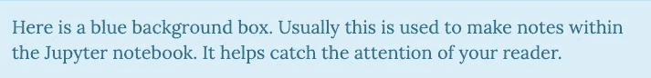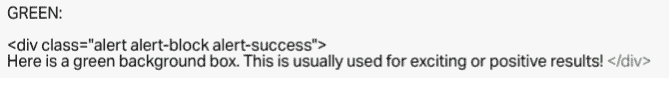

绿色:

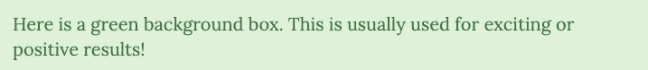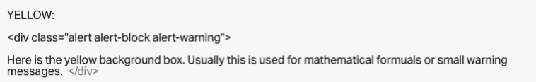

黄色:

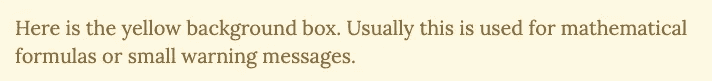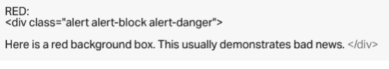

红色:

# 文本颜色

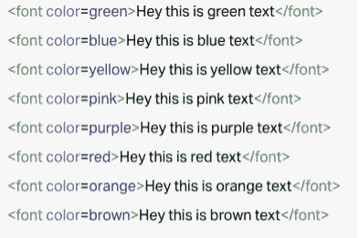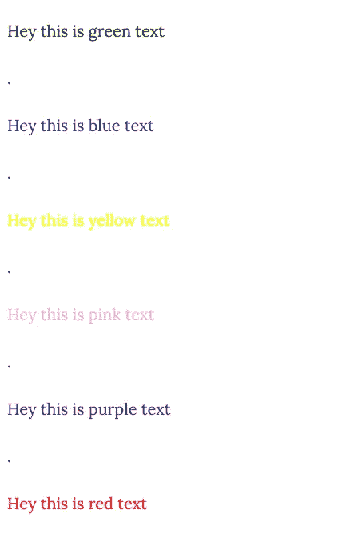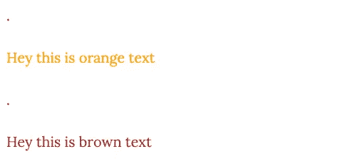

# 文本字体

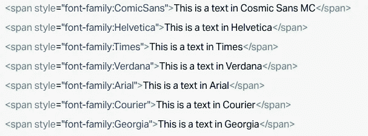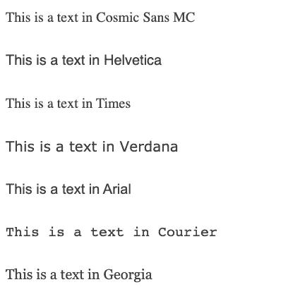

# 突出显示您的文本

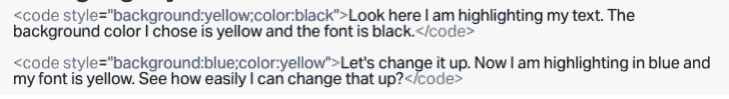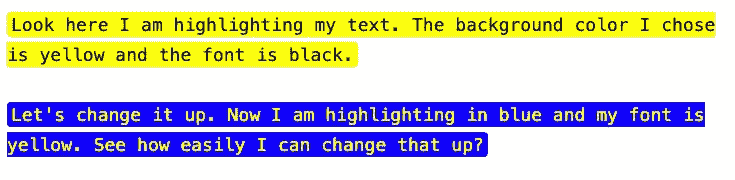

# 嵌入您的画面

%%HTML，然后在发布之前粘贴 Tableau 提供的嵌入链接。

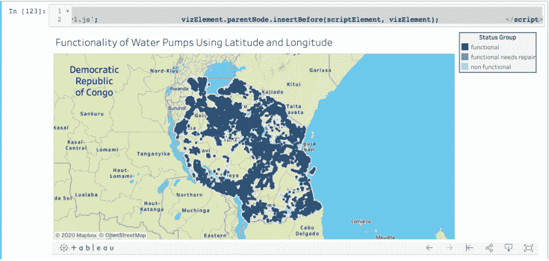