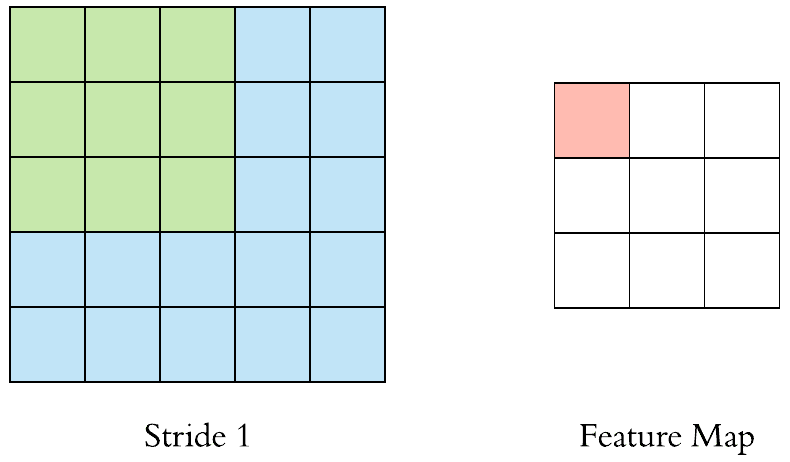

# 卷积神经网络手册

> 原文：<https://medium.com/analytics-vidhya/your-handbook-to-convolutional-neural-networks-628782b68f7e?source=collection_archive---------6----------------------->

## 终极指南

## CNN 用简单的英语回答了“是什么”和“怎样”的问题，让所有读者都能理解。

随着 CNN 慢慢融入我们的日常生活，从搜索推荐到分析安全监控录像，CNN 是由什么组成的，让它如此智能？CNN 的每个概念都用简单的英语解释。

信用: [MissingLink.ai](https://www.google.com/url?sa=i&url=https%3A%2F%2Fmissinglink.ai%2Fguides%2Fconvolutional-neural-networks%2Fconvolutional-neural-network-architecture-forging-pathways-future%2F&psig=AOvVaw1mAcQRJhRulM1Yv0QEcX2L&ust=1607219082469000&source=images&cd=vfe&ved=0CAIQjRxqFwoTCPiJlPfbte0CFQAAAAAdAAAAABAD)

1.  **什么是 CNN？**
2.  **CNN 目前有哪些用途？**
3.  **CNN 的基本布局**
4.  **CNN 是如何工作的？**
5.  **内核**
6.  **大踏步**
7.  **联营**
8.  **展平和预测**
9.  **总结**
10.  **来源**
11.  **个人笔记**

## 什么是卷积神经网络(CNN)？

随着隔离的日子变得无聊，你试图通过解决一个 500 块的难题来增加一天的趣味。因为它在你床下放了很长时间，盒子上的封面照片都被刮掉了。只留下你和你的感觉，你试着识别它描绘了什么。几个拼图块开始匹配，这在拼图中创建了一些特征，使你能够洞察结果。这被认为是一个 ***卷积。***

> **卷积**是通过改变图片从图像中提取特征的过程。

但是，几个拼图块的形成并不能真正告诉你最终的结果；也可能是一只狗或一只猫。所以，你不断地将一组组相似的拼图拼在一起，最终拼在一起。一个卷积很少是足够的，所以几个卷积对于 CNN 显示有价值的特征是必要的。

> 卷积神经网络是深度学习的一种形式，用于使用卷积来分析图像和检测模式。

为此，CNN 在输入图像上使用一系列卷积来获得预测。

CNN 可以被认为是无监督的——聚类，或者有监督的学习——分类，这取决于需求是什么。但总的来说，是有人监督的。

## CNN 的用途

CNN 最普遍的用途是用于*图像分类*。一个主要的例子是对手写数字进行分类，对图片是狗还是猫进行分类，等等。

[YOLO 天体探测器](https://www.google.com/url?sa=i&url=https%3A%2F%2Ftowardsdatascience.com%2Fyolo-you-only-look-once-17f9280a47b0&psig=AOvVaw30BoM6NmByv2n_eZaSqP3f&ust=1607024108538000&source=images&cd=vfe&ved=0CA0QjhxqFwoTCIDBvruFsO0CFQAAAAAdAAAAABAD)

## 卷积神经网络的基本布局

卷积神经网络通过 [eCognition](https://www.google.com/url?sa=i&url=https%3A%2F%2Fdocs.ecognition.com%2Fv9.5.0%2FeCognition_documentation%2FReference%2520Book%2F23%2520Convolutional%2520Neural%2520Network%2520Algorithms%2FConvolutional%2520Neural%2520Network%2520Algorithms.htm&psig=AOvVaw2WJ1sadOBLgo7VN33B5ptL&ust=1607011891937000&source=images&cd=vfe&ved=0CAIQjRxqFwoTCPjw-f7Xr-0CFQAAAAAdAAAAABAJ)

CNN 有一个输入层、一些隐藏层和一个输出层，输出层输出转换后的输入——CNN 内部的隐藏层使用**过滤器**。过滤器是模式的检测器。一开始，CNN 只开始检测边缘和形状。随着算法的进展，它开始检测有形物体，如耳朵。

## 卷积神经网络是如何工作的？

CNN 主要依靠卷积来提取特征并产生足够的输出。第一种卷积是核。一个**内核**不过是一个过滤器，用来从图像中提取特征。

当我们阅读一本书时，我们通过从左到右阅读从文本中提取意义。类似地，内核从左到右从输入图像中提取特征。

同样，我们倾向于从每个单词中吸收信息，而不是通过阅读每个字母。类似地，内核每次通过一组像素提取特征。

最常用的内核形式是一个 **3 x 3** ，如下所示。

鸣谢:Irum Shafkat 在[迈向数据科学](https://towardsdatascience.com/intuitively-understanding-convolutions-for-deep-learning-1f6f42faee1)

您可能知道，图像中的每个像素都有一个数值，范围是从 **0 到 255** 。对于彩色图像，它由三个通道决定:红色、蓝色和绿色。数值越高，像素产生的亮度越大。

如前所述，内核也有一个与其每个块相关联的值。

## 使用内核

许多神经网络中的大多数数学计算包括对线性代数和微积分的透彻理解。然而…

> 使用内核就像乘法和加法一样简单！

[信用](https://miro.medium.com/max/1400/1*Z0fpcVQWjvlUMY6NywvkTg.gif)

我们来分解一下。内核有一个 3x3 的矩阵，黄色方框中的红色数字就是滤镜。如您所见，输入像素乘以其对应的滤波器数，然后将这 9 个相乘的数字相加。

换句话说，9 个输入值分别相乘并相加成为 1 个输出值，然后成为卷积图像的一部分。

例如，对于第一组像素:

如果我们使用输入图像在[1，1]处的值，并在核的位置[1，1]处将其相乘，我们得到 1。然后，我们将[2，1]处的输入图像乘以核的位置[2，1]，得到 0。

基本上，**(1 * 1)+(1 * 0)+(1 * 1)+(0 * 0)…= 4**。

这样做，直到我们使用了 3x3 内核中的所有值，相应的输出显示:4。

由于数字的重叠，卷积后的图像更准确，像素更多(与使用 5×5 矩阵或更大的步幅相比)。

## 大步

包含成千上万像素的图像必然包含各种数据。试图处理大量的像素在计算上是昂贵的，并且难以调试和组织。这就强加了使用**步幅**参数的理想时间。

> 跨距定义了内核应该在任一方向上移动的像素数

[Arden Dertat](https://towardsdatascience.com/applied-deep-learning-part-4-convolutional-neural-networks-584bc134c1e2) 在[走向数据科学](https://miro.medium.com/max/2074/1*L4T6IXRalWoseBncjRr4wQ@2x.gif)

在此图中，步幅为**【1，1】**。这告诉内核在行上移动时向右移动 1 个像素，在列上移动时向下移动 1 个像素。输出是 3x3 的图像。

[走向数据科学](/@kaiyasith_p/visualizing-kernels-and-feature-maps-in-deep-learning-model-cnn-with-google-colab-python-2ba638aec9ae)[中的](https://miro.medium.com/max/1442/0*JTn_FiIX3VfG_1Dy.gif)

在此图中，步幅为**【2，2】**。这告诉内核在行上移动时向右移动 2 个像素，在列上移动时向下移动 2 个像素。输出是一个 2x2 的图像。

如图所示，步幅越大，**特征图**(或回旋图像)越小。就这一点而言，步幅对 CNN 来说意义重大，因为它们被用来大幅缩小图像尺寸。

## 联营

如果推断到输入图像的 1/4 足以确定整个图像显示什么，那么处理图像的所有 4/4 是没有意义的。这就是合用发挥作用的地方。

> 池用于减小要素地图的大小。

像内核一样，池化在特征上移动 n×n 滤波器(即，3×3 滤波器),并采用在输入像素上确定的一个值。可以通过几种方式找到该值:它可能是输入像素的最大值**(最大池)**，所有值的总和**(总和池)**，或者所有值的平均值**(平均池)**。最常用的池类型是最大池。

[联营类型](https://www.bouvet.no/bouvet-deler/understanding-convolutional-neural-networks-part-1/_/attachment/inline/e60e56a6-8bcd-4b61-880d-7c621e2cb1d5:6595a68471ed37621734130ca2cb7997a1502a2b/Pooling.gif)

## 展平和预测

一旦算法使用了许多不同的内核和池技术，就到了预测的时候了。在这一点上，该算法现在可以检测眼睛，耳朵，胡须和一张脸。现在，它所要做的就是预测图像是一只猫。这就是**扁平化**出现的原因。

> **展平**是将汇集的要素地图转换为传递给完全连接图层的单个列的功能。

[信用](https://www.kaggle.com/gazi13/convolutional-neural-network-cnn-example-1/comments)

[信用](https://www.kaggle.com/suademre/deep-learning-cnn-with-keras/comments)

展平后，展平的特征图通过神经网络。该步骤包括人工神经网络 **(ANN)** 中的输入层、全连接层和输出层。输出层是我们获得预测类的地方。通过网络传递信息，计算预测的误差。然后，误差通过系统反向传播，以改进预测。

虽然这听起来可能令人困惑，但扁平化是一个很容易掌握的概念，在重读几次后会自动点击。展平对于将从卷积中提取的特征转换为该算法输出的实际预测输出非常重要。

但是我们如何建立一个 CNN？请关注下一篇文章，深入了解构建 CNN 的过程。

## 摘要

[苏米特·萨哈](https://towardsdatascience.com/a-comprehensive-guide-to-convolutional-neural-networks-the-eli5-way-3bd2b1164a53)在[走向数据科学](https://miro.medium.com/max/2000/1*vkQ0hXDaQv57sALXAJquxA.jpeg)

*   CNN 分析图像并提取重要特征
*   **卷积**是以提取重要特征的方式改变输入图像的特征，然后可以通过人工神经网络(ANN)输入这些特征。
*   CNN 通过**过滤器**，这是提取水平线、垂直线和曲线等特征的主要指南
*   **步长**在内核中使用，决定过滤器在图像上移动多少个框。步幅越大，图像越小。
*   一个**特征图**是一个旋绕层或一个已经通过旋绕的层。
*   之后，使用**池**。池用于减小特征图的大小。
*   展平对于在人工神经网络中使用的特征地图至关重要。从那里，人工神经网络预测分类，聚类，图像分割等。

## 来源

 [## 卷积神经网络综合指南 ELI5 方法

### 人工智能见证了人类能力差距的巨大增长…

towardsdatascience.com](https://towardsdatascience.com/a-comprehensive-guide-to-convolutional-neural-networks-the-eli5-way-3bd2b1164a53)  [## 卷积神经网络导论

### 卷积神经网络(CNN)是一种具有一个或多个卷积层的神经网络，主要用于

towardsdatascience.com](https://towardsdatascience.com/an-introduction-to-convolutional-neural-networks-eb0b60b58fd7)  [## 卷积神经网络池层的温和介绍-机器学习…

### 卷积神经网络中的卷积层总结了输入图像中特征的存在。一个问题…

machinelearningmastery.com](https://machinelearningmastery.com/pooling-layers-for-convolutional-neural-networks/)  [## 应用深度学习-第 4 部分:卷积神经网络

### 欢迎来到应用深度学习系列的第 4 部分。第 1 部分是人工神经网络的实践介绍…

www.google.com](https://www.google.com/url?sa=i&url=https%3A%2F%2Ftowardsdatascience.com%2Fapplied-deep-learning-part-4-convolutional-neural-networks-584bc134c1e2&psig=AOvVaw3R2chVCmW5Zv64pUa75vRv&ust=1607093802854000&source=images&cd=vfe&ved=0CA0QjhxqFwoTCOjYuY-Jsu0CFQAAAAAdAAAAABAD) 

希望你喜欢阅读！查看我的 [**LinkedIn**](https://www.linkedin.com/in/fatimah-hussain/) ， [**Instagram**](https://www.instagram.com/fxtimxhh/?hl=en) ，关注我的 [**中**](/@fatimahandhussain) 。当我写这些文章时，我总是付出 100%的努力和奉献，所以请随时鼓掌让我知道你喜欢它！。敬请关注，点击关注按钮，获取每周更新和引人入胜的文章！