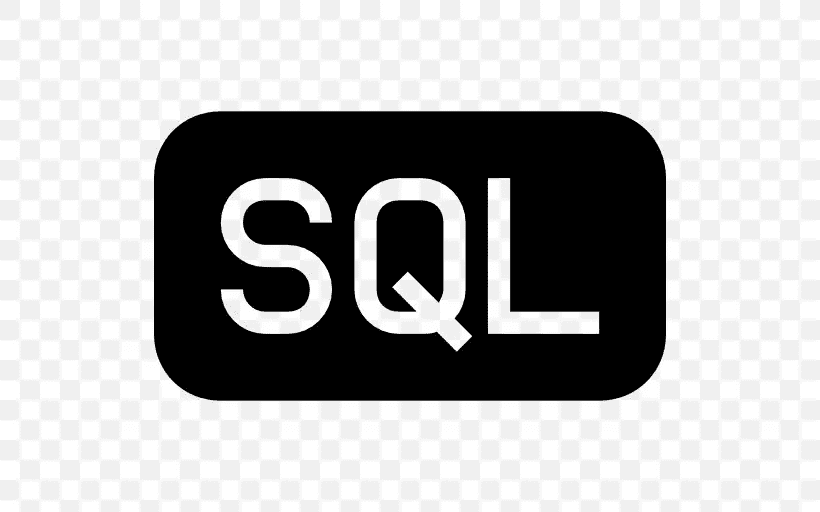
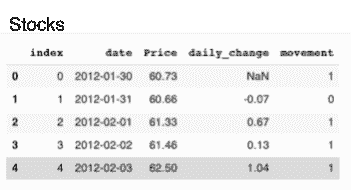
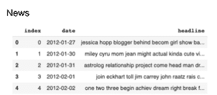
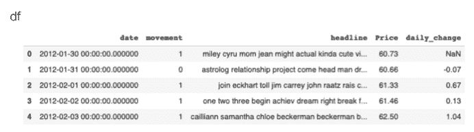

# 熊猫 SQL 入门指南

> 原文：<https://medium.com/analytics-vidhya/your-introductory-guide-to-pandas-sql-7eddb2c00572?source=collection_archive---------21----------------------->



在寻找“数据科学家”或“数据分析师”的工作时，三个字母通常会出现在职位描述部分。这三个字母就是 **SQL** 也称为结构化查询语言。这是一个用于提取和组织存储在关系数据库中的数据的过程。当听到关系数据库这个术语时，会想到一个或多个共享公共列的数据表。例如，下面我们有两个表“股票”和“新闻”,它们包含一个类似的日期列。



下面是我们使用 pandas SQL 将这两个表连接在一起的步骤:

第一步。**在你的机器上安装 pandassql。pandassql 是一个库，允许用户在 panda 中使用 sql 风格的语法查询数据帧。**

`pip install pandasql`

第二步。**导入 pandasql**

`from pandasql import sqldf`

第三步。**创建** `pysqldf = lambda q: sqldf(q, globals())`这允许更快更容易的查询。

第四步。**调用你想加入的数据**

```
q = '''SELECT s.date, s.movement, n.headline, s.Price, s.daily_change       
      FROM stocks s					
      JOIN news n 					
     ON n.date = s.date:'''  

df = pysqldf(q)	
df.head()
```

第五步:**最终产品:**



# 我们刚才做了什么？

下面显示了 SQL 查询的基本概要:

```
q= '''SELECT t.col1, t.col2, t.col3, o.col4, o.col5 
FROM table t 
JOIN othertable o 
ON  t.records = o.records;'''
```

# '''引号' ' '

您可能会注意到，上面的两个查询都以三个引号开始和结束。这允许我们使用多行来完成一个查询。

# 从以下选项中选择 __:

Select 选择将哪些列连接到新的数据框架中。选择这些列有三种不同的策略。

**一:**如果您用`'''SELECT * FROM`开始查询，这将从两个数据帧中选择每一列来连接在一起。

两个 T21:另一种方法是用 T4 开始你的查询。在这里，您可以在 col1、col2 等的空白处填入列名。这样做的问题是，一些数据表会有相同标题的列，尽管它们可能没有相同的信息。要解决这个问题，你可以遵循第三步。

**三**:第三步是基本轮廓示例中显示的内容。在`FROM table`之后我写了一个 t，这是一个缩写，表示任何前面有 t 的东西都是来自“table”。因此，在我们的第一个 sql 示例中:日期、移动、价格和 daily_change 都来自股票数据框架，因为它们的名称前面有一个 s。而 news 后面有一个 n，所以任何前面有 n 的东西都意味着它来自我们的 news 表。

# 加入

加入是我们可以花很多时间的部分。有不同类型的联接，包括内联接、左联接、右联接、外联接、一对一联接、一对多联接，我鼓励您自己去查找。现在，我们将简单地介绍连接允许我们选择将哪个表与原始表连接在一起。如上所示，我们将 othertable 与 table 连接起来。

# 在…上

On 用于选择表将被联接的列。通常情况下，两个表共享相似的项，但具有不同的列名。例如，表中的 CustomerName 和其他表中的 ClientName，这两列具有相同的信息，因此我们可以使用这些列来连接我们的表。

```
'''SELECT * 
FROM table t
JOIN othertable o
ON t.CustomerName = o.ClientName;'''
```

# 使用

使用是联接两个具有相同列名的表的一种方式。根据我最初的例子

```
q= '''SELECT t.col1, t.col2, t.col3, o.col4, o.col5 
FROM table t 
JOIN othertable o 
ON  t.records = o.records;'''
```

但是，由于 records 列同时出现在 table 和 othertable 中，我本可以使用 USING 而不是 ON。见下文:

```
q= '''SELECT t.col1, t.col2, t.col3, o.col4, o.col5 
FROM table t 
JOIN othertable o 
USING(records);'''
```

这将生成与前面的代码完全相同的表，从两个表中选择列 1–5。

# 在哪里

`WHERE`子句根据特定条件过滤查询结果。如果您要从一个数据库中获取信息，这是非常有用的。如果我有所有股票的数据框架，我就可以`'''SELECT * FROM stocks WHERE stock_name = S&P500'''`。这将获取任何标记为 S & P500 的股票信息，以创建数据框架。

# 以...排序

ORDER BY 是一种有助于组织的工具。当提取结果排序依据时，允许您按特定特征/列过滤结果。也许我想按价格给我的股票排序，因此我的查询应该是这样的:

```
'''SELECT * 
FROM stocks 
WHERE stock_name = S&P500 ORDER BY price DESC;'''
```

这将使 S&P500 股票按价格降序排列。ORDER BY 的缺省值是升序，因此如果你想要一个升序列表，你可以从上面的例子中删除 DESC。

# 分组依据

也许您想要将数据帧分组到特定的类别中，这就是 GROUP BY 发挥作用的地方。以 S&P500 为例，假设我们想要查看我们有多少个星期一的股票信息，为此我们将:

```
'''SELECT price, day, 
COUNT day
FROM stocks 
GROUP BY day;'''
```

# 限制

Limit 允许您控制收到多少结果。也许完整的数据帧会有数千行，而您只想要 200 行。要进行限制，只需在查询的末尾添加`LIMIT 200`。

# 在...之间

也许你想要一份 S&P500 在每股 60 美元到 70 美元之间的日期列表。要找到它，你可以使用 between 函数。

```
'''SELECT price 
FROM stocks 
WHERE price 
BETWEEN 60 AND 70;'''
```

# 空

有时我们可能想看看一个数据帧中有多少个空值。为此，我们可以`'''SELECT * FROM stocks WHERE price IS null;'''`这将返回 S & P 500 的价格为空的任何行。

当您真正钻研 SQL 时，您可以做的事情还很多。在这篇博文中，我们介绍了一些基础知识，帮助你开始学习。为了更深入，我鼓励您自己尝试一下，要获得更多信息，请从查找聚合函数和不同类型的连接开始。我希望您喜欢理解 SQL 的第一步。