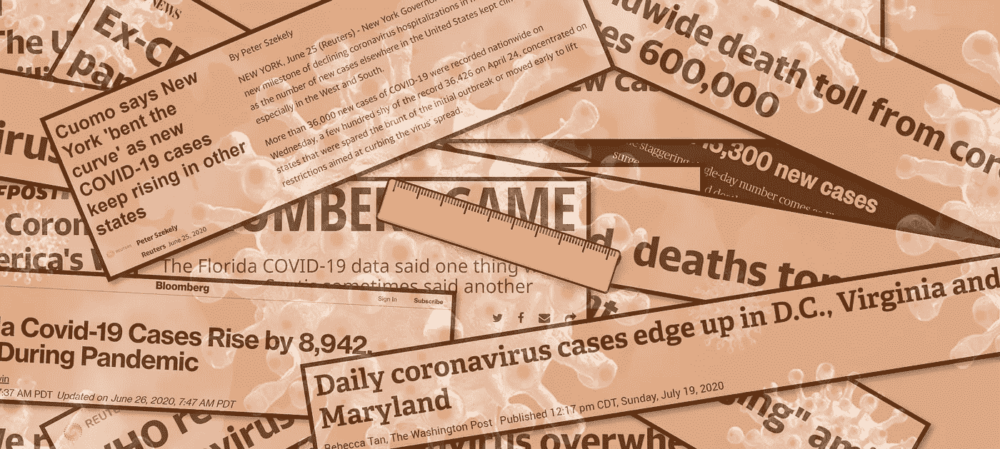

# 你没有正确测量新冠肺炎

> 原文：<https://medium.com/analytics-vidhya/youre-not-measuring-covid-19-correctly-80398c251a1?source=collection_archive---------18----------------------->

标题来源:CBS 新闻，纽约时报，迈阿密先驱报，美联社，路透社，NBC 新闻，赫芬顿邮报，华盛顿邮报，福克斯新闻频道，商业内幕。图片来源:Pixabay。

## 度量问题

也许你听说过佛罗里达的病例急剧上升，或者纽约的病例下降。然后，无论是口头上还是心里上，你可能会把这个标准附加到某个策略上。不幸的是，从充斥新闻的标题来看，大多数人都没有看到全貌。