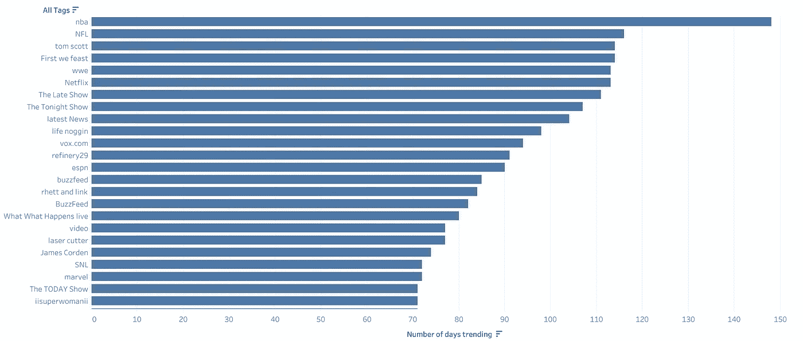
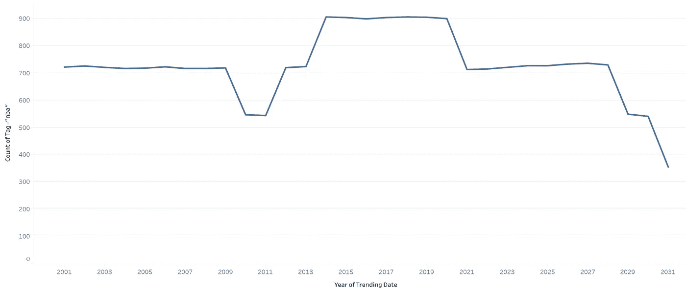
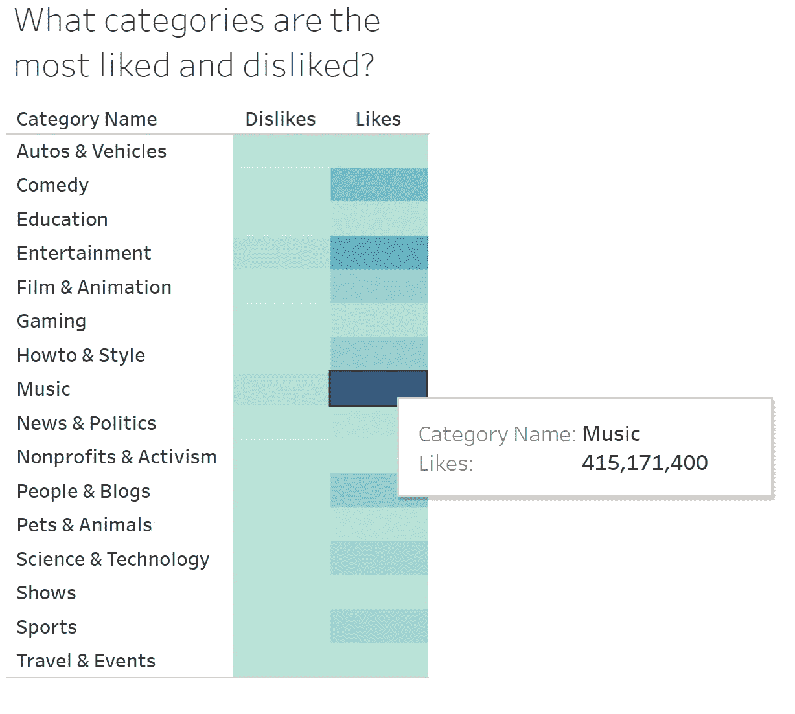
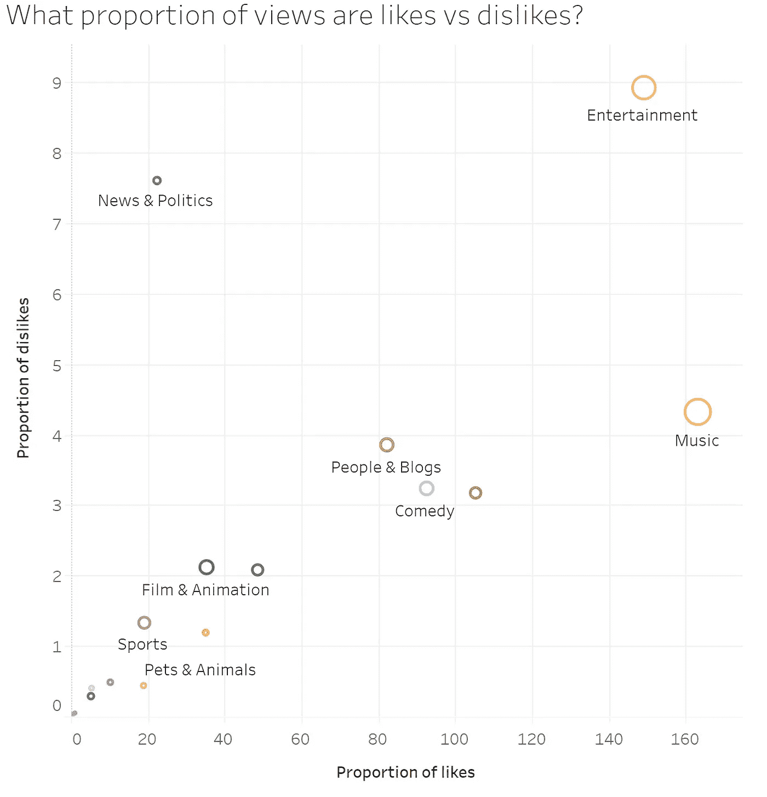
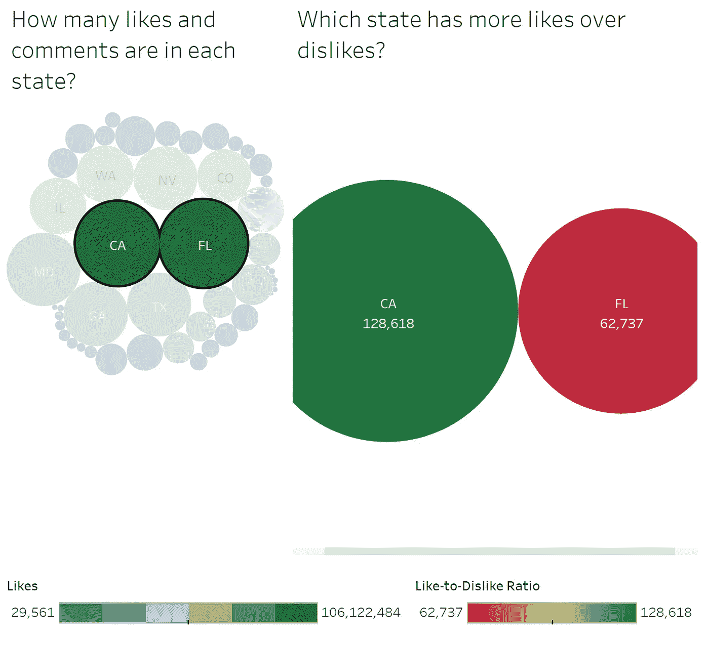
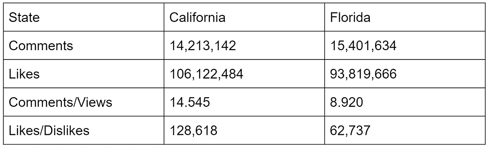

# YouTube 上哪个视频最受喜欢？

> 原文：<https://medium.com/analytics-vidhya/youtube-data-tableau-dashboard-405ff87c0649?source=collection_archive---------28----------------------->

YouTube Data US 是来自 [Kaggle](https://www.kaggle.com/) 的一个数据集，其中包括一天或更长时间内的热门视频信息。让我们使用这个数据集，通过 Tableau 可视化来寻找一些问题的答案。

## 随着时间的推移，哪些标签越来越受欢迎？

标签成为流行趋势的天数

所有与视频相关联的标签都在一个单独的列中，带有一个管道分隔符，称为标签。使用这种信息表示，很难分析标签和视频。

作为第一步，我们将使用 Tableau 的自定义分割特性将这个字段分割成多个包含单独标签的字段。

对于流行度，我们统计了一个标签词在 100 年的可用数据中出现的次数。标签 1 是视频标签序列中的第一个标签。对于 Tag1 来说，“nba”的趋势时间最长(148 天)。

## 标签受欢迎程度这些年有变化吗？

我们可以深入探究 Tag1 何时开始流行。tag 1“NBA”的巅峰年份是哪一年？

“nba”标签的趋势

从折线图可以看出，2018 年和 2019 年是这个标签被 mos 趋势化的年份。2018-2019 是 NBA 的第 73 个赛季。

## 最喜欢和最不喜欢的类别有哪些？

YouTube 清理的数据只有类别 ID。categories 文件是一个单独的文件，包含 id 和类别名称。类别文件应该包含类别 id 上的数据。这些额外的数据允许我们基于类别名称来可视化细节，这比 id 更直观、更有意义。

为了回答最喜欢和最不喜欢的类别，我们可以基于色阶的光谱进行可视化。

从右边的图表来看，音乐似乎是最受欢迎的类别，娱乐是最不受欢迎的类别。

这些喜欢和不喜欢的数量会受到特定类别中的视图数量的影响吗？

为了在统一的尺度上理解这种行为，我们可以绘制出喜欢和不喜欢与视图数量的比例。圆圈的大小表示视图的数量。

我们看到比娱乐和音乐确实有很多看法。类似地，新闻是一个类别，与喜欢相比，不喜欢的比例非常高，看起来像一个异常类别。

当在过滤器中移除这三个类别时，所有其他类别都落在对角线上，并且彼此的好恶比例非常相似。

## 哪些州的评论数、不喜欢数和喜欢数最高？

从气泡图中，我们可以看到哪里往往有更多的评论和喜欢。从左图来看，加利福尼亚州(1400 万条评论，1.06 亿个赞)和佛罗里达州(1500 万条评论，9300 万个赞)的评论和赞数最多。

人们倾向于更喜欢这两种状态吗？还是有别的因素在作怪？

在右边的图表中，我们根据喜欢与不喜欢的比率(喜欢的数量/不喜欢的数量)将圆圈从绿色变为红色。这个比率越高，喜欢的数量与不喜欢的数量之比就越大。

从这个图表中，我们看到，虽然加州和佛罗里达州的喜欢和不喜欢的数量相似，但喜欢的比例在加州(128k)比在佛罗里达州(62k)要显著得多。加州的评论数(14.5)比佛罗里达州的(8.9)多。

绿色越深，喜欢的数量越多。尺寸代表评论，气泡越大，评论数量越多。

因为图表右边的红绿调色板被选择来代表喜欢的比例。绿色表示喜欢的相对较多，红色表示喜欢的比例较少。

以下是加州和佛罗里达州的对比总结:

