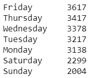

# YouTube 人气预测

> 原文：<https://medium.com/analytics-vidhya/youtube-popularity-prediction-7efc80d8df0e?source=collection_archive---------6----------------------->

嘿！你在那里！你是一个善于交际的人吗？你喜欢创作内容并与世界分享吗？大概在 YouTube 上碰过运气？

如果你对以上任何一个问题的回答是肯定的，我们完全了解你的感受！当你试图以优步的身份走向全球时，一致性是关键。想出内容往往不是一件容易的事，当你全心全意地投入到一个最终没有得到你所期望的那么多爱的视频中时，伤害会更大。

一时间不禁感到失落。好吧，你并不孤单！我们是来帮你的。我们将打破错综复杂的“YOUTUBE 算法”,让你成为有创造力的自己！

说到这里，让我告诉你一点我们在这里努力实现的目标。这个项目是我和一个朋友决定从事的事业。附注:我们对数据科学充满热情！

> 注意——在我深入研究技术细节之前，我只想指出一个事实，如果您不熟悉数据科学项目，您可能无法理解所有的术语。但是我会尽我最大的努力在多个层面上解释，这样每个人都能理解。我还会把你可能想知道的术语链接到其他文章。

# 关于数据:

Youtube API 和网络抓取是用于数据收集的两个重要工具。在这篇博客中，你将会看到我们从对 Youtube 数据的探索性数据分析中获得的一些见解。该数据集的视频 id 基数范围从(2010–2016)到大约。每个类别有 22，000–24，000 个视频 id(Youtube 有 15 个视频类别)，总共大约有 3，50，000 个视频 id。

 [## 网页抓取说明

### 网页抓取(也称为屏幕抓取、网页数据提取、网页采集等。)是一种用来提取…

www.webharvy.com](https://www.webharvy.com/articles/what-is-web-scraping.html) 

# 预处理:

我不会用数据中每个变量的细节来烦你，只说好的变量。先具体说一下 2。

> 1-Day Uploaded，表示变量是在一周的哪一天上传的。它的值范围从(0–6)到按字母顺序排序的天数。所以 0 代表星期五，1 代表星期六，以此类推。
> 
> 2-类别 Id，说明该视频属于哪个类别。它的值范围为(0–14)，其中 10 表示音乐，20 表示游戏。

很快，我们觉得在解释它们的时候会有问题。所以我们用实际的标签对它们进行了解码，这些标签是我们在对 YouTube 如何存储数据进行研究后发现的。

接下来，有一个名为“月龄”的变量，它的值表示特定视频在数据收集当天的年龄。我们从中派生出一个名为“YearPublished”的新列，正如您可能已经猜到的那样，它包含与视频上传年份相对应的标签(例如 2010 年)。我们这样做是因为看看 YouTube 或一个频道多年来的发展会很有见地。

> 问题警报-

**1-** 我们发现 4 个视频的年份为 0，这意味着它们不在 2010-2016 年范围内。我们把那些视频 id 拿出来在 YouTube 上查了查。

我们发现都是 2009 年 12 月的。由于我们在其他年份每年有大约 50000 个视频，保留 2009 年的这 4 个视频没有意义，因此我们最终将它们从数据集中删除。

**2-** 我们遇到的第二个问题是一个叫做**持续时间**的变量，这个变量以秒为单位表示特定视频有多长。该变量的最小值为 0。现在任何有常识的人都能看出这里有问题！没错。一个时长为 0 的视频怎么会存在，更别说在 Youtube 上了？对于其中的一些视频，我们在 YouTube 上查看了一下，发现它们**不可用。**

所以我们把它们从数据中剔除了。

# 探索性数据分析:

在继续探索之前，我们先来看看视频在数据集中的分布。[只是一种奇特的说法——‘我们的数据看起来怎么样？’]

我们发现，除了周末平均有 30000 个视频外，每周每天平均有 50000 个视频。这些数据是通过随机抽样收集的，所以我们可以说它代表了总体。

**因此，我们可以理解为，一般来说，周六和周日上传的视频数量较少。**

现在我们想知道为什么会存在这种现象。所以我们进一步调查。

与此同时，一个新问题冒了出来。每个类别的情况都一样吗？

我们绘制这张热图来回答这个问题。请注意，无论类别如何，周六和周日的区块相对于其他工作日来说都更暗。但是有一个压倒性的例外。游戏。

 [## 什么是热图，如何生成热图，示例和案例研究

### 你知道什么是热图吗——它有什么用途？如今热图无处不在。你看到他们在…

www.crazyegg.com](https://www.crazyegg.com/blog/understanding-using-heatmaps-studies/) 

我们想知道为什么会发生这种情况，这样我们就可以发现最初观察到他们在周末上传的视频较少的背后隐藏的原因。让我们来讨论其中的两个类别，然后概括其余的类别。

我们制定了一个假设，即 youtube 上的大多数音乐视频将来自音乐公司或唱片公司运营的频道，而在另一个极端，对于游戏来说，大多数频道将来自开始作为 Youtube 用户并最终开始上传他们的视频的人。他们的频道经受住了时间的考验，随着 Youtube 越来越受欢迎，他们的订户也在增加。

> 假设检验-

 [## 假设检验

### 基本图表和图形回归分类数据调查实验概率随机变量离散…

stattrek.com](https://stattrek.com/hypothesis-test/hypothesis-testing.aspx) 

我们将采取两个类别，每一个都是极端的。让我们对照游戏来分析音乐。

因为谈论每一个音乐频道是一项不可能的任务，我们选择了前 5 名贡献者-

1.  t 系列
2.  2.1 泰克(원더케이)

3.旋转唱片

4.KEXP

5.英国广播公司第一电台

我们会画出这些的上传频率-

对于其中的 3 个通道，我们注意到了类似的上传模式。他们都不喜欢在周末上传视频，每个人都有一两天最喜欢上传他们的大部分视频。这样做可能是为了从心理上影响人们的观看模式。换句话说，他们让你知道哪一天更有可能有新的上传，所以你不断回来。

对于另外两个，我们看到上传量在一周内逐渐减少，并且倾向于前半周。在这里，我们再次看到周末的最小上传量。

现在，我们将讨论游戏的五大贡献者

1.佩迪派

2.流行电影

3.马克普里耶

4.DanTDM

5 .天眼

我们会标出这些频道的上传频率-

没有大势，不像音乐视频。

> 观察-

我们可以说，由于大多数音乐贡献者是公司，他们计划他们的视频上传，并避免周末，因为唱片公司计划他们的上传，以获得最少数量的上传。他们有能力这样做，因为 Youtube 不是他们的主要收入来源。另一方面，游戏业主要是个人或一群人将 Youtube 作为一个可行的职业，并定期上传视频。他们不能跳过几天，因为他们知道试图在 Youtube 上发展时一致性很重要。他们可能会偏爱某一天，这取决于他们对受众的了解程度，但他们没有明显的理由避免在周末上传。

所以我们的假设是正确的。

> 你可能会问，我们有这么多其他类别可以选择，为什么还要选择音乐。
> 
> 原因如下-

> 尽管我们的视频在不同类别中的分布相当相似，但 Youtube 上的音乐仍然非常多。
> 
> 了解了以上事实，我们来搞清楚，是哪些因素影响了一个视频的浏览量。

# Youtube 的成长

谷歌视频和 Youtube 一样，都是在 2005 年推出的。谷歌在 2006 年收购了 Youtube，因为它知道它的潜力。2012 年，谷歌决定将谷歌视频与 youtube 合并。谷歌视频是谷歌的免费视频托管服务，类似于 YouTube，允许视频剪辑托管在谷歌服务器上，并嵌入到其他网站上。这次合并为那一年带来了动力。2012 年 10 月，YouTube 宣布其算法已经转向更喜欢观看时间更长的视频，而不是观看次数更高的视频。Youtube 会停止计算观看次数，直到用户观看到特定的时间限制。因此从那时开始减少。这样做是为了减少点击诱饵视频。

 [## 点击诱饵

### Clickbait 是一种虚假广告，它使用超链接文本或缩略图链接，旨在吸引…

en.m.wikipedia.org](https://en.m.wikipedia.org/wiki/Clickbait) 

# 描述目标变量(视图计数)

正如我们所看到的，我们的分布是高度右偏的，这意味着有很多视频的浏览量很低，而只有一小部分视频的浏览量很高，这似乎是 Youtube 的情况。

我们将变量视图计数转换为对数标度，以响应  这种偏斜。

好多了！

对数标度帮助我们减少变量中异常值的数量。

# 双变量分析:

 [## 二元分析定义和示例

### 统计定义>双变量分析什么是双变量数据？统计学中的数据有时会被分类…

www.statisticshowto.datasciencecentral.com](https://www.statisticshowto.datasciencecentral.com/bivariate-analysis/) 

在这里，我们将看到哪些变量与视图计数相关。

所有这 3 个变量都与直观的视图计数高度正相关。

当你喜欢一个视频时，你倾向于对它进行评论并分享视频，增加其浏览量。YouTube 算法将喜欢、不喜欢和评论比例高的视频推荐给更多人，进一步提升了浏览量。

我们现在来讨论一些分类变量-

> **我们很想知道 youtube 上哪个类别有更多粉丝-**

> **总的来说，音乐是 Youtube 上最受关注的类别，其次是娱乐、喜剧和游戏。**

> 为什么会这样呢？

虽然 YouTube 不是为流媒体音乐服务而创建的，但谷歌拥有的平台仍然是世界上最常用的合法听音乐的网站。虽然像 Spotify 和 Apple Music 这样的竞争对手正在飞速发展，但世界各地的大多数音乐爱好者仍然喜欢去 YouTube 听他们最喜欢的音乐

每年，IFPI(国际唱片业联合会)都会发布《音乐消费者洞察报告》，分析世界上数百万人是如何互动和接触音乐的。根据 2017 年的报告，视频占据了点播流媒体全部时间的 55%。令人难以置信的是，YouTube 占了所有点播流媒体时间的 46%。

> 上传的天数如何影响浏览量？

我们看到，一般来说，周末上传的所有类别的视频都比较少。那为什么音乐视频的平均浏览量受影响最大？

除了有机观看，将音乐视频作为广告放在其他 YouTube 视频前面已经成为音乐行业的常见做法，因为如果观看时间足够长，它可以被算作一次观看。记住这一点，精心策划的广告活动是为了让一个音乐视频在发布后的 24 小时内登上 YouTube 的排行榜。人们使用这些统计数据——许多人经常吹捧破纪录的 24 小时观看次数——作为“其即时文化影响的决定性代表”。现在，由于所有其他类别在周末上传较少，在周末发起单日广告活动没有意义，因为总的来说，平台上的观众和新上传较少。

> 9 月 13 日-YouTube 正在改变它如何计算破纪录的音乐视频的浏览量，此前 Baadshah 在一天内击败 BTS，因为他购买了植入他的音乐视频的付费广告，人为地增加了浏览量。

> 从图表中，我们可以看出音乐是 Youtube 上最受关注的类别。这引起了我们的兴趣，想知道为什么会这样？

第一张桌子是放音乐视频的，第二张是用来娱乐的，第三张是用来玩游戏的。

由于音乐视频往往在前 24 小时内获得大部分浏览量，而且大多数音乐视频是在周五上传的，因此周五平台上的平均浏览量更多。电影工作室和电视网络经常使用类似的策略，争夺破纪录的数字，我们看到同样的娱乐上传模式。周五的上传数量与其他任何一天都有所不同，就像音乐一样。为了证明这仅适用于这些类别，而非一般化，我们举了一个更基于用户的游戏的例子。正如所料，周五不是上传最多的一天，周二、周四和周五的上传数量也没有太大差异。

> 持续时间如何影响视图？

一般来说，长视频获得的浏览量较少。正如我们所看到的，在左上角的持续时间范围内，我们有更多的视图计数。因此，当我们放大并绘制图表时，我们发现了一个有趣的特征，即观看次数最多的前 5 个视频大约为 4.5 分钟长。

这一观察让我们得出一个假设，这可能是音乐成为 Youtube 上观看次数最多的类别的原因。看我们找到了什么！！

音乐视频的平均时长为 5 分钟，75%的音乐视频长度不到 5 分钟。现在，由于人们更喜欢较短的视频，这可能是音乐成为 Youtube 上观看次数最多的类别的原因。

# 结论-

总之，这个项目帮助我们更好地了解 Youtube，未来，我们的目标是使用预测模型来帮助预测一个可能的视频的预期浏览量。

这是我们用过的文件和笔记本。附:查看推荐视图(第三个文件)，亲自看看我们的推荐引擎是如何工作的。(这是一项正在进行的工作，但这里有一个例子，如果你告诉它你想上传一个游戏视频，它会建议你在周六上传)

随着项目的进展，我们将发布更多内容。保持更新，快乐阅读！

点击这里查看我们对这个项目的介绍-

【https://drive.google.com/open? id = 1eo 19 dfgs 53 xavwwh1 w-ifhXIgqRvYJHC

点击这里获取 Github 链接(代码)

【https://github.com/VarishuPant99/YoutubeStats 

**关于我们:**

1-Varishu 长裤

在 Instagram 上找我@v_pawk

电子邮件 id- varishu.pant@praxis.ac.in

2- Swetha Ramanadham

电子邮件 id-swet ha . ramanadham @ praxis . AC . in