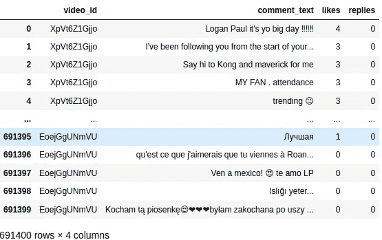
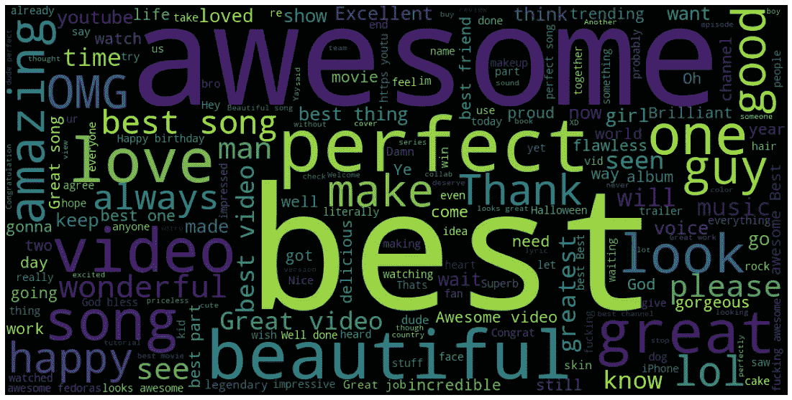
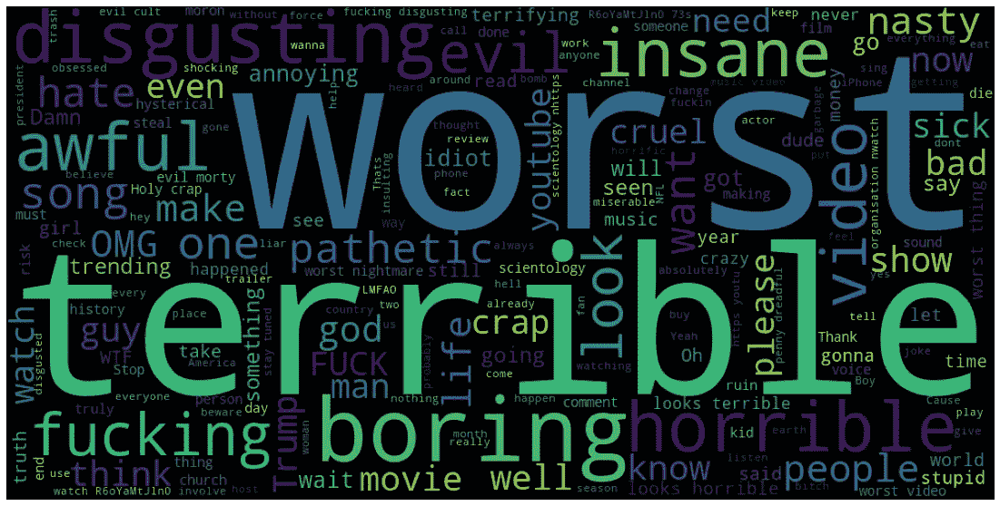
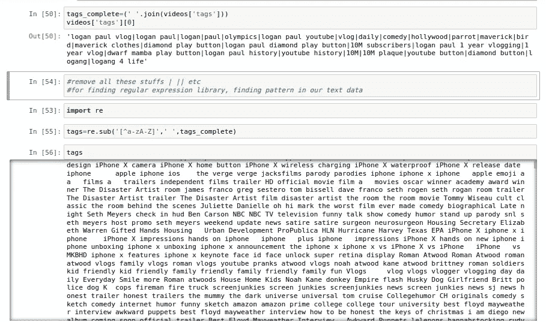
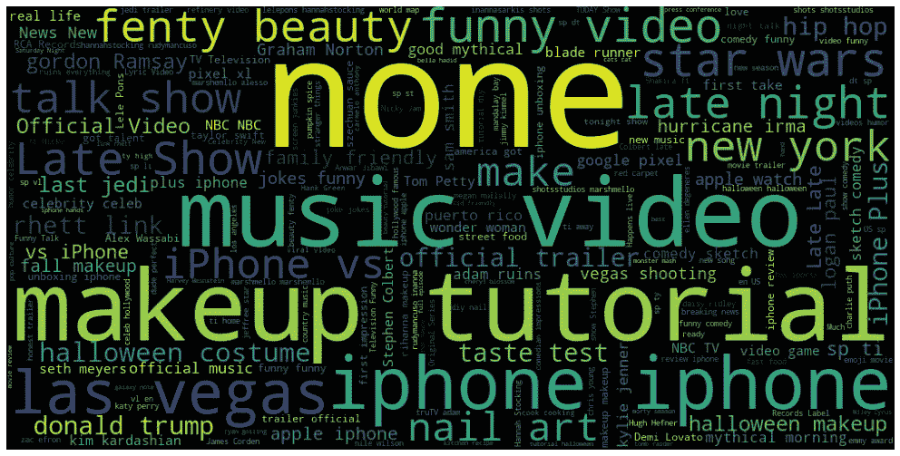
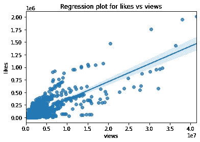
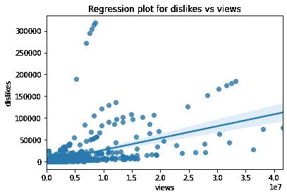
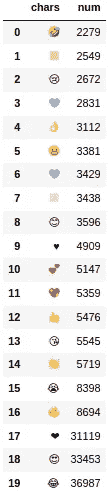

# YouTube 情感分析(使用 Python)

> 原文：<https://medium.com/analytics-vidhya/youtube-sentiment-analysis-using-python-7b4dcb6907b0?source=collection_archive---------11----------------------->

# **情感分析**

> 情感分析是最常见的文本分类工具，它分析传入的消息，并判断潜在的情感是积极的、消极的还是中性的。

情感分析——也称为观点挖掘——是一个广为流传但经常被误解的术语。

本质上，它是确定一系列词语背后的情绪基调的过程，用于理解在线提及中表达的态度、观点和情绪。

## 为什么要进行情感分析？

在今天的环境中，我们饱受数据过载之苦(尽管这并不意味着更好或更深入的见解)，公司可能收集了大量的客户反馈。然而，对于单纯的人类来说，没有任何错误或偏差的手动分析仍然是不可能的。

很多时候，有着良好意愿的公司发现自己处于*洞察真空*。你知道你需要洞察力来为你的决策提供信息。你知道你缺少它们。但是你不知道*如何最好地得到它们。*

情感分析为最重要的问题提供了答案。因为情感分析可以自动化，所以可以基于大量数据而不是不总是正确的简单直觉来做出决策。

YouTube 情感分析

用户数据集

1.  ***最频繁正面&负面评论***

通过分析正面和负面评论的比例，我们可以跟踪根据负面反馈是否需要极端的变化，或者一切按计划进行！因此，为了确定评论是负面的还是正面的，我们将使用 ***Textblob*** (这是一个用于处理文本数据的开源 python 库)，从中我们可以计算极性(-1:负面，0:中性，1 正面)。

视频上所有频繁正面评论的词云。(使用 python 脚本创建)

视频上所有频繁出现的负面评论的文字云。(使用 python 脚本创建)

**②*。在文本数据中寻找模式***

清理用于分析标签和视图的数据

***3。分析趋势标签*和**

我们需要排除一些助动词，如 is，am，are，他们，..等等。以便我们的最终输出不包含这些异常值。去掉这些词后，我们来分析一下趋势。

趋势标签的单词云。(使用 python 脚本创建)

***4。好恶之间的关联&观点*观点**

使用 Seaborn，我们可以得到一个回归图，显示喜欢和观点之间的关系。

从这个图中我们可以得出结论，喜欢和观点彼此之间是线性的。

这个回归图清楚地显示了厌恶和观点之间的关系不是线性的。

***5。执行表情符号的分析***

所以在这里，我们将分析评论中使用的表情符号，并列出最常用的表情符号。

问题是我们如何检测出这个物体是表情符号？这很简单，我们有一个**独特的表情符号统一代码**。

从给定数据中提取所有表情符号。

前 20 大流行表情符号

最后，我们将把所有的表情符号存储在一个字典中，这样我们就可以通过使用一个键来轻松地访问表情符号。并显示评论中使用最频繁或最热门的表情符号

## 使用情感分析的优势

通过使用情感分析，你可以判断客户对你业务不同领域的感受，而不必一次阅读成千上万的客户评论。

如果你每个月有数千条反馈，一个人是不可能看完所有这些回复的。通过使用情绪分析和自动化这一过程，您可以轻松地深入到您业务的不同客户群，并更好地了解这些客户群中的情绪。

通过以下方式与我联系:

 [## ammy20019 -概述

### 在 GitHub 上注册你自己的个人资料，这是托管代码、管理项目和构建软件的最佳地方…

github.com](https://github.com/ammy20019/)  [## 艾米特·库马尔 Sahu - Track Lead -开源社区:VIT-美联社| LinkedIn

### 查看艾米特·库马尔·萨胡在全球最大的职业社区 LinkedIn 上的个人资料。Amit 有 3 份工作列在他们的…

www.linkedin.com](https://www.linkedin.com/in/amit-kumar-sahu-7aab19169/) 

**Github:**[https://Github . com/ammy 20019/Projects/tree/main/Youtube % 20 情操% 20 分析](https://github.com/ammy20019/Projects/tree/main/Youtube%20Sentiment%20Analysis)