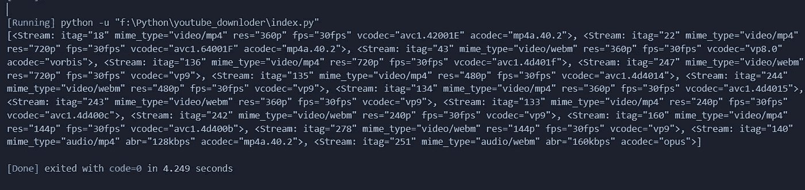

# YouTube 视频下载器(Python)

> 原文：<https://medium.com/analytics-vidhya/youtube-video-downloader-python-c1f449e758ff?source=collection_archive---------7----------------------->


在本教程中，我将向您展示如何使用 python (cmd 应用程序)构建自己的 Youtube 视频下载器。这是一个非常有趣的项目。

要开始这个项目，首先你需要在你的电脑上安装 python3 和一个文本编辑器或 IDE ( vs code，pycharm)。为了构建这个应用程序，我们使用 pytube 库。你可以在这里查看这个库[。要安装这个库，打开你的 cmd，键入并按下 ***pip 安装 pytube。*** 这里我们也使用了 virtualenv，所以我们也需要安装它。***pip in atall virtualenv***](https://pypi.org/project/pytube/)

现在环境设置完成了。现在编码部分。作为一个 IDE，我使用 vs 代码。现在进入你的项目文件夹，打开 cmd，输入 ***virtualenv venv。它将创建一个虚拟环境来构建我们的应用程序。我们需要激活我们的虚拟环境。如果你的电脑是 Linux 或者 mac 你可以通过输入**激活*源码。/venv/bin/activate*** 如果您是 windows 用户，您可以激活 ***源。/venv/scripts/activate***然后回车。***

现在使用 vs 代码打开您的项目并创建 index.py 文件。代码看起来像这样。

```
from pytube import YouTube# *Youtube video link you need to download* yt = YouTube("https://www.youtube.com/watch?v=anq3D5XFFew") # *Display all formats this video available* print(yt.streams.all())
```

要运行 cmd 类型的文件并按 Enter 键***python index . py .***如果您看到类似下面的内容，那么您是好的。



结果

但有时它会出错。在那个错误中，有一行 ***mixins.py*** 复制那个路径并打开那个文件。我们需要修改那个文件。删除文件中所有代码行，粘贴下面的代码行并保存。

[代码在这里](https://github.com/nficano/pytube/blob/e5f1a9e2476b096ed2012939d50851d3499016e1/pytube/mixins.py)。

现在所有的错误都消失了。

因此，您可以在每个流中看到 itag。意味着视频的质量。使用这个 itag，我们可以下载视频。

```
from pytube import YouTubeyt = YouTube("https://www.youtube.com/watch?v=anq3D5XFFew") 
# *Youtube video link you need to download*# *Display all formats this video available*print(yt.streams.all())# *Download Video* yt.streams.get_by_itag(22).download()
```

现在再次运行该文件。现在你可以直接在你的项目中看到视频文件。

现在，您可以根据需要对此进行修改。举个例子，如果我们想下载多个文件，我们可以使用 list 和 for 循环，代码如下。

```
from pytube import YouTube# List of video links
video_list = ["https://www.youtube.com/watch?v=XjKGJf2X-U8&list=TLPQMTcwMTIwMjBHNRzgUhODbQ&index=1","https://www.youtube.com/watch?v=Dq-SpbVX8gc&list=TLPQMTcwMTIwMjBHNRzgUhODbQ&index=2","https://www.youtube.com/watch?v=anq3D5XFFew"]for link in video_list:
    yt = YouTube(link)
    yt.streams.get_by_itag(22).download()
    print(yt.streams.get_by_itag(22))
```

就是这样。我希望你喜欢这个小项目。

谢谢，享受 Python 吧。