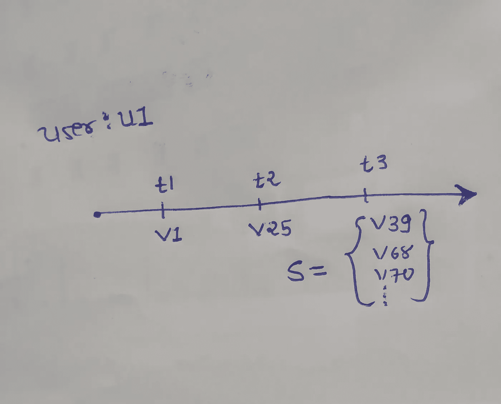
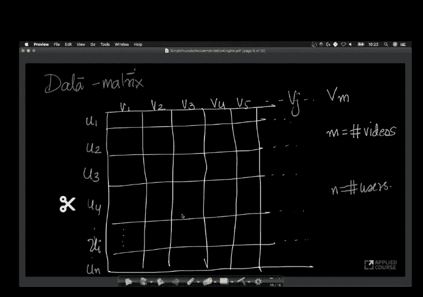
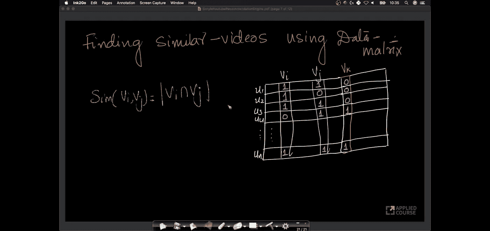
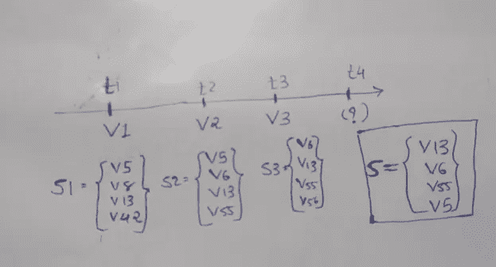
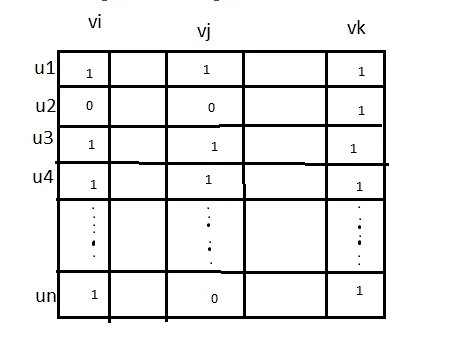
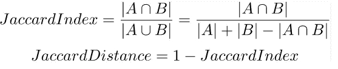

# 使用基本数学的 Youtube 视频推荐系统

> 原文：<https://medium.com/analytics-vidhya/youtube-video-recommendation-system-using-basic-math-e2130b2ecd67?source=collection_archive---------21----------------------->

Youtube 是互联网上最好的视频分享平台。人们可以获得与电影、歌曲、网络系列、教育、科技、科幻等相关的视频。但你还记得上次你打开应用程序，看了一个视频，然后关闭它吗？这很难记住，因为大约 70%的用户在使用该应用程序时会花时间观看多个视频。请点击[此处](https://techjury.net/stats-about/youtube/#gref)获取更多关于 Youtube 统计数据的信息。这种现象背后的原因是 Youtube 使用推荐系统向用户推荐更多的视频。

**商业推荐系统的使用**

> 每当你去购物中心或杂货店时，你会注意到面包和果酱的包装放得很近，这样买面包的顾客很可能会买果酱。每当你去电子商店购买笔记本电脑或个人电脑，你都会在配件上得到折扣，因为电子**电子公司有太多的客户购买数据**。据此，当用户在 Youtube 上观看视频时，推荐系统会向用户推荐更多的视频，这样用户会在应用上花费更多的时间，从而 Youtube 会获得更多的广告。

**问题陈述**

根据上面给定的时间线，假设用户 u1 在时间 t1 观看了视频 v1，在时间 t2 观看了视频 v25，现在我们必须向他/她建议他/她可能感兴趣的一组视频 S，并自动播放所有这些视频！

**数据矩阵**

Youtube 有<users>数据集。假设用户 u1 看过 v1，v23，v45 视频我们可以写成 u1 = {v1，v23，v45}。假设有 n 个用户和 m 个视频，那么我们可以绘制 n*m 矩阵，显示哪个用户观看了哪个视频。如果用户 u23 观看了 v45 视频，则 data_matrix[23，45] = 1。</users>

**视频相似度**

假设视频 v18 和 v34 更相似，而 v22 不太相似，因此观看 v18 的用户将被推荐观看 v34。相似性函数 sim(vi，vj)将返回两个视频之间的相似性指数。在这种情况下，我们可以说 sim(v18，v34) > sim(v18，v22)，但是我们如何找到两个项目之间的相似性呢？

> 使用上面的矩阵，我们可以找到两个视频之间的相似性。
> sim(vi，vj) = |vi ∩ vj |
> 根据上述等式，如果两个视频具有高数量的共同观众，则它们彼此相似。
> 根据上面给出的例子，有 n 个用户和 3 个视频(vi，vj，vk)。
> 这里我们可以观察到 sim(vi，vj) = 3，sim(vi，vk) = 1。所以如果用户正在观看视频 vi，那么接下来将推荐观看 vj 视频。按照这种方法，推荐前 10-20 个视频。

> 为了使这种方法更具体，假设用户已经观看了 3 个视频 v1、v2、v3，那么我们必须为每个 v1、v2 和 v3 找到前 10 个推荐的视频，并且找到它们的交集，并且按照相似性指数的降序来设置它们。

*   **问题**

(1)这种方法的第一个问题是冷启动。这意味着每当一个新的视频被添加到数据集中，那么与所有其他视频的相似性指数将变为零。

(2)假设大多数用户观看过的最受欢迎的视频(像《江南 style》、《despacito 》),那么这些视频与其他视频的相似性指数将会很高。根据下面给出的例子，vk 是受欢迎的视频，所以 vi 与 vk 的相似性很高，但是 vi 和 vj 彼此更相似。

*   **Jaccard 相似度指数**

为了解决上述问题，我们必须使用 Jaccard 相似性指数。Jaccard 相似性指数比较两个集合的成员，以查看哪些成员是共享的，哪些是不同的。这是对两组数据相似性的度量，范围从 0%到 100%。百分比越高，两个种群越相似。虽然它很容易解释，但它对小样本非常敏感，可能会给出错误的结果，特别是对于非常小的样本或缺少观察值的数据集。请点击[此处](https://en.wikipedia.org/wiki/Jaccard_index)了解更多关于 Jaccard 相似性指数的信息。

根据上述等式，vj 更类似于 vi，而不是 vk。

*   **基于用户的相似度**

在上面的例子中，我们发现了两个视频(项目)之间的相似性。在第二种方法中，我们可以找到两个用户之间的相似性。假设我们以用户 u1 为例，寻找与其他用户的相似性，我们发现 u32 具有最高的相似性。那么用户 u32 观看的而不是 u1 观看的视频将被推荐给用户 u1，反之亦然。

*   **这种方法的问题**

> 似乎在<users-videos>数据集的帮助下，我们可以推荐相似度最高的视频。但事实上，Youtube 有大约 10 亿用户和 1 亿个视频。因此，如果我们找到视频的相似性矩阵，那么矩阵的大小将是 100 M * 100 M，这等于存储浮点值(4 字节)的单元的 10 个⁶数。因此，大小将在 4000 TB 左右，这是意料之外的。</users-videos>

为了解决这个问题，我们必须只考虑最初最相似的视频。假设我们考虑前 10 个视频，那么矩阵的大小将是 10⁸ * 10 = 10⁹.因此，该矩阵所需的大小是 4 * 10⁹字节，等于 4 GB。

事实上，Youtube 使用所有数据，如用户视图、评论、搜索历史、视频类别，甚至视频内容，并应用机器学习、深度学习算法来推荐新视频，我将在下一篇博客中讨论这一点，但这是算法在基础上使用的核心概念。

非常感谢你花时间阅读这篇博客。如果您有任何反馈或建议，请发电子邮件给我((shahparth032@gmail.com)或在下面留言。

再次感谢您！！！